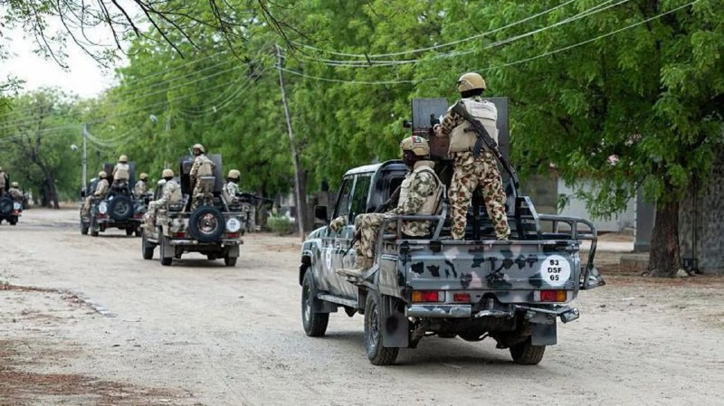
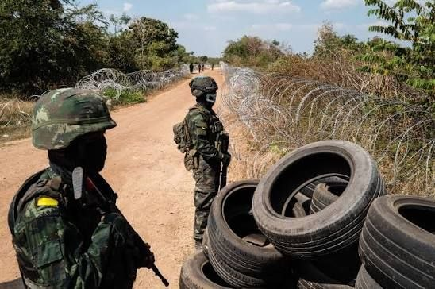
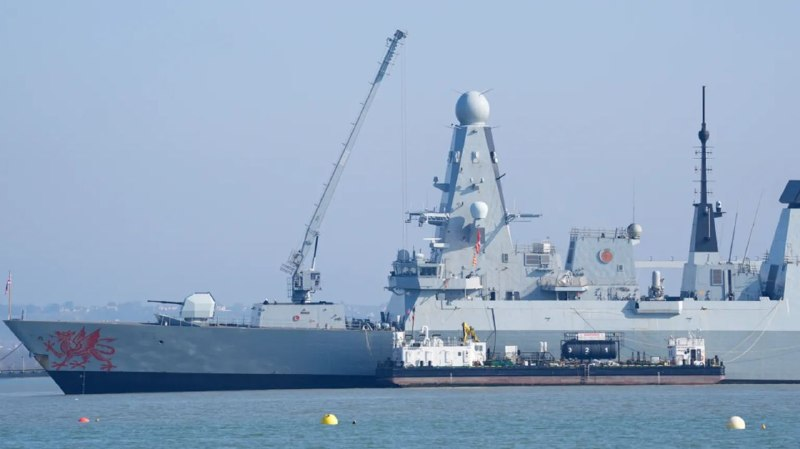
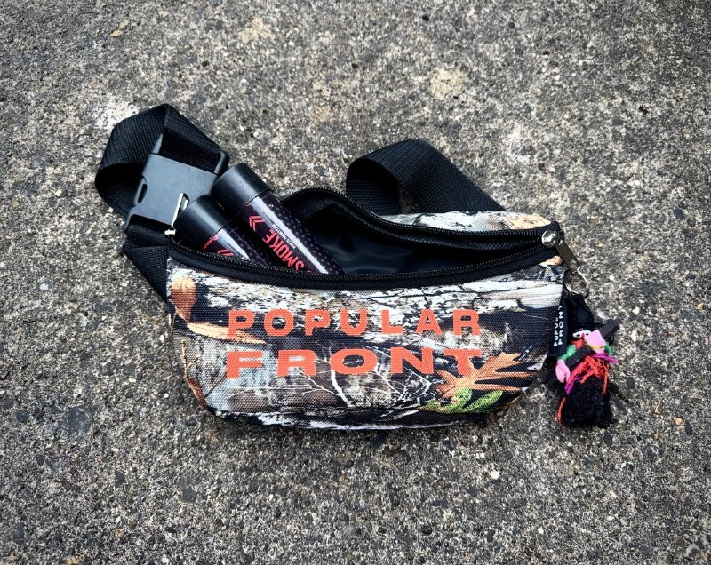
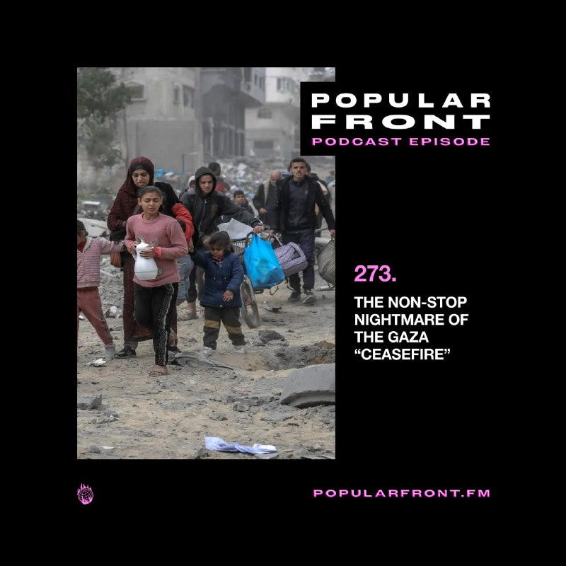
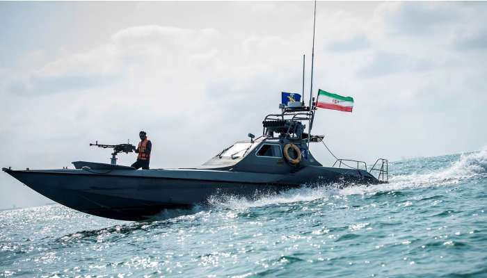

# خواننده تلگرام

<!-- TOP_NAV START -->

<!-- TOP_NAV END -->

<!-- MSG START -->

---
📅 بروزرسانی: 1405/02/28 00:10
---

## proxymtproto — post 47466

Server: rkn.proxytg.space
Port: 443
Secret: eedab8c006cdc477f71b1825b3082b1017726b6e2e70726f787974672e7370616365
@ProxyMTProto

## configx2ray — post 38981

184.24.77.42
2.23.168.213
2.23.168.174
2.23.168.7
184.24.77.32
184.24.77.5
184.24.77.7
184.24.77.16
184.24.77.36
184.24.77.21
2.23.169.111
2.23.169.105
184.24.77.11
184.24.77.29
185.200.232.49
185.200.232.50
185.200.232.42
185.200.232.41
23.48.23.186
23.48.23.133
23.48.23.195
23.48.23.178
104.78.170.186
96.17.222.31
23.41.37.129
23.2.13.227
23.222.126.108
2.20.255.113
2.17.251.98
23.2.13.152
95.101.23.27
2.21.239.21
23.211.49.252
88.221.168.5
104.103.90.156
23.79.20.249
88.221.132.162
23.59.235.208
23.60.69.118
23.46.188.71
104.122.212.92
23.219.1.4
23.57.43.195
184.51.252.135
2.22.6.68
23.217.11.56
95.100.69.108
23.40.63.69
96.16.122.74
104.109.250.232
92.123.104.7
104.110.191.57
104.83.5.82
92.122.166.168
104.83.5.65
104.121.0.17
104.66.70.133
92.122.166.146
23.73.2.161
92.122.73.138
92.122.166.141
96.16.122.55
104.81.108.51
23.72.248.214
104.126.37.185
104.83.5.201
104.83.5.216
92.123.104.67
104.83.5.203
96.17.207.151
88.221.168.138
96.17.207.149
104.81.108.10
23.73.2.148
92.122.166.175
172.237.127.6
104.81.104.13
96.17.207.137
92.123.112.7
96.16.122.75
96.16.122.70
92.122.166.182
104.109.128.153
104.96.143.134
23.73.2.141
104.83.5.202
23.67.136.200
23.67.136.202
23.65.119.52
92.122.166.236
92.122.166.234
92.122.166.237
104.110.138.190
173.222.200.5
184.51.252.36
184.51.252.38
104.83.5.208
96.16.122.146
96.17.206.214
92.122.166.197
104.94.100.73
104.83.15.66
88.221.213.81
172.239.57.117
104.117.76.40
184.51.252.4
96.17.207.30
96.16.122.83
96.16.122.150
23.73.207.11
96.16.122.77
96.17.207.155
92.123.189.82
96.16.122.82
96.16.122.66
96.7.218.219
96.16.122.137
184.51.252.157
92.123.189.41
184.86.251.12
96.16.122.154
184.51.252.152
96.17.207.12
23.79.48.162
151.101.0.223
151.101.128.223
151.101.192.223
151.101.64.223
65.109.34.234
142.54.178.211
2.23.168.47
2.23.168.96
2.23.168.144
2.23.169.207
2.23.170.80

آیپی های تست شده برای متود جدید سایفون
❤️

همشو باهم وارد کنید داخل برنامه 
🔥

Channel : https://t.me/ConfigX2ray

---
📅 بروزرسانی: 1405/02/27 23:20
---

## proxymtproto — post 47465

Server: night.nolags.pw
Port: 443
Secret: dddb42e911bcebf275392e32feebef9459
@ProxyMTProto

## configx2ray — post 38979

فروش مجدد سرور اختصاصی 3 گیگابایتی قیمت با بیشترین تخفیف تقدیم میشه 490 هزار تومان
❤️

سرور کاملا تضمینی میباشد بدونه ضریب همراه با ساب جهت استعلام حجم مصرفیتون
🌟

سرور ها بدونه هیچ گونه ضریب می‌باشند 
❤️

مدت زمان سرور ها نامحدود میباشد محدودیت زمانی ندارند 
👍

نیاز داشتید میتونید به ایدی زیر پیام بدید
⭐️ :

ID : https://t.me/servrfast2 
💠

---
📅 بروزرسانی: 1405/02/27 22:12
---

## popularxfront — post 6287

  <a href="telegram/content/popularxfront_6287_1779043378.mp4" target="_blank">🎬 Download video</a>

🇵🇸 #Palestine - 🇮🇱 #Israel: Five Palestinians were killed and several others wounded earlier today during Israeli airstrikes targeting a Turkish charity soup kitchen in Deir al-Balah near Al-Aqsa Hospital.

The strikes come a day after Israeli forces opened fire on civilians near the Abu Hamid roundabout in Khan Younis, while indiscrimante artillery shelling was also reported in the city’s eastern areas.

(via @MosabAbuToha on X)

## proxymtproto — post 47464

Server: alpina.agency
Port: 8443
Secret: eea02597a68d4821f58d17e6405c389da16164732e78352e7275
@ProxyMTProto

## configx2ray — post 38978

2.21.240.128
23.32.239.35
2.23.210.87
23.14.132.7
23.41.36.208
23.1.228.154
23.1.241.123
23.34.82.24
2.23.90.35
23.35.209.170
2.23.97.120
23.1.228.173
23.3.90.17
23.15.140.61
2.23.97.106
2.23.167.152
23.39.223.148
2.21.100.59
2.21.243.224
2.22.31.147
2.23.176.170
23.14.122.21
2.23.227.199
23.2.13.154
2.22.208.169
2.22.251.28
23.40.0.239
23.14.118.50
2.22.255.39
2.21.243.207
23.36.15.59
2.23.167.26
23.32.239.18
2.22.112.199
23.1.254.211
23.40.102.204
2.23.169.105
2.21.239.22
2.23.227.218
23.39.245.155
23.14.134.78
2.22.21.24
2.22.121.138
2.23.168.213
2.22.251.31
2.23.227.215
2.21.239.34
23.40.179.197
2.22.5.79
2.21.214.138
2.23.169.207
23.1.228.184
23.2.13.146
23.12.156.6
23.3.68.141
2.22.250.145
2.22.120.115
2.21.240.227
2.23.89.78
2.22.251.53
23.3.89.89
23.2.16.32
2.22.144.9
2.22.113.83
2.21.134.91
2.22.255.16
23.2.13.139
2.22.245.224
2.22.151.181
2.21.173.105
23.12.157.106
2.21.240.101
2.23.168.96
23.36.77.26
2.22.255.6
2.21.243.227
23.3.89.122
2.22.31.185
2.23.168.47
2.21.240.63
23.35.135.25
23.34.59.22
23.14.133.112
23.40.179.66
23.34.59.37
2.21.152.182
23.39.185.35
2.22.151.152
2.23.172.137
2.21.134.96
23.1.228.160
23.32.239.26
2.23.89.227
23.33.143.27
23.1.228.143
23.34.59.24
2.21.240.26
23.40.179.16
23.35.148.133
23.39.174.169
23.1.228.156
23.34.59.17
23.2.13.136
23.2.16.24
23.1.228.167
23.12.156.234
23.1.228.142
23.12.149.86
23.33.184.241
23.36.210.240
23.33.210.58
23.2.13.227
23.1.228.140
23.39.184.67
23.12.156.99
23.2.13.226
23.36.162.196
2.23.246.9
2.23.118.77
23.1.228.139
23.33.184.238
23.12.147.167
23.36.162.209
2.23.237.40
23.2.13.225
2.22.114.98
2.23.246.46
23.1.228.137
2.23.97.65
2.21.240.15
2.23.112.44
2.23.89.70
2.22.248.166
2.21.245.14
2.21.239.24
2.22.151.149
2.22.104.90
2.23.115.240
2.21.239.27
2.23.237.173
23.2.13.224
2.23.244.209
2.21.243.197
2.21.243.201
23.1.228.132
2.22.21.8
23.2.13.219
2.21.243.222
23.33.90.143
23.1.59.168
2.21.243.221
23.1.33.18
23.33.92.39
2.21.134.95
2.21.239.21
2.21.243.203
2.21.2.120
2.19.248.215
2.21.2.121
2.19.248.197
2.21.2.129
2.17.112.70
2.19.248.196
2.20.170.91
2.20.169.249
2.17.106.176
2.19.248.223
2.21.2.122
2.19.248.208
2.17.106.180
2.20.170.35
2.17.112.88
2.21.2.114
2.21.2.113
2.17.106.169
2.17.113.121
2.19.248.207
2.17.106.182
2.19.248.206
2.21.2.115
2.17.112.69
2.19.248.203
2.17.112.84
2.19.248.217
2.21.2.128
2.17.106.199
2.21.2.123
2.19.248.216
2.21.2.112

آیپی های تست شده برای متود جدید سایفون
❤️

همشو باهم وارد کنید داخل برنامه 
🔥

Channel : https://t.me/ConfigX2ray

## configx2ray — post 38977

185.200.232.43 185.200.232.40 167.82.48.223 151.101.128.223 185.200.232.49 185.200.232.50 185.200.232.42 185.200.232.41 184.24.77.42 184.24.77.32 184.24.77.5 184.24.77.7 184.24.77.16 184.24.77.36 184.24.77.21 184.24.77.11 23.48.23.186 23.48.23.133 23.48.23.195 23.48.23.178 184.24.77.29 23.65.119.52 23.73.2.141 104.110.138.190 104.83.5.202 92.122.166.236 92.122.166.234 92.122.166.237 96.16.122.70 23.67.136.200 23.67.136.202 95.216.69.37 95.216.69.38 95.216.69.39 95.216.69.40 104.78.170.186 96.17.222.31 23.41.37.129 23.2.13.227 23.222.126.108 2.20.255.113 2.17.251.98 23.2.13.152 95.101.23.27 2.21.239.21 23.211.49.252 88.221.168.5 104.103.90.156 23.79.20.249 88.221.132.162 23.59.235.208 23.60.69.118 23.46.188.71 104.122.212.92 23.219.1.4 23.57.43.195 184.51.252.135 2.22.6.68 23.217.11.56 95.100.69.108 23.40.63.69 96.16.122.74 104.109.250.232 92.123.104.7 104.110.191.57 104.83.5.82 92.122.166.168 104.83.5.65 104.121.0.17 104.66.70.133 92.122.166.146 23.73.2.161 92.122.73.138 92.122.166.141 96.16.122.55 104.81.108.51 23.72.248.214 104.126.37.185 104.83.5.201 104.83.5.216 92.123.104.67 104.83.5.203 96.17.207.151 88.221.168.138 96.17.207.149 104.81.108.10 23.73.2.148 92.122.166.175 172.237.127.6 104.81.104.13 96.16.122.82 96.16.122.66 96.7.218.219 96.16.122.137 184.51.252.157 92.123.189.41 184.86.251.12 96.16.122.154 184.51.252.152 96.17.207.12 23.79.48.162 151.101.0.223 151.101.192.223 65.109.34.234 151.101.64.223 2.23.169.111 2.23.168.96 2.23.169.105 2.23.168.7 2.23.169.207 2.17.100.200 2.19.205.42 2.19.205.50 2.19.252.134 2.20.169.70 2.20.170.91 95.101.111.144 2.16.245.188 2.18.69.150 2.16.106.4 23.58.222.107 184.25.28.31 23.47.124.134 23.50.131.147 23.46.190.18 23.58.222.147 23.56.162.186 23.44.203.68 23.12.156.115 23.216.77.16 23.62.61.53 23.39.148.245 23.210.73.133 23.44.201.136 23.205.46.167 184.30.150.142 23.220.161.217 184.28.165.4 23.46.230.133 88.221.168.204 104.96.158.174 184.51.252.4 172.234.199.15 104.85.26.14 172.237.145.27 92.123.103.24 172.234.159.58 184.86.103.210 96.16.248.183 92.122.16.5 96.16.249.60 96.16.249.9 142.54.178.211 185.137.25.214 81.12.72.218 5.160.13.85 37.255.133.30 81.91.145.2  104.117.76.26 104.117.76.40 184.25.52.200 184.28.230.87 184.51.252.36 184.51.252.38 184.86.251.27 23.215.0.164 23.220.128.221 96.17.207.142 23.50.131.18 23.219.3.212 23.223.245.150 96.17.207.135 23.220.113.51 96.17.72.41 23.203.185.105 2.23.168.213 2.23.168.174 96.17.207.137 96.16.122.75 173.222.200.5 96.16.122.146 96.17.206.214 172.239.57.117 96.17.207.30 96.16.122.83 96.16.122.150 96.16.122.77 96.17.207.155 2.23.168.47 2.23.168.144
185.200.232.8
185.200.232.9
185.200.232.17
185.200.232.25
185.200.232.26
185.200.232.32
185.200.232.40
185.200.232.43
185.200.232.49
185.200.232.50
185.200.232.57
185.200.232.58
185.200.232.65
185.200.232.16
185.200.232.19
185.200.232.24
185.200.232.27
185.200.232.41
185.200.232.42
185.200.232.48
185.200.232.56
185.200.232.59
185.200.232.64
185.200.232.67
185.200.232.66

آیپی های تست شده برای متود جدید سایفون
❤️

همشو باهم وارد کنید داخل برنامه 
🔥

Channel : https://t.me/ConfigX2ray

---
📅 بروزرسانی: 1405/02/27 21:10
---

## proxymtproto — post 47463

Server: 132.243.213.221
Port: 443
Secret: eedb1bb2c2c796e681b5062a973eb05859706574726f766963682e7275
@ProxyMTProto

## configx2ray — post 38976

  <a href="telegram/content/configx2ray_38976_1779039658.webm" target="_blank">🎬 Download video</a>

vless://97b36571-ffdc-5bdb-7bc4-bbcf8f3debb4@varzesh3.com:8080?encryption=none&type=ws&path=%2F&host=cdn-665e-o0g.fars-rehan.ir#https://t.me/ConfigX2ray

ترکیبی با سایفون وصله 
✅

آموزش استفادع : 
👇
https://t.me/ConfigX2ray0/1665

Channel : https://t.me/ConfigX2ray

---
📅 بروزرسانی: 1405/02/27 20:09
---

## proxymtproto — post 47462

Server: tg1.tgproxy1.fun
Port: 443
Secret: ee9f275776f928838953db9dc7c5629ef27467312e746770726f7879312e66756e
@ProxyMTProto

## configx2ray — post 38974

فروش مجدد سرور اختصاصی 3 گیگابایتی قیمت با بیشترین تخفیف تقدیم میشه 490 هزار تومان
❤️

سرور کاملا تضمینی میباشد بدونه ضریب همراه با ساب جهت استعلام حجم مصرفیتون
🌟

سرور ها بدونه هیچ گونه ضریب می‌باشند 
❤️

مدت زمان سرور ها نامحدود میباشد محدودیت زمانی ندارند 
👍

نیاز داشتید میتونید به ایدی زیر پیام بدید
⭐️ :

ID : https://t.me/servrfast2 
💠

## configx2ray — post 38971

184.24.77.42
2.23.168.213
2.23.168.174
2.23.168.7
184.24.77.32
184.24.77.5
184.24.77.7
184.24.77.16
184.24.77.36
184.24.77.21
2.23.169.111
2.23.169.105
184.24.77.11
184.24.77.29
185.200.232.49
185.200.232.50
185.200.232.42
185.200.232.41
23.48.23.186
23.48.23.133
23.48.23.195
23.48.23.178
104.78.170.186
96.17.222.31
23.41.37.129
23.2.13.227
23.222.126.108
2.20.255.113
2.17.251.98
23.2.13.152
95.101.23.27
2.21.239.21
23.211.49.252
88.221.168.5
104.103.90.156
23.79.20.249
88.221.132.162
23.59.235.208
23.60.69.118
23.46.188.71
104.122.212.92
23.219.1.4
23.57.43.195
184.51.252.135
2.22.6.68
23.217.11.56
95.100.69.108
23.40.63.69
96.16.122.74
104.109.250.232
92.123.104.7
104.110.191.57
104.83.5.82
92.122.166.168
104.83.5.65
104.121.0.17
104.66.70.133
92.122.166.146
23.73.2.161
92.122.73.138
92.122.166.141
96.16.122.55
104.81.108.51
23.72.248.214
104.126.37.185
104.83.5.201
104.83.5.216
92.123.104.67
104.83.5.203
96.17.207.151
88.221.168.138
96.17.207.149
104.81.108.10
23.73.2.148
92.122.166.175
172.237.127.6
104.81.104.13
96.17.207.137
92.123.112.7
96.16.122.75
96.16.122.70
92.122.166.182
104.109.128.153
104.96.143.134
23.73.2.141
104.83.5.202
23.67.136.200
23.67.136.202
23.65.119.52
92.122.166.236
92.122.166.234
92.122.166.237
104.110.138.190
173.222.200.5
184.51.252.36
184.51.252.38
104.83.5.208
96.16.122.146
96.17.206.214
92.122.166.197
104.94.100.73
104.83.15.66
88.221.213.81
172.239.57.117
104.117.76.40
184.51.252.4
96.17.207.30
96.16.122.83
96.16.122.150
23.73.207.11
96.16.122.77
96.17.207.155
92.123.189.82
96.16.122.82
96.16.122.66
96.7.218.219
96.16.122.137
184.51.252.157
92.123.189.41
184.86.251.12
96.16.122.154
184.51.252.152
96.17.207.12
23.79.48.162
151.101.0.223
151.101.128.223
151.101.192.223
151.101.64.223
65.109.34.234
142.54.178.211
2.23.168.47
2.23.168.96
2.23.168.144
2.23.169.207
2.23.170.80

آیپی های تست شده برای متود جدید سایفون
❤️

همشو باهم وارد کنید داخل برنامه 
🔥

Channel : https://t.me/ConfigX2ray

---
📅 بروزرسانی: 1405/02/27 19:06
---

## popularxfront — post 6286

  <a href="telegram/content/popularxfront_6286_1779032186.mp4" target="_blank">🎬 Download video</a>

🇱🇧 #Lebanon - 🇮🇱 #Israel: Hezbollah has released footage allegedly showing a fiber-optic-guided drone operated by its militants striking IDF soldiers in the Al-Naqoura area.

(via @war_noir)

## proxymtproto — post 47461

Server: ark.proxytg.space
Port: 443
Secret: eeb8df1294e7e13cd99e7a9144bae17db861726b2e70726f787974672e7370616365
@ProxyMTProto

## proxymtproto — post 47460

Server: atg.proxytg.space
Port: 443
Secret: eef9632da3b0ea3b51ab5840f93b2ddaff6174672e70726f787974672e7370616365
@ProxyMTProto

## configx2ray — post 38970

  <a href="https://t.me/ConfigX2ray/38970" target="_blank">📎 Download file</a>

کانفیگ برای Npv tunnel ⭕️

به هیچ وج دانلود نزنید باهاش
❤️

رمز فایل : @ConfigX2ray

Channel : https://t.me/ConfigX2ray

## configx2ray — post 38968

151.101.64.223
151.101.0.223
185.200.232.43  
2.17.100.200
2.19.205.42
2.19.205.50
2.19.252.134
2.20.169.70
2.20.170.91
95.101.111.144
2.16.245.188
2.18.69.150
2.16.106.4
23.58.222.107
184.25.28.31
23.47.124.134
23.50.131.147
23.46.190.18
23.58.222.147
23.56.162.186
23.44.203.68
23.12.156.115
23.216.77.16
23.62.61.53
23.39.148.245
23.210.73.133
23.44.201.136
23.205.46.167
184.30.150.142
23.220.161.217
184.28.165.4
23.46.230.133
88.221.168.204
104.96.158.174
184.51.252.4
172.234.199.15
104.85.26.14
172.237.145.27
92.123.103.24
172.234.159.58
184.86.103.210
96.16.248.183
92.122.16.5
96.16.249.60
96.16.249.9

آیپی های تست شده برای متود جدید سایفون
❤️

همشو باهم وارد کنید داخل برنامه 
🔥

Channel : https://t.me/ConfigX2ray

## configx2ray — post 38967

  <a href="telegram/content/configx2ray_38967_1779032189.webm" target="_blank">🎬 Download video</a>

{"remarks":"https://t.me/ConfigX2ray 🥗","log":{"loglevel":"warning"},"inbounds":[{"tag":"socks","port":10808,"protocol":"socks","settings":{"auth":"noauth","udp":true,"userLevel":8},"sniffing":{"enabled":true,"destOverride":["http","tls","fakedns","fakedns"],"routeOnly":false}},{"tag":"dns-in","port":10853,"protocol":"dokodemo-door","listen":"127.0.0.1","settings":{"address":"1.1.1.1","port":53,"network":"tcp,udp"}}],"outbounds":[{"tag":"proxy","protocol":"vless","settings":{"vnext":[{"address":"varzesh3.com","port":8080,"users":[{"id":"97b36571-ffdc-5bdb-7bc4-bbcf8f3debb4","level":8,"encryption":"none"}]}]},"streamSettings":{"network":"ws","wsSettings":{"path":"/","headers":{"Host":"cdn-665e-o0g.fars-rehan.ir"}}},"mux":{"enabled":true,"concurrency":8,"xudpConcurrency":16,"xudpProxyUDP443":"reject"}},{"tag":"direct","protocol":"freedom","settings":{"domainStrategy":"UseIP"},"mux":{"enabled":false,"concurrency":8,"xudpConcurrency":8,"xudpProxyUDP443":""}},{"tag":"block","protocol":"blackhole","settings":{"response":{"type":"http"}},"mux":{"enabled":false,"concurrency":8,"xudpConcurrency":8,"xudpProxyUDP443":""}},{"tag":"dns-out","protocol":"dns","mux":{"enabled":false,"concurrency":8,"xudpConcurrency":8,"xudpProxyUDP443":""}}],"dns":{"servers":[{"address":"fakedns","domains":["geosite:cn"]},"1.1.1.1"],"hosts":{"domain:googleapis.cn":"googleapis.com","dns.alidns.com":["223.5.5.5","223.6.6.6","2400:3200::1","2400:3200:baba::1"],"one.one.one.one":["1.1.1.1","1.0.0.1","2606:4700:4700::1111","2606:4700:4700::1001"],"dot.pub":["1.12.12.12","120.53.53.53"],"dns.google":["8.8.8.8","8.8.4.4","2001:4860:4860::8888","2001:4860:4860::8844"],"dns.quad9.net":["9.9.9.9","149.112.112.112","2620:fe::fe","2620:fe::9"],"common.dot.dns.yandex.net":["77.88.8.8","77.88.8.1","2a02:6b8::feed:0ff","2a02:6b8:0:1::feed:0ff"]}},"routing":{"domainStrategy":"IPIfNonMatch","rules":[{"type":"field","outboundTag":"dns-out","inboundTag":["dns-in"]},{"type":"field","ip":["1.1.1.1"],"outboundTag":"proxy","port":"53"},{"type":"field","ip":["223.5.5.5"],"outboundTag":"direct","port":"53"},{"type":"field","outboundTag":"dns-out","inboundTag":["dns-in"]},{"type":"field","ip":["1.1.1.1"],"outboundTag":"proxy","port":"53"},{"type":"field","ip":["223.5.5.5"],"outboundTag":"direct","port":"53"}]},"fakedns":[{"ipPool":"198.18.0.0/15","poolSize":10000}]}

ترکیبی با سایفون وصله 
✅

آموزش استفادع : 
👇
https://t.me/ConfigX2ray0/1665

Channel : https://t.me/ConfigX2ray

## configx2ray — post 38966

95.101.29.12
95.101.29.30
95.101.29.54
95.101.35.73
95.101.35.83
95.101.181.125
95.101.200.63
96.16.122.48
96.16.122.59
104.83.5.208
104.83.15.66
104.94.100.73
104.96.143.134
104.103.64.7
104.109.128.153
104.111.202.158
104.117.76.26
104.117.76.40
184.25.52.200
184.28.230.87
184.51.252.36
184.51.252.38
184.86.251.27
23.215.0.164
23.220.128.221
96.17.207.142
23.50.131.18
23.219.3.212
23.223.245.150
96.17.207.135
23.220.113.51
96.17.72.41
23.203.185.105
2.23.168.213
2.23.168.174
96.17.207.137
96.16.122.75
173.222.200.5
96.16.122.146
96.17.206.214
172.239.57.117
96.17.207.30
96.16.122.83
96.16.122.150
96.16.122.77
96.17.207.155
2.23.168.47
2.23.168.144

آیپی های تست شده برای متود جدید سایفون
❤️

همشو باهم وارد کنید داخل برنامه 
🔥

Channel : https://t.me/ConfigX2ray

---
📅 بروزرسانی: 1405/02/27 17:56
---

## proxymtproto — post 47459

Server: 144.31.221.15
Port: 443
Secret: bfb063cc6d861de10f6a39c795fc66e4
@ProxyMTProto

## configx2ray — post 38965

94.130.33.41
138.201.54.122
94.130.70.160
144.76.1.88
65.109.34.234
94.130.50.12
95.216.69.37
142.54.178.211
63.141.252.203
2.23.168.144
2.23.168.96
184.31.170.185
2.23.168.213
2.22.31.104

23.40.10.24 2.23.168.47 2.23.168.250 23.1.228.148 23.35.134.38

23.65.119.52

23.44.201.151
 

آیپی های تست شده برای متود جدید سایفون
❤️

همشو باهم وارد کنید داخل برنامه 
🔥

Channel : https://t.me/ConfigX2ray

## configx2ray — post 38964

2.16.16.153
2.16.16.164
2.16.16.182
2.16.16.185
2.16.16.196
2.16.16.198
2.16.16.200
2.16.238.20
2.16.238.23
2.16.238.25
2.16.238.26
2.16.238.28
2.16.238.133
2.16.238.139
2.16.238.140
2.17.251.75
2.17.251.83
2.17.251.97
2.17.251.100
2.17.251.103
2.17.251.104
2.17.251.119
2.17.251.181
2.17.251.186
2.18.67.67
2.18.190.89
2.18.190.174
2.19.13.78
2.23.168.144

آیپی های تست شده برای متود جدید سایفون
❤️

همشو باهم وارد کنید داخل برنامه 
🔥

Channel : https://t.me/ConfigX2ray

---
📅 بروزرسانی: 1405/02/27 16:29
---

## proxymtproto — post 47458

Server: 186.246.16.55
Port: 443
Secret: ee7d21ac88a75bdb5887ec4918a20386927777772e6d6963726f736f66742e636f6d
@ProxyMTProto

## configx2ray — post 38963

فروش مجدد سرور اختصاصی 3 گیگابایتی قیمت با بیشترین تخفیف تقدیم میشه 490 هزار تومان
❤️ سرور کاملا تضمینی میباشد بدونه ضریب همراه با ساب جهت استعلام حجم مصرفیتون
🌟 سرور ها بدونه هیچ گونه ضریب می‌باشند 
❤️ مدت زمان سرور ها نامحدود میباشد محدودیت زمانی ندارند…

---
📅 بروزرسانی: 1405/02/27 15:26
---

## proxymtproto — post 47457

Server: proxy.nexorabust.ru
Port: 443
Secret: dd1cebd1dd4f8441f8af01177087ee9918
@ProxyMTProto

## configx2ray — post 38962

فروش مجدد سرور اختصاصی 3 گیگابایتی قیمت با بیشترین تخفیف تقدیم میشه 490 هزار تومان
❤️

سرور کاملا تضمینی میباشد بدونه ضریب همراه با ساب جهت استعلام حجم مصرفیتون
🌟

سرور ها بدونه هیچ گونه ضریب می‌باشند 
❤️

مدت زمان سرور ها نامحدود میباشد محدودیت زمانی ندارند 
👍

نیاز داشتید میتونید به ایدی زیر پیام بدید
⭐️ :

ID : https://t.me/servrfast2 
💠

---
📅 بروزرسانی: 1405/02/27 14:18
---

## popularxfront — post 6284

  <a href="telegram/content/popularxfront_6284_1779014932.mp4" target="_blank">🎬 Download video</a>

🇺🇦 #Ukraine - 🇷🇺 #Russia: Ukraine has launched reportedly one of the largest drone attacks of the war overnight towards Russia, with more than 500 drones launched across the country, including over 100 targeting the Moscow region alone.

According to reports, strikes targeted the Moscow oil refinery, the Elma microelectronics technology park in Zelenograd, and a fuel facility near Solnechnogorsk.

As a result of the strikes, Moscow’s four main airports temporarily suspended flights, while residential areas across Khimki, Mytishchi, and Krasnogorsk also reported damage from drone strikes and falling air defense debris.

At least three civilians were reportedly killed.

(via @wartranslated)

## proxymtproto — post 47456

Server: 132.243.213.215
Port: 443
Secret: ee46f33d84ae85e3ad53567904d7199be7706574726f766963682e7275
@ProxyMTProto

## proxymtproto — post 47455

Server: ark.proxytg.space
Port: 443
Secret: eeb8df1294e7e13cd99e7a9144bae17db861726b2e70726f787974672e7370616365
@ProxyMTProto

---
📅 بروزرسانی: 1405/02/27 12:49
---

## proxymtproto — post 47454

Server: 186.246.16.55
Port: 443
Secret: ee7d21ac88a75bdb5887ec4918a20386927777772e6d6963726f736f66742e636f6d
@ProxyMTProto

## proxymtproto — post 47453

Server: dealer4-fin.dealer.ac
Port: 8443
Secret: ee602b25b6e94c83ec0e24fbbc83c8bc547477656e7475722e636f6d
@ProxyMTProto

## configx2ray — post 38961

  <a href="https://t.me/ConfigX2ray/38961" target="_blank">📎 Download file</a>

کانفیگ برای Npv tunnel ⭕️

به هیچ وج دانلود نزنید باهاش
❤️

رمز فایل : @ConfigX2ray

Channel : https://t.me/ConfigX2ray

## configx2ray — post 38960

2.21.2.89
23.208.222.120
23.48.203.248
23.44.201.136
23.44.201.151
23.44.201.149
2.21.2.58
23.3.90.48
23.44.201.41
2.19.204.184
23.218.232.188
23.44.201.12
23.212.253.227
23.201.31.155
23.220.163.203
23.44.201.185
23.52.116.66
23.44.201.17
23.62.54.24
23.218.239.132
23.39.149.69
23.52.40.147
23.58.95.144
2.16.244.58
23.212.253.137
2.17.106.176
23.62.54.137
2.17.106.5
23.203.134.233
23.212.253.232
23.206.188.197
23.44.201.170
23.54.127.39
23.214.170.83
23.52.40.89
23.55.176.73
23.202.229.140
23.215.56.61
2.17.106.166
23.222.126.108
184.25.85.224
23.1.241.123
23.3.90.43

آیپی های تست شده برای متود جدید سایفون
❤️

همشو باهم وارد کنید داخل برنامه 
🔥

Channel : https://t.me/ConfigX2ray

## configx2ray — post 38958

  <a href="https://t.me/ConfigX2ray/38958" target="_blank">📎 Download file</a>

کانفیگ برای Npv tunnel ⭕️

به هیچ وج دانلود نزنید باهاش
❤️

رمز فایل : @ConfigX2ray

Channel : https://t.me/ConfigX2ray

## configx2ray — post 38957

  <a href="telegram/content/configx2ray_38957_1779009546.webm" target="_blank">🎬 Download video</a>

{"remarks":"💚 https://t.me/ConfigX2ray ","log":{"loglevel":"warning"},"inbounds":[{"tag":"socks","port":10808,"protocol":"socks","settings":{"auth":"noauth","udp":true,"userLevel":8},"sniffing":{"enabled":true,"destOverride":["http","tls"],"routeOnly":false}}],"outbounds":[{"tag":"proxy","protocol":"vless","settings":{"vnext":[{"address":"193.151.155.162","port":443,"users":[{"id":"2503481c-0757-4db8-bd54-589eb1b65bfe","level":8,"encryption":"none"}]}]},"streamSettings":{"network":"ws","security":"tls","wsSettings":{"path":"/","headers":{"Host":"cdn.gapfilm.org"}},"tlsSettings":{"allowInsecure":true,"serverName":"cdn.gapfilm.org","fingerprint":"chrome","show":false}},"mux":{"enabled":false,"concurrency":-1,"xudpConcurrency":8,"xudpProxyUDP443":""}},{"tag":"direct","protocol":"freedom","settings":{"domainStrategy":"UseIP"},"mux":{"enabled":false,"concurrency":8,"xudpConcurrency":8,"xudpProxyUDP443":""}},{"tag":"block","protocol":"blackhole","settings":{"response":{"type":"http"}},"mux":{"enabled":false,"concurrency":8,"xudpConcurrency":8,"xudpProxyUDP443":""}}],"dns":{"servers":["1.1.1.1"],"hosts":{"domain:googleapis.cn":"googleapis.com","dns.alidns.com":["223.5.5.5","223.6.6.6","2400:3200::1","2400:3200:baba::1"],"one.one.one.one":["1.1.1.1","1.0.0.1","2606:4700:4700::1111","2606:4700:4700::1001"],"dot.pub":["1.12.12.12","120.53.53.53"],"dns.google":["8.8.8.8","8.8.4.4","2001:4860:4860::8888","2001:4860:4860::8844"],"dns.quad9.net":["9.9.9.9","149.112.112.112","2620:fe::fe","2620:fe::9"],"common.dot.dns.yandex.net":["77.88.8.8","77.88.8.1","2a02:6b8::feed:0ff","2a02:6b8:0:1::feed:0ff"]}},"routing":{"domainStrategy":"IPIfNonMatch","rules":[{"type":"field","ip":["1.1.1.1"],"outboundTag":"proxy","port":"53"},{"type":"field","ip":["223.5.5.5"],"outboundTag":"direct","port":"53"},{"type":"field","ip":["1.1.1.1"],"outboundTag":"proxy","port":"53"},{"type":"field","ip":["223.5.5.5"],"outboundTag":"direct","port":"53"}]}}

ترکیبی با سایفون وصله 
✅

آموزش استفادع : 
👇
https://t.me/ConfigX2ray0/1665

Channel : https://t.me/ConfigX2ray

---
📅 بروزرسانی: 1405/02/27 10:55
---

## popularxfront — post 6283

  

🇺🇸 #US - 🇳🇬 #Nigeria: Senior Islamic State commander Abu-Bilal al-Minuki was reportedly killed alongside several of his lieutenants during a joint US - Nigerian raid in the Lake Chad Basin.

According to Nigerian authorities, the operation followed months of intelligence gathering and reconnaissance targeting militant activity in the region, which is a long-standing stronghold of Boko Haram and Islamic State West Africa Province (ISWAP).

No casualties among US or Nigerian forces were reported during the raid.

(via BBC)

## proxymtproto — post 47452

Server: proxy.chunkycorp.shop
Port: 443
Secret: ee3a3365be03d6bc13518d65e70a3146c2706574726f766963682e7275
@ProxyMTProto

## proxymtproto — post 47451

Server: 132.243.224.115
Port: 443
Secret: ee64fa232998f0194a2cc5f5d0f4d1c9ae706574726f766963682e7275
@ProxyMTProto

## proxymtproto — post 47450

Server: atg.proxytg.space
Port: 443
Secret: eef9632da3b0ea3b51ab5840f93b2ddaff6174672e70726f787974672e7370616365
@ProxyMTProto

## configx2ray — post 38956

دوستان چند عدد سرور اختصاصی 3 گیگ هم موجوده قیمت با بیشترین تخفیف تقدیم میشه 490 هزار تومان
❤️ سرور کاملا تضمینی میباشد بدونه ضریب همراه با ساب جهت استعلام حجم مصرفیتون
🌟 سرور ها بدونه هیچ گونه ضریب می‌باشند 
❤️ مدت زمان سرور ها نامحدود میباشد محدودیت زمانی…

## configx2ray — post 38955

دوستان چند عدد سرور اختصاصی 3 گیگ هم موجوده قیمت با بیشترین تخفیف تقدیم میشه 490 هزار تومان
❤️

سرور کاملا تضمینی میباشد بدونه ضریب همراه با ساب جهت استعلام حجم مصرفیتون
🌟

سرور ها بدونه هیچ گونه ضریب می‌باشند 
❤️

مدت زمان سرور ها نامحدود میباشد محدودیت زمانی ندارند 
👍

نیاز داشتید میتونید به ایدی زیر پیام بدید
⭐️ :

ID : https://t.me/servrfast2 
💠

## configx2ray — post 38954

  <a href="telegram/content/configx2ray_38954_1779002743.webm" target="_blank">🎬 Download video</a>

vless://6202b230-417c-4d8e-b624-0f71afa9c75d@213.182.199.138:2096?security=tls&encryption=none&insecure=1&host=sni.111000.indevs.in&type=ws&allowInsecure=1&sni=sni.111000.indevs.in#https://t.me/ConfigX2ray

vless://6202b230-417c-4d8e-b624-0f71afa9c75d@104.18.32.47:2096?path=%2F%3Fed&security=tls&encryption=none&insecure=1&host=sni.111000.indevs.in&type=ws&allowInsecure=1&sni=sni.111000.indevs.in#https://t.me/ConfigX2ray

vless://6202b230-417c-4d8e-b624-0f71afa9c75d@104.129.166.138:2096?path=%2F&security=tls&encryption=none&insecure=0&host=sni.111000.indevs.in&type=ws&allowInsecure=0&sni=sni.111000.indevs.in#https://t.me/ConfigX2ray

vless://6202b230-417c-4d8e-b624-0f71afa9c75d@172.64.147.223:443?security=tls&alpn=http%2F1.1&encryption=none&insecure=1&host=sni.111000.dynv6.net&fp=chrome&type=ws&allowInsecure=1&sni=sni.111000.dynv6.net#https://t.me/ConfigX2ray

vless://6202b230-417c-4d8e-b624-0f71afa9c75d@31.185.108.138:2096?path=%2F&security=tls&encryption=none&insecure=1&host=sni.111000.indevs.in&type=ws&allowInsecure=1&sni=sni.111000.indevs.in#https://t.me/ConfigX2ray

ترکیبی با سایفون وصله 
✅

آموزش استفادع : 
👇
https://t.me/ConfigX2ray0/1665

Channel : https://t.me/ConfigX2ray

## configx2ray — post 38953

185.200.232.43  
185.200.232.40
167.82.48.223
151.101.128.223
185.200.232.49
185.200.232.50
185.200.232.42
185.200.232.41
184.24.77.42
184.24.77.32
184.24.77.5
184.24.77.7
184.24.77.16
184.24.77.36
184.24.77.21
184.24.77.11
23.48.23.186
23.48.23.133
23.48.23.195
23.48.23.178
184.24.77.29

آیپی های تست شده برای متود جدید سایفون
❤️

همشو باهم وارد کنید داخل برنامه 
🔥

Channel : https://t.me/ConfigX2ray

---
📅 بروزرسانی: 1405/02/27 08:03
---

## proxymtproto — post 47449

Server: 144.31.221.15
Port: 443
Secret: ea0d12da766348efd261ca88728c8b83
@ProxyMTProto

---
📅 بروزرسانی: 1405/02/27 03:44
---

هیچ پیام جدیدی در این بروزرسانی ارسال نشد.

---
📅 بروزرسانی: 1405/02/27 02:58
---

## popularxfront — post 6280

  <a href="telegram/content/popularxfront_6280_1778974094.mp4" target="_blank">🎬 Download video</a>

🇮🇹 #Italy: A man rammed his car into pedestrians earlier today in Modena before crashing into a nearby store. After exiting the vehicle, the suspect stabbed another person who attempted to stop him before fleeing the scene.

Police later arrested the suspect. According to reports, up to eight people were injured in the incident, while authorities have not yet publicly released a motive.

---
📅 بروزرسانی: 1405/02/27 02:00
---

هیچ پیام جدیدی در این بروزرسانی ارسال نشد.

---
📅 بروزرسانی: 1405/02/27 01:03
---

## configx2ray — post 38952

185.200.232.43  
2.17.100.200
2.19.205.42
2.19.205.50
2.19.252.134
2.20.169.70
2.20.170.91
95.101.111.144
2.16.245.188
2.18.69.150
2.16.106.4
23.58.222.107
184.25.28.31
23.47.124.134
23.50.131.147
23.46.190.18
23.58.222.147
23.56.162.186
23.44.203.68
23.12.156.115
23.216.77.16
23.62.61.53
23.39.148.245
23.210.73.133
23.44.201.136
23.205.46.167
184.30.150.142
23.220.161.217
184.28.165.4
23.46.230.133
88.221.168.204
104.96.158.174
184.51.252.4
172.234.199.15
104.85.26.14
172.237.145.27
92.123.103.24
172.234.159.58
184.86.103.210
96.16.248.183
92.122.16.5
96.16.249.60
96.16.249.9

آیپی های تست شده برای متود جدید سایفون
❤️

همشو باهم وارد کنید داخل برنامه 
🔥

Channel : https://t.me/ConfigX2ray

## configx2ray — post 38951

2.23.167.64
23.2.13.136
2.23.167.113
2.23.245.35
2.22.250.149
72.246.28.37
184.86.251.12
96.16.122.154
96.16.53.134
96.16.122.141
96.16.53.152


آیپی های تست شده برای متود جدید سایفون
❤️

همشو باهم وارد کنید داخل برنامه 
🔥

Channel : https://t.me/ConfigX2ray

---
📅 بروزرسانی: 1405/02/27 00:09
---

## proxymtproto — post 47448

Server: connect.nolags.pw
Port: 443
Secret: ddc64c1442e6d67631dd7d40ed1e24aef2
@ProxyMTProto

## proxymtproto — post 47447

Server: Unknown
Port: 7443
Secret: AAAAAAAAAAAAAAAAAAAAABQ=
@ProxyMTProto

## configx2ray — post 38950

دوستان چند عدد سرور اختصاصی 3 گیگ هم موجوده قیمت با بیشترین تخفیف تقدیم میشه 490 هزار تومان
❤️ سرور کاملا تضمینی میباشد بدونه ضریب همراه با ساب جهت استعلام حجم مصرفیتون
🌟 سرور ها بدونه هیچ گونه ضریب می‌باشند 
❤️ مدت زمان سرور ها نامحدود میباشد محدودیت زمانی…

## configx2ray — post 38949

دوستان چند عدد سرور اختصاصی 3 گیگ هم موجوده قیمت با بیشترین تخفیف تقدیم میشه 490 هزار تومان
❤️

سرور کاملا تضمینی میباشد بدونه ضریب همراه با ساب جهت استعلام حجم مصرفیتون
🌟

سرور ها بدونه هیچ گونه ضریب می‌باشند 
❤️

مدت زمان سرور ها نامحدود میباشد محدودیت زمانی ندارند 
👍

نیاز داشتید میتونید به ایدی زیر پیام بدید
⭐️ :

ID : https://t.me/servrfast2 
💠

## configx2ray — post 38948

94.130.33.41
138.201.54.122
94.130.70.160
144.76.1.88
65.109.34.234
94.130.50.12
95.216.69.37
142.54.178.211
63.141.252.203
2.23.168.144
2.23.168.96
184.31.170.185
2.23.168.213
2.22.31.104

23.40.10.24 2.23.168.47 2.23.168.250 23.1.228.148 23.35.134.38

23.65.119.52

23.44.201.151
 

همراه اول متصله انگار

همشو باهم وارد کنید داخل برنامه 
🔥

Channel : https://t.me/ConfigX2ray

---
📅 بروزرسانی: 1405/02/26 23:17
---

## proxymtproto — post 47446

Server: pika.proxytg.space
Port: 443
Secret: ee09ca9424322894efa56ebc7e6c88f87b70696b612e70726f787974672e7370616365
@ProxyMTProto

---
📅 بروزرسانی: 1405/02/26 22:10
---

## proxymtproto — post 47445

Server: pika.proxytg.space
Port: 443
Secret: ee09ca9424322894efa56ebc7e6c88f87b70696b612e70726f787974672e7370616365
@ProxyMTProto

## configx2ray — post 38947

  <a href="telegram/content/configx2ray_38947_1778956805.webm" target="_blank">🎬 Download video</a>

vmess://eyJhZGQiOiJhay5yZWF0YS5pciIsImFpZCI6IjAiLCJhbHBuIjoiIiwiZnAiOiIiLCJob3N0IjoiIiwiaWQiOiIzZDMyMmViYS1mN2I4LTRhODQtYmRlYi1mY2NlOTI4NjM1MWMiLCJuZXQiOiJ0Y3AiLCJwYXRoIjoiIiwicG9ydCI6IjE2NDgyIiwicHMiOiJAQ29uZmlnWDJyYXnwn5Sx8J+UpfCfkosiLCJzY3kiOiJhdXRvIiwic25pIjoiIiwidGxzIjoiIiwidHlwZSI6Im5vbmUiLCJ2IjoiMiJ9

ترکیبی با سایفون وصله 
✅

آموزش استفادع : 
👇
https://t.me/ConfigX2ray0/1665

Channel : https://t.me/ConfigX2ray

## configx2ray — post 38946

  <a href="https://t.me/ConfigX2ray/38946" target="_blank">📎 Download file</a>

کانفیگ برای Npv tunnel ⭕️

به هیچ وج دانلود نزنید باهاش
❤️

رمز فایل : @ConfigX2ray

Channel : https://t.me/ConfigX2ray

## configx2ray — post 38945

مخابراتیا این هاست و پورت رو داخل سایفون وارد کنید انگار خوب وصله باهاش

Host : 37.202.232.125
Port : 1080

Channel : https://t.me/ConfigX2ray

## configx2ray — post 38944

95.38.201.199
5.144.129.174
37.191.76.110
81.12.72.218
80.191.243.226
79.175.169.59
5.160.13.85
185.137.25.214
81.91.145.2
92.246.144.179
193.148.67.117
217.219.39.77

های تست شده برای متود جدید سایفون
❤️

همشو باهم وارد کنید داخل برنامه 
🔥

Channel : https://t.me/ConfigX2ray

---
📅 بروزرسانی: 1405/02/26 21:09
---

## popularxfront — post 6274

  <a href="telegram/content/popularxfront_6274_1778953195.mp4" target="_blank">🎬 Download video</a>

🇧🇴 #Bolivia: Clashes broke out between miner unions, protest groups, and law enforcement in La Paz as demonstrators called for the resignation of President Rodrigo Paz amid the country’s worsening economic and fuel crisis.

Protesters confronted police while attempting to enter Plaza Murillo, Bolivia’s central government square, throwing what appeared to be dynamite sticks during the clashes. Meanwhile, roadblocks and demonstrations have continued across several parts of the country, including in El Alto, with regional reports describing a deteriorating security situation as authorities attempt to restore circulation.

(via @correodelsurcom on X & Reuters)

## proxymtproto — post 47444

Server: 89.125.188.111
Port: 443
Secret: eeb07da4931e2e88e60496723a88462a9279616e6465782e7275
@ProxyMTProto

## configx2ray — post 38943

23.208.65.40
104.103.65.50
2.23.168.47
23.215.60.41
2.21.2.9
2.21.2.10
2.16.221.37
95.101.35.112
2.23.168.250
2.21.2.91
2.21.2.34
2.21.2.104
2.23.169.105
2.16.20.51
2.16.53.11
2.16.53.50
2.16.19.136
151.101.0.223
151.101.128.223
151.101.192.223
65.109.34.234
151.101.64.223
142.54.178.211
2.16.53.50
2.16.53.11
95.101.133.82
95.101.133.42
104.103.65.50
2.23.168.47
104.103.64.7
2.23.168.254
2.23.168.144
2.23.169.249
2.23.169.42
2.23.170.80
104.103.65.5
95.101.133.131
104.103.65.74
2.16.20.51
23.221.28.57
23.221.29.29
23.221.28.5
2.23.169.111
2.23.168.96
2.23.169.12
2.23.168.174
2.23.168.7
184.84.221.34
2.23.41.22
185.200.232.43  
185.200.232.40
167.82.48.223
151.101.128.223
185.200.232.49
185.200.232.50
185.200.232.42
185.200.232.41
184.24.77.42
184.24.77.32
184.24.77.5
184.24.77.7
184.24.77.16
184.24.77.36
184.24.77.21
184.24.77.11
23.48.23.186
23.48.23.133
23.48.23.195
23.48.23.178
184.24.77.29
2.23.168.47
2.23.170.80
2.23.168.144
2.23.168.213
2.23.168.174
2.23.168.96
2.23.168.254

آیپی های تست شده برای متود جدید سایفون
❤️

همشو باهم وارد کنید داخل برنامه 
🔥

Channel : https://t.me/ConfigX2ray

---
📅 بروزرسانی: 1405/02/26 20:06
---

## proxymtproto — post 47443

Server: germany.tgproxysokol.pro
Port: 8443
Secret: ee4215d16e455242e9b5ffb6349df285d06164732e78352e7275
@ProxyMTProto

---
📅 بروزرسانی: 1405/02/26 19:04
---

## popularxfront — post 6272

  <a href="telegram/content/popularxfront_6272_1778945651.mp4" target="_blank">🎬 Download video</a>

🇬🇧 #UK: Footage shows tens of thousands of protesters marching through London as two rival demonstrations, the “Unite the Kingdom” rally and a large pro-Palestine march, take place simultaneously across the capital.

According to police, at least 11 people have been arrested since the demonstrations began.

## proxymtproto — post 47442

Server: hot.proxytg.space
Port: 443
Secret: ee12ff13d128ef99c8565ff9b580577959686f742e70726f787974672e7370616365
@ProxyMTProto

## proxymtproto — post 47441

Server: 95.216.222.63
Port: 443
Secret: ee85f51151981bd69a6281f9e85395161a676f6f676c65617069732e636f6d
@ProxyMTProto

## configx2ray — post 38942

  <a href="telegram/content/configx2ray_38942_1778945653.webm" target="_blank">🎬 Download video</a>

vless://0a47ab98-b50b-4b92-baec-6e16af930dde@snapp.ir:8080?type=ws&encryption=none&path=%2FEmbestpro1&host=Cyrus.zomavo.ir&security=none#https://t.me/ConfigX2ray

ترکیبی با سایفون وصله 
✅

آموزش استفادع : 
👇
https://t.me/ConfigX2ray0/1665

Channel : https://t.me/ConfigX2ray

## configx2ray — post 38941

2.23.168.144
2.23.168.174
2.23.168.213
2.23.168.96
2.23.168.47
2.23.168.7
2.23.169.249
2.23.169.42
2.23.170.80
2.23.169.111
2.23.169.12
23.221.28.57
2.21.2.144
95.101.35.96
2.20.110.34
95.101.35.88
95.101.35.80
95.101.35.64
95.101.35.90
104.103.65.5
104.103.65.74
2.16.20.51
23.221.28.5
23.221.29.29
2.23.168.254
95.101.35.59
95.101.35.106
95.101.35.91
95.101.35.104
2.16.19.136
2.16.19.129
2.20.114.102
92.122.166.141
92.123.102.169
23.221.30.96
2.22.248.186
184.84.221.34
2.23.41.22
2.19.204.249
2.21.173.120
2.19.126.98
104.103.90.156
185.200.232.50
92.123.112.7
96.16.122.75
96.17.207.137
96.17.207.142
23.58.222.136
172.237.127.6
104.81.104.13

آیپی های تست شده برای متود جدید سایفون
❤️

همشو باهم وارد کنید داخل برنامه 
🔥

Channel : https://t.me/ConfigX2ray

## configx2ray — post 38940

دوستان چند عدد سرور اختصاصی 3 گیگ هم موجوده قیمت با بیشترین تخفیف تقدیم میشه 490 هزار تومان
❤️ سرور کاملا تضمینی میباشد بدونه ضریب همراه با ساب جهت استعلام حجم مصرفیتون
🌟 سرور ها بدونه هیچ گونه ضریب می‌باشند 
❤️ مدت زمان سرور ها نامحدود میباشد محدودیت زمانی…

## configx2ray — post 38939

دوستان چند عدد سرور اختصاصی 3 گیگ هم موجوده قیمت با بیشترین تخفیف تقدیم میشه 490 هزار تومان
❤️

سرور کاملا تضمینی میباشد بدونه ضریب همراه با ساب جهت استعلام حجم مصرفیتون
🌟

سرور ها بدونه هیچ گونه ضریب می‌باشند 
❤️

مدت زمان سرور ها نامحدود میباشد محدودیت زمانی ندارند 
👍

نیاز داشتید میتونید به ایدی زیر پیام بدید
⭐️ :

ID : https://t.me/servrfast2 
💠

---
📅 بروزرسانی: 1405/02/26 17:50
---

## proxymtproto — post 47440

Server: femboy.arixo.shop
Port: 443
Secret: eec11798ab008831b474066c9e1ebf5c99617669746f2e7275
@ProxyMTProto

## configx2ray — post 38938

2.22.250.149
23.58.193.140
23.48.23.151
2.19.126.81
23.202.138.125
23.43.237.239
104.112.146.82
23.2.13.136
72.246.28.37
2.18.63.49
2.16.53.11
2.16.53.50
2.16.19.136

آیپی های تست شده برای متود جدید سایفون
❤️

همشو باهم وارد کنید داخل برنامه 
🔥

Channel : https://t.me/ConfigX2ray

## configx2ray — post 38937

185.200.232.43  
185.200.232.40
167.82.48.223
151.101.128.223
185.200.232.49
185.200.232.50
185.200.232.42
185.200.232.41
184.24.77.42
184.24.77.32
184.24.77.5
184.24.77.7
184.24.77.16
184.24.77.36
184.24.77.21
184.24.77.11
23.48.23.186
23.48.23.133
23.48.23.195
23.48.23.178
184.24.77.29

آیپی های تست شده برای متود جدید سایفون
❤️

همشو باهم وارد کنید داخل برنامه 
🔥

Channel : https://t.me/ConfigX2ray

---
📅 بروزرسانی: 1405/02/26 16:17
---

## proxymtproto — post 47439

Server: dealer1-de.dealer.ac
Port: 8443
Secret: ee1d5ddd766b5581496d020d394d0cb66d7477656e7475722e636f6d
@ProxyMTProto

---
📅 بروزرسانی: 1405/02/26 15:15
---

## proxymtproto — post 47438

Server: 104.253.43.230
Port: 443
Secret: ee415fbec3218718b534391d4439ab184579616e6465782e7275
@ProxyMTProto

## proxymtproto — post 47437

Server: dealer3-swe.dealer.ac
Port: 8443
Secret: ee5afcdc6cd0823c91e8c453b0fd37be207477656e7475722e636f6d
@ProxyMTProto

## configx2ray — post 38936

2.16.53.11
2.16.53.50
2.16.19.136
23.214.170.83
23.52.40.89
23.55.176.73
23.202.229.140
2.22.6.68
2.23.168.144
2.23.168.96
2.17.251.98
2.19.205.88
2.19.204.240
2.19.126.98
2.17.147.11
23.221.28.5
23.44.201.206
23.220.163.205
23.209.46.33
23.10.34.11
23.39.185.35
23.32.152.106
23.218.232.181
23.206.188.212
2.21.2.89
23.208.222.120
23.48.203.248
23.44.201.136
23.44.201.151
23.44.201.149
2.21.2.58
23.3.90.48
23.44.201.41
2.19.204.184
23.218.232.188
23.44.201.12
23.212.253.227
23.201.31.155
23.220.163.203
23.44.201.185
23.52.116.66
23.44.201.17
23.62.54.24
23.218.239.132
23.39.149.69
23.52.40.147
23.58.95.144
2.16.244.58
23.212.253.137
2.17.106.176
23.62.54.137
2.17.106.5
23.203.134.233
23.212.253.232
23.206.188.197
23.44.201.170
23.54.127.39
23.215.56.61
2.17.106.166
23.222.126.108
184.25.85.224
23.1.241.123
23.3.90.43
184.26.13.91
23.54.210.170  
2.20.255.113
2.21.134.89
2.19.204.217
96.16.122.149
172.237.127.6
96.16.53.158
23.55.163.135
2.19.205.64
23.73.2.148
2.17.147.11
2.19.204.240
184.51.252.36
2.19.204.217
2.19.205.64
2.23.168.213
184.24.77.42
184.24.77.32
184.24.77.5
184.24.77.7
184.24.77.16
184.24.77.36
184.24.77.21
184.24.77.11
185.200.232.49
185.200.232.50
185.200.232.42
185.200.232.41
23.48.23.186
23.48.23.133
23.48.23.195
23.48.23.178
184.24.77.29
2.22.250.149
23.58.193.140
23.48.23.151
2.19.126.81
23.202.138.125
23.43.237.239
104.112.146.82
23.2.13.136
72.246.28.37
2.18.63.49

آیپی های تست شده برای متود جدید سایفون
❤️

همشو باهم وارد کنید داخل برنامه 
🔥

Channel : https://t.me/ConfigX2ray

## configx2ray — post 38935

151.101.64.223
151.101.0.223
151.101.128.223
151.101.192.223
92.122.123.128
2.19.204.87
2.19.204.137
2.19.204.144
2.19.204.145
2.19.204.170
2.19.204.184
2.19.204.185
2.19.204.202
2.19.204.210
2.19.204.225
2.19.204.232
2.19.204.234
2.19.204.240
2.19.204.249
2.19.204.250
2.19.204.251
2.19.205.8
2.19.205.9
2.19.205.11
2.19.205.27
2.19.205.33
2.19.205.34
2.19.205.40
2.19.205.41
2.19.205.42
2.19.205.49
2.19.205.50
2.19.205.58
2.19.205.59
2.19.205.64
2.19.205.65
2.19.205.82
2.19.205.83
2.19.205.88
2.19.205.97
2.19.205.98
2.19.205.105
2.22.21.152
95.101.23.82
23.215.0.164
23.197.161.35
184.28.230.87
23.220.128.221
96.17.207.142
23.50.131.18
23.36.162.209
23.219.3.212
23.223.245.150
96.16.122.59
23.2.13.138
23.2.13.144
96.17.207.135
23.220.113.51
96.17.72.41
23.203.185.105
95.101.35.83
2.21.239.23
23.54.210.170
23.215.60.73
95.101.181.125
23.192.237.222
23.200.143.71
23.58.222.98
125.56.219.8
104.80.49.118
96.16.122.158
2.21.239.10
96.16.122.65
95.101.23.170
104.111.202.158
23.2.13.201
92.123.102.104
23.58.222.139
2.17.147.89
96.17.178.132
23.49.248.6
23.222.30.64
23.55.110.70
23.2.13.153
173.222.105.65
23.200.143.73
23.201.217.14
23.55.110.200
95.101.23.25
23.37.206.186
173.222.105.42
95.101.29.12
88.221.92.177
23.50.131.132
184.86.251.27
2.16.244.11
2.16.27.71
2.19.10.30
104.121.12.86
23.73.207.16
2.18.190.26
96.16.122.149
23.201.217.150
95.101.23.168
96.17.207.162
96.16.122.48
95.101.35.73
23.192.237.208
80.67.82.179
96.17.207.154
2.21.89.66
2.18.190.27
95.100.156.147
23.192.46.51
104.76.220.137
23.36.162.198
23.37.197.128
96.17.207.143
23.36.162.208
23.36.162.202
23.200.143.88
23.55.110.46
23.55.110.143
173.222.105.18
2.23.176.166
23.44.10.10
104.126.37.171
23.55.155.169
23.210.123.174
104.117.76.26
23.46.188.168
23.58.222.147
95.101.200.63
125.56.219.32
23.192.237.209
95.101.29.54
23.46.230.118
96.17.207.153
184.25.52.200
23.202.156.203
23.36.162.196
96.16.122.145
23.33.126.163
95.101.29.30
23.36.162.215
23.39.249.249
2.21.239.29
23.210.73.136
104.126.37.161
23.2.13.186
23.50.131.160
23.219.138.200
96.16.122.153
104.117.76.146
23.38.49.97
2.19.196.105
96.16.122.141
104.78.170.186
96.17.222.31
23.41.37.129
23.2.13.227
23.222.126.108
2.20.255.113
2.17.251.98
23.2.13.152
95.101.23.27
2.21.239.21
23.211.49.252
88.221.168.5
104.103.90.156
23.79.20.249
88.221.132.162
23.59.235.208
23.60.69.118
23.46.188.71
104.122.212.92
23.219.1.4
23.57.43.195
184.51.252.135
2.22.6.68
23.217.11.56
95.100.69.108
23.40.63.69
2.16.106.34
2.17.251.104
23.55.110.67
23.216.77.62
23.216.77.63
23.216.77.71
23.48.203.186
23.219.36.80
23.56.109.144
96.16.53.161
96.16.122.156
185.200.232.43
185.200.232.40
96.16.122.60
184.51.97.129

آیپی های تست شده برای متود جدید سایفون
❤️

همشو باهم وارد کنید داخل برنامه 
🔥

Channel : https://t.me/ConfigX2ray

---
📅 بروزرسانی: 1405/02/26 14:27
---

## proxymtproto — post 47436

Server: swekitty.grittytarantula.sbs
Port: 443
Secret: ee51cb8137d7fc9ac4ef73184f45d6208e7377656b697474792e677269747479746172616e74756c612e736273
@ProxyMTProto

## configx2ray — post 38933

دوستان چند عدد سرور اختصاصی 3 گیگ هم موجوده قیمت با بیشترین تخفیف تقدیم میشه 490 هزار تومان
❤️ سرور کاملا تضمینی میباشد بدونه ضریب همراه با ساب جهت استعلام حجم مصرفیتون
🌟 سرور ها بدونه هیچ گونه ضریب می‌باشند 
❤️ مدت زمان سرور ها نامحدود میباشد محدودیت زمانی…

## configx2ray — post 38932

دوستان چند عدد سرور اختصاصی 3 گیگ هم موجوده قیمت با بیشترین تخفیف تقدیم میشه 490 هزار تومان
❤️

سرور کاملا تضمینی میباشد بدونه ضریب همراه با ساب جهت استعلام حجم مصرفیتون
🌟

سرور ها بدونه هیچ گونه ضریب می‌باشند 
❤️

مدت زمان سرور ها نامحدود میباشد محدودیت زمانی ندارند 
👍

نیاز داشتید میتونید به ایدی زیر پیام بدید
⭐️ :

ID : https://t.me/servrfast2 
💠

## configx2ray — post 38931

104.88.70.105 92.123.10.153 96.16.248.152 104.83.197.160 96.16.248.133 96.16.249.54 96.16.248.162 173.222.249.155 184.87.193.138 96.6.34.243 96.17.96.7 96.16.248.137 104.110.191.32 184.51.97.129 104.116.98.32 184.87.193.139 184.84.221.34 96.16.248.139 96.16.249.52 88.221.0.39 96.16.249.28 96.16.248.142 96.17.72.48 104.117.76.106 104.109.128.163 96.17.72.51 96.17.72.75 104.109.250.11 104.115.39.202 96.16.249.38 184.85.134.164 104.76.210.6 104.117.76.16 104.117.76.8 184.84.81.125 23.66.101.71 96.16.248.177 92.123.10.217 184.85.155.41 88.221.0.52 173.222.146.221 184.51.102.248 96.17.72.80 96.17.72.58 173.222.249.146 104.115.39.104 96.17.72.57 173.222.249.153 173.222.108.57 96.17.72.10 23.67.142.129 173.222.108.49 88.221.0.58 96.16.248.182 104.110.191.39 104.110.191.41 96.16.248.159 96.16.248.156 96.16.248.153 104.110.191.14 88.221.0.38 88.221.0.44 104.108.86.50 96.7.105.201 96.16.248.166 173.222.249.160 96.16.248.183 88.221.0.56 184.51.102.88 96.16.249.23 88.221.0.50 104.68.103.205 96.16.248.170 104.116.96.159 96.16.249.20 88.221.0.36 96.17.180.45 96.16.249.11 96.16.248.181 104.83.197.135 173.222.108.120 23.64.59.9 92.122.16.5 104.120.56.96 104.117.76.147 92.123.10.232 184.86.103.159 104.117.76.137 104.117.76.145 104.117.76.139 104.117.76.114 104.69.81.4 104.117.76.104 104.117.76.99 104.117.76.179 104.117.76.153 104.120.90.56 104.117.76.90 104.117.76.91 96.6.33.250 104.117.76.67 104.117.76.72 104.117.76.64 104.117.76.57 104.117.76.58 104.117.76.19 184.86.103.20 184.86.103.12 184.86.103.23 184.86.103.14 184.86.103.19 173.223.109.20 96.17.96.31 104.76.220.65 173.222.148.49 184.51.96.7 104.76.220.42 184.51.149.33 104.108.238.182 104.80.48.203 92.122.17.9 92.123.8.93 104.76.210.216 104.76.220.112 23.64.224.224 173.222.168.212 173.222.168.191 92.123.8.87 92.123.10.140 184.51.102.58 184.51.102.177 104.76.220.170 104.76.220.168 92.122.6.109 173.223.29.67 92.123.8.100 23.65.117.219 173.222.148.43 23.75.23.33 184.86.103.223 184.86.103.217 184.86.103.196 23.67.129.53 184.86.103.139 184.86.103.142 104.108.237.97 184.86.103.13 104.112.135.94 23.64.59.26 92.122.9.160 104.120.80.245 173.223.239.52 92.122.1.249 173.222.116.88 96.16.249.50 96.16.249.33 96.16.249.60 96.16.248.151 96.16.248.145 96.16.248.148 96.16.248.176 96.16.248.136 96.16.248.154 96.16.248.143 92.123.8.77 104.124.165.104 96.16.249.12 96.16.248.155 96.16.248.179 96.16.248.171 96.16.248.147 96.16.248.144 23.65.124.89 96.16.249.9 23.65.124.88 96.16.249.16 96.16.249.6 96.16.248.174 96.16.248.167 96.16.248.164 92.123.8.99 92.123.8.94 23.65.124.104 92.123.8.74 23.65.124.91 23.65.124.106 23.65.124.105 104.108.231.170 23.66.101.79 184.85.137.131 104.120.82.77 104.120.77.233 23.64.12.168 104.120.89.53 104.120.76.148

آیپی های تست شده برای متود جدید سایفون
❤️

همشو باهم وارد کنید داخل برنامه 
🔥

Channel : https://t.me/ConfigX2ray

---
📅 بروزرسانی: 1405/02/26 13:26
---

## popularxfront — post 6271

  <a href="telegram/content/popularxfront_6271_1778925400.mp4" target="_blank">🎬 Download video</a>

🇪🇹 #Ethiopia: Intense fighting between Fano militias and Ethiopian government forces was reported in and around Mahdere Maryam town in the Farta district of South Gondar on May 14th.

According to regional sources, clashes lasted for more than seven hours after government forces backed by mechanized units and drones temporarily entered the town before being pushed back by AFNM fighters.

(via @Zeyede1264 on X)

## proxymtproto — post 47435

Server: s1.proxytg.space
Port: 443
Secret: ee481fc4aa7c63d939142d4dbf07e1aac464726976652e676f6f676c652e636f6d
@ProxyMTProto

## proxymtproto — post 47434

Server: ethereal.arixo.shop
Port: 443
Secret: eed9fd89062ab62abcbf1bd82dfe914004617669746f2e7275
@ProxyMTProto

---
📅 بروزرسانی: 1405/02/26 11:58
---

## proxymtproto — post 47433

Server: proxy.subs-sosavpn.ru
Port: 8443
Secret: bfb77f1c4bf8a5c16eb5a3d93954ce69
@ProxyMTProto

## configx2ray — post 38930

172.237.127.6 185.200.232.49 185.200.232.50 185.200.232.42 185.200.232.41 184.24.77.42 184.24.77.32 184.24.77.5 184.24.77.7 184.24.77.16 184.24.77.36 184.24.77.21 184.24.77.11 23.48.23.186 23.48.23.133 23.48.23.195 23.48.23.178 184.24.77.29 23.65.119.52 23.73.2.141…

## configx2ray — post 38929

172.237.127.6
185.200.232.49
185.200.232.50
185.200.232.42
185.200.232.41
184.24.77.42
184.24.77.32
184.24.77.5
184.24.77.7
184.24.77.16
184.24.77.36
184.24.77.21
184.24.77.11
23.48.23.186
23.48.23.133
23.48.23.195
23.48.23.178
184.24.77.29
23.65.119.52
23.73.2.141
104.110.138.190
104.83.5.202
92.122.166.236
92.122.166.234
92.122.166.237
96.16.122.70
23.67.136.200
23.67.136.202
96.16.53.158
23.55.163.135
2.21.134.89
2.19.204.217
96.16.122.149
2.19.205.64
23.73.2.148
2.17.147.11
2.19.204.240
184.51.252.36
23.55.110.58
92.122.166.146
2.23.168.213
23.213.184.134
2.22.6.68
2.19.205.88
184.30.150.136
23.219.36.80
23.39.249.249
2.19.126.98
2.23.168.96
23.41.37.129
95.100.69.108
185.200.232.50
104.103.90.156
92.122.166.141
2.23.168.144
184.24.77.42 184.24.77.32 184.24.77.5 184.24.77.7 184.24.77.16 184.24.77.36 184.24.77.21 184.24.77.11 185.200.232.49 185.200.232.50 185.200.232.42 185.200.232.41 23.48.23.186 23.48.23.133 23.48.23.195 23.48.23.178 184.24.77.29 104.78.170.186 96.17.222.31 23.41.37.129 23.2.13.227 23.222.126.108 2.20.255.113 2.17.251.98 23.2.13.152 95.101.23.27 2.21.239.21 23.211.49.252 88.221.168.5 104.103.90.156 23.79.20.249 88.221.132.162 23.59.235.208 23.60.69.118 23.46.188.71 104.122.212.92 23.219.1.4 23.57.43.195 184.51.252.135 2.22.6.68 23.217.11.56 95.100.69.108 23.40.63.69 185.200.232.49 185.200.232.50 185.200.232.42 185.200.232.41 184.24.77.42 184.24.77.32 184.24.77.5 184.24.77.7 184.24.77.16 184.24.77.36 184.24.77.21 184.24.77.11 23.48.23.186 23.48.23.133 23.48.23.195 23.48.23.178 184.24.77.29 96.16.122.74 104.109.250.232 92.123.104.7 104.110.191.57 104.83.5.82 92.122.166.168 104.83.5.65 104.121.0.17 104.66.70.133 92.122.166.146 23.73.2.161 92.122.73.138 92.122.166.141 96.16.122.55 104.81.108.51 23.72.248.214 104.126.37.185 104.83.5.201 104.83.5.216 92.123.104.67 104.83.5.203 96.17.207.151 88.221.168.138 96.17.207.149 104.81.108.10 23.73.2.148 92.122.166.175 172.237.127.6 104.81.104.13 96.17.207.137 92.123.112.7 96.16.122.75 96.16.122.70 92.122.166.182 104.109.128.153 104.96.143.134 23.73.2.141 104.83.5.202 23.67.136.200 23.67.136.202 23.65.119.52 92.122.166.236 92.122.166.234 92.122.166.237 104.110.138.190 173.222.200.5 184.51.252.36 184.51.252.38 104.83.5.208 96.16.122.146 96.17.206.214 92.122.166.197 104.94.100.73 104.83.15.66 88.221.213.81 172.239.57.117 104.117.76.40 184.51.252.4 96.17.207.30 96.16.122.83 96.16.122.150 23.73.207.11 96.16.122.77 96.17.207.155 92.123.189.82 96.16.122.82 96.16.122.66 96.7.218.219 96.16.122.137 184.51.252.157 92.123.189.41 184.86.251.12 96.16.122.154 184.51.252.152 96.17.207.12 23.79.48.162 151.101.0.223 151.101.128.223 151.101.192.223 65.109.34.234 151.101.64.223 142.54.178.211 104.103.90.156 23.79.20.249 88.221.132.162 23.59.235.208 23.60.69.118 23.46.188.71 104.122.212.92 23.219.1.4 23.57.43.195 184.51.252.135 2.22.6.68 23.217.11.56 95.100.69.108 23.40.63.69 2.23.168.47 2.23.170.80 2.23.168.144 2.23.168.213 2.23.168.174 2.23.169.111 2.23.168.96 185.200.232.49 185.200.232.41 2.23.169.105 2.23.168.7 2.23.169.207 185.200.232.50 185.200.232.42
23.54.210.170
23.44.201.206
23.220.163.205
23.209.46.33
23.10.34.11
23.39.185.35
23.32.152.106
23.218.232.181
23.206.188.212
2.21.2.89
23.208.222.120
23.48.203.248
23.44.201.136
23.44.201.151
23.44.201.149
2.21.2.58
23.3.90.48
23.44.201.41
2.19.204.184
23.218.232.188
23.44.201.12
23.212.253.227
23.201.31.155
23.220.163.203
23.44.201.185
23.52.116.66
23.44.201.17
23.62.54.24
23.218.239.132
23.39.149.69
23.52.40.147
23.58.95.144
2.16.244.58
23.212.253.137
2.17.106.176
23.62.54.137
2.17.106.5
23.203.134.233
23.212.253.232
23.206.188.197
23.44.201.170
23.54.127.39
23.214.170.83
23.52.40.89
23.55.176.73
23.202.229.140
23.215.56.61
2.17.106.166
23.222.126.108
184.25.85.224
23.1.241.123
23.3.90.43

آیپی های تست شده برای متود جدید سایفون
❤️

همشو باهم وارد کنید داخل برنامه 
🔥

Channel : https://t.me/ConfigX2ray

## configx2ray — post 38928

زمانی

## configx2ray — post 38927

دوستان چند عدد سرور اختصاصی 3 گیگ هم موجوده قیمت با بیشترین تخفیف تقدیم میشه 490 هزار تومان
❤️

سرور کاملا تضمینی میباشد بدونه ضریب همراه با ساب جهت استعلام حجم مصرفیتون
🌟

سرور ها بدونه هیچ گونه ضریب می‌باشند 
❤️

مدت زمان سرور ها نامحدود میباشد محدودیت زمانی ندارند 
👍

نیاز داشتید میتونید به ایدی زیر پیام بدید
⭐️ :

ID : https://t.me/servrfast2 
💠

## configx2ray — post 38925

172.237.127.6
96.16.53.158
23.55.163.135
2.21.134.89
2.19.204.217
96.16.122.149
2.19.205.64
23.73.2.148
2.17.147.11
2.19.204.240
184.51.252.36
23.55.110.58
92.122.166.146
2.23.168.213
23.213.184.134
2.22.6.68
2.19.205.88
184.30.150.136
23.219.36.80
23.39.249.249
2.19.126.98
2.23.168.96
23.41.37.129
95.100.69.108
185.200.232.50
104.103.90.156
92.122.166.141
2.23.168.144

آیپی های تست شده برای متود جدید سایفون
❤️

همشو باهم وارد کنید داخل برنامه 
🔥

Channel : https://t.me/ConfigX2ray

## configx2ray — post 38924

151.101.64.223
151.101.0.223
151.101.128.223
151.101.192.223
92.122.123.128
2.16.186.20
2.16.186.31
2.16.186.44
2.16.186.58
2.16.186.69
2.16.186.81
2.19.204.19
2.19.204.87
2.19.204.137
2.19.204.144
2.19.204.145
2.19.204.170
2.19.204.184
2.19.204.185
2.19.204.202
2.19.204.210
2.19.204.211
2.19.204.217
2.19.204.218
2.19.204.225
2.19.204.232
2.19.204.234
2.19.204.240
2.19.204.249
2.19.204.250
2.19.204.251
2.19.205.8
2.19.205.9
2.19.205.11
2.19.205.27
2.19.205.33
2.19.205.34
2.19.205.40
2.19.205.41
2.19.205.42
2.19.205.49
2.19.205.50
2.19.205.58
2.19.205.59
2.19.205.64
2.19.205.65
2.19.205.82
2.19.205.83
2.19.205.88
2.19.205.97
2.19.205.98
2.19.205.105
2.22.151.4
2.22.151.9
2.22.151.12
2.22.151.13
2.22.151.15
2.22.151.17
2.22.151.20
2.22.151.22
2.22.151.23
2.22.151.32
2.22.151.36
2.22.151.37
2.22.151.39
2.22.151.47
2.22.151.51
2.22.151.53
2.22.151.54
2.22.151.58
2.22.151.60
2.22.151.62
2.22.151.135
2.22.151.138
2.22.151.139
2.22.151.141
2.22.151.142
2.22.151.143
2.22.151.144
2.22.151.146
2.22.151.149
2.22.151.150
2.22.151.151
2.22.151.152
2.22.151.153
2.22.151.154
2.22.151.155
2.22.151.156
2.22.151.157
2.22.151.158
2.22.151.159
2.22.151.161
2.22.151.162
2.22.151.163
2.22.151.164
2.22.151.168
2.22.151.169
2.22.151.170
2.22.151.171
2.22.151.173
2.22.151.175
2.22.151.179
2.22.151.181
2.22.151.182
2.22.151.183
2.22.151.184
2.22.151.185
2.22.151.186
2.22.151.188
2.22.151.189
2.22.151.190
2.22.151.191
2.22.151.193
2.22.151.194
2.22.151.195
23.32.5.18
23.32.5.44
23.32.5.71
23.32.5.96
23.32.5.118
23.32.5.141
23.32.5.167
23.32.5.193
23.32.5.214
23.32.5.236
23.53.35.146
23.53.35.158
23.53.35.171
23.53.35.182
23.53.35.194
23.53.35.207
23.67.253.11
23.67.253.24
23.67.253.55
23.67.253.77
23.67.253.101
23.67.253.120
23.195.81.72
23.195.81.84
23.195.81.96
23.195.81.108
50.7.5.83
63.141.252.203
65.109.34.234
92.122.123.128
94.130.13.19
94.130.33.41
94.130.50.12
94.130.70.160
95.216.69.37
96.16.97.82
96.16.97.104
96.16.97.126
96.16.97.148
96.16.97.169
96.16.97.191
104.124.148.191
104.124.148.203
138.201.54.122
142.54.178.211
144.76.1.88
184.26.163.12
184.26.163.24
184.26.163.38
184.26.163.51
184.26.163.66
184.26.163.79
184.31.169.195
184.31.169.252
184.31.170.97
184.31.170.185
184.50.87.22
184.50.87.44
184.50.87.66
184.50.87.88

آیپی های تست شده برای متود جدید سایفون
❤️

همشو باهم وارد کنید داخل برنامه 
🔥

Channel : https://t.me/ConfigX2ray

---
📅 بروزرسانی: 1405/02/26 10:04
---

## proxymtproto — post 47432

Server: 204.168.255.33
Port: 8080
Secret: dd104462821249bd7ac519130220c25d09
@ProxyMTProto

## proxymtproto — post 47431

Server: 104.253.43.252
Port: 443
Secret: eee14dc96febcc0d6ea1e3f7972e286a6679616e6465782e7275
@ProxyMTProto

## proxymtproto — post 47430

Server: hello.proxytg.space
Port: 443
Secret: ee57b7509fe484325abedc85f18804843768656c6c6f2e70726f787974672e7370616365
@ProxyMTProto

## configx2ray — post 38923

  <a href="https://t.me/ConfigX2ray/38923" target="_blank">📎 Download file</a>

کانفیگ برای Npv tunnel ⭕️

به هیچ وج دانلود نزنید باهاش
❤️

رمز فایل : @ConfigX2ray

Channel : https://t.me/ConfigX2ray

## configx2ray — post 38922

23.65.119.52
96.16.122.70
92.122.166.236
92.122.166.234
92.122.166.237
104.110.138.190
173.222.200.5
184.51.252.36
184.51.252.38
104.83.5.208
23.73.2.141
104.83.5.202
23.67.136.200
23.67.136.202
96.16.122.146
96.17.206.214
92.122.166.197
104.94.100.73
104.83.15.66
88.221.213.81
172.239.57.117
104.117.76.40
184.51.252.4
96.17.207.30
96.16.122.83
96.16.122.150
23.73.207.11
96.16.122.77
96.17.207.155
92.123.189.82
96.17.207.12
23.79.48.162
96.16.122.82
96.16.122.66
96.7.218.219
96.16.122.137
184.51.252.157
92.123.189.41
184.86.251.12
96.16.122.154
96.16.122.157
184.51.252.152
184.24.77.42
184.24.77.32
184.24.77.5
184.24.77.7
184.24.77.16
184.24.77.36
184.24.77.21
184.24.77.11
185.200.232.49
185.200.232.50
185.200.232.42
185.200.232.41
23.48.23.186
23.48.23.133
23.48.23.195
23.48.23.178
184.24.77.29
2.22.250.149
23.58.193.140
23.48.23.151
2.19.126.81
23.202.138.125
23.43.237.239
104.112.146.82
23.2.13.136
72.246.28.37
2.18.63.49
2.16.53.11
2.16.53.50
2.16.19.136
104.78.170.186
96.17.222.31
23.41.37.129
23.2.13.227
23.222.126.108
2.20.255.113
2.17.251.98
23.2.13.152
95.101.23.27
2.21.239.21
23.211.49.252
88.221.168.5
104.103.90.156
23.79.20.249
88.221.132.162
23.59.235.208
23.60.69.118
23.46.188.71
104.122.212.92
23.219.1.4
23.57.43.195
184.51.252.135
2.22.6.68
23.217.11.56
95.100.69.108
23.40.63.69
185.200.232.49
185.200.232.50
185.200.232.42
185.200.232.41
184.24.77.42
184.24.77.32
184.24.77.5
184.24.77.7
184.24.77.16
184.24.77.36
184.24.77.21
184.24.77.11
23.48.23.186
23.48.23.133
23.48.23.195
23.48.23.178
184.24.77.29
96.16.122.74
104.109.250.232
92.123.104.7
104.110.191.57
104.83.5.82
92.122.166.168
104.83.5.65
104.121.0.17
104.66.70.133
92.122.166.146
23.73.2.161
92.122.73.138
92.122.166.141
96.16.122.55
104.81.108.51
23.72.248.214
104.126.37.185
104.83.5.201
104.83.5.216
92.123.104.67
104.83.5.203
96.17.207.151
88.221.168.138
96.17.207.149
104.81.108.10
23.73.2.148
92.122.166.175
172.237.127.6
104.81.104.13
96.17.207.137
92.123.112.7
96.16.122.75
96.16.122.70
92.122.166.182
104.109.128.153
104.96.143.134
23.73.2.141
104.83.5.202
23.67.136.200
23.67.136.202
23.65.119.52
92.122.166.236
92.122.166.234
92.122.166.237
104.110.138.190
173.222.200.5
184.51.252.36
184.51.252.38
104.83.5.208
96.16.122.146
96.17.206.214
92.122.166.197
104.94.100.73
104.83.15.66
88.221.213.81
172.239.57.117
104.117.76.40
184.51.252.4
96.17.207.30
96.16.122.83
96.16.122.150
23.73.207.11
96.16.122.77
96.17.207.155
92.123.189.82
96.16.122.82
96.16.122.66
96.7.218.219
96.16.122.137
184.51.252.157
92.123.189.41
184.86.251.12
96.16.122.154
184.51.252.152
96.17.207.12
23.79.48.162
151.101.0.223
151.101.128.223
151.101.192.223
65.109.34.234
151.101.64.223
142.54.178.211
104.103.90.156
23.79.20.249
88.221.132.162
23.59.235.208
23.60.69.118
23.46.188.71
104.122.212.92
23.219.1.4
23.57.43.195
184.51.252.135
2.22.6.68
23.217.11.56
95.100.69.108
23.40.63.69
185.200.232.49
185.200.232.64
23.2.13.227
185.200.232.49
92.123.104.7
92.123.104.67
88.221.168.138
104.81.108.10
184.51.252.38
184.51.252.4
104.117.76.40
65.109.34.234
142.54.178.211
185.200.232.49
92.123.104.7
185.200.232.64
88.221.168.138
184.51.252.38
92.123.104.67
104.81.108.10
184.51.252.4
65.109.34.234
104.117.76.40

همراه اول تست شده متصله 
🔥

همشو باهم وارد کنید داخل برنامه 
🔥

Channel : https://t.me/ConfigX2ray

## configx2ray — post 38921

37.255.133.28
37.255.132.14
37.255.132.6
37.255.128.67
37.255.133.106
37.255.133.30
37.255.133.29
37.255.133.28
37.255.133.110
37.255.133.108
37.255.133.107
37.255.133.106
37.255.133.98
37.255.135.5
37.255.133.210
37.255.133.170
37.255.133.112

آیپی های تست شده برای متود جدید سایفون
🔥

همشو باهم وارد کنید داخل برنامه 
🔥

Channel : https://t.me/ConfigX2ray

## configx2ray — post 38920

😈

---
📅 بروزرسانی: 1405/02/26 07:33
---

## popularxfront — post 6270

  <a href="telegram/content/popularxfront_6270_1778904229.mp4" target="_blank">🎬 Download video</a>

🇨🇴 #Colombia: Aerial footage shows a drone operated by the National Liberation Army (ELN) dropping explosives on FARC dissident positions in the Catatumbo region.

(via @war_noir)

---
📅 بروزرسانی: 1405/02/26 03:45
---

هیچ پیام جدیدی در این بروزرسانی ارسال نشد.

---
📅 بروزرسانی: 1405/02/26 02:57
---

## configx2ray — post 38917

184.24.77.42
184.24.77.32
184.24.77.5
184.24.77.7
184.24.77.16
184.24.77.36
184.24.77.21
184.24.77.11
185.200.232.49
185.200.232.50
185.200.232.42
185.200.232.41
23.48.23.186
23.48.23.133
23.48.23.195
23.48.23.178
184.24.77.29
2.22.250.149
23.58.193.140
23.48.23.151
2.19.126.81
23.202.138.125
23.43.237.239
104.112.146.82
23.2.13.136
72.246.28.37
2.18.63.49
2.16.53.11
2.16.53.50
2.16.19.136

آیپی های تست شده برای متود جدید سایفون
🔥

همشو باهم وارد کنید داخل برنامه 
🔥

Channel : https://t.me/ConfigX2ray

---
📅 بروزرسانی: 1405/02/26 01:46
---

## configx2ray — post 38916

متصله یکم زمان بدید فقط.npvt

## configx2ray — post 38915

23.55.110.58
92.122.166.146
2.23.168.213
23.213.184.134
2.22.6.68
2.19.205.88
184.30.150.136
23.219.36.80
23.39.249.249
95.100.69.108
185.200.232.50
104.103.90.156
92.122.166.141
2.23.168.144
2.19.126.98
2.23.168.96
23.41.37.129

ایرانسل تست شده متصله 
🔥

همشو باهم وارد کنید داخل برنامه 
🔥

Channel : https://t.me/ConfigX2ray

## configx2ray — post 38914

2.23.167.138
2.23.169.111
23.41.37.129
2.22.144.27
23.35.148.156
23.15.141.238
2.22.144.26
2.22.31.104
2.22.255.32
23.36.162.73
2.21.173.120
2.21.134.77
23.2.13.155
23.36.208.48
2.22.251.17
2.22.31.90
2.22.31.97
23.1.228.179
23.13.155.131
23.2.13.137
23.34.125.115
23.35.104.58
2.22.255.57
23.41.37.243
23.1.228.178
23.36.15.32
23.14.136.174
23.34.75.229
2.21.20.149
23.10.76.81
23.35.104.66
2.23.154.99
23.36.15.70
23.44.51.83
23.3.75.200
23.32.239.11
2.23.210.35
2.21.240.109
2.21.89.96
2.22.144.22
23.11.33.159
23.36.15.25
23.32.24.39
23.34.82.20
23.42.222.205
23.40.63.132
2.23.170.80
23.3.75.204
23.41.187.28
23.35.208.109
2.23.210.24
2.22.5.177
2.23.82.18
23.32.39.52
2.21.239.28
2.23.172.114
23.15.179.137
2.21.69.10
2.22.245.88
2.22.31.177
2.23.210.25
23.36.106.252
23.36.15.69
23.12.147.157
23.33.184.251
23.39.184.7
2.21.20.143
2.22.255.54
2.22.248.186
2.22.144.4
2.23.245.85
23.12.157.138
23.15.102.155
2.21.198.155
23.39.174.152
2.22.255.58
2.22.255.37
2.22.255.56
23.35.29.81
2.22.251.26
23.15.241.153
2.22.113.88
23.33.203.94
2.23.167.227
23.3.68.148
23.42.122.66
23.40.179.30
2.23.82.83
23.40.207.81
2.23.81.98
2.21.239.11
2.21.173.144
2.22.248.182
23.41.187.25
2.21.33.40
2.21.173.137
23.12.147.173
2.22.89.35
23.34.124.7
2.21.240.200
23.15.179.146
23.40.207.66
23.40.63.138
23.34.82.9
2.23.116.30
2.22.120.29
23.41.187.95
23.35.104.161
23.40.112.61
2.21.240.147
23.39.223.140
23.40.63.139
2.21.240.234
2.21.173.67
23.39.149.69
2.23.167.50
23.33.184.229
2.21.239.9
23.12.147.133
2.22.144.29
2.23.168.7
23.40.63.135
2.21.173.161
23.12.158.155
2.23.97.98
23.35.104.33
23.35.104.41
23.35.104.88
23.14.136.168
2.21.240.211
2.21.173.152
2.21.173.89
23.34.67.6
2.21.240.8
2.23.245.35
23.33.42.81
2.21.134.85
23.32.39.134
2.23.167.187
2.23.227.211
2.23.81.75
2.22.255.30
2.23.7.19
23.34.106.69
2.22.255.15
2.22.248.168
2.23.7.43
2.22.101.77
23.42.122.212
2.23.245.90
23.15.2.9
2.22.145.14
2.23.7.25
2.23.167.88
23.35.104.75
2.23.167.33
2.23.97.234
23.34.124.195
23.41.121.206
23.1.254.154
2.23.167.211
23.35.28.60
2.23.154.8
2.23.169.12
23.40.179.202
23.41.187.18
23.41.66.220
23.34.59.14
23.15.2.16
23.41.187.81
2.21.173.66
23.34.124.87
23.2.13.138
23.41.37.35
23.41.187.4
2.21.173.147
23.36.15.40
23.1.241.121
23.3.68.8
23.13.181.57
2.22.251.41
2.22.145.86
2.22.144.39
2.22.114.156
23.2.13.193
2.21.240.21
23.2.13.185
2.22.112.63
23.1.228.190
23.3.68.72
23.36.20.220
23.2.191.21
2.22.255.53
2.22.112.208
23.13.172.218
2.21.240.102
2.23.97.112
23.32.238.209
23.41.187.10
23.35.112.224
2.22.255.42
2.23.227.214
23.35.104.27
2.22.251.9
23.39.185.129
23.3.68.152
2.21.173.26
23.14.132.202
2.23.89.205
23.35.104.9
2.21.173.57
2.22.89.13
23.35.208.5
23.36.137.50
2.22.5.215
23.40.63.69
2.22.89.140
23.32.29.97
2.21.240.73
2.22.113.123
2.22.31.96
2.22.145.29
23.15.111.112
23.34.126.70
23.40.229.58
2.21.134.89
2.23.210.15
23.1.228.182
23.35.134.38
2.21.173.64
2.22.255.60
23.40.10.24
23.32.29.89
2.22.255.167
2.22.145.20
23.34.194.172
23.39.148.245
23.14.137.56
2.23.246.164
23.35.100.176
2.22.144.25
23.35.104.193
2.23.176.169
2.21.173.42
2.23.154.33
23.40.102.212
23.1.228.148
2.23.167.226
23.2.13.147
23.35.29.178
23.41.38.102
2.21.240.107
2.23.168.250
2.22.255.151
23.2.77.119
2.22.89.18
23.40.10.25
2.22.145.70
23.1.228.150
2.21.217.101
2.23.227.213
23.35.148.187
2.21.173.115
2.21.243.220
23.35.148.149
2.23.90.148
23.12.156.115
2.21.240.19
2.21.240.100
2.22.251.62
23.3.89.97
2.22.255.24
23.2.185.71
23.35.30.25
23.15.241.218
23.32.238.177
2.21.134.81
2.21.240.130
23.39.223.147
2.23.49.97
23.2.16.35
2.23.167.144
23.40.179.10
23.12.157.101
23.39.184.199
2.21.173.25
23.34.126.20
2.23.97.152
23.1.241.90
2.22.255.34
23.1.241.91
2.23.41.22
2.22.151.151

همراه اول تست شده متصله 
🔥

همشو باهم وارد کنید داخل برنامه 🔥

Channel : https://t.me/ConfigX2ray

## configx2ray — post 38913

  <a href="https://t.me/ConfigX2ray/38913" target="_blank">📎 Download file</a>

کانفیگ برای Npv tunnel ⭕️

به هیچ وج دانلود نزنید باهاش
❤️

رمز فایل : @ConfigX2ray

Channel : https://t.me/ConfigX2ray

## configx2ray — post 38912

  <a href="telegram/content/configx2ray_38912_1778883399.mp4" target="_blank">🎬 Download video</a>

🎬 Video

## configx2ray — post 38911

2.19.204.251
184.30.157.239
95.101.35.66
23.207.210.74
23.207.210.84
23.207.210.79
23.207.210.69
23.207.210.77
2.22.210.51
2.22.144.34
23.14.136.174
23.215.2.5
23.55.110.48
2.23.167.185
23.47.124.86
2.17.211.193
2.23.168.47

آیپی های تست شده برای متود جدید سایفون
🔥

همشو باهم وارد کنید داخل برنامه 
🔥

Channel : https://t.me/ConfigX2ray

---
📅 بروزرسانی: 1405/02/26 00:48
---

## proxymtproto — post 47429

🚨 Всё упало? Наши прокси работают ⚡

🎁 Бесплатный MTProto прокси 👇

🚫 Без рекламы
⚡ Быстро и стабильно
🛡 Без ограничений

👇 Получить прокси

## proxymtproto — post 47428

Server: akenai.top
Port: 853
Secret: ee54ce330e4690cc297d2b031ff3f288b06d742e616b656e61692e636c69636b
@ProxyMTProto

## proxymtproto — post 47427

Server: Unknown
Port: 7443
Secret: AAAAAAAAAAAAAAAAAAAAABQ=
@ProxyMTProto

## configx2ray — post 38910

  <a href="https://t.me/ConfigX2ray/38910" target="_blank">📎 Download file</a>

کانفیگ برای Npv tunnel ⭕️

به هیچ وج دانلود نزنید باهاش
❤️

رمز فایل : @ConfigX2ray

Channel : https://t.me/ConfigX2ray

## configx2ray — post 38909

184.24.77.42 184.24.77.32 184.24.77.5 184.24.77.7 184.24.77.16 184.24.77.36 184.24.77.21 184.24.77.11 185.200.232.49 185.200.232.50 185.200.232.42 185.200.232.41 23.48.23.186 23.48.23.133 23.48.23.195 23.48.23.178 184.24.77.29 104.78.170.186 96.17.222.31 23.41.37.129 23.2.13.227 23.222.126.108 2.20.255.113 2.17.251.98 23.2.13.152 95.101.23.27 2.21.239.21 23.211.49.252 88.221.168.5 104.103.90.156 23.79.20.249 88.221.132.162 23.59.235.208 23.60.69.118 23.46.188.71 104.122.212.92 23.219.1.4 23.57.43.195 184.51.252.135 2.22.6.68 23.217.11.56 95.100.69.108 23.40.63.69 185.200.232.49 185.200.232.50 185.200.232.42 185.200.232.41 184.24.77.42 184.24.77.32 184.24.77.5 184.24.77.7 184.24.77.16 184.24.77.36 184.24.77.21 184.24.77.11 23.48.23.186 23.48.23.133 23.48.23.195 23.48.23.178 184.24.77.29 96.16.122.74 104.109.250.232 92.123.104.7 104.110.191.57 104.83.5.82 92.122.166.168 104.83.5.65 104.121.0.17 104.66.70.133 92.122.166.146 23.73.2.161 92.122.73.138 92.122.166.141 96.16.122.55 104.81.108.51 23.72.248.214 104.126.37.185 104.83.5.201 104.83.5.216 92.123.104.67 104.83.5.203 96.17.207.151 88.221.168.138 96.17.207.149 104.81.108.10 23.73.2.148 92.122.166.175 172.237.127.6 104.81.104.13 96.17.207.137 92.123.112.7 96.16.122.75 96.16.122.70 92.122.166.182 104.109.128.153 104.96.143.134 23.73.2.141 104.83.5.202 23.67.136.200 23.67.136.202 23.65.119.52 92.122.166.236 92.122.166.234 92.122.166.237 104.110.138.190 173.222.200.5 184.51.252.36 184.51.252.38 104.83.5.208 96.16.122.146 96.17.206.214 92.122.166.197 104.94.100.73 104.83.15.66 88.221.213.81 172.239.57.117 104.117.76.40 184.51.252.4 96.17.207.30 96.16.122.83 96.16.122.150 23.73.207.11 96.16.122.77 96.17.207.155 92.123.189.82 96.16.122.82 96.16.122.66 96.7.218.219 96.16.122.137 184.51.252.157 92.123.189.41 184.86.251.12 96.16.122.154 184.51.252.152 96.17.207.12 23.79.48.162 151.101.0.223 151.101.128.223 151.101.192.223 65.109.34.234 151.101.64.223 142.54.178.211 104.103.90.156 23.79.20.249 88.221.132.162 23.59.235.208 23.60.69.118 23.46.188.71 104.122.212.92 23.219.1.4 23.57.43.195 184.51.252.135 2.22.6.68 23.217.11.56 95.100.69.108 23.40.63.69 2.23.168.47 2.23.170.80 2.23.168.144 2.23.168.213 2.23.168.174 2.23.169.111 2.23.168.96 185.200.232.49 185.200.232.41 2.23.169.105 2.23.168.7 2.23.169.207 185.200.232.50 185.200.232.42

ایپی های تست شده برای متود جدید سایفون
❤️

همشو باهم وارد کنید داخل برنامه 
🔥

Channel : https://t.me/ConfigX2ray

---
📅 بروزرسانی: 1405/02/25 23:41
---

## proxymtproto — post 47426

Server: who-are-you.top
Port: 853
Secret: ee54ce330e4690cc297d2b031ff3f288b06d742e616b656e61692e636c69636b
@ProxyMTProto

## configx2ray — post 38907

دوستان چند عدد سرور اختصاصی 3 گیگ هم موجوده قیمت با بیشترین تخفیف تقدیم میشه 490 هزار تومان
❤️

سرور کاملا تضمینی میباشد بدونه ضریب همراه با ساب جهت استعلام حجم مصرفیتون
🌟

سرور ها بدونه هیچ گونه ضریب می‌باشند 
❤️

مدت زمان سرور ها نامحدود میباشد محدودیت زمانی ندارند 
👍

نیاز داشتید میتونید به ایدی زیر پیام بدید
⭐️ :

ID : https://t.me/serverfast2 
💠

## configx2ray — post 38906

🎖لیست جدید و پرسرعت و متصل برای شیر و خورشید؛ مناسب برای تلگرام🎖

2.21.134.77
23.2.13.155
23.36.208.48
2.22.251.17
2.22.31.90
2.22.31.97
2.23.167.138
2.23.169.111
23.41.37.129
2.22.144.27
23.35.148.156
23.15.141.238
2.22.144.26
2.22.31.104
2.22.255.32
23.36.162.73
2.21.173.120
23.1.228.179
23.13.155.131
23.2.13.137
23.34.125.115
23.35.104.58
2.22.255.57
23.41.37.243
23.1.228.178
23.36.15.32
23.14.136.174
23.34.75.229
2.21.20.149
23.10.76.81
23.35.104.66
2.23.154.99
23.36.15.70
23.44.51.83
23.3.75.200
23.32.239.11
2.23.210.35
2.21.240.109
2.21.89.96
2.22.144.22
23.11.33.159
23.36.15.25
23.32.24.39
23.34.82.20
23.42.222.205
23.40.63.132
2.23.170.80
23.3.75.204
23.41.187.28
23.35.208.109
2.23.210.24
2.22.5.177
2.23.82.18
23.32.39.52
2.21.239.28
2.23.172.114
23.15.179.137
2.21.69.10
2.22.245.88
2.22.31.177
2.23.210.25
23.36.106.252
23.36.15.69
23.12.147.157
23.33.184.251
23.39.184.7
2.21.20.143
2.22.255.54
2.22.248.186
2.22.144.4
2.23.245.85
23.12.157.138
23.15.102.155
2.21.198.155
23.39.174.152
2.22.255.58
2.22.255.37
2.22.255.56
23.35.29.81
2.22.251.26
23.15.241.153
2.22.113.88
23.33.203.94
2.23.167.227
23.3.68.148
23.42.122.66
23.40.179.30
2.23.82.83
23.40.207.81
2.23.81.98
2.21.239.11
2.21.173.144
2.22.248.182
23.41.187.25
2.21.33.40
2.21.173.137
23.12.147.173
2.22.89.35
23.34.124.7
2.21.240.200
23.15.179.146
23.40.207.66
23.40.63.138
23.34.82.9
2.23.116.30
2.22.120.29
23.41.187.95
23.35.104.161
23.40.112.61
2.21.240.147
23.39.223.140
23.40.63.139
2.21.240.234
2.21.173.67
23.39.149.69
2.23.167.50
23.33.184.229
2.21.239.9
23.12.147.133
2.22.144.29
2.23.168.7
23.40.63.135
2.21.173.161
23.12.158.155
2.23.97.98
23.35.104.33
23.35.104.41
23.35.104.88
23.14.136.168
2.21.240.211
2.21.173.152
2.21.173.89
23.34.67.6
2.21.240.8
2.23.245.35
23.33.42.81
2.21.134.85
23.32.39.134
2.23.167.187
2.23.227.211
2.23.81.75
2.22.255.30
2.23.7.19
23.34.106.69
2.22.255.15
2.22.248.168
2.23.7.43
2.22.101.77
23.42.122.212
2.23.245.90
23.15.2.9
2.22.145.14
2.23.7.25
2.23.167.88
23.35.104.75
2.23.167.33
2.23.97.234
23.34.124.195
23.41.121.206
23.1.254.154
2.23.167.211
23.35.28.60
2.23.154.8
2.23.169.12
23.40.179.202
23.41.187.18
23.41.66.220
23.34.59.14
23.15.2.16
23.41.187.81
2.21.173.66
23.34.124.87
23.2.13.138
23.41.37.35
23.41.187.4
2.21.173.147
23.36.15.40
23.1.241.121
23.3.68.8
23.13.181.57
2.22.251.41
2.22.145.86
2.22.144.39
2.22.114.156
23.2.13.193
2.21.240.21
23.2.13.185
2.22.112.63
23.1.228.190
23.3.68.72
23.36.20.220
23.2.191.21
2.22.255.53
2.22.112.208
23.13.172.218
2.21.240.102
2.23.97.112
23.32.238.209
23.41.187.10
23.35.112.224
2.22.255.42
2.23.227.214
23.35.104.27
2.22.251.9
23.39.185.129
23.3.68.152
2.21.173.26
23.14.132.202
2.23.89.205
23.35.104.9
2.21.173.57
2.22.89.13
23.35.208.5
23.36.137.50
2.22.5.215
23.40.63.69
2.22.89.140
23.32.29.97
2.21.240.73
2.22.113.123
2.22.31.96
2.22.145.29
23.15.111.112
23.34.126.70
23.40.229.58
2.21.134.89
2.23.210.15
23.1.228.182
23.35.134.38
2.21.173.64
2.22.255.60
23.40.10.24
23.32.29.89
2.22.255.167
2.22.145.20
23.34.194.172
23.39.148.245
23.14.137.56
2.23.246.164
23.35.100.176
2.22.144.25
23.35.104.193
2.23.176.169
2.21.173.42
2.23.154.33
23.40.102.212
23.1.228.148
2.23.167.226
23.2.13.147
23.35.29.178
23.41.38.102
2.21.240.107
2.23.168.250
2.22.255.151
23.2.77.119
2.22.89.18
23.40.10.25
2.22.145.70
23.1.228.150
2.21.217.101
2.23.227.213
23.35.148.187
2.21.173.115
2.21.134.81
2.21.240.130
23.39.223.147
2.23.49.97
23.2.16.35
2.23.167.144
23.40.179.10
23.12.157.101
23.39.184.199
2.21.173.25
23.34.126.20
2.23.97.152
23.1.241.90
2.22.255.34
23.1.241.91
2.23.41.22
2.22.151.151
2.22.255.24
23.2.185.71
23.35.30.25
23.15.241.218
2.21.243.220
23.35.148.149
2.23.90.148
23.12.156.115
2.21.240.19
2.21.240.100
2.22.251.62
23.3.89.97
23.32.238.177

ایپی های تست شده برای متود جدید سایفون
🔥

همشو باهم وارد کنید داخل برنامه 
🔥

Channel : https://t.me/ConfigX2ray

---
📅 بروزرسانی: 1405/02/25 22:26
---

## popularxfront — post 6264

  <a href="telegram/content/popularxfront_6264_1778871379.mp4" target="_blank">🎬 Download video</a>

🇺🇦 #Ukraine - 🇷🇺 #Russia: Russian forces have struck clearly marked UN vehicles in two separate instances that were delivering humanitarian aid to civilians in Ostriv, Kherson region yesterday.

The first two clips are taken from Russian Telegram channels showing the moments of the strikes, while the third was published on UNIFEED’s website and shows both the impact and the aftermath. Furthermore, Russian forces also struck a vehicle belonging to the NGO “Iskra Dobra” in the Dnipro district of the city while it was delivering hot meals to residents.

(via @yaroslavshanko, UNifeed & @wartranslated on X)

## proxymtproto — post 47425

Server: hot.proxytg.space
Port: 443
Secret: ee12ff13d128ef99c8565ff9b580577959686f742e70726f787974672e7370616365
@ProxyMTProto

## proxymtproto — post 47424

Server: ctfd-is-shit.top
Port: 853
Secret: ee54ce330e4690cc297d2b031ff3f288b06d742e616b656e61692e636c69636b
@ProxyMTProto

## configx2ray — post 38905

  <a href="https://t.me/ConfigX2ray/38905" target="_blank">📎 Download file</a>

کانفیگ برای Npv tunnel ⭕️

به هیچ وج دانلود نزنید باهاش
❤️

رمز فایل : @ConfigX2ray

Channel : https://t.me/ConfigX2ray

## configx2ray — post 38904

184.24.77.42
184.24.77.32
184.24.77.5
184.24.77.7
184.24.77.16
184.24.77.36
184.24.77.21
184.24.77.11
185.200.232.49
185.200.232.50
185.200.232.42
185.200.232.41
23.48.23.186
23.48.23.133
23.48.23.195
23.48.23.178
184.24.77.29
2.22.250.149
23.58.193.140
23.48.23.151
2.19.126.81
23.202.138.125
23.43.237.239
104.112.146.82
23.2.13.136
72.246.28.37
2.18.63.49
2.16.53.11
2.16.53.50
2.16.19.136

ایپی های تست شده برای متود جدید سایفون
🔥

همشو باهم وارد کنید داخل برنامه 
🔥

Channel : https://t.me/ConfigX2ray

## configx2ray — post 38903

2.22.21.152
95.101.23.82
23.215.0.164
23.197.161.35
184.28.230.87
23.220.128.221
96.17.207.142
23.50.131.18
23.36.162.209
23.219.3.212
23.223.245.150
96.16.122.59
23.2.13.138
23.2.13.144
96.17.207.135
23.220.113.51
96.17.72.41
23.203.185.105
95.101.35.83
2.21.239.23
23.54.210.170
23.215.60.73
95.101.181.125
23.192.237.222
23.200.143.71
23.58.222.98
125.56.219.8
104.80.49.118
96.16.122.158
2.21.239.10
96.16.122.65
95.101.23.170
104.111.202.158
23.2.13.201
92.123.102.104
23.58.222.139
2.17.147.89
96.17.178.132
23.49.248.6
23.222.30.64
23.55.110.70
23.2.13.153
173.222.105.65
23.200.143.73
23.201.217.14
23.55.110.200
95.101.23.25
23.37.206.186
173.222.105.42
95.101.29.12
88.221.92.177
23.50.131.132
184.86.251.27
2.16.244.11
2.16.27.71
2.19.10.30
104.121.12.86
23.73.207.16
2.18.190.26
96.16.122.149
23.201.217.150
95.101.23.168
96.17.207.162
96.16.122.48
95.101.35.73
23.192.237.208
80.67.82.179
96.17.207.154
2.21.89.66
2.18.190.27
95.100.156.147
23.192.46.51
104.76.220.137
23.36.162.198
23.37.197.128
96.17.207.143
23.36.162.208
23.36.162.202
23.200.143.88
23.55.110.46
23.55.110.143
173.222.105.18
2.23.176.166
23.44.10.10
104.126.37.171
23.55.155.169
23.210.123.174
104.117.76.26
23.46.188.168
23.58.222.147
95.101.200.63
125.56.219.32
23.192.237.209
95.101.29.54
23.46.230.118
96.17.207.153
184.25.52.200
23.202.156.203
23.36.162.196
96.16.122.145
23.33.126.163
95.101.29.30
23.36.162.215
23.39.249.249
2.21.239.29
23.210.73.136
104.126.37.161
23.2.13.186
23.50.131.160
23.219.138.200
96.16.122.153
104.117.76.146
23.38.49.97
2.19.196.105
96.16.122.141
104.78.170.186
96.17.222.31
23.41.37.129
23.2.13.227
23.222.126.108
2.20.255.113
2.17.251.98
23.2.13.152
95.101.23.27
2.21.239.21
23.211.49.252
88.221.168.5
104.103.90.156
23.79.20.249
88.221.132.162
23.59.235.208
23.60.69.118
23.46.188.71
104.122.212.92
23.219.1.4
23.57.43.195
184.51.252.135
2.22.6.68
23.217.11.56
95.100.69.108
23.40.63.69
.:
104.103.65.50
104.103.64.7
95.101.78.171
95.101.78.184
95.101.78.25
23.50.185.91
95.101.78.241
2.20.110.49
104.103.65.5
95.101.78.154
95.101.78.152
2.16.53.50
95.101.78.194
2.16.53.11
2.16.19.136
95.101.35.91
95.101.78.232
2.16.19.129
2.23.168.254
95.101.35.104
2.20.114.102
23.50.176.34
95.101.35.113
23.34.75.229
95.101.35.59
95.101.35.106
2.16.20.51
104.103.65.74
2.23.168.144
23.221.28.57
2.21.2.144
95.101.35.96
2.20.110.34
95.101.35.88
2.23.169.249
95.101.35.80
2.23.168.213
95.101.35.64
2.23.170.80
95.101.35.90
2.21.2.200
95.101.35.218
95.101.35.72
95.101.35.67
2.21.2.169
2.21.2.131
2.21.2.130
2.16.221.116
92.123.106.208
95.101.35.186
2.16.221.84
23.221.28.5
2.16.220.194
95.101.35.112
95.101.133.42
95.101.35.107
95.101.35.240
2.21.2.128
23.59.29.16
2.23.169.12
95.101.35.81
95.101.35.74
2.21.2.113
2.21.2.97
2.21.2.98
95.101.35.105
95.101.35.99
92.123.106.11
95.101.78.217
92.123.106.96
2.21.2.112
2.23.169.111
95.101.35.83
23.208.64.159
2.23.168.96
95.101.35.98
2.21.2.107
92.123.106.90
95.101.35.73
2.21.2.91
95.101.35.82
23.208.64.169
2.21.2.106
95.101.35.75
2.21.2.122
2.21.2.115
2.21.2.89
95.101.35.66
95.101.35.65
2.21.2.120
2.21.2.96
2.21.2.99
2.21.2.90
2.21.2.104
2.21.2.123
92.123.106.97
2.21.2.129
2.21.2.121
95.101.133.82
2.23.168.7
184.29.80.206
23.205.48.170
23.59.29.113
2.23.169.207
2.23.169.105
23.197.216.67
2.21.2.114
23.59.29.58
23.221.29.76
2.21.2.105
23.221.29.120
23.208.65.203
2.21.2.19
23.221.30.96
2.23.168.250
95.101.133.131
23.12.128.124
2.21.2.24
2.21.2.33
2.21.2.26
23.205.49.151
2.21.2.58
2.21.2.18
2.21.2.82
2.21.2.81
2.21.2.43
2.21.2.16
2.21.2.34
2.21.2.32
184.86.117.219
2.21.2.17
23.34.65.80
23.208.65.40
2.21.2.11
2.21.2.41
2.21.2.25
2.21.2.27
2.21.2.40
2.21.2.10
2.21.2.9
23.12.234.159
2.21.2.75
23.205.48.8
2.21.2.65
2.21.2.67
2.21.2.64
2.21.2.59
2.21.2.74
23.58.95.146
2.21.2.48
23.208.65.107
2.21.2.35
23.208.66.125
2.21.2.80
2.21.2.56

ایپی های تست شده برای متود جدید سایفون
🔥

همشو باهم وارد کنید داخل برنامه 
🔥

Channel : https://t.me/ConfigX2ray

## configx2ray — post 38902

😈

---
📅 بروزرسانی: 1405/02/25 20:45
---

## popularxfront — post 6262

🇬🇧 #UK: London is preparing for one of its largest public order operations in recent years as two major demonstrations, the pro-Palestine “Nakba Day” march and the “Unite the Kingdom” rally organised by Tommy Robinson, take place simultaneously this weekend in central London, alongside the FA Cup Final.

For the first time in a protest policing operation in the UK, live AI facial recognition will be used alongside aerial surveillance employing helicopters and drones, as well as armoured vehicles and large-scale specialist policing units deployed across the capital. Around 4.000 officers will be involved in the operation, with reinforcements from forces across England and Wales, as authorities reportedly prepare for "significant public order risks" across multiple protest routes.

(via Reuters & BBC)

## proxymtproto — post 47423

Server: 34.51.189.93
Port: 443
Secret: dd2d7d9877fd3e4240f2ffd5596a39c68c
@ProxyMTProto

---
📅 بروزرسانی: 1405/02/25 19:05
---

## popularxfront — post 6257

  <a href="telegram/content/popularxfront_6257_1778859329.mp4" target="_blank">🎬 Download video</a>

🇺🇦 #Ukraine - 🇷🇺 #Russia: The Ryazan oil refinery in western Russia was struck overnight during a Ukrainian drone attack, causing massive fires at the facility and what local residents described as “oil rain” falling over parts of the city.

The refinery, one of the largest in Russia and located more than 460 km from the Ukrainian border, has been targeted multiple times by Ukrainian strikes since the beginning of the war.

Russian air defence activity during the attack also reportedly resulted in damage to residential buildings, with casualties reported.

(via @Archer83Able on X)

## proxymtproto — post 47422

Server: f1.kurduk.store
Port: 443
Secret: ee1e34c689f1f76dff1f2ae4aefb4c6848706574726f766963682e7275
@ProxyMTProto

## proxymtproto — post 47421

Server: 217.60.98.160
Port: 443
Secret: eed9fd89062ab62abcbf1bd82dfe9140047777772e6d6963726f736f66742e636f6d
@ProxyMTProto

## proxymtproto — post 47420

Server: pika.proxytg.space
Port: 443
Secret: ee09ca9424322894efa56ebc7e6c88f87b70696b612e70726f787974672e7370616365
@ProxyMTProto

## configx2ray — post 38898

184.24.77.42 184.24.77.32 184.24.77.5 184.24.77.7 184.24.77.16 184.24.77.36 184.24.77.21 184.24.77.11 185.200.232.49 185.200.232.50 185.200.232.42 185.200.232.41 23.48.23.186 23.48.23.133 23.48.23.195 23.48.23.178 184.24.77.29 لیست ایپی های تست شده برای متود…

## configx2ray — post 38897

184.24.77.42
184.24.77.32
184.24.77.5
184.24.77.7
184.24.77.16
184.24.77.36
184.24.77.21
184.24.77.11
185.200.232.49
185.200.232.50
185.200.232.42
185.200.232.41
23.48.23.186
23.48.23.133
23.48.23.195
23.48.23.178
184.24.77.29

لیست ایپی های تست شده برای متود جدید سایفون
🔥

همشو باهم وارد کنید داخل برنامه 
🔥

Channel : https://t.me/ConfigX2ray

## configx2ray — post 38896

این متود هم فکر کنم نابود شد 
😋

## configx2ray — post 38895

84.26.13.91
23.54.210.170
23.44.201.206
23.220.163.205
23.209.46.33
23.10.34.11
23.39.185.35
23.32.152.106
23.218.232.181
23.206.188.212
2.21.2.89
23.208.222.120
23.48.203.248
23.44.201.136
23.44.201.151
23.44.201.149
2.21.2.58
23.3.90.48
23.44.201.41
2.19.204.184
23.218.232.188
23.44.201.12
23.212.253.227
23.201.31.155
23.220.163.203
23.44.201.185
23.52.116.66
23.44.201.17
23.62.54.24
23.218.239.132
23.39.149.69
23.52.40.147
23.58.95.144
2.16.244.58
23.212.253.137
2.17.106.176
23.62.54.137
2.17.106.5
23.203.134.233
23.212.253.232
23.206.188.197
23.44.201.170
23.54.127.39
23.214.170.83
23.52.40.89
23.55.176.73
23.202.229.140
23.215.56.61
2.17.106.166
23.222.126.108
184.25.85.224
23.1.241.123
23.3.90.43

لیست ایپی های تست شده برای متود جدید سایفون
🔥

همشو باهم وارد کنید داخل برنامه 
🔥

Channel : https://t.me/ConfigX2ray

---
📅 بروزرسانی: 1405/02/25 16:48
---

## proxymtproto — post 47419

Server: proxy.fluxoria.it.com
Port: 443
Secret: ee307242dd41275c771f40035565d0750a70726f78792e666c75786f7269612e69742e636f6d
@ProxyMTProto

## configx2ray — post 38894

2.22.250.149
23.58.193.140
23.48.23.151
2.19.126.81
23.202.138.125
23.43.237.239
104.112.146.82
23.2.13.136
72.246.28.37
2.18.63.49
2.16.53.11
2.16.53.50
2.16.19.136
2.19.205.58
2.19.205.59
2.19.205.64
2.19.205.65
2.19.205.82
2.19.205.83
92.122.123.128
65.109.34.234
94.130.70.160
63.141.252.203
94.130.50.12
50.7.5.83
142.54.178.211
94.130.33.41
144.76.1.88
138.201.54.122
95.216.69.37
2.19.204.19
2.19.204.87
2.19.204.137
2.19.204.144
2.19.204.145
2.19.204.170
2.19.204.184
2.19.204.185
2.19.204.202
2.19.204.210
2.19.204.211
2.19.204.217
2.19.204.218
2.19.204.225
2.19.204.232
2.19.204.234
2.19.204.240
2.19.204.249
2.19.204.250
2.19.204.251
2.19.205.8
2.19.205.9
2.19.205.11
2.19.205.27
2.19.205.33
2.19.205.34
2.19.205.40
2.19.205.41
2.19.205.42
2.19.205.49
2.19.205.50
2.19.205.88
2.19.205.97
2.19.205.98
2.19.205.105
184.31.169.195
184.31.169.252
184.31.170.97
184.31.170.185
212.71.238.39

لیست ایپی های تست شده برای متود جدید سایفون
🔥

همشو باهم وارد کنید داخل برنامه 
🔥

Channel : https://t.me/ConfigX2ray

## configx2ray — post 38893

جهت دریافت Dns های متصل شیر و خورشید روی همین کلمه کلیک کنید 🌟

## configx2ray — post 38892

چندین DNS متصل تست شده رو براتون تست کردیم برای این که سریع مسدود نشه داخل رباتمون گذاشتیم میتونین با کلیک کردن کلمه زیر دریافت کنید و استفاده کنید 
❤️

جهت دریافت Dns های متصل شیر و خورشید روی همین کلمه کلیک کنید 🌟

Channel : https://t.me/ConfigX2ray

## configx2ray — post 38891

151.101.0.223
151.101.128.223
151.101.192.223
65.109.34.234
151.101.64.223
142.54.178.211
2.16.53.50
2.16.53.11
95.101.133.82
95.101.133.42
104.103.65.50
2.23.168.47
104.103.64.7
2.23.168.254
2.23.168.144
2.23.169.249
2.23.169.42
2.23.170.80
104.103.65.5
95.101.133.131
104.103.65.74
2.16.20.51
23.221.28.57
23.221.29.29
23.221.28.5
2.23.169.111
2.23.168.96
2.23.169.12
2.23.168.174
2.23.168.7
184.84.221.34
2.23.41.22

لیست ایپی های تست شده برای متود جدید سایفون
🔥

همشو باهم وارد کنید داخل برنامه 
🔥

Channel : https://t.me/ConfigX2ray

## configx2ray — post 38890

  <a href="https://t.me/ConfigX2ray/38890" target="_blank">📎 Download file</a>

کانفیگ برای Npv tunnel ⭕️

به هیچ وج دانلود نزنید باهاش
❤️

رمز فایل : @ConfigX2ray

Channel : https://t.me/ConfigX2ray

---
📅 بروزرسانی: 1405/02/25 15:03
---

## proxymtproto — post 47418

Server: 147.45.79.137
Port: 443
Secret: eea90f801141cbf3154444b618e56f7976766b2e636f6d
@ProxyMTProto

## proxymtproto — post 47417

Server: 147.45.79.142
Port: 443
Secret: eea585facf3aa5bb842a35536149837a2e766b2e636f6d
@ProxyMTProto

## proxymtproto — post 47416

Server: 147.45.79.141
Port: 443
Secret: eefcd14518ed9188502624ba211abbebb4766b2e636f6d
@ProxyMTProto

## configx2ray — post 38889

😈

## configx2ray — post 38888

104.126.37.162
23.73.0.64
96.16.122.141
104.117.76.10
96.16.53.158
92.123.157.46
104.81.175.248
23.58.222.136
23.73.2.148
92.122.166.175
172.237.127.6
104.81.104.13
96.17.207.137
92.123.112.7
96.16.122.75
96.17.207.142
96.17.207.143
92.122.166.182
104.109.128.153
104.96.143.134
23.73.2.141
104.83.5.202
23.67.136.200
23.67.136.202
23.65.119.52
96.16.122.70
92.122.166.236
92.122.166.234
92.122.166.237
104.110.138.190
173.222.200.5
184.51.252.36
184.51.252.38
104.83.5.208
96.16.122.146
96.17.206.214
92.122.166.197
104.94.100.73
104.83.15.66
88.221.213.81
172.239.57.117
104.117.76.40
184.51.252.4
96.17.207.30
96.16.122.83
96.16.122.150
23.73.207.11
96.16.122.77
96.17.207.155
92.123.189.82
96.16.122.82
96.16.122.66
96.7.218.219
96.16.122.137
184.51.252.157
92.123.189.41
184.86.251.12
96.16.122.154
96.16.122.157
184.51.252.152
96.17.207.12
23.79.48.162
96.16.122.74
104.109.250.232
92.123.104.7
104.110.191.57
184.51.233.146
173.222.201.77
96.16.53.134
96.16.122.140
184.51.252.135
172.234.24.211
96.16.122.149
104.122.213.129
104.103.72.97
104.103.65.5
104.83.5.210
104.117.76.152
104.83.5.176
184.86.251.26
96.16.122.133
96.16.53.152
96.16.53.147
96.16.122.152

لیست ایپی های تست شده برای متود جدید سایفون
🔥

همشو باهم وارد کنید داخل برنامه 
🔥

Channel : https://t.me/ConfigX2ray

## configx2ray — post 38887

2.22.250.149
23.58.193.140
23.48.23.151
2.19.126.81
23.202.138.125
23.43.237.239
104.112.146.82
23.2.13.136
72.246.28.37
2.18.63.49
2.16.53.11
2.16.53.50
2.16.19.136



لیست ایپی های تست شده برای متود جدید سایفون
🔥

همشو باهم وارد کنید داخل برنامه 
🔥

Channel : https://t.me/ConfigX2ray

---
📅 بروزرسانی: 1405/02/25 12:54
---

## popularxfront — post 6256

  <a href="telegram/content/popularxfront_6256_1778837099.mp4" target="_blank">🎬 Download video</a>

🇮🇪 #Ireland - 🇬🇧 #UK: Archival footage showing IRA Volunteers hijacking and destroying British trains in response to marches organised by loyalists through nationalist areas in 1997.

(📹 via @dublinbhoy_ on IG)

## proxymtproto — post 47415

Server: 2.26.74.135
Port: 443
Secret: eee1de11495a1f99a91c4ee0c863252b586d742e736869666f722e6c697665
@ProxyMTProto

## proxymtproto — post 47414

Server: 144.31.221.15
Port: 443
Secret: b2d53412432435cd7d8e90b4d0821d60
@ProxyMTProto

## proxymtproto — post 47413

Server: 217.60.98.160
Port: 443
Secret: eed9fd89062ab62abcbf1bd82dfe9140047777772e6d6963726f736f66742e636f6d
@ProxyMTProto

## configx2ray — post 38884

104.78.170.186
96.17.222.31
23.41.37.129
23.2.13.227
23.222.126.108
2.20.255.113
2.17.251.98
23.2.13.152
95.101.23.27
2.21.239.21
23.211.49.252
88.221.168.5
104.103.90.156
23.79.20.249
88.221.132.162
23.59.235.208
23.60.69.118
23.46.188.71
104.122.212.92
23.219.1.4
23.57.43.195
184.51.252.135
2.22.6.68
23.217.11.56
95.100.69.108
23.40.63.69
185.200.232.49
185.200.232.50
185.200.232.42
185.200.232.41
184.24.77.42
184.24.77.32
184.24.77.5
184.24.77.7
184.24.77.16
184.24.77.36
184.24.77.21
184.24.77.11
23.48.23.186
23.48.23.133
23.48.23.195
23.48.23.178
184.24.77.29
96.16.122.74
104.109.250.232
92.123.104.7
104.110.191.57
104.83.5.82
92.122.166.168
104.83.5.65
104.121.0.17
104.66.70.133
92.122.166.146
23.73.2.161
92.122.73.138
92.122.166.141
96.16.122.55
104.81.108.51
23.72.248.214
104.126.37.185
104.83.5.201
104.83.5.216
92.123.104.67
104.83.5.203
96.17.207.151
88.221.168.138
96.17.207.149
104.81.108.10
23.73.2.148
92.122.166.175
172.237.127.6
104.81.104.13
96.17.207.137
92.123.112.7
96.16.122.75
96.16.122.70
92.122.166.182
104.109.128.153
104.96.143.134
23.73.2.141
104.83.5.202
23.67.136.200
23.67.136.202
23.65.119.52
92.122.166.236
92.122.166.234
92.122.166.237
104.110.138.190
173.222.200.5
184.51.252.36
184.51.252.38
104.83.5.208
96.16.122.146
96.17.206.214
92.122.166.197
104.94.100.73
104.83.15.66
88.221.213.81
172.239.57.117
104.117.76.40
184.51.252.4
96.17.207.30
96.16.122.83
96.16.122.150
23.73.207.11
96.16.122.77
96.17.207.155
92.123.189.82
96.16.122.82
96.16.122.66
96.7.218.219
96.16.122.137
184.51.252.157
92.123.189.41
184.86.251.12
96.16.122.154
184.51.252.152
96.17.207.12
23.79.48.162
151.101.0.223
151.101.128.223
151.101.192.223
65.109.34.234
151.101.64.223
142.54.178.211
104.103.90.156
23.79.20.249
88.221.132.162
23.59.235.208
23.60.69.118
23.46.188.71
104.122.212.92
23.219.1.4
23.57.43.195
184.51.252.135
2.22.6.68
23.217.11.56
95.100.69.108
23.40.63.69

لیست ایپی های تست شده برای متود جدید سایفون
🔥

همشو باهم وارد کنید داخل برنامه 
🔥

Channel : https://t.me/ConfigX2ray

## configx2ray — post 38883

  <a href="telegram/content/configx2ray_38883_1778837101.webm" target="_blank">🎬 Download video</a>

vless://bbc68258-173b-4f0f-b126-f7aac6bb2db3@adler-1g.adelshoop.net:80?path=%2F&security=none&encryption=none&type=ws#https://t.me/ConfigX2ray

ترکیبی با سایفون وصله 
✅

آموزش استفادع : 
👇
https://t.me/ConfigX2ray0/1665

Channel : https://t.me/ConfigX2ray

## configx2ray — post 38882

23.39.249.249
2.22.6.68
95.101.200.63
96.17.207.142
23.55.155.169
23.220.113.51
95.100.69.108
96.17.207.153
23.219.36.80
173.222.105.42
23.41.37.129
23.40.63.69
184.51.97.129

ایپی های تست شده برای متود جدید سایفون
🔥

همشو باهم وارد کنید داخل برنامه 
🔥

Channel : https://t.me/ConfigX2ray

## configx2ray — post 38881

185.200.232.8
185.200.232.43  
185.200.232.40
185.143.232.122
185.200.232.9
185.200.232.11
185.200.232.16
185.200.232.17
185.200.232.19
185.200.232.24
185.200.232.25
185.200.232.26
185.200.232.34
185.200.232.40
185.200.232.42
185.200.232.43
185.200.232.49
185.200.232.56
185.200.232.57
185.200.232.58
185.200.232.64
185.200.232.65
185.200.232.66
185.200.232.67

های تست شده برای متود جدید سایفون
🔥

همشو باهم وارد کنید داخل برنامه 
🔥

Channel : https://t.me/ConfigX2ray

## configx2ray — post 38880

84.26.13.91
23.54.210.170
23.44.201.206
23.220.163.205
23.209.46.33
23.10.34.11
23.39.185.35
23.32.152.106
23.218.232.181
23.206.188.212
2.21.2.89
23.208.222.120
23.48.203.248
23.44.201.136
23.44.201.151
23.44.201.149
2.21.2.58
23.3.90.48
23.44.201.41
2.19.204.184
23.218.232.188
23.44.201.12
23.212.253.227
23.201.31.155
23.220.163.203
23.44.201.185
23.52.116.66
23.44.201.17
23.62.54.24
23.218.239.132
23.39.149.69
23.52.40.147
23.58.95.144
2.16.244.58
23.212.253.137
2.17.106.176
23.62.54.137
2.17.106.5
23.203.134.233
23.212.253.232
23.206.188.197
23.44.201.170
23.54.127.39
23.214.170.83
23.52.40.89
23.55.176.73
23.202.229.140
23.215.56.61
2.17.106.166
23.222.126.108
184.25.85.224
23.1.241.123
23.3.90.43

ایپی های تست شده برای متود جدید سایفون
🔥

همشو باهم وارد کنید داخل برنامه 
🔥

Channel : https://t.me/ConfigX2ray

## configx2ray — post 38879

  <a href="https://t.me/ConfigX2ray/38879" target="_blank">📎 Download file</a>

کانفیگ برای Npv tunnel ⭕️

به هیچ وج دانلود نزنید باهاش
❤️

رمز فایل : @ConfigX2ray

Channel : https://t.me/ConfigX2ray

## configx2ray — post 38878

2.19.204.210
2.19.204.211
2.19.204.217
185.200.232.43
185.200.232.43
2.19.205.40
2.19.204.19
2.19.204.87
2.19.204.137
2.19.204.144
2.19.204.145
2.19.204.170
2.19.204.184
2.19.204.185
2.19.204.202
2.19.204.218
2.19.204.225
2.19.204.232
2.19.204.234
2.19.204.240
2.19.204.249
2.19.204.250
2.19.204.251
2.19.205.8
2.19.205.9
2.19.205.11
2.19.205.27
2.19.205.33
2.19.205.34
2.19.205.40
2.19.205.41
2.19.205.42
2.19.205.49
2.19.205.50
2.19.205.58
2.19.205.59
2.19.205.64
2.19.205.65
2.19.205.82
2.19.205.83
2.19.205.88
2.19.205.97
2.19.205.98
2.19.205.105
184.31.169.195
184.31.169.252
184.31.170.97
184.31.170.185
2.19.204.19
2.19.204.87
2.19.204.137
2.19.204.144
2.19.204.145
2.19.204.170
2.19.204.184
2.19.204.185
2.19.204.202
2.19.204.210
2.19.204.211
2.19.204.217
2.19.204.218
2.19.204.225
2.19.204.232
2.19.204.234
2.19.204.240
2.19.204.249
2.19.204.250
2.19.204.251
2.19.205.8
2.19.205.9
2.19.205.11
2.19.205.27
2.19.205.33
2.19.205.34
2.19.205.40
2.19.205.41
2.19.205.42
2.19.205.49
2.19.205.50
2.19.205.58
2.19.205.59
2.19.205.64
2.19.205.65
2.19.205.82
2.19.205.83
2.19.205.88
2.19.205.97
2.19.205.98
2.19.205.105
184.31.169.195
184.31.169.252
184.31.170.97
184.31.170.185
151.101.0.22
151.101.128.223
151.101.192.223
65.109.34.234
151.101.64.223
142.54.178.211
2.16.53.50
2.16.53.11
95.101.133.82
95.101.133.42
104.103.65.50
2.23.168.47
104.103.64.7
2.23.168.254
2.23.168.144
2.23.169.249
2.23.169.42
2.23.170.80
104.103.65.5
95.101.133.131
104.103.65.74
2.16.20.51
23.221.28.57
23.221.29.29
23.221.28.5
2.23.169.111
2.23.168.96
2.23.169.12
2.23.168.174
2.23.168.7
184.84.221.34
2.23.41.22
185.200.232.49
185.200.232.50
185.200.232.42
185.200.232.41
184.24.77.42
184.24.77.32
184.24.77.5
184.24.77.7
184.24.77.16
184.24.77.36
184.24.77.21
184.24.77.11
23.48.23.186
23.48.23.133
23.48.23.195
23.48.23.178
184.24.77.29

لیست ایپی های تست شده برای متود جدید سایفون
🔥

همشو باهم وارد کنید داخل برنامه 
🔥

Channel : https://t.me/ConfigX2ray

## configx2ray — post 38877

😈

---
📅 بروزرسانی: 1405/02/25 09:35
---

## popularxfront — post 6254

  <a href="telegram/content/popularxfront_6254_1778825100.mp4" target="_blank">🎬 Download video</a>

🇭🇹 #Haiti: Footage showing the aftermath of a raid in Haiti after gang members have set fire to several houses in Artibonite.

(via @war_noir)

## proxymtproto — post 47412

Server: 87.120.108.38
Port: 443
Secret: f212b4ee21a6f1026aadae4ce0b08f98
@ProxyMTProto

## proxymtproto — post 47411

Server: hello.proxytg.space
Port: 443
Secret: ee57b7509fe484325abedc85f18804843768656c6c6f2e70726f787974672e7370616365
@ProxyMTProto

---
📅 بروزرسانی: 1405/02/25 05:42
---

هیچ پیام جدیدی در این بروزرسانی ارسال نشد.

---
📅 بروزرسانی: 1405/02/25 03:17
---

هیچ پیام جدیدی در این بروزرسانی ارسال نشد.

---
📅 بروزرسانی: 1405/02/25 02:20
---

## configx2ray — post 38876

96.16.122.74
104.109.250.232
92.123.104.7
104.110.191.57
104.83.5.82
92.122.166.168
104.83.5.65
104.121.0.17
104.103.64.7
104.66.70.133
92.122.166.146
23.73.2.161
92.122.73.138
92.122.166.141
96.16.122.55
104.81.108.51
23.72.248.214
104.126.37.185
104.83.5.201
104.83.5.216
92.123.104.67
104.83.5.203
96.17.207.151
88.221.168.138
96.17.207.149
104.81.108.10
23.73.2.148
92.122.166.175
172.237.127.6
104.81.104.13
96.17.207.137
92.123.112.7
96.16.122.75
96.17.207.142
96.17.207.143
92.122.166.182
104.109.128.153
104.96.143.134
23.73.2.141
104.83.5.202
23.67.136.200
23.67.136.202
23.65.119.52
96.16.122.70
92.122.166.236
92.122.166.234
92.122.166.237
104.110.138.190
173.222.200.5
184.51.252.36
184.51.252.38
104.83.5.208
96.16.122.146
96.17.206.214
92.122.166.197
104.94.100.73
104.83.15.66
88.221.213.81
172.239.57.117
104.117.76.40
184.51.252.4
96.17.207.30
96.16.122.83
96.16.122.150
23.73.207.11
96.16.122.77
96.17.207.155
92.123.189.82
96.16.122.82
96.16.122.66
96.7.218.219
96.16.122.137
184.51.252.157
92.123.189.41
184.86.251.12
96.16.122.154
96.16.122.157
184.51.252.152
96.17.207.12
23.79.48.162

لیست ایپی های تست شده برای متود جدید سایفون
🔥

همشو باهم وارد کنید داخل برنامه 
🔥

Channel : https://t.me/ConfigX2ray

## configx2ray — post 38875

  <a href="https://t.me/ConfigX2ray/38875" target="_blank">📎 Download file</a>

کانفیگ برای Npv tunnel ⭕️

به هیچ وج دانلود نزنید باهاش
❤️

رمز فایل : @ConfigX2ray

Channel : https://t.me/ConfigX2ray

## configx2ray — post 38874

  <a href="https://t.me/ConfigX2ray/38874" target="_blank">📎 Download file</a>

کانفیگ برای Npv tunnel ⭕️

به هیچ وج دانلود نزنید باهاش
❤️

رمز فایل : @ConfigX2ray

Channel : https://t.me/ConfigX2ray

## configx2ray — post 38873

جهت دریافت Dns های متصل شیر و خورشید روی همین کلمه کلیک کنید 🌟

## configx2ray — post 38872

چندین DNS متصل تست شده رو براتون تست کردیم برای این که سریع مسدود نشه داخل رباتمون گذاشتیم میتونین با کلیک کردن کلمه زیر دریافت کنید و استفاده کنید 
❤️

جهت دریافت Dns های متصل شیر و خورشید روی همین کلمه کلیک کنید 🌟

Channel : https://t.me/ConfigX2ray

## configx2ray — post 38871

پسرا به dns وصل باشید 
😈
😂

## configx2ray — post 38870

  <a href="https://t.me/ConfigX2ray/38870" target="_blank">📎 Download file</a>

کانفیگ برای Npv tunnel ⭕️

به هیچ وج دانلود نزنید باهاش
❤️

رمز فایل : @ConfigX2ray

Channel : https://t.me/ConfigX2ray

## configx2ray — post 38869

23.208.65.40
104.103.65.50
2.23.168.47
23.215.60.41
2.21.2.9
2.21.2.10
2.16.221.37
95.101.35.112
2.23.168.250
2.21.2.91
2.21.2.34
2.21.2.104
2.23.169.105
2.16.20.51
2.16.53.11
2.16.53.50
2.16.19.136

لیست ایپی های تست شده برای متود جدید سایفون
🔥

همشو باهم وارد کنید داخل برنامه 
🔥

Channel : https://t.me/ConfigX2ray

---
📅 بروزرسانی: 1405/02/25 01:21
---

## configx2ray — post 38867

IP: 167.82.48.223

sni: files.pythonhosted.org

Channel : https://t.me/ConfigX2ray

## configx2ray — post 38866

  <a href="https://t.me/ConfigX2ray/38866" target="_blank">📎 Download file</a>

کانفیگ برای Npv tunnel ⭕️

به هیچ وج دانلود نزنید باهاش
❤️

رمز فایل : @ConfigX2ray

Channel : https://t.me/ConfigX2ray

## configx2ray — post 38865

آیپی اینو بزنید :
151.101.192.223
151.101.64.223

  تو SNi هم اینو بزنید
python.org

Channel : https://t.me/ConfigX2ray

## configx2ray — post 38864

😈

## configx2ray — post 38863

CDN Edge IPs: 84.17.46.53

CDN SNI Hostname: a.optnmstr.com

Channel : https://t.me/ConfigX2ray

## configx2ray — post 38862

🟥 این رو در CDN Edge بزنید :

167.82.48.223

🟥 این آدرس رو هم در CDN SNI بزنید :
(دقیقا پایین همون CDN Edge)

files.pythonhosted.org

بزنید روش خودش کپی میشه 
❤️

Channel : https://t.me/ConfigX2ray

## configx2ray — post 38861

بعدی رو بزاریم اونم داشته باشید 
😈

## configx2ray — post 38860

CDN Edge IPs: 151.101.192.223 CDN SNI Hostname: python.org Channel : https://t.me/ConfigX2ray

## configx2ray — post 38859

CDN Edge IPs: 151.101.192.223

CDN SNI Hostname: python.org

Channel : https://t.me/ConfigX2ray

## configx2ray — post 38858

ایپی و cdn جدید دقت کنید حتما باید cdn رو وارد کنید. cdn : python.org ip : 151.101.64.223 151.101.0.223 151.101.128.223 151.101.192.223 92.122.123.128 2.16.186.20 2.16.186.31 2.16.186.44 2.16.186.58 2.16.186.69 2.16.186.81 2.19.204.19 2.19.204.87 2.19.204.137…

## configx2ray — post 38857

ایپی و cdn جدید دقت کنید حتما باید cdn رو وارد کنید.
cdn : python.org
ip :

151.101.64.223
151.101.0.223
151.101.128.223
151.101.192.223
92.122.123.128
2.16.186.20
2.16.186.31
2.16.186.44
2.16.186.58
2.16.186.69
2.16.186.81
2.19.204.19
2.19.204.87
2.19.204.137
2.19.204.144
2.19.204.145
2.19.204.170
2.19.204.184
2.19.204.185
2.19.204.202
2.19.204.210
2.19.204.211
2.19.204.217
2.19.204.218
2.19.204.225
2.19.204.232
2.19.204.234
2.19.204.240
2.19.204.249
2.19.204.250
2.19.204.251
2.19.205.8
2.19.205.9
2.19.205.11
2.19.205.27
2.19.205.33
2.19.205.34
2.19.205.40
2.19.205.41
2.19.205.42
2.19.205.49
2.19.205.50
2.19.205.58
2.19.205.59
2.19.205.64
2.19.205.65
2.19.205.82
2.19.205.83
2.19.205.88
2.19.205.97
2.19.205.98
2.19.205.105
2.22.151.4
2.22.151.9
2.22.151.12
2.22.151.13
2.22.151.15
2.22.151.17
2.22.151.20
2.22.151.22
2.22.151.23
2.22.151.32
2.22.151.36
2.22.151.37
2.22.151.39
2.22.151.47
2.22.151.51
2.22.151.53
2.22.151.54
2.22.151.58
2.22.151.60
2.22.151.62
2.22.151.135
2.22.151.138
2.22.151.139
2.22.151.141
2.22.151.142
2.22.151.143
2.22.151.144
2.22.151.146
2.22.151.149
2.22.151.150
2.22.151.151
2.22.151.152
2.22.151.153
2.22.151.154
2.22.151.155
2.22.151.156
2.22.151.157
2.22.151.158
2.22.151.159
2.22.151.161
2.22.151.162
2.22.151.163
2.22.151.164
2.22.151.168
2.22.151.169
2.22.151.170
2.22.151.171
2.22.151.173
2.22.151.175
2.22.151.179
2.22.151.181
2.22.151.182
2.22.151.183
2.22.151.184
2.22.151.185
2.22.151.186
2.22.151.188
2.22.151.189
2.22.151.190
2.22.151.191
2.22.151.193
2.22.151.194
2.22.151.195
23.32.5.18
23.32.5.44
23.32.5.71
23.32.5.96
23.32.5.118
23.32.5.141
23.32.5.167
23.32.5.193
23.32.5.214
23.32.5.236
23.53.35.146
23.53.35.158
23.53.35.171
23.53.35.182
23.53.35.194
23.53.35.207
23.67.253.11
23.67.253.24
23.67.253.55
23.67.253.77
23.67.253.101
23.67.253.120
23.195.81.72
23.195.81.84
23.195.81.96
23.195.81.108
50.7.5.83
63.141.252.203
65.109.34.234
92.122.123.128
94.130.13.19
94.130.33.41
94.130.50.12
94.130.70.160
95.216.69.37
96.16.97.82
96.16.97.104
96.16.97.126
96.16.97.148
96.16.97.169
96.16.97.191
104.124.148.191
104.124.148.203
138.201.54.122
142.54.178.211
144.76.1.88
184.26.163.12
184.26.163.24
184.26.163.38
184.26.163.51
184.26.163.66
184.26.163.79
184.31.169.195
184.31.169.252
184.31.170.97
184.31.170.185
184.50.87.22
184.50.87.44
184.50.87.66
184.50.87.88

بدون cdn هم تست کنید

Channel : https://t.me/ConfigX2ray

## configx2ray — post 38856

104.88.70.105 92.123.10.153 96.16.248.152 104.83.197.160 96.16.248.133 96.16.249.54 96.16.248.162 173.222.249.155 184.87.193.138 96.6.34.243 96.17.96.7 96.16.248.137 104.110.191.32 184.51.97.129 104.116.98.32 184.87.193.139 184.84.221.34 96.16.248.139 96.16.249.52…

## configx2ray — post 38855

104.88.70.105 92.123.10.153 96.16.248.152 104.83.197.160 96.16.248.133 96.16.249.54 96.16.248.162 173.222.249.155 184.87.193.138 96.6.34.243 96.17.96.7 96.16.248.137 104.110.191.32 184.51.97.129 104.116.98.32 184.87.193.139 184.84.221.34 96.16.248.139 96.16.249.52 88.221.0.39 96.16.249.28 96.16.248.142 96.17.72.48 104.117.76.106 104.109.128.163 96.17.72.51 96.17.72.75 104.109.250.11 104.115.39.202 96.16.249.38 184.85.134.164 104.76.210.6 104.117.76.16 104.117.76.8 184.84.81.125 23.66.101.71 96.16.248.177 92.123.10.217 184.85.155.41 88.221.0.52 173.222.146.221 184.51.102.248 96.17.72.80 96.17.72.58 173.222.249.146 104.115.39.104 96.17.72.57 173.222.249.153 173.222.108.57 96.17.72.10 23.67.142.129 173.222.108.49 88.221.0.58 96.16.248.182 104.110.191.39 104.110.191.41 96.16.248.159 96.16.248.156 96.16.248.153 104.110.191.14 88.221.0.38 88.221.0.44 104.108.86.50 96.7.105.201 96.16.248.166 173.222.249.160 96.16.248.183 88.221.0.56 184.51.102.88 96.16.249.23 88.221.0.50 104.68.103.205 96.16.248.170 104.116.96.159 96.16.249.20 88.221.0.36 96.17.180.45 96.16.249.11 96.16.248.181 104.83.197.135 173.222.108.120 23.64.59.9 92.122.16.5 104.120.56.96 104.117.76.147 92.123.10.232 184.86.103.159 104.117.76.137 104.117.76.145 104.117.76.139 104.117.76.114 104.69.81.4 104.117.76.104 104.117.76.99 104.117.76.179 104.117.76.153 104.120.90.56 104.117.76.90 104.117.76.91 96.6.33.250 104.117.76.67 104.117.76.72 104.117.76.64 104.117.76.57 104.117.76.58 104.117.76.19 184.86.103.20 184.86.103.12 184.86.103.23 184.86.103.14 184.86.103.19 173.223.109.20 96.17.96.31 104.76.220.65 173.222.148.49 184.51.96.7 104.76.220.42 184.51.149.33 104.108.238.182 104.80.48.203 92.122.17.9 92.123.8.93 104.76.210.216 104.76.220.112 23.64.224.224 173.222.168.212 173.222.168.191 92.123.8.87 92.123.10.140 184.51.102.58 184.51.102.177 104.76.220.170 104.76.220.168 92.122.6.109 173.223.29.67 92.123.8.100 23.65.117.219 173.222.148.43 23.75.23.33 184.86.103.223 184.86.103.217 184.86.103.196 23.67.129.53 184.86.103.139 184.86.103.142 104.108.237.97 184.86.103.13 104.112.135.94 23.64.59.26 92.122.9.160 104.120.80.245 173.223.239.52 92.122.1.249 173.222.116.88 96.16.249.50 96.16.249.33 96.16.249.60 96.16.248.151 96.16.248.145 96.16.248.148 96.16.248.176 96.16.248.136 96.16.248.154 96.16.248.143 92.123.8.77 104.124.165.104 96.16.249.12 96.16.248.155 96.16.248.179 96.16.248.171 96.16.248.147 96.16.248.144 23.65.124.89 96.16.249.9 23.65.124.88 96.16.249.16 96.16.249.6 96.16.248.174 96.16.248.167 96.16.248.164 92.123.8.99 92.123.8.94 23.65.124.104 92.123.8.74 23.65.124.91 23.65.124.106 23.65.124.105 104.108.231.170 23.66.101.79 184.85.137.131 104.120.82.77 104.120.77.233 23.64.12.168 104.120.89.53
104.120.76.148

لیست ایپی های تست شده برای متود جدید سایفون
🔥

همشو باهم وارد کنید داخل برنامه 
🔥

Channel : https://t.me/ConfigX2ray

---
📅 بروزرسانی: 1405/02/25 00:14
---

## proxymtproto — post 47410

Server: hot.proxytg.space
Port: 443
Secret: ee12ff13d128ef99c8565ff9b580577959686f742e70726f787974672e7370616365
@ProxyMTProto

## proxymtproto — post 47409

Server: Unknown
Port: 7443
Secret: AAAAAAAAAAAAAAAAAAAAABQ=
@ProxyMTProto

## proxymtproto — post 47408

Server: i-love-femboys.top
Port: 853
Secret: ee54ce330e4690cc297d2b031ff3f288b06d742e616b656e61692e636c69636b
@ProxyMTProto

## configx2ray — post 38854

جهت دریافت Dns های متصل شیر و خورشید روی همین کلمه کلیک کنید 🌟

## configx2ray — post 38853

چندین DNS متصل تست شده رو براتون تست کردیم برای این که سریع مسدود نشه داخل رباتمون گذاشتیم میتونین با کلیک کردن کلمه زیر دریافت کنید و استفاده کنید 
❤️

جهت دریافت Dns های متصل شیر و خورشید روی همین کلمه کلیک کنید 🌟

Channel : https://t.me/ConfigX2ray

## configx2ray — post 38851

😈

## configx2ray — post 38850

23.207.154.93
23.222.125.55
23.49.248.33
2.23.237.178
23.59.235.9
23.214.170.91
2.20.12.96
2.20.12.86
2.21.2.25
23.44.201.134
23.48.224.68
23.217.125.42
23.217.125.249
23.212.254.112
23.210.73.147
2.21.2.26
23.63.84.194
2.21.2.74
23.219.2.145
23.216.77.178
23.216.77.177
23.216.77.180
23.216.77.184
23.1.228.178
23.208.64.159
23.221.29.186
184.25.52.7
2.19.193.232
23.35.134.38
184.29.98.95
2.20.255.113
23.219.2.137
184.25.193.133
23.49.248.29
23.216.77.172
23.216.77.163
2.19.117.69
2.23.237.157
2.21.2.9
23.1.228.149
23.1.228.142
23.216.151.146
23.216.77.170
23.216.77.149
184.25.102.162
23.1.228.168
23.49.248.40
23.53.35.203
23.44.111.48
23.48.224.81
23.44.201.140
23.202.138.125
23.216.77.157
23.216.77.153
2.22.255.37
2.22.255.34
2.22.255.39
2.22.255.40
23.221.227.196
23.216.77.136
23.216.77.140
23.216.77.138
23.1.228.156
23.1.228.145
23.1.228.137
2.16.6.151
23.215.0.45
23.216.132.68
2.19.204.170
23.214.184.21
23.48.224.70
23.48.224.71
23.48.224.74
2.21.2.16
2.22.255.20
23.216.77.141
23.221.227.207
23.221.214.145
23.221.241.92
23.39.223.148
23.48.203.135
2.20.12.98
2.21.2.17
184.25.102.153
2.22.255.9
2.22.255.17
2.21.2.96
23.221.30.96
23.209.72.174
2.20.12.97
2.19.204.225
23.49.5.132
23.61.202.82
23.38.49.97
2.21.239.12
2.21.239.23
23.14.133.112
2.21.2.65
2.21.2.56
23.203.134.235
2.23.81.75
23.37.196.7
23.44.201.145
23.44.201.147
23.44.201.152
23.55.176.84
23.221.240.208
23.208.64.169
23.216.77.83
23.3.90.50
184.26.57.235
23.9.30.108
23.39.223.154
2.19.204.217
23.207.138.29
23.35.29.178
2.19.204.201
23.219.36.113
184.24.145.216
23.216.77.58
23.44.111.73
2.21.2.81
23.44.201.19
23.205.218.66
23.219.89.184
23.53.126.64
23.219.36.109
23.202.229.22
23.209.72.137
23.44.201.6
23.215.0.134
2.19.204.211
23.219.36.106
23.215.0.44
23.15.241.218
23.207.192.6
2.16.1.201
2.21.2.49
23.36.20.220
23.219.36.103
23.219.36.104
2.21.2.88
23.55.176.89
23.39.148.213
23.35.28.60
2.19.204.200
23.209.72.172
184.26.128.7
23.212.254.67
95.100.170.50
2.21.2.66
2.19.204.235
2.17.106.104
23.32.113.166
2.21.2.40
23.48.203.113
23.1.33.18
23.61.202.117
23.209.72.134
23.44.201.218
23.44.201.216
2.21.2.98
2.21.2.97
2.21.2.90
23.44.201.27
2.21.2.42
23.209.72.135
23.55.244.179
23.203.134.236
2.19.204.218
23.53.127.106
2.19.204.203
23.220.200.9
23.47.49.240
23.15.241.153
23.201.31.240
23.61.202.70
23.209.72.167
2.20.135.152
23.44.111.49
2.20.135.160
23.40.207.81
184.29.30.61
23.38.63.215
2.21.2.80
2.21.2.82
23.207.192.167
23.215.0.5
23.61.214.101
23.37.182.153
2.19.204.202

لیست ایپی های تست شده برای متود جدید سایفون 
🌟

همشو باهم وارد کنید داخل برنامه 
❤️

Channel : https://t.me/ConfigX2ray

## configx2ray — post 38849

184.26.13.91
23.54.210.170
23.44.201.206
23.220.163.205
23.209.46.33
23.10.34.11
23.39.185.35
23.32.152.106
23.218.232.181
23.206.188.212
2.21.2.89
23.208.222.120
23.48.203.248
23.44.201.136
23.44.201.151
23.44.201.149
2.21.2.58
23.3.90.48
23.44.201.41
2.19.204.184
23.218.232.188
23.44.201.12
23.212.253.227
23.201.31.155
23.220.163.203
23.44.201.185
23.52.116.66
23.44.201.17
23.62.54.24
23.218.239.132
23.39.149.69
23.52.40.147
23.58.95.144
2.16.244.58
23.212.253.137
2.17.106.176
23.62.54.137
2.17.106.5
23.203.134.233
23.212.253.232
23.206.188.197
23.44.201.170
23.54.127.39
23.214.170.83
23.52.40.89
23.55.176.73
23.202.229.140
23.215.56.61
2.17.106.166
23.222.126.108
184.25.85.224
23.1.241.123
23.3.90.43

لیست ایپی های تست شده برای متود جدید سایفون 
🌟

همشو باهم وارد کنید داخل برنامه 
❤️

Channel : https://t.me/ConfigX2ray

---
📅 بروزرسانی: 1405/02/24 22:36
---

## popularxfront — post 6252

  <a href="telegram/content/popularxfront_6252_1778785569.mp4" target="_blank">🎬 Download video</a>

🇮🇷 #Iran: Footage shared by channels affiliated with the IRGC shows two separate instances of IRGC personnel training with sniper rifles.

The first video shows a member setting up and firing an SVD Dragunov designated marksman rifle, while the second appears to show a militant firing a suppressed Steyr HS .50-style anti-materiel rifle, reportedly an Iranian-produced variant of the weapon.

## popularxfront — post 6251

  <a href="telegram/content/popularxfront_6251_1778785571.mp4" target="_blank">🎬 Download video</a>

🇰🇵 #NorthKorea - 🇷🇺 #Russia: A compilation of footage reportedly shows North Korean soldiers operating in Russia’s Kursk region.

Throughout the footage, North Korean personnel can allegedly be seen manning multiple missile systems and mortars, while the video also appears to show them operating a drone.

## proxymtproto — post 47407

Server: 144.31.221.15
Port: 443
Secret: a882fe13626155c2ea56b8b79639576c
@ProxyMTProto

## proxymtproto — post 47406

Server: i-love-boobs.top
Port: 853
Secret: ee54ce330e4690cc297d2b031ff3f288b06d742e616b656e61692e636c69636b
@ProxyMTProto

## configx2ray — post 38848

دوستان چند عدد سرور اختصاصی 3 گیگ هم موجوده قیمت با بیشترین تخفیف تقدیم میشه 490 هزار تومان
❤️

سرور کاملا تضمینی میباشد بدونه ضریب همراه با ساب جهت استعلام حجم مصرفیتون
🌟

نیاز داشتید میتونید به ایدی زیر پیام بدید
⭐️ :

ID : https://t.me/serverfast2 
💠

## configx2ray — post 38847

2.22.251.51 23.36.162.220 2.22.251.38 95.101.111.170 23.36.162.78 2.16.164.67 95.101.35.59 23.211.39.41 2.16.154.192 2.22.208.169 2.16.154.120 95.101.111.137 2.16.154.195 2.16.1.203 95.101.57.210 95.101.78.51 2.16.168.196 95.100.102.164 2.23.89.227…

## configx2ray — post 38846

2.22.251.51
23.36.162.220
2.22.251.38
95.101.111.170
23.36.162.78
2.16.164.67
95.101.35.59
23.211.39.41
2.16.154.192
2.22.208.169
2.16.154.120
95.101.111.137
2.16.154.195
2.16.1.203
95.101.57.210
95.101.78.51
2.16.168.196
95.100.102.164
2.23.89.227
23.12.156.6
2.16.238.5
23.216.134.106
2.21.134.71
2.21.134.73
2.16.154.147
2.22.248.182
23.205.47.167
2.17.251.186
2.17.100.129
2.16.154.113
184.24.77.58
23.192.25.125
95.101.137.212
184.24.77.170
23.11.40.157
184.24.77.80
2.18.190.83
2.16.168.209
95.101.137.19
2.22.245.88
95.101.29.37
2.16.238.25
23.219.79.86
95.101.111.185
2.18.190.150
2.16.168.116
2.23.7.25
2.16.106.34
2.20.169.205
23.14.119.41
95.101.61.199
2.17.137.157
2.17.251.181
95.101.111.152
2.16.241.19
2.21.134.77
23.219.79.96
23.46.188.232
95.101.27.107
2.17.100.139
23.210.170.249
95.100.146.27
95.101.137.31
2.16.154.136
2.16.168.118
95.101.111.175
2.16.106.142
23.15.179.153
2.16.238.23
2.19.248.224
2.16.165.210
23.11.206.88
2.19.248.208
95.101.238.171
95.101.35.88
184.26.3.238
23.201.242.44
2.23.7.8
2.16.106.28
2.16.164.10
2.16.168.13
23.202.156.85
2.21.134.84
95.101.29.67
23.35.208.5
2.16.238.18
2.16.106.227
95.101.29.56
23.219.79.101
2.17.100.145
23.58.222.104
95.101.111.150
23.15.179.137
2.17.100.226
23.204.132.194
2.16.164.50
2.16.168.113
23.205.47.184
23.58.222.96
95.100.146.26
2.16.168.106
95.100.232.73
2.22.145.24
184.24.167.96
23.38.31.63
95.101.137.93
23.36.162.73
184.30.156.119
95.100.146.90
95.100.146.82
2.22.245.224
95.101.27.66
23.58.223.211
23.52.181.166
23.50.55.19
23.45.106.167
23.206.71.179
23.202.156.203
95.100.178.131
95.101.75.113
23.214.208.61
2.22.145.20
23.205.176.190
23.204.132.239
2.17.100.138
95.101.23.74
2.17.147.8
2.16.164.64
23.204.132.237
95.101.22.225
2.18.69.150
23.11.206.49
95.101.234.80
95.101.137.40
2.16.164.105
95.100.146.35
95.101.35.106
23.220.158.121
95.101.111.131
95.101.29.159
23.63.146.88
95.101.137.37
2.22.145.29
23.14.118.50
2.16.106.17
95.100.133.93
23.56.202.239
2.16.238.28
95.101.29.53
95.101.35.67
95.101.22.203
2.23.227.200
23.32.112.173
95.101.35.83
23.62.15.27
95.100.176.221
23.216.134.162
23.203.61.225
2.19.252.153
2.16.183.198
23.192.237.196
2.19.248.163
23.197.161.85
23.202.156.221
2.18.190.11
2.16.168.115
95.100.237.52
23.220.72.94
2.16.241.13
2.16.106.35
2.16.168.220
2.22.31.90
23.196.110.205
2.16.245.154
2.22.251.53
95.101.111.182
2.19.252.140
95.101.29.48
23.204.132.249
23.12.156.141
95.101.29.42
2.16.106.24
95.101.29.151
23.211.97.107
23.35.104.145
95.101.181.80
2.16.168.211
2.17.147.210
2.17.147.17
23.55.163.156
2.16.168.111
23.11.206.98
95.101.27.102
95.100.110.7
23.12.158.44
2.18.64.7
2.18.190.79
23.204.132.200
2.17.147.99
2.18.190.69
2.21.33.40
23.55.163.10
95.101.137.97
2.16.168.100
95.101.23.211
95.101.22.216
95.100.110.5
95.101.137.29
95.101.137.30
95.101.137.27
95.101.137.24
2.16.245.137
2.18.190.77
2.17.147.83
95.101.111.130
95.101.35.64
2.16.164.72
2.16.106.11
23.15.179.146
2.16.238.154
23.216.134.150
2.23.210.25
2.19.248.217
95.101.29.38
2.19.248.33
95.101.29.34
2.17.147.89
2.19.248.207
184.30.158.72
2.16.221.84
2.18.190.31
23.209.210.105
23.202.156.205
23.203.61.216
2.22.251.23
23.58.223.187
95.101.123.82
95.101.29.44
2.23.89.83
2.18.190.24
2.20.168.7
2.18.190.88
2.18.190.181
2.18.69.19
95.101.137.18
2.19.252.155
2.16.168.108
2.18.68.167
95.101.29.33
23.11.206.58
2.22.248.186
2.18.190.26
95.101.35.112
2.19.248.206
2.18.190.78
95.100.110.16
23.36.77.26
23.11.206.96
2.16.238.11
2.18.64.216
23.204.132.211
95.101.137.28
2.23.89.78
2.18.190.20
95.101.137.26
2.16.238.147
2.18.190.177
2.18.190.76
2.19.248.147
2.16.154.193
2.23.167.226

لیست ایپی های تست شده برای متود جدید سایفون 
🌟

همشو باهم وارد کنید داخل برنامه 
❤️

Channel : https://t.me/ConfigX2ray

---
📅 بروزرسانی: 1405/02/24 20:39
---

## popularxfront — post 6250

  

🇹🇭 #Thailand - 🇰🇭 #Cambodia: Thailand’s Defence Minister has ordered Thai troops to maintain their positions along the border with Cambodia after Cambodian forces reportedly fired a single M79 grenade launcher round toward the Huai Ta Maria area.

A similar incident was also reported in February of this year, when the Royal Thai Army stated that Thai troops came under fire from a 40mm grenade allegedly launched from the Cambodian side near the border.

(via Khaosod English)

## proxymtproto — post 47405

Server: 77.110.98.131
Port: 443
Secret: eee81e60b985ab58eb0d4c219ed761f249616d617a6f6e2e636f6d
@ProxyMTProto

## proxymtproto — post 47404

Server: pika.proxytg.space
Port: 443
Secret: ee09ca9424322894efa56ebc7e6c88f87b70696b612e70726f787974672e7370616365
@ProxyMTProto

## configx2ray — post 38845

دوستان چند عدد سرور اختصاصی 3 گیگ هم موجوده قیمت با بیشترین تخفیف تقدیم میشه 490 هزار تومان
❤️ سرور کاملا تضمینی میباشد بدونه ضریب همراه با ساب جهت استعلام حجم مصرفیتون
🌟 نیاز داشتید میتونید به ایدی زیر پیام بدید
⭐️ : ID : https://t.me/serverfast2 
💠

## configx2ray — post 38844

دوستان چند عدد سرور اختصاصی 3 گیگ هم موجوده قیمت با بیشترین تخفیف تقدیم میشه 490 هزار تومان
❤️

سرور کاملا تضمینی میباشد بدونه ضریب همراه با ساب جهت استعلام حجم مصرفیتون
🌟

نیاز داشتید میتونید به ایدی زیر پیام بدید
⭐️ :

ID : https://t.me/serverfast2 
💠

## configx2ray — post 38843

2.22.151.4 23.67.253.11 23.67.253.24 23.67.253.55 23.67.253.77 23.67.253.101 23.67.253.120 23.53.35.146 23.53.35.158 23.53.35.171 23.53.35.182 23.53.35.194 23.53.35.207 184.26.163.12 184.26.163.24 184.26.163.38 184.26.163.51 184.26.163.66 184.26.163.79 2.16.186.20…

## configx2ray — post 38842

  <a href="telegram/content/configx2ray_38842_1778778560.webm" target="_blank">🎬 Download video</a>

2.22.151.4
23.67.253.11
23.67.253.24
23.67.253.55
23.67.253.77
23.67.253.101
23.67.253.120
23.53.35.146
23.53.35.158
23.53.35.171
23.53.35.182
23.53.35.194
23.53.35.207
184.26.163.12
184.26.163.24
184.26.163.38
184.26.163.51
184.26.163.66
184.26.163.79
2.16.186.20
2.16.186.31
2.16.186.44
2.16.186.58
2.16.186.69
2.16.186.81
23.195.81.72
23.195.81.84
23.195.81.96
23.195.81.108
104.124.148.191
104.124.148.203
23.32.5.18
23.32.5.44
23.32.5.71
23.32.5.96
23.32.5.118
23.32.5.141
23.32.5.167
23.32.5.193
23.32.5.214
23.32.5.236
96.16.97.82
96.16.97.104
96.16.97.126
96.16.97.148
96.16.97.169
96.16.97.191
184.50.87.22
184.50.87.44
184.50.87.66
184.50.87.88
92.122.123.128
2.19.204.87
2.19.204.137
2.19.204.144
2.19.204.145
2.19.204.170
2.19.204.184
2.19.204.185
2.19.204.202
2.19.204.210
138.201.54.122
2.22.151.4
2.22.151.9
2.22.151.12
2.22.151.13
2.22.151.15
2.22.151.17
2.22.151.20
2.22.151.22
2.22.151.23
2.22.151.32
2.22.151.36
2.22.151.37
2.22.151.39
2.22.151.47
2.22.151.51
2.22.151.53
2.22.151.54
2.22.151.58
2.22.151.60
2.22.151.62
2.22.151.135
2.22.151.138
2.22.151.139
2.22.151.141
2.22.151.142
2.22.151.143
2.22.151.144
2.22.151.146
2.22.151.149
2.22.151.150
2.22.151.151
2.22.151.152
2.22.151.153
2.22.151.154
2.22.151.155
2.22.151.156
2.22.151.157
2.22.151.158
2.22.151.159
2.22.151.161
2.22.151.162
2.22.151.163
2.22.151.164
2.22.151.168
2.22.151.169
2.22.151.170
2.22.151.171
2.22.151.173
2.22.151.175
2.22.151.179
2.22.151.181
2.22.151.182
2.22.151.183
2.22.151.184
2.22.151.185
2.22.151.186
2.22.151.188
2.22.151.189
2.22.151.190
2.22.151.191
2.22.151.193
2.22.151.194
2.22.151.195

پی های جدید همشونو با هم کپی کنید و جایگزین ای پی های قبلی تو CDN edge IPs کنید
✅

لینک فایل تلگرامی دانلود نسخه جدید شیر و خورشید 👇

https://t.me/ConfigX2ray0/2239

لینک دانلود داخلی نسخه جدید شیر و خورشید ( بدون فیلترشکن باز کنید لینک رو)👇

https://files.bokhary.fun/dump/%23%23%20Apps%20%23%23/ShirOKhorshid-2026.05.14.apk

لینک آموزش نسخه جدید شیر و خورشید 👇

https://t.me/ConfigX2ray0/2239

لینک آموزش اضافه کردن ای پی به CDN edge IPs 👇

https://t.me/ConfigX2ray0/2244

Channel : https://t.me/ConfigX2ray 
🌟

## configx2ray — post 38841

@ConfigX2ray.txt

## configx2ray — post 38840

  <a href="https://t.me/ConfigX2ray/38840" target="_blank">📎 Download file</a>

لیست چند هزارتایی آیپی های تمیز.

این لیست باز کنید کامل کپی کنید داخل سایفون
Channel : https://t.me/ConfigX2ray

## configx2ray — post 38839

ShirOKhorshid-2026.05.14.apk

## configx2ray — post 38837

  <a href="https://t.me/ConfigX2ray/38837" target="_blank">📎 Download file</a>

کانفیگ برای Npv tunnel ⭕️

به هیچ وج دانلود نزنید باهاش
❤️

رمز فایل : @ConfigX2ray

Channel : https://t.me/ConfigX2ray

## configx2ray — post 38836

ستینگ پروکسی گزینش نباید فعال باشه
پروتکل بزار رو Cdn
بعد برو پایینتر
Cdn edge ips
ایپی هارو اضاف کن

2.22.151.4
23.67.253.11
23.67.253.24
23.67.253.55
23.67.253.77
23.67.253.101
23.67.253.120
23.53.35.146
23.53.35.158
23.53.35.171
23.53.35.182
23.53.35.194
23.53.35.207
184.26.163.12
184.26.163.24
184.26.163.38
184.26.163.51
184.26.163.66
184.26.163.79
2.16.186.20
2.16.186.31
2.16.186.44
2.16.186.58
2.16.186.69
2.16.186.81
23.195.81.72
23.195.81.84
23.195.81.96
23.195.81.108
104.124.148.191
104.124.148.203
23.32.5.18
23.32.5.44
23.32.5.71
23.32.5.96
23.32.5.118
23.32.5.141
23.32.5.167
23.32.5.193
23.32.5.214
23.32.5.236
96.16.97.82
96.16.97.104
96.16.97.126
96.16.97.148
96.16.97.169
96.16.97.191
184.50.87.22
184.50.87.44
184.50.87.66
184.50.87.88
92.122.123.128
2.19.204.87
2.19.204.137
2.19.204.144
2.19.204.145
2.19.204.170
2.19.204.184
2.19.204.185
2.19.204.202
2.19.204.210
138.201.54.122
2.22.151.4
2.22.151.9
2.22.151.12
2.22.151.13
2.22.151.15
2.22.151.17
2.22.151.20
2.22.151.22
2.22.151.23
2.22.151.32
2.22.151.36
2.22.151.37
2.22.151.39
2.22.151.47
2.22.151.51
2.22.151.53
2.22.151.54
2.22.151.58
2.22.151.60
2.22.151.62
2.22.151.135
2.22.151.138
2.22.151.139
2.22.151.141
2.22.151.142
2.22.151.143
2.22.151.144
2.22.151.146
2.22.151.149
2.22.151.150
2.22.151.151
2.22.151.152
2.22.151.153
2.22.151.154
2.22.151.155
2.22.151.156
2.22.151.157
2.22.151.158
2.22.151.159
2.22.151.161
2.22.151.162
2.22.151.163
2.22.151.164
2.22.151.168
2.22.151.169
2.22.151.170
2.22.151.171
2.22.151.173
2.22.151.175
2.22.151.179
2.22.151.181
2.22.151.182
2.22.151.183
2.22.151.184
2.22.151.185
2.22.151.186
2.22.151.188
2.22.151.189
2.22.151.190
2.22.151.191
2.22.151.193
2.22.151.194
2.22.151.195

لیست ایپی های تست شده برای متود جدید سایفون 
🌟

همشو باهم وارد کنید داخل برنامه 
❤️

Channel : https://t.me/ConfigX2ray

---
📅 بروزرسانی: 1405/02/24 18:35
---

## proxymtproto — post 47403

Server: 2.27.41.207
Port: 443
Secret: ee9436fa39ab47ccb34f217ac6d06b4e58617669746f2e7275
@ProxyMTProto

## proxymtproto — post 47402

Server: 2.27.41.207
Port: 443
Secret: ee9436fa39ab47ccb34f217ac6d06b4e58617669746f2e7275
@ProxyMTProto

## proxymtproto — post 47401

Server: proxy.chunkycorp.shop
Port: 443
Secret: ee3a3365be03d6bc13518d65e70a3146c2706574726f766963682e7275
@ProxyMTProto

## configx2ray — post 38835

2.23.227.196 2.17.147.11 2.18.64.9 2.18.64.4 2.18.64.5 2.22.114.98 95.100.153.184 95.101.27.196 2.17.96.131 95.101.137.74 95.101.78.25 2.23.245.35 2.16.168.107 2.17.100.250 2.16.245.188 2.17.100.130 95.100.110.28 2.22.89.43 2.18.63.33 95.100.153.186…

## configx2ray — post 38834

2.23.227.196 2.17.147.11 2.18.64.9 2.18.64.4 2.18.64.5 2.22.114.98 95.100.153.184 95.101.27.196 2.17.96.131 95.101.137.74 95.101.78.25 2.23.245.35 2.16.168.107 2.17.100.250 2.16.245.188 2.17.100.130 95.100.110.28 2.22.89.43 2.18.63.33 95.100.153.186…

## configx2ray — post 38832

2.23.227.196
2.17.147.11
2.18.64.9
2.18.64.4
2.18.64.5
2.22.114.98
95.100.153.184
95.101.27.196
2.17.96.131
95.101.137.74
95.101.78.25
2.23.245.35
2.16.168.107
2.17.100.250
2.16.245.188
2.17.100.130
95.100.110.28
2.22.89.43
2.18.63.33
95.100.153.186
2.22.151.140
95.100.177.68
95.101.61.215
95.101.27.71
2.23.227.218
2.23.227.209
2.23.227.221
2.17.100.218
2.17.97.198
95.101.27.101
2.17.240.5
2.16.106.222
95.101.234.87
2.21.33.113
23.194.20.27
95.101.38.176
95.101.35.113
2.17.100.225
2.16.168.214
2.17.113.121
2.23.227.212
2.23.227.219
23.212.110.218
95.101.35.96
2.17.96.158
2.16.168.208
2.16.245.174
2.16.245.173
23.192.237.219
2.17.152.213
2.17.100.200
2.22.112.208
2.23.172.114
2.23.227.199
2.23.227.215
2.21.134.89
2.17.100.136
2.23.90.148
95.101.111.168
23.219.79.75
2.16.168.122
2.16.168.123
95.100.177.112
23.192.24.7
23.12.157.106
2.16.245.133
23.52.22.3
2.17.147.218
23.216.134.80
23.55.163.135
23.46.188.71
2.17.100.169
95.101.234.88
2.22.151.152
2.17.241.119
95.101.122.131
95.101.111.161
2.21.245.14
2.18.172.59
95.101.234.90
23.11.41.157
95.101.38.158
2.16.164.34
2.16.164.89

لیست ایپی های تست شده برای متود جدید سایفون 
🌟

همشو باهم وارد کنید داخل برنامه 
❤️

Channel : https://t.me/ConfigX2ray

## configx2ray — post 38831

92.122.123.128
2.19.204.87
2.19.204.137
2.19.204.144
2.19.204.145
2.19.204.170
2.19.204.184
2.19.204.185
2.19.204.202
2.19.204.210

دوباره تعدادی Dns جدید برای سایفونتون 
😋

همشو باهم وارد کنید داخل برنامه 
❤️
Channel : https://t.me/ConfigX2ray

## configx2ray — post 38830

2.22.151.4
23.67.253.11
23.67.253.24
23.67.253.55
23.67.253.77
23.67.253.101
23.67.253.120
23.53.35.146
23.53.35.158
23.53.35.171
23.53.35.182
23.53.35.194
23.53.35.207
184.26.163.12
184.26.163.24
184.26.163.38
184.26.163.51
184.26.163.66
184.26.163.79
2.16.186.20
2.16.186.31
2.16.186.44
2.16.186.58
2.16.186.69
2.16.186.81
23.195.81.72
23.195.81.84
23.195.81.96
23.195.81.108
104.124.148.191
104.124.148.203
23.32.5.18
23.32.5.44
23.32.5.71
23.32.5.96
23.32.5.118
23.32.5.141
23.32.5.167
23.32.5.193
23.32.5.214
23.32.5.236
96.16.97.82
96.16.97.104
96.16.97.126
96.16.97.148
96.16.97.169
96.16.97.191
184.50.87.22
184.50.87.44
184.50.87.66
184.50.87.88
92.122.123.128
2.19.204.87
2.19.204.137
2.19.204.144
2.19.204.145
2.19.204.170
2.19.204.184
2.19.204.185
2.19.204.202
2.19.204.210
138.201.54.122
2.22.151.4
2.22.151.9
2.22.151.12
2.22.151.13
2.22.151.15
2.22.151.17
2.22.151.20
2.22.151.22
2.22.151.23
2.22.151.32
2.22.151.36
2.22.151.37
2.22.151.39
2.22.151.47
2.22.151.51
2.22.151.53
2.22.151.54
2.22.151.58
2.22.151.60
2.22.151.62
2.22.151.135
2.22.151.138
2.22.151.139
2.22.151.141
2.22.151.142
2.22.151.143
2.22.151.144
2.22.151.146
2.22.151.149
2.22.151.150
2.22.151.151
2.22.151.152
2.22.151.153
2.22.151.154
2.22.151.155
2.22.151.156
2.22.151.157
2.22.151.158
2.22.151.159
2.22.151.161
2.22.151.162
2.22.151.163
2.22.151.164
2.22.151.168
2.22.151.169
2.22.151.170
2.22.151.171
2.22.151.173
2.22.151.175
2.22.151.179
2.22.151.181
2.22.151.182
2.22.151.183
2.22.151.184
2.22.151.185
2.22.151.186
2.22.151.188
2.22.151.189
2.22.151.190
2.22.151.191
2.22.151.193
2.22.151.194
2.22.151.195

دوباره تعدادی Dns جدید برای سایفونتون 
😋

همشو باهم وارد کنید داخل برنامه 
❤️

Channel : https://t.me/ConfigX2ray

## configx2ray — post 38829

درین درین 
😈

حال میکنیدا

## configx2ray — post 38828

ShirOKhorshid-2026.05.14.apk

## configx2ray — post 38827

ShirOKhorshid-2026.05.14.apk

---
📅 بروزرسانی: 1405/02/24 15:48
---

## proxymtproto — post 47400

Server: xd.rkn.lat
Port: 443
Secret: eec58bbb0e46e9fe769afc157088d87a076d61782e7275
@ProxyMTProto

## configx2ray — post 38824

ShirOKhorshid-2026.05.14.apk

## configx2ray — post 38823

  <a href="https://t.me/ConfigX2ray/38823" target="_blank">📎 Download file</a>

✅ برای استفاده از متود سایفون در گوشی بدون نیاز به v2ray و نصب سرتیفیکت، نسخه کاستوم شده سایفون رو نصب کنید

⚙️ تنظیمات برنامه:
در بخش More Option تیک Beast Mode رو بزنید و Connection Protocol رو روی CDN Fronting قرار بدید و در قسمت cdn ips edge ایپی های زیر را وارد کنید سپس وصل بشید ✅
92.122.123.128
2.19.204.87
2.19.204.137
2.19.204.144
2.19.204.145
2.19.204.170
2.19.204.184
2.19.204.185
2.19.204.202
2.19.204.210
⬇️ لینک دانلود داخلی برنامه
⬇️ لینک گیت هاب پروژه

Channel : https://t.me/ConfigX2ray

## configx2ray — post 38822

  <a href="https://t.me/ConfigX2ray/38822" target="_blank">📎 Download file</a>

کانفیگ برای Npv tunnel ⭕️

به هیچ وج دانلود نزنید باهاش
❤️

رمز فایل : @ConfigX2ray

Channel : https://t.me/ConfigX2ray

## configx2ray — post 38821

  <a href="https://t.me/ConfigX2ray/38821" target="_blank">📎 Download file</a>

کانفیگ برای Npv tunnel ⭕️

به هیچ وج دانلود نزنید باهاش
❤️

رمز فایل : @ConfigX2ray

Channel : https://t.me/ConfigX2ray

---
📅 بروزرسانی: 1405/02/24 14:11
---

## popularxfront — post 6249

  

🇮🇪 #Ireland - 🇮🇱 #Israel: Newly released internal documents reveal that the Irish government approved approximately €20 million worth of “dual-use” exports to the IDF and Israel’s Ministry of Defence in 2024, during the height of the war in Gaza.

The approved exports included technology and equipment with both civilian and military applications. The documents reportedly show that Irish authorities later on reversed course next year in 2025, citing concerns over human rights, regional stability, and the risk that the exported technology could be diverted for military use.

The revelations have triggered political backlash in Ireland, with opposition figures accusing the government of contradicting its public stance on Gaza.

(via Labour.ie & the currency)

## popularxfront — post 6245

  <a href="telegram/content/popularxfront_6245_1778755275.mp4" target="_blank">🎬 Download video</a>

🇺🇦 #Ukraine - 🇷🇺 #Russia: Russia launched a mass drone attack on Ukraine overnight, targeting multiple locations across Kyiv. Missiles were also reportedly used during the strikes.

According to reports, Russia launched approximately 892 drones toward the city within the past 24 hours.

(via @war_noir, @wartranslated & @NOELREPORTS on X)

## proxymtproto — post 47399

Server: 138.124.79.102
Port: 443
Secret: eeef989ce1d22d2afce85121376fed00176d61782e7275
@ProxyMTProto

## proxymtproto — post 47398

Server: hello.proxytg.space
Port: 443
Secret: ee57b7509fe484325abedc85f18804843768656c6c6f2e70726f787974672e7370616365
@ProxyMTProto

## proxymtproto — post 47397

Server: predator-artist.top
Port: 853
Secret: ee54ce330e4690cc297d2b031ff3f288b06d742e616b656e61692e636c69636b
@ProxyMTProto

## configx2ray — post 38816

  <a href="https://t.me/ConfigX2ray/38816" target="_blank">📎 Download file</a>

کانفیگ برای Npv tunnel ⭕️

به هیچ وج دانلود نزنید باهاش
❤️

رمز فایل : @ConfigX2ray

Channel : https://t.me/ConfigX2ray

## configx2ray — post 38815

Host:
87.107.54.147

Port:
8888

پروکسی برای سایفونتون 
⚡️

Channel : https://t.me/ConfigX2ray

## configx2ray — post 38812

  <a href="telegram/content/configx2ray_38812_1778755277.webm" target="_blank">🎬 Download video</a>

socks://62.220.126.92:32302/#https://t.me/ConfigX2ray

socks://62.220.126.56:26132/#https://t.me/ConfigX2ray

ترکیبی با سایفون وصله 
✅

آموزش استفادع : 
👇
https://t.me/ConfigX2ray0/1665

Channel : https://t.me/ConfigX2ray

---
📅 بروزرسانی: 1405/02/24 11:47
---

## proxymtproto — post 47396

Server: 87.120.108.48
Port: 443
Secret: 074e7d1d37cc043746fd0c823f20d21a
@ProxyMTProto

## proxymtproto — post 47395

Server: 80.241.216.110
Port: 443
Secret: 7vaJt82Sn9_w6Ojol_x57I9wZXRyb3ZpY2gucnU
@ProxyMTProto

## configx2ray — post 38811

😈

## configx2ray — post 38810

  <a href="telegram/content/configx2ray_38810_1778746674.webm" target="_blank">🎬 Download video</a>

{"remarks":"https://t.me/ConfigX2ray","log":{"loglevel":"warning"},"inbounds":[{"tag":"socks","port":10808,"protocol":"socks","settings":{"auth":"noauth","udp":true,"userLevel":8},"sniffing":{"enabled":true,"destOverride":["http","tls"],"routeOnly":false}}],"outbounds":[{"tag":"proxy","protocol":"socks","settings":{"servers":[{"address":"62.220.126.92","ota":false,"port":32302,"level":8}]},"streamSettings":{"network":"tcp"},"mux":{"enabled":false,"concurrency":-1,"xudpConcurrency":8,"xudpProxyUDP443":""}},{"tag":"direct","protocol":"freedom","settings":{"domainStrategy":"UseIP"},"mux":{"enabled":false,"concurrency":8,"xudpConcurrency":8,"xudpProxyUDP443":""}},{"tag":"block","protocol":"blackhole","settings":{"response":{"type":"http"}},"mux":{"enabled":false,"concurrency":8,"xudpConcurrency":8,"xudpProxyUDP443":""}}],"dns":{"servers":["1.1.1.1"],"hosts":{"domain:googleapis.cn":"googleapis.com","dns.alidns.com":["223.5.5.5","223.6.6.6","2400:3200::1","2400:3200:baba::1"],"one.one.one.one":["1.1.1.1","1.0.0.1","2606:4700:4700::1111","2606:4700:4700::1001"],"dot.pub":["1.12.12.12","120.53.53.53"],"dns.google":["8.8.8.8","8.8.4.4","2001:4860:4860::8888","2001:4860:4860::8844"],"dns.quad9.net":["9.9.9.9","149.112.112.112","2620:fe::fe","2620:fe::9"],"common.dot.dns.yandex.net":["77.88.8.8","77.88.8.1","2a02:6b8::feed:0ff","2a02:6b8:0:1::feed:0ff"]}},"routing":{"domainStrategy":"IPIfNonMatch","rules":[{"type":"field","ip":["1.1.1.1"],"outboundTag":"proxy","port":"53"},{"type":"field","ip":["223.5.5.5"],"outboundTag":"direct","port":"53"}]}}

ترکیبی با سایفون وصله 
✅

آموزش استفادع : 
👇
https://t.me/ConfigX2ray0/1665

Channel : https://t.me/ConfigX2ray

## configx2ray — post 38807

  <a href="https://t.me/ConfigX2ray/38807" target="_blank">📎 Download file</a>

کانفیگ برای Npv tunnel ⭕️

به هیچ وج دانلود نزنید باهاش
❤️

رمز فایل : @ConfigX2ray

Channel : https://t.me/ConfigX2ray

---
📅 بروزرسانی: 1405/02/24 09:03
---

## proxymtproto — post 47394

Server: 79.137.196.223
Port: 2053
Secret: eeee1701dff011da0ee1313d584fc565187777772e636c6f7564666c6172652e636f6d
@ProxyMTProto

## proxymtproto — post 47393

Server: swekitty.grittytarantula.sbs
Port: 443
Secret: ee7c9245a98f1f79bd6f318cbd8118c10f7377656b697474792e677269747479746172616e74756c612e736273
@ProxyMTProto

## configx2ray — post 38806

  <a href="telegram/content/configx2ray_38806_1778736821.webm" target="_blank">🎬 Download video</a>

vless://dc7b8019-893f-4583-b95c-044b1f9696f4@dl4.paycollection.lol:80?path=%2Fflutter&security=&encryption=none&host=dl4.paycollection.lol&type=ws#6 https://t.me/ConfigX2ray

socks://Og@62.220.126.56:26132#5 https://t.me/ConfigX2ray

vless://5d5e2bf6-c92e-4c75-914f-6aa14d1988e3@SpeeD6630CSf.sismonifarangi.shop:443?path=%2Fleonvpn&security=tls&alpn=h2%2Chttp%2F1.1&encryption=none&insecure=0&host=SpeeD6630CSf.sismonifarangi.shop&fp=chrome&type=ws&allowInsecure=0&sni=SpeeD6630CSf.sismonifarangi.shop#4 https://t.me/ConfigX2ray

vless://04738fc0-2279-4e80-a641-5e99485a1367@185.221.239.67:2222?security=none&encryption=none&headerType=none&type=tcp#3 https://t.me/ConfigX2ray

socks://Og@62.220.126.56:26132#2 https://t.me/ConfigX2ray

vless://Telegram-Parsashonam@kubernetes.io:443?mode=auto&path=%2Fp4r34m&security=tls&alpn=h2%2Chttp%2F1.1&encryption=none&extra=%7B%22xPaddingBytes%22%3A%221-1%22%2C%22scMaxEachPostBytes%22%3A%221000000%22%2C%22headers%22%3A%7B%22x-host%22%3A%22netlify.parsashonam.sbs%3A444%22%7D%7D&insecure=1&host=ir-netlify-unlimited-new.netlify.app&type=xhttp&allowInsecure=1&sni=kubernetes.io#1 https://t.me/ConfigX2ray

ترکیبی با سایفون وصله 
✅

آموزش استفادع : 
👇
https://t.me/ConfigX2ray0/1665

Channel : https://t.me/ConfigX2ray

## configx2ray — post 38805

Good morning 🌞
😋

---
📅 بروزرسانی: 1405/02/24 05:03
---

هیچ پیام جدیدی در این بروزرسانی ارسال نشد.

---
📅 بروزرسانی: 1405/02/24 03:12
---

## configx2ray — post 38802

  <a href="https://t.me/ConfigX2ray/38802" target="_blank">📎 Download file</a>

کانفیگ برای Npv tunnel ⭕️

به هیچ وج دانلود نزنید باهاش
❤️

رمز فایل : @ConfigX2ray

Channel : https://t.me/ConfigX2ray

---
📅 بروزرسانی: 1405/02/24 02:08
---

## configx2ray — post 38798

  <a href="https://t.me/ConfigX2ray/38798" target="_blank">📎 Download file</a>

کانفیگ برای Npv tunnel ⭕️

به هیچ وج دانلود نزنید باهاش
❤️

رمز فایل : @ConfigX2ray

Channel : https://t.me/ConfigX2ray

---
📅 بروزرسانی: 1405/02/24 00:35
---

## proxymtproto — post 47392

Server: fit.proxytg.space
Port: 443
Secret: ee0ea320b5c19fb4f014bb1514baeb49da64726976652e676f6f676c652e636f6d
@ProxyMTProto

## proxymtproto — post 47391

Server: i-love-femboys.top
Port: 853
Secret: ee54ce330e4690cc297d2b031ff3f288b06d742e616b656e61692e636c69636b
@ProxyMTProto

---
📅 بروزرسانی: 1405/02/23 22:55
---

## popularxfront — post 6244

  

🇬🇧 #UK - 🇮🇷 #Iran: The UK government has announced that it will deploy Typhoon fighter jets, drones, autonomous mine hunting systems, and a Royal Navy warship as part of a multinational mission aimed at securing commercial shipping through the Strait of Hormuz.

More than 40 countries are reportedly expected to participate in the operation.

According to the British Ministry of Defence, the mission is intended to remain "strictly defensive" and focused on protecting maritime traffic.

The announcement comes after Iran heavily restricted shipping through the strait in response to US and Israeli military operations, while simultaneously, US has enforced its own blockade on Iranian ports.

(via BBC)

## proxymtproto — post 47390

Server: germany.tgproxysokol.pro
Port: 8443
Secret: ee4215d16e455242e9b5ffb6349df285d06164732e78352e7275
@ProxyMTProto

## configx2ray — post 38797

  <a href="telegram/content/configx2ray_38797_1778700344.webm" target="_blank">🎬 Download video</a>

socks://ZXJtaWE6RXJtaWEzNDcyIw@185.231.183.229:80#https://t.me/ConfigX2ray

ترکیبی با سایفون وصله 
✅

آموزش استفادع : 
👇
https://t.me/ConfigX2ray0/1665

Channel : https://t.me/ConfigX2ray

---
📅 بروزرسانی: 1405/02/23 21:09
---

## proxymtproto — post 47389

Server: i-love-cu.top
Port: 853
Secret: ee54ce330e4690cc297d2b031ff3f288b06d742e616b656e61692e636c69636b
@ProxyMTProto

## proxymtproto — post 47388

Server: vfast.proxytg.space
Port: 443
Secret: ee4b3ce8c172e8a23ff5f953069ef6c38a64726976652e676f6f676c652e636f6d
@ProxyMTProto

## configx2ray — post 38794

بزنید بر بدن 🔥 (1).npvt

## configx2ray — post 38793

  <a href="https://t.me/ConfigX2ray/38793" target="_blank">📎 Download file</a>

کانفیگ برای Npv tunnel ⭕️

به هیچ وج دانلود نزنید باهاش
❤️

رمز فایل : @ConfigX2ray

Channel : https://t.me/ConfigX2ray

## configx2ray — post 38792

😈

## configx2ray — post 38791

  <a href="https://t.me/ConfigX2ray/38791" target="_blank">📎 Download file</a>

کانفیگ برای Npv tunnel ⭕️

به هیچ وج دانلود نزنید باهاش
❤️

رمز فایل : @ConfigX2ray

Channel : https://t.me/ConfigX2ray

---
📅 بروزرسانی: 1405/02/23 19:09
---

## proxymtproto — post 47387

Server: vfast.proxytg.space
Port: 443
Secret: ee4b3ce8c172e8a23ff5f953069ef6c38a64726976652e676f6f676c652e636f6d
@ProxyMTProto

## proxymtproto — post 47386

Server: proxy.nolags.pw
Port: 443
Secret: dd1ceee809992f1b5205b6fc3cea02aac7
@ProxyMTProto

## proxymtproto — post 47385

Server: 2.27.41.207
Port: 443
Secret: ee9436fa39ab47ccb34f217ac6d06b4e58617669746f2e7275
@ProxyMTProto

## configx2ray — post 38790

  <a href="telegram/content/configx2ray_38790_1778686759.webm" target="_blank">🎬 Download video</a>

vless://6a2405d9-61e2-4c74-a638-b2e2899e1995@snapp.ir:80/?type=ws&encryption=none&flow=&host=pa1.ghostantaniehh.ir&path=%2F#https://t.me/ConfigX2ray

vless://086ea932-23ce-402d-969c-8ac02325ce42@185.143.233.5:2083/?type=ws&encryption=none&flow=&host=p1.sesrsa.com&path=%2F&security=tls&sni=sub.sesrsa.com&fp=firefox#https://t.me/ConfigX2ray

ترکیبی با سایفون وصله 
✅

آموزش استفادع : 
👇
https://t.me/ConfigX2ray0/1665

Channel : https://t.me/ConfigX2ray

## configx2ray — post 38789

  <a href="https://t.me/ConfigX2ray/38789" target="_blank">📎 Download file</a>

کانفیگ برای Npv tunnel ⭕️

به هیچ وج دانلود نزنید باهاش
❤️

رمز فایل : @ConfigX2ray

Channel : https://t.me/ConfigX2ray

## configx2ray — post 38788

  <a href="https://t.me/ConfigX2ray/38788" target="_blank">📎 Download file</a>

کانفیگ برای Npv tunnel ⭕️

به هیچ وج دانلود نزنید باهاش
❤️

رمز فایل : @ConfigX2ray

Channel : https://t.me/ConfigX2ray

---
📅 بروزرسانی: 1405/02/23 16:07
---

## popularxfront — post 6243

  <a href="telegram/content/popularxfront_6243_1778675824.mp4" target="_blank">🎬 Download video</a>

🇺🇸 #US - 🇲🇽 #Mexico: A pickup truck carrying alleged members of the Sinaloa Cartel exploded on a highway on the outskirts of Mexico City in late March, killing two sicarios.

One of those killed was reportedly a senior cartel figure and lieutenant known by the alias “El Payín.” Initial reports from Mexican media claimed the blast was caused by a car bomb, though later reporting attributed the explosion to a possible mechanical failure.

However, other sources cited by CNN alleged that the attack may have been carried out by the CIA’s "Ground Branch" division as part of a covert campaign against Mexican cartels. Mexico’s Secretary of Security, Omar García Harfuch, has publicly denied those claims, stating that no such foreign operations are taking place on Mexican soil.

(via CNN)

## proxymtproto — post 47384

Server: fast.etherealvpn.uk
Port: 443
Secret: ee369e4778721f2f5a1cc54e802e379c62706574726f766963682e7275
@ProxyMTProto

## proxymtproto — post 47383

Server: 185.224.215.250
Port: 443
Secret: eea1b2c3d4e5f60123456789adadad432173332e616d617a6f6e6177732e636f6d
@ProxyMTProto

---
📅 بروزرسانی: 1405/02/23 14:13
---

## popularxfront — post 6241

🇺🇦 #Ukraine: Ukrainian soldier Nazar Daletskyi was photographed staring at his own grave on February of this year in a small cemetery in the village of Velykyi Doroshiv after he had been presumed dead for nearly three years.

Due to a DNA mismatch involving the remains of another soldier, Daletskyi’s family was wrongly informed that he had been killed in action and buried what they believed were his remains. In reality, he had been held in Russian captivity before eventually being released in a prisoner-of-war exchange.

(📷 via blackstarops on IG)

## proxymtproto — post 47382

Server: mtp.love-pussy.online
Port: 853
Secret: eeb6506e69d11db32d81c215a14850a1947777772e666173746c792e636f6d
@ProxyMTProto

## proxymtproto — post 47381

Server: s1.proxytg.space
Port: 443
Secret: ee481fc4aa7c63d939142d4dbf07e1aac464726976652e676f6f676c652e636f6d
@ProxyMTProto

## proxymtproto — post 47380

Server: skill-issue.top
Port: 853
Secret: ee54ce330e4690cc297d2b031ff3f288b06d742e616b656e61692e636c69636b
@ProxyMTProto

## configx2ray — post 38785

  <a href="telegram/content/configx2ray_38785_1778668993.webm" target="_blank">🎬 Download video</a>

{"remarks":"Telegram : https://t.me/ConfigX2ray 🦅","log":{"loglevel":"warning"},"inbounds":[{"tag":"socks","port":10808,"protocol":"socks","settings":{"auth":"noauth","udp":true,"userLevel":8},"sniffing":{"enabled":true,"destOverride":["http","tls"],"routeOnly":false}}],"outbounds":[{"tag":"proxy","protocol":"socks","settings":{"servers":[{"address":"62.220.126.92","ota":false,"port":32302,"level":8}]},"streamSettings":{"network":"tcp"},"mux":{"enabled":false,"concurrency":-1,"xudpConcurrency":8,"xudpProxyUDP443":""}},{"tag":"direct","protocol":"freedom","settings":{"domainStrategy":"UseIP"},"mux":{"enabled":false,"concurrency":8,"xudpConcurrency":8,"xudpProxyUDP443":""}},{"tag":"block","protocol":"blackhole","settings":{"response":{"type":"http"}},"mux":{"enabled":false,"concurrency":8,"xudpConcurrency":8,"xudpProxyUDP443":""}}],"dns":{"servers":["1.1.1.1"],"hosts":{"domain:googleapis.cn":"googleapis.com","dns.alidns.com":["223.5.5.5","223.6.6.6","2400:3200::1","2400:3200:baba::1"],"one.one.one.one":["1.1.1.1","1.0.0.1","2606:4700:4700::1111","2606:4700:4700::1001"],"dot.pub":["1.12.12.12","120.53.53.53"],"dns.google":["8.8.8.8","8.8.4.4","2001:4860:4860::8888","2001:4860:4860::8844"],"dns.quad9.net":["9.9.9.9","149.112.112.112","2620:fe::fe","2620:fe::9"],"common.dot.dns.yandex.net":["77.88.8.8","77.88.8.1","2a02:6b8::feed:0ff","2a02:6b8:0:1::feed:0ff"]}},"routing":{"domainStrategy":"IPIfNonMatch","rules":[{"type":"field","ip":["1.1.1.1"],"outboundTag":"proxy","port":"53"},{"type":"field","ip":["223.5.5.5"],"outboundTag":"direct","port":"53"}]}}

ترکیبی با سایفون وصله 
✅

آموزش استفادع : 
👇
https://t.me/ConfigX2ray0/1665

Channel : https://t.me/ConfigX2ray

## configx2ray — post 38784

این قافله عمر عجب میگذرد

## configx2ray — post 38783

  <a href="https://t.me/ConfigX2ray/38783" target="_blank">📎 Download file</a>

کانفیگ برای Npv tunnel ⭕️

به هیچ وج دانلود نزنید باهاش
❤️

رمز فایل : @ConfigX2ray

Channel : https://t.me/ConfigX2ray

---
📅 بروزرسانی: 1405/02/23 11:42
---

## popularxfront — post 6236

🇲🇲 #Myanmar: Four people, including alleged prisoners of war, were killed after Myanmar junta fighter jets carried out airstrikes on a location in Mindat Town.

According to regional reports, the Myanmar military has conducted a total of 11 airstrikes over the past two days, with the attacks also reportedly destroying at least 15 civilian homes.

(via @pvtvmyanmar)

## proxymtproto — post 47379

Server: 2.26.53.140
Port: 8443
Secret: ee11692222333217445555615377778888322e32362e35332e313430
@ProxyMTProto

## proxymtproto — post 47378

Server: proxy.chunkycorp.shop
Port: 443
Secret: 3a3365be03d6bc13518d65e70a3146c2
@ProxyMTProto

## proxymtproto — post 47377

Server: peyk.acharbashi.info
Port: 4515
Secret: eee9a4f23b1d768c04a8d7f39120ca5b6e626973636f7474692e79656b74616e65742e636f6d
@ProxyMTProto

## configx2ray — post 38782

  <a href="telegram/content/configx2ray_38782_1778659923.webm" target="_blank">🎬 Download video</a>

{"remarks":"https://t.me/ConfigX2ray 👈 کانال تلگرامی ما","log":{"loglevel":"warning"},"inbounds":[{"tag":"socks","port":10808,"protocol":"socks","settings":{"auth":"noauth","udp":true,"userLevel":8},"sniffing":{"enabled":true,"destOverride":["http","tls"],"routeOnly":false}}],"outbounds":[{"tag":"proxy","protocol":"socks","settings":{"servers":[{"address":"62.220.126.92","ota":false,"port":32302,"level":8}]},"streamSettings":{"network":"tcp"},"mux":{"enabled":false,"concurrency":-1,"xudpConcurrency":8,"xudpProxyUDP443":""}},{"tag":"direct","protocol":"freedom","settings":{"domainStrategy":"UseIP"},"mux":{"enabled":false,"concurrency":8,"xudpConcurrency":8,"xudpProxyUDP443":""}},{"tag":"block","protocol":"blackhole","settings":{"response":{"type":"http"}},"mux":{"enabled":false,"concurrency":8,"xudpConcurrency":8,"xudpProxyUDP443":""}}],"dns":{"servers":["1.1.1.1"],"hosts":{"domain:googleapis.cn":"googleapis.com","dns.alidns.com":["223.5.5.5","223.6.6.6","2400:3200::1","2400:3200:baba::1"],"one.one.one.one":["1.1.1.1","1.0.0.1","2606:4700:4700::1111","2606:4700:4700::1001"],"dot.pub":["1.12.12.12","120.53.53.53"],"dns.google":["8.8.8.8","8.8.4.4","2001:4860:4860::8888","2001:4860:4860::8844"],"dns.quad9.net":["9.9.9.9","149.112.112.112","2620:fe::fe","2620:fe::9"],"common.dot.dns.yandex.net":["77.88.8.8","77.88.8.1","2a02:6b8::feed:0ff","2a02:6b8:0:1::feed:0ff"]}},"routing":{"domainStrategy":"IPIfNonMatch","rules":[{"type":"field","ip":["1.1.1.1"],"outboundTag":"proxy","port":"53"},{"type":"field","ip":["223.5.5.5"],"outboundTag":"direct","port":"53"}]}}

ترکیبی با سایفون وصله 
✅

آموزش استفادع : 
👇
https://t.me/ConfigX2ray0/1665

Channel : https://t.me/ConfigX2ray

## configx2ray — post 38781

دوستان چند عدد سرور اختصاصی 3 گیگ هم موجوده قیمت با بیشترین تخفیف تقدیم میشه 490 هزار تومان
❤️ سرور کاملا تضمینی میباشد بدونه ضریب همراه با ساب جهت استعلام حجم مصرفیتون
🌟 نیاز داشتید میتونید به ایدی زیر پیام بدید
⭐️ : ID : https://t.me/serverfast2 
💠

## configx2ray — post 38780

دوستان چند عدد سرور اختصاصی 3 گیگ هم موجوده قیمت با بیشترین تخفیف تقدیم میشه 490 هزار تومان
❤️

سرور کاملا تضمینی میباشد بدونه ضریب همراه با ساب جهت استعلام حجم مصرفیتون
🌟

نیاز داشتید میتونید به ایدی زیر پیام بدید
⭐️ :

ID : https://t.me/serverfast2 
💠

## configx2ray — post 38779

  <a href="https://t.me/ConfigX2ray/38779" target="_blank">📎 Download file</a>

کانفیگ برای Npv tunnel ⭕️

به هیچ وج دانلود نزنید باهاش
❤️

رمز فایل : @ConfigX2ray

Channel : https://t.me/ConfigX2ray

---
📅 بروزرسانی: 1405/02/23 08:34
---

## proxymtproto — post 47376

Server: mt.shifor.live
Port: 443
Secret: eee1de11495a1f99a91c4ee0c863252b586d742e736869666f722e6c697665
@ProxyMTProto

---
📅 بروزرسانی: 1405/02/23 04:53
---

هیچ پیام جدیدی در این بروزرسانی ارسال نشد.

---
📅 بروزرسانی: 1405/02/23 02:48
---

## configx2ray — post 38778

  <a href="telegram/content/configx2ray_38778_1778627916.webm" target="_blank">🎬 Download video</a>

vless://92177ca1-c032-4335-a166-c1947a3447b4@snapp.ir:80?path=%2F&security=none&encryption=none&host=M1.snllshop.ir&type=ws#https://t.me/ConfigX2ray

ترکیبی با سایفون وصله 
✅

آموزش استفادع : 
👇
https://t.me/ConfigX2ray0/1665

Channel : https://t.me/ConfigX2ray

---
📅 بروزرسانی: 1405/02/23 01:41
---

هیچ پیام جدیدی در این بروزرسانی ارسال نشد.

---
📅 بروزرسانی: 1405/02/23 00:28
---

## popularxfront — post 6235

  

🇺🇸 #US: A former mayor of Arcadia, California, has plead guilty to acting as an agent of the Chinese government, according to the US Department of Justice.

Eileen Wang, 58, allegedly worked with individuals linked to Beijing between 2020 and 2022 to distribute pro-PRC propaganda through a Chinese-language media platform, targeting the local Chinese-American community.

Prosecutors stated that some of the content promoted narratives approved directly by Chinese officials, including propaganda denying genocide and human rights abuses against Uyghurs in Xinjiang.

Wang resigned from both the Arcadia City Council and her position as mayor shortly after the charges were announced. She now faces a maximum sentence of up to 10 years in federal prison.

(via BBC)

## proxymtproto — post 47375

Server: fit.proxytg.space
Port: 443
Secret: ee0ea320b5c19fb4f014bb1514baeb49da64726976652e676f6f676c652e636f6d
@ProxyMTProto

## proxymtproto — post 47374

Server: Unknown
Port: 7443
Secret: AAAAAAAAAAAAAAAAAAAAABQ=
@ProxyMTProto

## proxymtproto — post 47373

Server: s.rkn.tg
Port: 853
Secret: ee54ce330e4690cc297d2b031ff3f288b06d742e616b656e61692e636c69636b
@ProxyMTProto

## configx2ray — post 38777

  <a href="https://t.me/ConfigX2ray/38777" target="_blank">📎 Download file</a>

کانفیگ برای Npv tunnel ⭕️

به هیچ وج دانلود نزنید باهاش
❤️

رمز فایل : @ConfigX2ray

Channel : https://t.me/ConfigX2ray

---
📅 بروزرسانی: 1405/02/22 22:56
---

## popularxfront — post 6234

  

👁 New podcast episode out now... LISTEN

## proxymtproto — post 47372

Server: mt.rimuruproject.ru
Port: 443
Secret: ee0b32a6d19fd9f1c1f8b3e48c8638a29c79612e7275
@ProxyMTProto

## configx2ray — post 38774

  <a href="telegram/content/configx2ray_38774_1778613980.webm" target="_blank">🎬 Download video</a>

{"remarks":"Telegram : https://t.me/ConfigX2ray 🦅","log":{"loglevel":"warning"},"inbounds":[{"tag":"socks","port":10808,"protocol":"socks","settings":{"auth":"noauth","udp":true,"userLevel":8},"sniffing":{"enabled":true,"destOverride":["http","tls"],"routeOnly":false}}],"outbounds":[{"tag":"proxy","protocol":"socks","settings":{"servers":[{"address":"62.220.126.92","ota":false,"port":32302,"level":8}]},"streamSettings":{"network":"tcp"},"mux":{"enabled":false,"concurrency":-1,"xudpConcurrency":8,"xudpProxyUDP443":""}},{"tag":"direct","protocol":"freedom","settings":{"domainStrategy":"UseIP"},"mux":{"enabled":false,"concurrency":8,"xudpConcurrency":8,"xudpProxyUDP443":""}},{"tag":"block","protocol":"blackhole","settings":{"response":{"type":"http"}},"mux":{"enabled":false,"concurrency":8,"xudpConcurrency":8,"xudpProxyUDP443":""}}],"dns":{"servers":["1.1.1.1"],"hosts":{"domain:googleapis.cn":"googleapis.com","dns.alidns.com":["223.5.5.5","223.6.6.6","2400:3200::1","2400:3200:baba::1"],"one.one.one.one":["1.1.1.1","1.0.0.1","2606:4700:4700::1111","2606:4700:4700::1001"],"dot.pub":["1.12.12.12","120.53.53.53"],"dns.google":["8.8.8.8","8.8.4.4","2001:4860:4860::8888","2001:4860:4860::8844"],"dns.quad9.net":["9.9.9.9","149.112.112.112","2620:fe::fe","2620:fe::9"],"common.dot.dns.yandex.net":["77.88.8.8","77.88.8.1","2a02:6b8::feed:0ff","2a02:6b8:0:1::feed:0ff"]}},"routing":{"domainStrategy":"IPIfNonMatch","rules":[{"type":"field","ip":["1.1.1.1"],"outboundTag":"proxy","port":"53"},{"type":"field","ip":["223.5.5.5"],"outboundTag":"direct","port":"53"}]}}

ترکیبی با سایفون وصله 
✅

آموزش استفادع : 
👇
https://t.me/ConfigX2ray0/1665

Channel : https://t.me/ConfigX2ray

## configx2ray — post 38773

  <a href="https://t.me/ConfigX2ray/38773" target="_blank">📎 Download file</a>

کانفیگ برای Npv tunnel ⭕️

به هیچ وج دانلود نزنید باهاش
❤️

رمز فایل : @ConfigX2ray

Channel : https://t.me/ConfigX2ray

## configx2ray — post 38771

  <a href="https://t.me/ConfigX2ray/38771" target="_blank">📎 Download file</a>

کانفیگ برای Npv tunnel ⭕️

به هیچ وج دانلود نزنید باهاش
❤️

رمز فایل : @ConfigX2ray

Channel : https://t.me/ConfigX2ray

## configx2ray — post 38770

  <a href="https://t.me/ConfigX2ray/38770" target="_blank">📎 Download file</a>

کانفیگ برای Npv tunnel ⭕️

به هیچ وج دانلود نزنید باهاش
❤️

رمز فایل : @ConfigX2ray

Channel : https://t.me/ConfigX2ray

---
📅 بروزرسانی: 1405/02/22 21:04
---

## popularxfront — post 6233

  <a href="telegram/content/popularxfront_6233_1778607243.mp4" target="_blank">🎬 Download video</a>

🇨🇺 #Cuba: Footage released by Cuban media shows artillery units of the FAR (Revolutionary Armed Forces of Cuba) carrying out combat drills involving howitzers and multiple rocket launcher systems (MRLS).

(via @war_noir)

## popularxfront — post 6232

  

🍃 Wild bag out now: https://www.popularfront.shop/products/wild-bag

## proxymtproto — post 47371

Server: tg1.tgproxy1.fun
Port: 8443
Secret: ee9f275776f928838953db9dc7c5629ef27467312e746770726f7879312e66756e
@ProxyMTProto

## proxymtproto — post 47370

Server: calcium-credit.top
Port: 853
Secret: ee54ce330e4690cc297d2b031ff3f288b06d742e616b656e61692e636c69636b
@ProxyMTProto

## proxymtproto — post 47369

Server: vfast.proxytg.space
Port: 443
Secret: ee4b3ce8c172e8a23ff5f953069ef6c38a64726976652e676f6f676c652e636f6d
@ProxyMTProto

## configx2ray — post 38768

  <a href="telegram/content/configx2ray_38768_1778607245.webm" target="_blank">🎬 Download video</a>

trojan://2a599135-886f-4359-bf68-0993baa990f1@79.127.82.170:443?path=%2F1000%2F10%2Fb449693f-1869-4379-946d-279f2ad95021&security=tls&alpn=h3%2Ch2%2Chttp%2F1.1&insecure=0&host=wow-game-server-gb-nb-d.world-of-warcraft-game-server.cfd&fp=randomized&type=ws&allowInsecure=0&sni=wow-game-server-gb-nb-d.world-of-warcraft-game-server.cfd#https://t.me/ConfigX2ray

ترکیبی با سایفون وصله 
✅

آموزش استفادع : 
👇
https://t.me/ConfigX2ray0/1665

Channel : https://t.me/ConfigX2ray

---
📅 بروزرسانی: 1405/02/22 18:55
---

## proxymtproto — post 47368

Server: arixo.shop
Port: 443
Secret: eec11798ab008831b474066c9e1ebf5c99617669746f2e7275
@ProxyMTProto

## proxymtproto — post 47367

Server: arixo.shop
Port: 443
Secret: eec11798ab008831b474066c9e1ebf5c99617669746f2e7275
@ProxyMTProto

## proxymtproto — post 47366

Server: proxy.nolags.pw
Port: 443
Secret: dd1ceee809992f1b5205b6fc3cea02aac7
@ProxyMTProto

## configx2ray — post 38764

دوستان چند عدد سرور اختصاصی 3 گیگ هم موجوده قیمت با بیشترین تخفیف تقدیم میشه 490 هزار تومان
❤️

سرور کاملا تضمینی میباشد بدونه ضریب همراه با ساب جهت استعلام حجم مصرفیتون
🌟

نیاز داشتید میتونید به ایدی زیر پیام بدید
⭐️ :

ID : https://t.me/serverfast2 
💠

## configx2ray — post 38763

  <a href="telegram/content/configx2ray_38763_1778599543.webm" target="_blank">🎬 Download video</a>

vless://telegram-dickiriptorbot@13.249.2.122:443?path=%2F&security=tls&encryption=none&insecure=1&host=dbw9jfe94rh28.cloudfront.net&type=ws&allowInsecure=1&sni=3.173.21.63#https://t.me/ConfigX2ray

ترکیبی با سایفون وصله 
✅

آموزش استفادع : 
👇
https://t.me/ConfigX2ray0/1665

Channel : https://t.me/ConfigX2ray

## configx2ray — post 38762

مرادعلی متصل.npvt

## configx2ray — post 38761

  <a href="https://t.me/ConfigX2ray/38761" target="_blank">📎 Download file</a>

کانفیگ برای Npv tunnel ⭕️

به هیچ وج دانلود نزنید باهاش
❤️

رمز فایل : @ConfigX2ray

Channel : https://t.me/ConfigX2ray

## configx2ray — post 38760

  <a href="telegram/content/configx2ray_38760_1778599544.webm" target="_blank">🎬 Download video</a>

{"remarks":"https://t.me/ConfigX2ray","log":{"loglevel":"warning"},"inbounds":[{"tag":"socks","port":10808,"protocol":"socks","settings":{"auth":"noauth","udp":true,"userLevel":8},"sniffing":{"enabled":true,"destOverride":["http","tls"],"routeOnly":false}}],"outbounds":[{"tag":"proxy","protocol":"socks","settings":{"servers":[{"address":"62.220.126.92","ota":false,"port":32302,"level":8}]},"streamSettings":{"network":"tcp"},"mux":{"enabled":false,"concurrency":-1,"xudpConcurrency":8,"xudpProxyUDP443":""}},{"tag":"direct","protocol":"freedom","settings":{"domainStrategy":"UseIP"},"mux":{"enabled":false,"concurrency":8,"xudpConcurrency":8,"xudpProxyUDP443":""}},{"tag":"block","protocol":"blackhole","settings":{"response":{"type":"http"}},"mux":{"enabled":false,"concurrency":8,"xudpConcurrency":8,"xudpProxyUDP443":""}}],"dns":{"servers":["1.1.1.1"],"hosts":{"domain:googleapis.cn":"googleapis.com","dns.alidns.com":["223.5.5.5","223.6.6.6","2400:3200::1","2400:3200:baba::1"],"one.one.one.one":["1.1.1.1","1.0.0.1","2606:4700:4700::1111","2606:4700:4700::1001"],"dot.pub":["1.12.12.12","120.53.53.53"],"dns.google":["8.8.8.8","8.8.4.4","2001:4860:4860::8888","2001:4860:4860::8844"],"dns.quad9.net":["9.9.9.9","149.112.112.112","2620:fe::fe","2620:fe::9"],"common.dot.dns.yandex.net":["77.88.8.8","77.88.8.1","2a02:6b8::feed:0ff","2a02:6b8:0:1::feed:0ff"]}},"routing":{"domainStrategy":"IPIfNonMatch","rules":[{"type":"field","ip":["1.1.1.1"],"outboundTag":"proxy","port":"53"},{"type":"field","ip":["223.5.5.5"],"outboundTag":"direct","port":"53"}]}}

ترکیبی با سایفون وصله 
✅

آموزش استفادع : 
👇
https://t.me/ConfigX2ray0/1665

Channel : https://t.me/ConfigX2ray

---
📅 بروزرسانی: 1405/02/22 15:52
---

## proxymtproto — post 47365

Server: mt.corph.ru
Port: 443
Secret: ee2ed7517b077ef414e24b106e0729335d6d742e636f7270682e7275
@ProxyMTProto

## proxymtproto — post 47364

Server: 89.125.48.232
Port: 443
Secret: ee72f3ca54320d22b0c5d8daf53168962d706574726f766963682e7275
@ProxyMTProto

## configx2ray — post 38757

دوستانی که میتونن سرور بسازن تو این شرایط خوب کار کنه برا همکاری میتونید پیوی پیام بدید

@Mehrabhabo

## configx2ray — post 38756

  <a href="https://t.me/ConfigX2ray/38756" target="_blank">📎 Download file</a>

کانفیگ برای Npv tunnel ⭕️

به هیچ وج دانلود نزنید باهاش
❤️

رمز فایل : @ConfigX2ray

Channel : https://t.me/ConfigX2ray

---
📅 بروزرسانی: 1405/02/22 13:45
---

## popularxfront — post 6229

  <a href="telegram/content/popularxfront_6229_1778580919.mp4" target="_blank">🎬 Download video</a>

🇸🇴 #Somalia: Somali security forces have opened fire on protesters in Mogadishu’s Daynile district as demonstrations intensified over the past week following the government’s decision to evict residents from low-income areas.

(via @Terroralerts007)

## proxymtproto — post 47363

Server: s1.proxytg.space
Port: 443
Secret: ee481fc4aa7c63d939142d4dbf07e1aac464726976652e676f6f676c652e636f6d
@ProxyMTProto

## proxymtproto — post 47362

Server: i-love-femboys.top
Port: 853
Secret: ee54ce330e4690cc297d2b031ff3f288b06d742e616b656e61692e636c69636b
@ProxyMTProto

## configx2ray — post 38753

  <a href="telegram/content/configx2ray_38753_1778580921.webm" target="_blank">🎬 Download video</a>

socks://ZXJtaWE6RXJtaWEzNDcyIw%3D%3D@185.231.183.229:80#https://t.me/ConfigX2ray

ترکیبی با سایفون وصله 
✅

آموزش استفادع : 
👇
https://t.me/ConfigX2ray0/1665

Channel : https://t.me/ConfigX2ray

---
📅 بروزرسانی: 1405/02/22 11:09
---

## popularxfront — post 6224

🇵🇰 #Pakistan: At least seven people, including two policemen, were killed and more than 20 others injured in an explosion targeting a police vehicle in the Serai Naurang area of Lakki Marwat district, Khyber Pakhtunkhwa province.

According to local authorities, the blast occurred in a crowded market area during a routine police patrol, causing multiple civilian casualties and extensive damage to nearby shops and vehicles. The exact nature of the explosion remains under investigation. However, the attack follows a recurring pattern in the region of TTP (Tehrik-i-Taliban Pakistan) militants specifically targeting police and security force vehicles.

Meanwhile, roughly 30 km away, TTP militants blew up the Lora Fateh Khel bridge in Bannu district, effectively isolating multiple nearby areas. Just days earlier, another police checkpoint in the region was targeted in a suicide attack.

(via @TKCkhyber on X)

## proxymtproto — post 47361

Server: xycrastination.org
Port: 443
Secret: eef00a88fd4b67fa2f96bfb3402fceb5ea7777772e676f6f676c652e636f6d
@ProxyMTProto

## proxymtproto — post 47360

Server: tp.ascel.la
Port: 543
Secret: eec1f71e1f27f7169fff4d48d2d03ca39e7777772e7472656c6c6f2e636f6d
@ProxyMTProto

## proxymtproto — post 47359

Server: proproxiesnl.grittytarantula.sbs
Port: 443
Secret: ee6f60810259ee86ef3103377d528366aa70726f70726f786965736e6c2e677269747479746172616e74756c612e736273
@ProxyMTProto

---
📅 بروزرسانی: 1405/02/22 08:26
---

## proxymtproto — post 47358

Server: proxy.xomodz.fit
Port: 853
Secret: ee78a3039828ea09d09f328b2590943c6570726f78792e786f6d6f647a2e666974
@ProxyMTProto

---
📅 بروزرسانی: 1405/02/22 04:53
---

هیچ پیام جدیدی در این بروزرسانی ارسال نشد.

---
📅 بروزرسانی: 1405/02/22 03:10
---

## configx2ray — post 38750

  <a href="https://t.me/ConfigX2ray/38750" target="_blank">📎 Download file</a>

کانفیگ برای Npv tunnel ⭕️

به هیچ وج دانلود نزنید باهاش
❤️

رمز فایل : @ConfigX2ray

Channel : https://t.me/ConfigX2ray

---
📅 بروزرسانی: 1405/02/22 02:10
---

هیچ پیام جدیدی در این بروزرسانی ارسال نشد.

---
📅 بروزرسانی: 1405/02/22 01:13
---

## proxymtproto — post 47357

Все отвалилось? Подключайся заново ⚡

🎁 Бесплатный MTProto прокси уже ждёт
Забери прямо сейчас 👇

🚫 Без рекламы
⚡ Максимальная скорость
🛡 Стабильное соединение

## proxymtproto — post 47356

Server: s1.proxytg.space
Port: 443
Secret: ee481fc4aa7c63d939142d4dbf07e1aac464726976652e676f6f676c652e636f6d
@ProxyMTProto

---
📅 بروزرسانی: 1405/02/21 23:45
---

## popularxfront — post 6223

  <a href="telegram/content/popularxfront_6223_1778530546.mp4" target="_blank">🎬 Download video</a>

🇱🇧 #Lebanon - 🇮🇱 #Israel: Aerial footage shows an explosive-laden Hezbollah drone striking the door of an IDF APC somewhere in Bayada on May 3rd.

The drone was reportedly fiber-optic-guided and had an RPG warhead attached underneath it.

(via @war_noir)

## proxymtproto — post 47355

Server: Unknown
Port: 7443
Secret: AAAAAAAAAAAAAAAAAAAAABQ=
@ProxyMTProto

## proxymtproto — post 47354

Server: proxy.fluxoria.it.com
Port: 443
Secret: ee307242dd41275c771f40035565d0750a70726f78792e666c75786f7269612e69742e636f6d
@ProxyMTProto

## proxymtproto — post 47353

Server: tgobhod.forum
Port: 443
Secret: ee1a2b3c4d5e6f7a8b9c0d1e2f3a4b5c6d74676f62686f642e666f72756d
@ProxyMTProto

---
📅 بروزرسانی: 1405/02/21 21:57
---

## proxymtproto — post 47352

Server: 111.88.156.136
Port: 443
Secret: dd8e8284414d21cdc5575cf17d59c5307e
@ProxyMTProto

## configx2ray — post 38744

  <a href="telegram/content/configx2ray_38744_1778524077.webm" target="_blank">🎬 Download video</a>

vless://59bc19e5-9384-45ea-99c6-0fc412975eee@adler-1g.adelshoop.net:80/?type=ws&encryption=none&flow=&path=%2F#https://t.me/ConfigX2ray

ترکیبی با سایفون وصله 
✅

آموزش استفادع : 
👇
https://t.me/ConfigX2ray0/1665

Channel : https://t.me/ConfigX2ray

---
📅 بروزرسانی: 1405/02/21 20:15
---

## popularxfront — post 6218

🇫🇷 We met with members of the mysterious "814" group recently. They told us they're an apolitical collective focused only on “living fast”. More soon...

## popularxfront — post 6215

🇨🇳 #China: Footage reportedly shows the PLA experimenting with “cope cage” protection on unmanned ground vehicles (UGVs) used for frontline logistics and supply transport, including water and other essential supplies.

According to a Chinese defence blog aligned with PLA analysis, Chinese military observers have studied the war in Ukraine, particularly the growing dominance of FPV drones over battlefield logistics. The report notes that the traditional way of moving supplies under the cover of darkness is becoming obsolete, as thermal-equipped drones now allow both sides to detect and strike targets even at night.

The report further describes the emergence of large “kill zones” behind the front line, where conventional resupply vehicles and personnel are highly vulnerable to drone attacks.

As a result, the PLA is reportedly exploring unmanned transport systems fitted with cage armor to improve survivability against FPV strikes.

## proxymtproto — post 47351

Server: another.life.mambabot.net
Port: 4515
Secret: ee9e9ad891ef691ab3a5b8051c1fdd1561616e6f746865722e6c6966652e6d616d6261626f742e6e6574
@ProxyMTProto

## proxymtproto — post 47350

Server: quickrouteapp.xyz
Port: 443
Secret: ee7e4f1c8b3d2a5e9c6f0b4d8a1c5e7f2b717569636b726f7574656170702e78797a
@ProxyMTProto

## proxymtproto — post 47349

Server: win.sosproxy.space
Port: 443
Secret: ee477ccce74a28c13a2ef6ec9e01510c3164726976652e676f6f676c652e636f6d
@ProxyMTProto

## proxymtproto — post 47348

Server: arixo.shop
Port: 443
Secret: eec11798ab008831b474066c9e1ebf5c99617669746f2e7275
@ProxyMTProto

## proxymtproto — post 47347

Server: 5.231.56.165
Port: 443
Secret: 7c81481b8a23812706cbd96fb2c8b0b8
@ProxyMTProto

## proxymtproto — post 47346

Server: fast.etherealvpn.uk
Port: 443
Secret: ee2a6c4a57692c97e9a8bf7bab7ae8479f706574726f766963682e7275
@ProxyMTProto

## configx2ray — post 38743

  <a href="https://t.me/ConfigX2ray/38743" target="_blank">📎 Download file</a>

کانفیگ برای Npv tunnel ⭕️

به هیچ وج دانلود نزنید باهاش
❤️

رمز فایل : @ConfigX2ray

Channel : https://t.me/ConfigX2ray

## configx2ray — post 38738

  <a href="https://t.me/ConfigX2ray/38738" target="_blank">📎 Download file</a>

کانفیگ برای Npv tunnel ⭕️

به هیچ وج دانلود نزنید باهاش
❤️

رمز فایل : @ConfigX2ray

Channel : https://t.me/ConfigX2ray

## configx2ray — post 38737

  <a href="telegram/content/configx2ray_38737_1778517960.webm" target="_blank">🎬 Download video</a>

ss://Y2hhY2hhMjAtaWV0Zi1wb2x5MTMwNTp2eE53NWRpWllOM3NycTh1Q2ZtUVI5OHZZYzM5ZWN0NA@xiaomandapple4certificate.ikco.ir.soserverbot.shop:15152?type=tcp&headerType=none#https://t.me/ConfigX2ray

ترکیبی با سایفون وصله 
✅

آموزش استفادع : 
👇
https://t.me/ConfigX2ray0/1665

Channel : https://t.me/ConfigX2ray

## configx2ray — post 38736

Free 🔥 اختصاصی @ConfigX2ray.npvt

---
📅 بروزرسانی: 1405/02/21 14:57
---

## popularxfront — post 6207

🇹🇭 #Thailand: A Chinese national was arrested on May 8th in Chon Buri province after a car crash led Thai police to what local media described as an entire “war arsenal” hidden inside his rented home.

Thai police seized a massive cache of weapons and explosives, including M4-style rifles, Glock pistols, hand grenades, anti-personnel mines, detonators, sticks of dynamite, C4, tactical gear, fuel containers, and large quantities of ammunition. At least one tactical vest rigged with C4 charges and remote detonators was also found.

Thai media further reported that investigators found alleged discussions related to sabotage and explosives on the suspect’s phone with ChatGPT, along with videos showing him training with firearms and grenades in Cambodia.

Authorities have not publicly confirmed any links to militant organizations. During questioning, the suspect reportedly claimed he suffered from depression and intended to use the explosives in a suicide attack.

(via Thai Examiner, Bangkok Post & amarintv)

## popularxfront — post 6206

  <a href="telegram/content/popularxfront_6206_1778498829.mp4" target="_blank">🎬 Download video</a>

🇺🇦 #Ukraine – 🇷🇺 #Russia: Helmet-cam footage shows a Ukrainian soldier from the Seraphim Drone Unit narrowly escaping a drone strike on a pickup truck, jumping clear at the exact moment of the explosion.

The soldier appears to be armed with a Turkish-made bullpup shotgun, the HATSAN BTS-12, reportedly used by anti-drone units for its effectiveness and accuracy at ranges of up to 120 meters with 12-gauge loads.

## proxymtproto — post 47345

Server: t.hhelios.ru
Port: 443
Secret: eebfe8fc1c84e404ccdfb33c0990ba5c4435706f73742d676174652e78352e7275
@ProxyMTProto

## proxymtproto — post 47344

Server: 2.27.22.112
Port: 443
Secret: ee17ea0a2562ea669ebe7308ee7f9ae63b706574726f766963682e7275
@ProxyMTProto

## proxymtproto — post 47343

Server: 172.234.115.238
Port: 443
Secret: 3a3365be03d6bc13518d65e70a3146c2
@ProxyMTProto

## configx2ray — post 38735

  <a href="https://t.me/ConfigX2ray/38735" target="_blank">📎 Download file</a>

کانفیگ برای Npv tunnel ⭕️

به هیچ وج دانلود نزنید باهاش
❤️

رمز فایل : @ConfigX2ray

Channel : https://t.me/ConfigX2ray

## configx2ray — post 38734

دوستان چند عدد سرور اختصاصی 3 گیگ هم موجوده قیمت با بیشترین تخفیف تقدیم میشه 490 هزار تومان
❤️ سرور کاملا تضمینی میباشد بدونه ضریب همراه با ساب جهت استعلام حجم مصرفیتون
🌟 نیاز داشتید میتونید به ایدی زیر پیام بدید
⭐️ : ID : https://t.me/serverfast2 
💠

## configx2ray — post 38733

دوستان چند عدد سرور اختصاصی 3 گیگ هم موجوده قیمت با بیشترین تخفیف تقدیم میشه 490 هزار تومان
❤️

سرور کاملا تضمینی میباشد بدونه ضریب همراه با ساب جهت استعلام حجم مصرفیتون
🌟

نیاز داشتید میتونید به ایدی زیر پیام بدید
⭐️ :

ID : https://t.me/serverfast2 
💠

## configx2ray — post 38732

  <a href="https://t.me/ConfigX2ray/38732" target="_blank">📎 Download file</a>

کانفیگ برای Npv tunnel ⭕️

به هیچ وج دانلود نزنید باهاش
❤️

رمز فایل : @ConfigX2ray

Channel : https://t.me/ConfigX2ray

## configx2ray — post 38731

45.82.136.180

22888

پروکسی برای سایفونتون 
⚡️

Channel : https://t.me/ConfigX2ray

## configx2ray — post 38729

  <a href="telegram/content/configx2ray_38729_1778498832.webm" target="_blank">🎬 Download video</a>

socks://Og@45.149.76.86:81#https://t.me/ConfigX2ray

ترکیبی با سایفون وصله 
✅

آموزش استفادع : 
👇
https://t.me/ConfigX2ray0/1665

Channel : https://t.me/ConfigX2ray

---
📅 بروزرسانی: 1405/02/21 11:30
---

## proxymtproto — post 47342

Server: win.sosproxy.space
Port: 443
Secret: ee477ccce74a28c13a2ef6ec9e01510c3164726976652e676f6f676c652e636f6d
@ProxyMTProto

## proxymtproto — post 47341

Server: 212.227.40.113
Port: 443
Secret: eea1b2c3d4e5f60123456789abcdef012373332e616d617a6f6e6177732e636f6d
@ProxyMTProto

## proxymtproto — post 47340

Server: proproxiesnl.grittytarantula.sbs
Port: 443
Secret: ee194f2f2828b75a915baed3715e51e94070726f70726f786965736e6c2e677269747479746172616e74756c612e736273
@ProxyMTProto

## proxymtproto — post 47339

Server: quickrouteapp.xyz
Port: 443
Secret: ee7e4f1c8b3d2a5e9c6f0b4d8a1c5e7f2b717569636b726f7574656170702e78797a
@ProxyMTProto

## configx2ray — post 38728

هرچیزی که رایگانه براتون وصله رو دایرکت چنل بفرستید تا متود برداری کنیم و از روش سرور بسازیم بزاریم چنل استفادع کنید فقط رایگان هارو بفرستید دمتون گرم دایرکت چنل : http://t.me/ConfigX2ray?direct

## configx2ray — post 38727

هرچیزی که رایگانه براتون وصله رو دایرکت چنل بفرستید تا متود برداری کنیم و از روش سرور بسازیم بزاریم چنل استفادع کنید

فقط رایگان هارو بفرستید دمتون گرم
دایرکت چنل :
http://t.me/ConfigX2ray?direct

---
📅 بروزرسانی: 1405/02/21 07:54
---

هیچ پیام جدیدی در این بروزرسانی ارسال نشد.

---
📅 بروزرسانی: 1405/02/21 03:37
---

هیچ پیام جدیدی در این بروزرسانی ارسال نشد.

---
📅 بروزرسانی: 1405/02/21 02:38
---

## configx2ray — post 38724

  <a href="https://t.me/ConfigX2ray/38724" target="_blank">📎 Download file</a>

کانفیگ برای Npv tunnel ⭕️

به هیچ وج دانلود نزنید باهاش
❤️

رمز فایل : @ConfigX2ray

Channel : https://t.me/ConfigX2ray

## configx2ray — post 38723

  <a href="https://t.me/ConfigX2ray/38723" target="_blank">📎 Download file</a>

کانفیگ برای Npv tunnel ⭕️

به هیچ وج دانلود نزنید باهاش
❤️

رمز فایل : @ConfigX2ray

Channel : https://t.me/ConfigX2ray

## configx2ray — post 38722

بیدارید 
🫤

---
📅 بروزرسانی: 1405/02/21 01:34
---

هیچ پیام جدیدی در این بروزرسانی ارسال نشد.

---
📅 بروزرسانی: 1405/02/21 00:35
---

## proxymtproto — post 47338

Server: tgobhod.forum
Port: 443
Secret: ee1a2b3c4d5e6f7a8b9c0d1e2f3a4b5c6d74676f62686f642e666f72756d
@ProxyMTProto

## configx2ray — post 38721

  <a href="telegram/content/configx2ray_38721_1778447150.webm" target="_blank">🎬 Download video</a>

vless://a3087447-269f-43c5-a5f9-d5686f452612@185.143.233.5:2082?security=none&allowInsecure=0&encryption=none&type=ws&host=cdn.mizbanertebatfarda.ir&path=/#https://t.me/ConfigX2ray

ترکیبی با سایفون وصله 
✅

آموزش استفادع : 
👇
https://t.me/ConfigX2ray0/1665

Channel : https://t.me/ConfigX2ray

---
📅 بروزرسانی: 1405/02/20 23:39
---

## proxymtproto — post 47337

Server: tgobhod.forum
Port: 443
Secret: ee1a2b3c4d5e6f7a8b9c0d1e2f3a4b5c6d74676f62686f642e666f72756d
@ProxyMTProto

---
📅 بروزرسانی: 1405/02/20 22:53
---

## proxymtproto — post 47336

Server: proxy.nolags.pw
Port: 443
Secret: dde8f80bb2dbf4105c07ca7559599924c9
@ProxyMTProto

---
📅 بروزرسانی: 1405/02/20 21:36
---

## proxymtproto — post 47335

Server: y.vkgosuslugi.ru
Port: 443
Secret: eef7f61a772049acbf6712254678726d8477622e7275
@ProxyMTProto

## configx2ray — post 38719

  <a href="telegram/content/configx2ray_38719_1778436368.webm" target="_blank">🎬 Download video</a>

socks://Og@62.220.126.92:30376#https://t.me/ConfigX2ray

ترکیبی با سایفون وصله 
✅

آموزش استفادع : 
👇
https://t.me/ConfigX2ray0/1665

Channel : https://t.me/ConfigX2ray

---
📅 بروزرسانی: 1405/02/20 20:42
---

## proxymtproto — post 47334

Server: free-nl.kimt.space
Port: 443
Secret: ee3efced182e68e689a17d58c71ff6fafe667265652d6e6c2e6b696d742e7370616365
@ProxyMTProto

## configx2ray — post 38718

  <a href="https://t.me/ConfigX2ray/38718" target="_blank">📎 Download file</a>

کانفیگ برای Npv tunnel ⭕️

به هیچ وج دانلود نزنید باهاش
❤️

رمز فایل : @ConfigX2ray

Channel : https://t.me/ConfigX2ray

## configx2ray — post 38717

  <a href="https://t.me/ConfigX2ray/38717" target="_blank">📎 Download file</a>

کانفیگ برای Npv tunnel ⭕️

به هیچ وج دانلود نزنید باهاش
❤️

رمز فایل : @ConfigX2ray

Channel : https://t.me/ConfigX2ray

## configx2ray — post 38716

چندتا سرور بزاریم براتون ببینیم چی به چیه 
😈

---
📅 بروزرسانی: 1405/02/20 19:40
---

## proxymtproto — post 47333

  

📉 Metrics show the #Iran internet blackout is now in its 72nd day with connectivity flatlining after 1704 hours. The unprecedented measure is well into its third month with no indication of a wider restoration as authorities bar the general public from international access.

## proxymtproto — post 47332

Server: quickrouteapp.xyz
Port: 443
Secret: ee7e4f1c8b3d2a5e9c6f0b4d8a1c5e7f2b717569636b726f7574656170702e78797a
@ProxyMTProto

## configx2ray — post 38715

هرچیزی که رایگانه براتون وصله رو دایرکت چنل بفرستید تا متود برداری کنیم و از روش سرور بسازیم بزاریم چنل استفادع کنید فقط رایگان هارو بفرستید دمتون گرم دایرکت چنل : http://t.me/ConfigX2ray?direct

## configx2ray — post 38714

هرچیزی که رایگانه براتون وصله رو دایرکت چنل بفرستید تا متود برداری کنیم و از روش سرور بسازیم بزاریم چنل استفادع کنید

فقط رایگان هارو بفرستید دمتون گرم
دایرکت چنل :
http://t.me/ConfigX2ray?direct

---
📅 بروزرسانی: 1405/02/20 18:43
---

## proxymtproto — post 47331

Server: 89.125.113.8
Port: 443
Secret: ee5b99cc79c1fe095be478df4111e00b6379616e6465782e7275
@ProxyMTProto

---
📅 بروزرسانی: 1405/02/20 17:38
---

## proxymtproto — post 47330

Server: 79.137.196.223
Port: 443
Secret: eeee525b778775d1c3b1e2beb8af08e2017777772e636c6f7564666c6172652e636f6d
@ProxyMTProto

---
📅 بروزرسانی: 1405/02/20 16:12
---

## proxymtproto — post 47329

Server: 194.50.94.98
Port: 443
Secret: ee75a53853cb3f53976737c82a53d4f13879616e6465782e7275
@ProxyMTProto

## configx2ray — post 38713

  <a href="https://t.me/ConfigX2ray/38713" target="_blank">📎 Download file</a>

کانفیگ برای Npv tunnel ⭕️

به هیچ وج دانلود نزنید باهاش
❤️

رمز فایل : @ConfigX2ray

Channel : https://t.me/ConfigX2ray

## configx2ray — post 38712

😋

---
📅 بروزرسانی: 1405/02/20 15:13
---

## proxymtproto — post 47328

Server: arixo.shop
Port: 443
Secret: eec11798ab008831b474066c9e1ebf5c9978352e7275
@ProxyMTProto

---
📅 بروزرسانی: 1405/02/20 14:26
---

## proxymtproto — post 47327

Server: 138.124.127.154
Port: 443
Secret: ee0c480abc71136dd1c5dadf918e32cea7766b2e636f6d
@ProxyMTProto

---
📅 بروزرسانی: 1405/02/20 13:22
---

## proxymtproto — post 47326

Server: quickrouteapp.xyz
Port: 443
Secret: ee7e4f1c8b3d2a5e9c6f0b4d8a1c5e7f2b717569636b726f7574656170702e78797a
@ProxyMTProto

---
📅 بروزرسانی: 1405/02/20 12:18
---

## popularxfront — post 6205

  

🇵🇸 New podcast episode out now: LISTEN HERE

## popularxfront — post 6204

  <a href="telegram/content/popularxfront_6204_1778402917.mp4" target="_blank">🎬 Download video</a>

🇱🇧 #Lebanon - 🇮🇱 #Israel: Footage released by Hezbollah shows the militants using a fiber optic FPV kamikaze drone hitting an IDF armored vehicle somewhere in Bint Jbeil recently.

(via @war_noir)

## popularxfront — post 6201

  <a href="telegram/content/popularxfront_6201_1778402919.mp4" target="_blank">🎬 Download video</a>

🇨🇴 #Colombia: FARC dissidents targeted the police station in the town of Suárez, Cauca, yesterday by dropping explosives on the building.

The attack lasted more than an hour, with reports that FARC militants also fired at the station. Footage recorded by nearby civilians allegedly shows the drones used in the attack.

(via BLUpacifico & ColombiaOscura on X)

## popularxfront — post 6200

  

🇳🇱 #Netherlands: A firework bomb was thrown through the mail slot of D66’s headquarters in The Hague yesterday, causing an explosion during a meeting of the youth wing of the progressive liberal party.

A 37-year-old man was arrested following the incident, but Dutch police have not released any further details.

The same headquarters were also targeted in September last year during a right-wing rally, when alleged football hooligans smashed the building’s windows and set fire to a police car near the offices.

(via Dutch News & Reuters)

## popularxfront — post 6196

🇮🇶 #Iraq: Hajaj Ahmed Hardan al-Tikriti, widely known among survivors as "Saddam Hussein’s personal butcher" was brought before the Rusafa Criminal Court in Baghdad over crimes linked to the Anfal genocide against the Kurds.

A former warden at the notorious Nugra Salman prison in Iraq’s southern Muthanna province, he is accused of overseeing torture and carrying out executions, forced disappearances, starvation, and the abuse of thousands of Kurdish detainees during the late 1980s.

Since his arrest on July of last year, after decades in hiding, al-Tikriti has appeared multiple times before the Rusafa Court in connection with atrocities committed at Nugra Salman prison.

Around 221 relatives of Anfal victims from several Kurdish regions attended the court session wearing traditional Kurdish clothing, demanding justice for the massacres and crimes committed against the Kurdish population. Attached footage shows Hajaj in handcuffs next to the Nugra Salman Prison.

(via Rudaw & @kurdishactivism_ on IG)

## popularxfront — post 6194

  <a href="telegram/content/popularxfront_6194_1778402921.mp4" target="_blank">🎬 Download video</a>

🇮🇷 #Iran - 🇺🇸 #US: The Iranian Broadcasting Agency has released footage showing the IRGC launching drones and missiles at US warships overnight during brief clashes in the Strait of Hormuz between the US and the IRGC Navy.

## popularxfront — post 6193

  <a href="telegram/content/popularxfront_6193_1778402923.mp4" target="_blank">🎬 Download video</a>

🇺🇸 #US - 🇮🇷 #Iran: The US military struck two empty Iranian tankers earlier today that were allegedly violating the ongoing US blockade.

CENTCOM later released footage on its X profile showing three Iranian-flagged tankers being struck, with the third vessel having been hit two days earlier.

## popularxfront — post 6190

  <a href="telegram/content/popularxfront_6190_1778402924.mp4" target="_blank">🎬 Download video</a>

🇺🇦 #Ukraine - 🇷🇺 #Russia: Ukraine has launched a wave of drone strikes across Grozny, Chechnya.

Regional reports indicate that the base of the 42nd Guards Motorized Rifle Division, along with the local FSB headquarters, was struck.

## popularxfront — post 6189

🇲🇲 #Myanmar: Helmet cam footage showing People's Defence Forces (PDF) rebels ambushing Junta troops somewhere in Dawei.

(via @war_noir)

## popularxfront — post 6188

  

🇺🇸 #US - 🇮🇷 #Iran: CENTCOM has confirmed that US naval forces exchanged fire with Iranian units while transiting the Strait of Hormuz toward the Gulf of Oman earlier today.

According to the US military, Iran has launched a wave of missiles and drones against three warships, the USS Truxtun, USS Rafael Peralta, and USS Mason, during the incident. While the US claims that all incoming attacks were intercepted, the IRGC Navy released a statement alleging that three American vessels were damaged and forced to change course.

The US further stated that it later carried out retaliatory strikes on Iranian military infrastructure allegedly involved in the attack, including the Bandar Kargan naval checkpoint in Minab, as well as Qeshm Port and Bandar Abbas.

(via @CENTCOM on X)

## popularxfront — post 6187

  

🇮🇷 #Iran - 🇺🇸 #US: Iranian state media reports that the IRGC launched missile strikes against US Navy vessels in the Strait of Hormuz, allegedly in response to a US attack on an Iranian oil tanker.

The claims come after conflicting reports emerged regarding several explosions near Iranian ports, with some IRGC-affiliated sources initially blaming the UAE. Those statements were later retracted, with the same sources claiming that the reported explosions were actually caused by IRGC “warning shots” fired at a commercial vessel.

Shortly afterward, Iranian sources stated that the IRGC had in fact engaged US naval units that were attempting to enforce Washington’s naval blockade, resulting in a brief confrontation in the Strait of Hormuz.

The claims were also mentioned in parts of the Israeli press; however, the US military has not officially confirmed that such an incident took place.

## popularxfront — post 6186

  

🇨🇳 #China: Two former Chinese defence ministers, Wei Fenghe and Li Shangfu, have been sentenced to suspended death sentences on corruption charges.

China’s military court sentenced the two former ministers to death with a two-year reprieve. Under Chinese law, this means the executions will be suspended and the sentences are expected to change to life imprisonment if they do not commit further crimes during the reprieve period. In this case, Chinese state media said no parole or further sentence reductions will be allowed after commutation.

The court alleged that both men accepted large sums of money and luxury items as bribes.

(via CNN & Reuters)

## proxymtproto — post 47325

Server: arixo.shop
Port: 443
Secret: eec11798ab008831b474066c9e1ebf5c9978352e7275
@ProxyMTProto

## proxymtproto — post 47324

Server: 132.243.235.189
Port: 443
Secret: ee580a561631a7217d4a0607bb2be8930e79616e6465782e7275
@ProxyMTProto

## proxymtproto — post 47323

Server: 138.124.127.179
Port: 443
Secret: eef3c8fea5c83c9c837e5e292b2025afd8766b2e636f6d
@ProxyMTProto

## proxymtproto — post 47322

Server: tg2.uniqvpn.online
Port: 4515
Secret: ee2e1e044a0ee0ce3efbbd27ef6a65f5126170706c652e636f6d
@ProxyMTProto

## proxymtproto — post 47321

Server: 132.243.235.187
Port: 443
Secret: ee89db719934b04d0875b8a84c948e57fa79616e6465782e7275
@ProxyMTProto

## proxymtproto — post 47320

Server: Unknown
Port: 8980
Secret: ee104462821249bd7ac519130220c25d09617669746f2e7275
@ProxyMTProto

## proxymtproto — post 47319

Все отвалилось? Подключайся заново ⚡

🎁 Бесплатный MTProto прокси уже ждёт
Забери прямо сейчас 👇

🚫 Без рекламы
⚡ Максимальная скорость
🛡 Стабильное соединение

## proxymtproto — post 47317

Server: lovevesper.zoryx.tech
Port: 853
Secret: ee2a43151ca1c75d56a2f8f63c87bfaae374726176656c6c696e652e7275
@ProxyMTProto

## proxymtproto — post 47316

Server: rkn.lat
Port: 443
Secret: eed33cc1365fef45292c52736f6695df6f6d61782e7275
@ProxyMTProto

## proxymtproto — post 47315

Server: Unknown
Port: 7443
Secret: AAAAAAAAAAAAAAAAAAAAABQ=
@ProxyMTProto

## proxymtproto — post 47314

Server: quickrouteapp.xyz
Port: 443
Secret: ee7e4f1c8b3d2a5e9c6f0b4d8a1c5e7f2b717569636b726f7574656170702e78797a
@ProxyMTProto

## proxymtproto — post 47313

Server: proxy.proxymtproto.net
Port: 443
Secret: dd97caa3c6888366f26b12f994f02ecf1a
@ProxyMTProto

## proxymtproto — post 47312

Server: mtp.fsoc-app.online
Port: 853
Secret: ee1d49946a9bd11022149e2c68f1d75f6774656c2e66736f632d6170702e6f6e6c696e65
@ProxyMTProto

## proxymtproto — post 47311

Server: ninja.spectranet.pro
Port: 443
Secret: eec72c7ef46ddd254e5fb5f248521c4f986e696e6a612e737065637472616e65742e70726f
@ProxyMTProto

## proxymtproto — post 47310

Server: quickrouteapp.xyz
Port: 443
Secret: ee7e4f1c8b3d2a5e9c6f0b4d8a1c5e7f2b717569636b726f7574656170702e78797a
@ProxyMTProto

## proxymtproto — post 47309

Server: arixo.shop
Port: 443
Secret: eec11798ab008831b474066c9e1ebf5c9978352e7275
@ProxyMTProto

## proxymtproto — post 47308

Server: 138.124.127.157
Port: 443
Secret: ee776ed6e05e7099a53f923bdcc99f659e766b2e636f6d
@ProxyMTProto

## proxymtproto — post 47307

Server: proxy.yard-tg-bot.ru
Port: 443
Secret: ee1cfe2c07741ef6c9d9dde94a7f14a3db79616e6465782e7275
@ProxyMTProto

## proxymtproto — post 47306

Server: 172.234.115.238
Port: 443
Secret: 3a3365be03d6bc13518d65e70a3146c2
@ProxyMTProto

## proxymtproto — post 47305

Server: proxy.yard-tg-bot.ru
Port: 443
Secret: ee1cfe2c07741ef6c9d9dde94a7f14a3db79616e6465782e7275
@ProxyMTProto

## configx2ray — post 38710

  <a href="https://t.me/ConfigX2ray/38710" target="_blank">📎 Download file</a>

کانفیگ برای Npv tunnel ⭕️

به هیچ وج دانلود نزنید باهاش
❤️

رمز فایل : @ConfigX2ray

Channel : https://t.me/ConfigX2ray

## configx2ray — post 38709

  <a href="telegram/content/configx2ray_38709_1778402928.webm" target="_blank">🎬 Download video</a>

vless://f3ef1255-1807-45d5-8872-324c6943175b@iman.neticoapp.ir:80/?type=ws&encryption=none&flow=&host=srv3.diamond-tech.online&path=%2F#https://t.me/ConfigX2ray

ترکیبی با سایفون وصله 
✅

آموزش استفادع : 
👇
https://t.me/ConfigX2ray0/1665

Channel : https://t.me/ConfigX2ray

## configx2ray — post 38708

  <a href="telegram/content/configx2ray_38708_1778402928.webm" target="_blank">🎬 Download video</a>

vless://afa40aec-0c64-43be-9dfb-05efad107874@5.56.132.22:8086?security=none&encryption=none&headerType=none&type=tcp#https://t.me/ConfigX2ray

socks://Og@62.220.126.56:30170#https://t.me/ConfigX2ray

ترکیبی با سایفون وصله 
✅

آموزش استفادع : 
👇
https://t.me/ConfigX2ray0/1665

Channel : https://t.me/ConfigX2ray

## configx2ray — post 38707

🔴طبق گزارشات؛
امروز وضعیت همین اینترنت ضعیف، ضعیف تر شده و خیلی از کاربرها قطع شدن..

## configx2ray — post 38706

  <a href="https://t.me/ConfigX2ray/38706" target="_blank">📎 Download file</a>

کانفیگ برای Npv tunnel ⭕️

به هیچ وج دانلود نزنید باهاش
❤️

رمز فایل : @ConfigX2ray

Channel : https://t.me/ConfigX2ray

## configx2ray — post 38705

  <a href="https://t.me/ConfigX2ray/38705" target="_blank">📎 Download file</a>

کانفیگ برای Npv tunnel ⭕️

به هیچ وج دانلود نزنید باهاش
❤️

رمز فایل : @ConfigX2ray

Channel : https://t.me/ConfigX2ray

## configx2ray — post 38704

  <a href="https://t.me/ConfigX2ray/38704" target="_blank">📎 Download file</a>

کانفیگ برای Npv tunnel ⭕️

به هیچ وج دانلود نزنید باهاش
❤️

رمز فایل : @ConfigX2ray

Channel : https://t.me/ConfigX2ray

## configx2ray — post 38703

  <a href="https://t.me/ConfigX2ray/38703" target="_blank">📎 Download file</a>

کانفیگ برای Npv tunnel ⭕️

به هیچ وج دانلود نزنید باهاش
❤️

رمز فایل : @ConfigX2ray

Channel : https://t.me/ConfigX2ray

## configx2ray — post 38699

⚡️Psiphon proxy

Host : 87.247.171.14
Port : 8080

Channel : https://t.me/ConfigX2ray

## configx2ray — post 38698

  <a href="https://t.me/ConfigX2ray/38698" target="_blank">📎 Download file</a>

کانفیگ برای Npv tunnel ⭕️

به هیچ وج دانلود نزنید باهاش
❤️

رمز فایل : @ConfigX2ray

Channel : https://t.me/ConfigX2ray

## configx2ray — post 38697

  <a href="https://t.me/ConfigX2ray/38697" target="_blank">📎 Download file</a>

کانفیگ برای Npv tunnel ⭕️

به هیچ وج دانلود نزنید باهاش
❤️

رمز فایل : @ConfigX2ray

Channel : https://t.me/ConfigX2ray

## configx2ray — post 38696

  <a href="telegram/content/configx2ray_38696_1778402931.webm" target="_blank">🎬 Download video</a>

socks://Og@130.185.75.82:9595#https://t.me/ConfigX2ray

ترکیبی با سایفون وصله 
✅

آموزش استفادع : 
👇
https://t.me/ConfigX2ray0/1665

Channel : https://t.me/ConfigX2ray

## configx2ray — post 38695

از سین چنل میشه فهمید که خیلیا تو این دو سه روز گذشته افلاین شدن و دیگه نتونستن انلاین بشن 
🐙

## configx2ray — post 38694

  <a href="https://t.me/ConfigX2ray/38694" target="_blank">📎 Download file</a>

کانفیگ برای Npv tunnel ⭕️

به هیچ وج دانلود نزنید باهاش
❤️

رمز فایل : @ConfigX2ray

Channel : https://t.me/ConfigX2ray

## configx2ray — post 38691

  <a href="https://t.me/ConfigX2ray/38691" target="_blank">📎 Download file</a>

کانفیگ برای Npv tunnel ⭕️

به هیچ وج دانلود نزنید باهاش
❤️

رمز فایل : @ConfigX2ray

Channel : https://t.me/ConfigX2ray

## configx2ray — post 38690

VIP @ConfigX2ray 🔥🇩🇪.npvt

## configx2ray — post 38689

  <a href="https://t.me/ConfigX2ray/38689" target="_blank">📎 Download file</a>

کانفیگ برای Npv tunnel ⭕️

به هیچ وج دانلود نزنید باهاش
❤️

رمز فایل : @ConfigX2ray

Channel : https://t.me/ConfigX2ray

## configx2ray — post 38688

  <a href="telegram/content/configx2ray_38688_1778402932.webm" target="_blank">🎬 Download video</a>

socks://Og@62.220.126.56:30170#https://t.me/ConfigX2ray

socks://Og@62.220.126.92:30376#https://t.me/ConfigX2ray

ترکیبی با سایفون وصله 
✅

آموزش استفادع : 
👇
https://t.me/ConfigX2ray0/1665

Channel : https://t.me/ConfigX2ray

## configx2ray — post 38685

  <a href="https://t.me/ConfigX2ray/38685" target="_blank">📎 Download file</a>

کانفیگ برای Npv tunnel ⭕️

به هیچ وج دانلود نزنید باهاش
❤️

رمز فایل : @ConfigX2ray

Channel : https://t.me/ConfigX2ray

## configx2ray — post 38683

  <a href="https://t.me/ConfigX2ray/38683" target="_blank">📎 Download file</a>

کانفیگ برای Npv tunnel ⭕️

به هیچ وج دانلود نزنید باهاش
❤️

رمز فایل : @ConfigX2ray

Channel : https://t.me/ConfigX2ray

---
📅 بروزرسانی: 1405/02/20 11:59
---

## popularxfront — post 6205

  

🇵🇸 New podcast episode out now: LISTEN HERE

## popularxfront — post 6204

  <a href="telegram/content/popularxfront_6204_1778401773.mp4" target="_blank">🎬 Download video</a>

🇱🇧 #Lebanon - 🇮🇱 #Israel: Footage released by Hezbollah shows the militants using a fiber optic FPV kamikaze drone hitting an IDF armored vehicle somewhere in Bint Jbeil recently.

(via @war_noir)

## popularxfront — post 6201

  <a href="telegram/content/popularxfront_6201_1778401775.mp4" target="_blank">🎬 Download video</a>

🇨🇴 #Colombia: FARC dissidents targeted the police station in the town of Suárez, Cauca, yesterday by dropping explosives on the building.

The attack lasted more than an hour, with reports that FARC militants also fired at the station. Footage recorded by nearby civilians allegedly shows the drones used in the attack.

(via BLUpacifico & ColombiaOscura on X)

## popularxfront — post 6200

  

🇳🇱 #Netherlands: A firework bomb was thrown through the mail slot of D66’s headquarters in The Hague yesterday, causing an explosion during a meeting of the youth wing of the progressive liberal party.

A 37-year-old man was arrested following the incident, but Dutch police have not released any further details.

The same headquarters were also targeted in September last year during a right-wing rally, when alleged football hooligans smashed the building’s windows and set fire to a police car near the offices.

(via Dutch News & Reuters)

## popularxfront — post 6196

🇮🇶 #Iraq: Hajaj Ahmed Hardan al-Tikriti, widely known among survivors as "Saddam Hussein’s personal butcher" was brought before the Rusafa Criminal Court in Baghdad over crimes linked to the Anfal genocide against the Kurds.

A former warden at the notorious Nugra Salman prison in Iraq’s southern Muthanna province, he is accused of overseeing torture and carrying out executions, forced disappearances, starvation, and the abuse of thousands of Kurdish detainees during the late 1980s.

Since his arrest on July of last year, after decades in hiding, al-Tikriti has appeared multiple times before the Rusafa Court in connection with atrocities committed at Nugra Salman prison.

Around 221 relatives of Anfal victims from several Kurdish regions attended the court session wearing traditional Kurdish clothing, demanding justice for the massacres and crimes committed against the Kurdish population. Attached footage shows Hajaj in handcuffs next to the Nugra Salman Prison.

(via Rudaw & @kurdishactivism_ on IG)

## popularxfront — post 6194

  <a href="telegram/content/popularxfront_6194_1778401777.mp4" target="_blank">🎬 Download video</a>

🇮🇷 #Iran - 🇺🇸 #US: The Iranian Broadcasting Agency has released footage showing the IRGC launching drones and missiles at US warships overnight during brief clashes in the Strait of Hormuz between the US and the IRGC Navy.

## popularxfront — post 6193

  <a href="telegram/content/popularxfront_6193_1778401778.mp4" target="_blank">🎬 Download video</a>

🇺🇸 #US - 🇮🇷 #Iran: The US military struck two empty Iranian tankers earlier today that were allegedly violating the ongoing US blockade.

CENTCOM later released footage on its X profile showing three Iranian-flagged tankers being struck, with the third vessel having been hit two days earlier.

## popularxfront — post 6190

  <a href="telegram/content/popularxfront_6190_1778401780.mp4" target="_blank">🎬 Download video</a>

🇺🇦 #Ukraine - 🇷🇺 #Russia: Ukraine has launched a wave of drone strikes across Grozny, Chechnya.

Regional reports indicate that the base of the 42nd Guards Motorized Rifle Division, along with the local FSB headquarters, was struck.

## popularxfront — post 6189

🇲🇲 #Myanmar: Helmet cam footage showing People's Defence Forces (PDF) rebels ambushing Junta troops somewhere in Dawei.

(via @war_noir)

## popularxfront — post 6188

  

🇺🇸 #US - 🇮🇷 #Iran: CENTCOM has confirmed that US naval forces exchanged fire with Iranian units while transiting the Strait of Hormuz toward the Gulf of Oman earlier today.

According to the US military, Iran has launched a wave of missiles and drones against three warships, the USS Truxtun, USS Rafael Peralta, and USS Mason, during the incident. While the US claims that all incoming attacks were intercepted, the IRGC Navy released a statement alleging that three American vessels were damaged and forced to change course.

The US further stated that it later carried out retaliatory strikes on Iranian military infrastructure allegedly involved in the attack, including the Bandar Kargan naval checkpoint in Minab, as well as Qeshm Port and Bandar Abbas.

(via @CENTCOM on X)

## popularxfront — post 6187

  

🇮🇷 #Iran - 🇺🇸 #US: Iranian state media reports that the IRGC launched missile strikes against US Navy vessels in the Strait of Hormuz, allegedly in response to a US attack on an Iranian oil tanker.

The claims come after conflicting reports emerged regarding several explosions near Iranian ports, with some IRGC-affiliated sources initially blaming the UAE. Those statements were later retracted, with the same sources claiming that the reported explosions were actually caused by IRGC “warning shots” fired at a commercial vessel.

Shortly afterward, Iranian sources stated that the IRGC had in fact engaged US naval units that were attempting to enforce Washington’s naval blockade, resulting in a brief confrontation in the Strait of Hormuz.

The claims were also mentioned in parts of the Israeli press; however, the US military has not officially confirmed that such an incident took place.

## popularxfront — post 6186

  

🇨🇳 #China: Two former Chinese defence ministers, Wei Fenghe and Li Shangfu, have been sentenced to suspended death sentences on corruption charges.

China’s military court sentenced the two former ministers to death with a two-year reprieve. Under Chinese law, this means the executions will be suspended and the sentences are expected to change to life imprisonment if they do not commit further crimes during the reprieve period. In this case, Chinese state media said no parole or further sentence reductions will be allowed after commutation.

The court alleged that both men accepted large sums of money and luxury items as bribes.

(via CNN & Reuters)

## proxymtproto — post 47324

Server: 132.243.235.189
Port: 443
Secret: ee580a561631a7217d4a0607bb2be8930e79616e6465782e7275
@ProxyMTProto

## proxymtproto — post 47323

Server: 138.124.127.179
Port: 443
Secret: eef3c8fea5c83c9c837e5e292b2025afd8766b2e636f6d
@ProxyMTProto

## proxymtproto — post 47322

Server: tg2.uniqvpn.online
Port: 4515
Secret: ee2e1e044a0ee0ce3efbbd27ef6a65f5126170706c652e636f6d
@ProxyMTProto

## proxymtproto — post 47321

Server: 132.243.235.187
Port: 443
Secret: ee89db719934b04d0875b8a84c948e57fa79616e6465782e7275
@ProxyMTProto

## proxymtproto — post 47320

Server: Unknown
Port: 8980
Secret: ee104462821249bd7ac519130220c25d09617669746f2e7275
@ProxyMTProto

## proxymtproto — post 47319

Все отвалилось? Подключайся заново ⚡

🎁 Бесплатный MTProto прокси уже ждёт
Забери прямо сейчас 👇

🚫 Без рекламы
⚡ Максимальная скорость
🛡 Стабильное соединение

## proxymtproto — post 47317

Server: lovevesper.zoryx.tech
Port: 853
Secret: ee2a43151ca1c75d56a2f8f63c87bfaae374726176656c6c696e652e7275
@ProxyMTProto

## proxymtproto — post 47316

Server: rkn.lat
Port: 443
Secret: eed33cc1365fef45292c52736f6695df6f6d61782e7275
@ProxyMTProto

## proxymtproto — post 47315

Server: Unknown
Port: 7443
Secret: AAAAAAAAAAAAAAAAAAAAABQ=
@ProxyMTProto

## proxymtproto — post 47314

Server: quickrouteapp.xyz
Port: 443
Secret: ee7e4f1c8b3d2a5e9c6f0b4d8a1c5e7f2b717569636b726f7574656170702e78797a
@ProxyMTProto

## proxymtproto — post 47313

Server: proxy.proxymtproto.net
Port: 443
Secret: dd97caa3c6888366f26b12f994f02ecf1a
@ProxyMTProto

## proxymtproto — post 47312

Server: mtp.fsoc-app.online
Port: 853
Secret: ee1d49946a9bd11022149e2c68f1d75f6774656c2e66736f632d6170702e6f6e6c696e65
@ProxyMTProto

## proxymtproto — post 47311

Server: ninja.spectranet.pro
Port: 443
Secret: eec72c7ef46ddd254e5fb5f248521c4f986e696e6a612e737065637472616e65742e70726f
@ProxyMTProto

## proxymtproto — post 47310

Server: quickrouteapp.xyz
Port: 443
Secret: ee7e4f1c8b3d2a5e9c6f0b4d8a1c5e7f2b717569636b726f7574656170702e78797a
@ProxyMTProto

## proxymtproto — post 47309

Server: arixo.shop
Port: 443
Secret: eec11798ab008831b474066c9e1ebf5c9978352e7275
@ProxyMTProto

## proxymtproto — post 47308

Server: 138.124.127.157
Port: 443
Secret: ee776ed6e05e7099a53f923bdcc99f659e766b2e636f6d
@ProxyMTProto

## proxymtproto — post 47307

Server: proxy.yard-tg-bot.ru
Port: 443
Secret: ee1cfe2c07741ef6c9d9dde94a7f14a3db79616e6465782e7275
@ProxyMTProto

## proxymtproto — post 47306

Server: 172.234.115.238
Port: 443
Secret: 3a3365be03d6bc13518d65e70a3146c2
@ProxyMTProto

## proxymtproto — post 47305

Server: proxy.yard-tg-bot.ru
Port: 443
Secret: ee1cfe2c07741ef6c9d9dde94a7f14a3db79616e6465782e7275
@ProxyMTProto

## proxymtproto — post 47304

Server: connect.tproxyru.live
Port: 8980
Secret: ee104462821249bd7ac519130220c25d09617669746f2e7275
@ProxyMTProto

## configx2ray — post 38709

  <a href="telegram/content/configx2ray_38709_1778401783.webm" target="_blank">🎬 Download video</a>

vless://f3ef1255-1807-45d5-8872-324c6943175b@iman.neticoapp.ir:80/?type=ws&encryption=none&flow=&host=srv3.diamond-tech.online&path=%2F#https://t.me/ConfigX2ray

ترکیبی با سایفون وصله 
✅

آموزش استفادع : 
👇
https://t.me/ConfigX2ray0/1665

Channel : https://t.me/ConfigX2ray

## configx2ray — post 38708

  <a href="telegram/content/configx2ray_38708_1778401784.webm" target="_blank">🎬 Download video</a>

vless://afa40aec-0c64-43be-9dfb-05efad107874@5.56.132.22:8086?security=none&encryption=none&headerType=none&type=tcp#https://t.me/ConfigX2ray

socks://Og@62.220.126.56:30170#https://t.me/ConfigX2ray

ترکیبی با سایفون وصله 
✅

آموزش استفادع : 
👇
https://t.me/ConfigX2ray0/1665

Channel : https://t.me/ConfigX2ray

## configx2ray — post 38707

🔴طبق گزارشات؛
امروز وضعیت همین اینترنت ضعیف، ضعیف تر شده و خیلی از کاربرها قطع شدن..

## configx2ray — post 38706

  <a href="https://t.me/ConfigX2ray/38706" target="_blank">📎 Download file</a>

کانفیگ برای Npv tunnel ⭕️

به هیچ وج دانلود نزنید باهاش
❤️

رمز فایل : @ConfigX2ray

Channel : https://t.me/ConfigX2ray

## configx2ray — post 38705

  <a href="https://t.me/ConfigX2ray/38705" target="_blank">📎 Download file</a>

کانفیگ برای Npv tunnel ⭕️

به هیچ وج دانلود نزنید باهاش
❤️

رمز فایل : @ConfigX2ray

Channel : https://t.me/ConfigX2ray

## configx2ray — post 38704

  <a href="https://t.me/ConfigX2ray/38704" target="_blank">📎 Download file</a>

کانفیگ برای Npv tunnel ⭕️

به هیچ وج دانلود نزنید باهاش
❤️

رمز فایل : @ConfigX2ray

Channel : https://t.me/ConfigX2ray

## configx2ray — post 38703

  <a href="https://t.me/ConfigX2ray/38703" target="_blank">📎 Download file</a>

کانفیگ برای Npv tunnel ⭕️

به هیچ وج دانلود نزنید باهاش
❤️

رمز فایل : @ConfigX2ray

Channel : https://t.me/ConfigX2ray

## configx2ray — post 38699

⚡️Psiphon proxy

Host : 87.247.171.14
Port : 8080

Channel : https://t.me/ConfigX2ray

## configx2ray — post 38698

  <a href="https://t.me/ConfigX2ray/38698" target="_blank">📎 Download file</a>

کانفیگ برای Npv tunnel ⭕️

به هیچ وج دانلود نزنید باهاش
❤️

رمز فایل : @ConfigX2ray

Channel : https://t.me/ConfigX2ray

## configx2ray — post 38697

  <a href="https://t.me/ConfigX2ray/38697" target="_blank">📎 Download file</a>

کانفیگ برای Npv tunnel ⭕️

به هیچ وج دانلود نزنید باهاش
❤️

رمز فایل : @ConfigX2ray

Channel : https://t.me/ConfigX2ray

## configx2ray — post 38696

  <a href="telegram/content/configx2ray_38696_1778401786.webm" target="_blank">🎬 Download video</a>

socks://Og@130.185.75.82:9595#https://t.me/ConfigX2ray

ترکیبی با سایفون وصله 
✅

آموزش استفادع : 
👇
https://t.me/ConfigX2ray0/1665

Channel : https://t.me/ConfigX2ray

## configx2ray — post 38695

از سین چنل میشه فهمید که خیلیا تو این دو سه روز گذشته افلاین شدن و دیگه نتونستن انلاین بشن 
🐙

## configx2ray — post 38694

  <a href="https://t.me/ConfigX2ray/38694" target="_blank">📎 Download file</a>

کانفیگ برای Npv tunnel ⭕️

به هیچ وج دانلود نزنید باهاش
❤️

رمز فایل : @ConfigX2ray

Channel : https://t.me/ConfigX2ray

## configx2ray — post 38691

  <a href="https://t.me/ConfigX2ray/38691" target="_blank">📎 Download file</a>

کانفیگ برای Npv tunnel ⭕️

به هیچ وج دانلود نزنید باهاش
❤️

رمز فایل : @ConfigX2ray

Channel : https://t.me/ConfigX2ray

## configx2ray — post 38690

VIP @ConfigX2ray 🔥🇩🇪.npvt

## configx2ray — post 38689

  <a href="https://t.me/ConfigX2ray/38689" target="_blank">📎 Download file</a>

کانفیگ برای Npv tunnel ⭕️

به هیچ وج دانلود نزنید باهاش
❤️

رمز فایل : @ConfigX2ray

Channel : https://t.me/ConfigX2ray

## configx2ray — post 38688

  <a href="telegram/content/configx2ray_38688_1778401788.webm" target="_blank">🎬 Download video</a>

socks://Og@62.220.126.56:30170#https://t.me/ConfigX2ray

socks://Og@62.220.126.92:30376#https://t.me/ConfigX2ray

ترکیبی با سایفون وصله 
✅

آموزش استفادع : 
👇
https://t.me/ConfigX2ray0/1665

Channel : https://t.me/ConfigX2ray

## configx2ray — post 38685

  <a href="https://t.me/ConfigX2ray/38685" target="_blank">📎 Download file</a>

کانفیگ برای Npv tunnel ⭕️

به هیچ وج دانلود نزنید باهاش
❤️

رمز فایل : @ConfigX2ray

Channel : https://t.me/ConfigX2ray

## configx2ray — post 38683

  <a href="https://t.me/ConfigX2ray/38683" target="_blank">📎 Download file</a>

کانفیگ برای Npv tunnel ⭕️

به هیچ وج دانلود نزنید باهاش
❤️

رمز فایل : @ConfigX2ray

Channel : https://t.me/ConfigX2ray

## configx2ray — post 38680

  <a href="telegram/content/configx2ray_38680_1778401789.webm" target="_blank">🎬 Download video</a>

vless://afa40aec-0c64-43be-9dfb-05efad107874@5.56.132.22:8086?security=none&encryption=none&headerType=none&type=tcp#https://t.me/ConfigX2ray

ترکیبی با سایفون وصله 
✅

آموزش استفادع : 
👇
https://t.me/ConfigX2ray0/1665

Channel : https://t.me/ConfigX2ray

---
📅 بروزرسانی: 1405/02/18 21:42
---

## VahidOOnLine — post 238951

  

دونالد ترامپ، رییس‌جمهوری آمریکا، با انتشار پستی در تروث سوشال اعلام کرد که بنا بر درخواست او، در روزهای نوزدهم، بیستم و بیست‌ویکم اردیبهشت، بین روسیه و اوکراین آتش‌بس سه روزه برقرار خواهد شد. ترامپ ابراز امیدواری کرد این آتش‌بس، شروعی برای پایان این جنگ باشد.

رییس‌جمهوری آمریکا نوشت: «این آتش‌بس شامل توقف تمامی فعالیت‌های نظامی و همچنین تبادل هزار اسیر از هر کشور خواهد بود. این درخواست مستقیما از سوی من مطرح شد و از موافقت ولادیمیر پوتین و ولودیمیر زلنسکی با آن بسیار قدردانی می‌کنم.»

ترامپ در این پست نوشت: «امیدوارم این، آغاز پایان یک جنگ بسیار طولانی، مرگبار و سخت باشد. مذاکرات برای پایان دادن به این درگیری بزرگ ــ بزرگ‌ترین درگیری از زمان جنگ جهانی دوم ــ ادامه دارد و هر روز بیش از پیش به توافق نزدیک می‌شویم.»
‌🏁 🇬🇧 IranintlTV

🤖 @VahidOOnLine

## VahidOnline — post 75338

  

خبرگزاری «تسنیم»،رسانه نزدیک به سپاه پاسداران به نقل از یک منبع نظامی نوشته است که «پس از مدتی تبادل آتش، هم اینک درگیری‌ها متوقف شده و فضا آرام است». او اما در عین حال ادامه داده که «اگر مجددا آمریکایی‌ها قصد ورود به خلیج فارس را داشته باشند و یا برای شناورهای ایرانی مزاحمتی ایجاد کنند، مجدداً پاسخ قاطع دریافت خواهند کرد. بنابراین احتمال ورود مجدد به درگیری‌هایی از این قبیل در این منطقه همچنان وجود دارد.»
@VahidHeadline

📡 @VahidOnline

## IranIntlTV — post 336185

  <a href="telegram/content/IranIntlTV_336185_1778263970.mp4" target="_blank">🎬 Download video</a>

وزارت خارجه آمریکا از قطعی شدن دور جدید گفت‌وگوها میان اسرائیل و لبنان در واشینگتن خبر داد. یک مقام لبنانی گفت با وجود تلاش‌های آمریکا برای کاهش اقدامات نظامی اسرائیل، حمله به ضاحیه جنوبی را پیامی برای اخلال در روند مذاکرات می‌دانیم.

گزارش اشکان صفایی، خبرنگار ایران‌اینترنشنال
@iranintltv

## IranIntlTV — post 336184

  

دونالد ترامپ، رییس‌جمهوری آمریکا، با انتشار پستی در تروث سوشال اعلام کرد که بنا بر درخواست او، در روزهای نوزدهم، بیستم و بیست‌ویکم اردیبهشت، بین روسیه و اوکراین آتش‌بس سه روزه برقرار خواهد شد. ترامپ ابراز امیدواری کرد این آتش‌بس، شروعی برای پایان این جنگ باشد.

رییس‌جمهوری آمریکا نوشت: «این آتش‌بس شامل توقف تمامی فعالیت‌های نظامی و همچنین تبادل هزار اسیر از هر کشور خواهد بود. این درخواست مستقیما از سوی من مطرح شد و از موافقت ولادیمیر پوتین و ولودیمیر زلنسکی با آن بسیار قدردانی می‌کنم.»

ترامپ در این پست نوشت: «امیدوارم این، آغاز پایان یک جنگ بسیار طولانی، مرگبار و سخت باشد. مذاکرات برای پایان دادن به این درگیری بزرگ ــ بزرگ‌ترین درگیری از زمان جنگ جهانی دوم ــ ادامه دارد و هر روز بیش از پیش به توافق نزدیک می‌شویم.»
https://iranintl.com/202605082152

## FarsiVOA — post 217211

آمریکا دو‌ نفتکش دیگر‌ وابسته به جمهوری اسلامی‌ را هدف قرار داد

## DW_Farsi — post 124457

  

🔶 حزب‌الله با وجود آتش‌بس به شمال اسرائیل راکت شلیک کرد؛ چهار کشته در حمله اسرائیل به جنوب لبنان

خبرگزاری آلمان گزارش داد با وجود آتش‌بس میان اسرائیل و حزب‌الله، بعدازظهر جمعه ۸ مه (۱۸ اردیبهشت) در چند نقطه از شمال اسرائیل آژیر خطر به صدا درآمد و ارتش اسرائیل اعلام کرد یک راکت را رهگیری کرده و چند راکت دیگر در مناطق باز فرود آمده‌اند. هم‌زمان، وزارت بهداشت لبنان خبر داد در حمله اسرائیل به جنوب لبنان چهار نفر کشته و چند نفر زخمی شده‌اند.

این تبادل آتش پس از آن رخ داد که اسرائیل در حمله‌ای به حومه جنوبی بیروت، یکی از فرماندهان واحد رضوان حزب‌الله را هدف قرار داد. رسانه‌های اسرائیلی گزارش دادند در این حمله، مالک بلّوط، معاون او و چند عضو دیگر این واحد کشته شده‌اند.

ارتش اسرائیل گفته بود از قبل انتظار واکنش از خاک لبنان را داشته و خود را برای چنین حمله‌ای آماده کرده بود.

ارتش اسرائیل همچنین اعلام کرد یک پهپاد حامل مواد انفجاری که به حزب‌الله نسبت داده شده، در اسرائیل سقوط کرده و در نتیجه آن دو سرباز زخمی شده‌اند که حال یکی از آن‌ها وخیم گزارش شده است.
@dw_farsi

## Dirty_Kids — post 389122

یه فیلترشکن فروش پیدا کردم میگه گیگی ۱۰ هزار تومن، فکر کنم تازه کلاه‌برداری رو شروع کرده، مرد حسابی من قبل جنگ هم انقدر ارزون نمیگرفتم.

@Dirty_Kids 👻

## Dirty_Kids — post 389121

  

ناموساً نمی‌دونم از کجا شروع کنم؟ این خارکسه عرزشی تمام قواد فیزیک، منطق، ریاضی و بهم ریختن

@Dirty_Kids 👻

## alonews — post 118732

  <a href="telegram/content/alonews_118732_1778263974.webm" target="_blank">🎬 Download video</a>

👈کاخ سفید: ترامپ همه گزینه‌ها را درباره ایران روی میز نگه می‌دارد

✅ @AloNews خبر جنگ

## alonews — post 118731

  <a href="telegram/content/alonews_118731_1778263974.webm" target="_blank">🎬 Download video</a>

👈تماس تلفنی وزرای خارجه ایران و انگلیس

✅ @AloNews خبر جنگ

---
📅 بروزرسانی: 1405/02/18 21:33
---

## VahidOOnLine — post 238950

  <a href="telegram/content/VahidOOnLine_238950_1778263390.mp4" target="_blank">🎬 Download video</a>

رحمانی فضلی، سفیر جمهوری اسلامی در چین، گزارش‌ها درباره حمله ایران به یک نفتکش چینی در تنگه هرمز را «غیرواقعی» توصیف کرد و گفت این خبر با هدف تحت تأثیر قرار دادن دستاوردهای سفر اخیر وزیر خارجه ایران به پکن منتشر شده است.
او همچنین گفت روابط تهران و پکن پس از جنگ «گسترده‌تر و عمیق‌تر» خواهد شد. سفیر نظام در چین افزود با توجه به جایگاه پکن برای ایران و کشورهای خلیج فارس، چین می‌تواند به‌عنوان «ضامن هرگونه توافق» در منطقه مطرح باشد.
‌🏁 🇬🇧 ManotoTV

🤖 @VahidOOnLine

## VahidOOnLine — post 238949

  <a href="telegram/content/VahidOOnLine_238949_1778263391.mp4" target="_blank">🎬 Download video</a>

یک شهروند در پیامی از قزوین به ایران‌اینترنشنال به کمبود داروها اشاره کرده و می‌گشوید به دلیل نبود داروی آنژیوگرافی در بیمارستان بوعلی جان و سلامت بیماران به خطر افتاده است.
‌🏁 🇬🇧 IranintlTV

🤖 @VahidOOnLine

## mwarmonitor — post 8724

🔴«به گزارش وال‌استریت ژورنال (WSJ)، از روز سه‌شنبه تاکنون هیچ کشتی تجاریِ متعلق به شرکت‌های کشتیرانی ثبت‌شده از تنگه هرمز عبور نکرده است؛ هم‌زمان با تشدید درگیری‌ها میان ایران و ایالات متحده.»

@mwarmonitor

## pm_afshaa — post 90382

🔴پرواز پهپاد های جاسوسی امریکا بر فراز تنگه هرمز

💧 Rainbet.com the #1 Non-KYC Crypto Casino & Sportsbook @rainbetcom

😁 @Pm_Afshaa

## kianmeli1 — post 87289

  

🔴سخنگو قرارگاه خاتم

ما از موضع ضعف مذاکره نمی‌کنیم؛ بلکه به دشمن آخرین فرصت را می‌دهیم تا از آنچه غیرقابل توصیف است، اجتناب کند. اگر درِ گفتگو را ببندید، دروازه‌های جهنم به رویتان گشوده خواهد شد.
https://t.me/kianmeli1

## IranIntlTV — post 336183

  <a href="telegram/content/IranIntlTV_336183_1778263394.mp4" target="_blank">🎬 Download video</a>

یک شهروند در پیامی از قزوین به ایران‌اینترنشنال به کمبود داروها اشاره کرده و می‌گشوید به دلیل نبود داروی آنژیوگرافی در بیمارستان بوعلی جان و سلامت بیماران به خطر افتاده است.

## ManotoTV — post 105157

  <a href="telegram/content/ManotoTV_105157_1778263396.mp4" target="_blank">🎬 Download video</a>

رحمانی فضلی، سفیر جمهوری اسلامی در چین، گزارش‌ها درباره حمله ایران به یک نفتکش چینی در تنگه هرمز را «غیرواقعی» توصیف کرد و گفت این خبر با هدف تحت تأثیر قرار دادن دستاوردهای سفر اخیر وزیر خارجه ایران به پکن منتشر شده است.
او همچنین گفت روابط تهران و پکن پس از جنگ «گسترده‌تر و عمیق‌تر» خواهد شد. سفیر نظام در چین افزود با توجه به جایگاه پکن برای ایران و کشورهای خلیج فارس، چین می‌تواند به‌عنوان «ضامن هرگونه توافق» در منطقه مطرح باشد.

## FarsiVOA — post 217210

اپلیکیشن‌های داخلی در ایران هیچ‌گونه امنیتی برای کاربران ندارند؛ گفت‌وگو با علیرضا فیروزی

## FarsiVOA — post 217209

همگرایی آمریکا و اروپا علیه برنامه هسته‌ای جمهوری اسلامی در تماس ترامپ و فون‌درلاین

## Persian_Trend_Official — post 13714

  

🔴 جمهوری اسلامی حملات آمریکا در هرمز را «ماجراجویی و رفتار یاغی‌گرایانه» توصیف کرد

اسماعیل بقایی، سخنگوی وزارت خارجه ، پس از حملات نظامی آمریکا به شناورهای ایرانی در تنگه هرمز، نسبت به «ماجراجویی و رفتار قانون‌گریزانه» هشدار داد.

بقایی در پیامی در X که به‌نظر می‌رسد اشاره‌ای مستقیم به دونالد ترامپ داشته باشد، نوشت:

«توطئه‌چینی و تعبیرات ساده‌لوحانه‌ای مانند “ضربه‌ای سبک” نمی‌تواند ننگ عمیقی را که حاصل خودشیفتگی، طمع، محاسبات بی‌پروا و بی‌مسئولیتی خارج از قانون است، پاک کند.»

عبارت «ضربه‌ای سبک» اشاره‌ای به اظهارات پیشین ترامپ دارد که حملات آمریکا علیه ایران را «یک love tap» توصیف کرده بود.

بقایی همچنین از «توییت‌های آشفته و توهم‌آلود» انتقاد کرد و گفت این پیام‌ها «دیگر هیچ تأثیری بر واقعیت ندارند.»

🫆:Tony

📌 @persian_trend_official
پرشین ترند | متفاوت‌ترین کانال نظامی

## Persian_Trend_Official — post 13713

آخرین اخبار تا این لحظه

🔴 تشدید تنش‌ها در خلیج فارس و جنوب لبنان

▪️ ارتش آمریکا اعلام کرد دو نفتکش با پرچم ایران را که در تلاش برای ورود به یکی از بنادر ایران در خلیج عمان بودند هدف قرار داده است؛ دومین روز متوالی از درگیری‌های دریایی میان دو طرف.

▪️ ارتش ایران این اقدام را «خصمانه» توصیف کرد و گفت نیروی دریایی ایران به حملات آمریکا پاسخ داده، اما اکنون وضعیت «آرام» است.

▪️ در پی حمله آمریکا به یک شناور ایرانی در پنج‌شنبه شب، دست‌کم یک ملوان جان باخته، ۱۰ نفر زخمی و ۴ نفر دیگر همچنان مفقود هستند.

▪️ حملات اسرائیل به جنوب لبنان نیز ادامه دارد. خبرگزاری ملی لبنان گزارش داده دست‌کم ۲۰ نفر در یکی از خونبارترین روزها از زمان آغاز جنگ با حزب‌الله در ۲ مارس کشته شده‌اند.

▪️ عباس عراقچی، وزیر خارجه ایران، با اشاره به طرح صلح آمریکا که هنوز در حال بررسی است، گفت:
«هر بار که راه‌حل دیپلماتیک روی میز قرار می‌گیرد، آمریکا یک ماجراجویی نظامی بی‌پروا را انتخاب می‌کند.»

🫆:Tony

📌 @persian_trend_official
پرشین ترند | متفاوت‌ترین کانال نظامی

## manototv — post 105157

  <a href="telegram/content/manototv_105157_1778263398.mp4" target="_blank">🎬 Download video</a>

رحمانی فضلی، سفیر جمهوری اسلامی در چین، گزارش‌ها درباره حمله ایران به یک نفتکش چینی در تنگه هرمز را «غیرواقعی» توصیف کرد و گفت این خبر با هدف تحت تأثیر قرار دادن دستاوردهای سفر اخیر وزیر خارجه ایران به پکن منتشر شده است.
او همچنین گفت روابط تهران و پکن پس از جنگ «گسترده‌تر و عمیق‌تر» خواهد شد. سفیر نظام در چین افزود با توجه به جایگاه پکن برای ایران و کشورهای خلیج فارس، چین می‌تواند به‌عنوان «ضامن هرگونه توافق» در منطقه مطرح باشد.

## alonews — post 118730

  <a href="telegram/content/alonews_118730_1778263398.webm" target="_blank">🎬 Download video</a>

👈طبق گزارش WSJ، از سه‌شنبه تاکنون هیچ کشتی تجاری که توسط شرکت‌های کشتیرانی ثبت‌شده اداره می‌شود، از تنگه هرمز عبور نکرده است، زیرا تنش‌ها بین ایران و آمریکا افزایش یافته است

✅ @AloNews خبر جنگ

## alonews — post 118729

  <a href="telegram/content/alonews_118729_1778263399.webm" target="_blank">🎬 Download video</a>

👈ارتش اسرائیل اعلام کرد که سیستم‌های راداری به اشتباه پرتاب دو موشک از ایران را تشخیص داده‌اند.ظاهراً این نقص سیستم بوده

✅ @AloNews خبر جنگ

---
📅 بروزرسانی: 1405/02/18 21:22
---

## VahidOOnLine — post 238948

  

♦️ عباس عراقچی، وزیر امور خارجه جمهوری اسلامی، در تماسی تلفنی با همتای ترکیه‌ای خود، هاکان فیدان، آخرین تحولات منطقه‌ای را مورد بحث و تبادل نظر قرار داد.

عراقچی در این تماس گزارشی از آخرین وضعیت مذاکرات و آنچه «نقض مکرر آتش‌بس توسط ایالات متحده» خوانده، ارائه کرده است. او همچنین اختلال در تردد دریایی تنگه هرمز را نتیجه «قانون‌گریزی و ماجراجویی‌های نظامی آمریکا» دانست.

هم‌زمان، فرماندهی مرکزی ایالات متحده (سنتکام) اعلام کرد که نیروهایش از ورود دو نفتکش دیگر ایرانی که قصد شکستن محاصره بنادر ایران را داشتند، جلوگیری کرده و آن‌ها را از کار انداخته‌اند. این اقدامات فشارها بر آتش‌بس لرزان کنونی را بیش از پیش افزایش داده است.
‌🇸🇦 Indypersian

🤖 @VahidOOnLine

## VahidOOnLine — post 238947

  <a href="telegram/content/VahidOOnLine_238947_1778262764.mp4" target="_blank">🎬 Download video</a>

♦️کاخ سفید روز جمعه ۱۸ اردیبهشت به مناسبت روز مادر میزبان ضیافتی در باغ رز (Rose Garden) بود. این مراسم با حضور مهمانان، خانواده‌ها و چهره‌های مختلف برگزار شد و در آن از نقش مادران در جامعه قدردانی شد.
ضیافت روز مادر یکی از برنامه‌های نمادین سالانه در کاخ سفید است که با هدف قدردانی از مادران و نقش آن‌ها در تربیت نسل‌ها برگزار می‌شود.
‌🇸🇦 Indypersian

🤖 @VahidOOnLine

## mwarmonitor — post 8723

  

✈️«یک فروند هواپیمای E-3 Sentry نیروی هوایی آمریکا با علامت پروازی ANDOR53 بر فراز شرق عربستان سعودی و در نزدیکی مرز قطر مشاهده شد. این هواپیمای آواکس وظیفه مدیریت میدان نبرد هوابرد و فرماندهی و کنترل را بر عهده دارد و عملیات‌ها را در یک منطقه وسیع هماهنگ می‌کند.»

@mwarmonitor

## pm_afshaa — post 90381

🔴وزارت امور خارجه ایالات متحده: لبنان و اسرائیل متعهد شده‌اند که بر اساس منافع مربوطه خود وارد گفتگو شوند و ما برای آشتی دادن آنها تلاش خواهیم کرد

💧 Rainbet.com the #1 Non-KYC Crypto Casino & Sportsbook @rainbetcom

😁 @Pm_Afshaa

## pm_afshaa — post 90380

💰تعرفه
💰 1 گیگ    
⬆️ 345 ت 500 مگ 
⬆️ 195 ت 100 مگ 
⬆️ 65 ت 
⭐️ اتصال پایدار در نت ملی 
⭐️ مناسب اینستاگرام و تلگرام و یوتیوب 
⭐️ دارای سایت استعلام باقی حجم 
⭐️ بدون محدودیت کاربر و بدون انقضا 
⭐️ ضمانت بازگشت عدم رضایت 
🌟 تست هم موجود میباشد 
🌟 جهت خرید…

## pm_afshaa — post 90379

💰تعرفه
💰

1 گیگ    
⬆️ 345 ت

500 مگ 
⬆️ 195 ت

100 مگ 
⬆️ 65 ت

⭐️ اتصال پایدار در نت ملی

⭐️ مناسب اینستاگرام و تلگرام و یوتیوب

⭐️ دارای سایت استعلام باقی حجم

⭐️ بدون محدودیت کاربر و بدون انقضا

⭐️ ضمانت بازگشت عدم رضایت

🌟 تست هم موجود میباشد 
🌟

جهت خرید به آیدی زیر پیام دهید 
⬆️

Admin : @Four_Support 
👨‍💻

Channel : @Four_Vpn_4 
🩵

🎇داخل گروه زیر هر شب قرعه کشی ۱۰ اشتراک رایگان انجام میشود 
⬆️
https://t.me/+v8GFmLXjHa5jNDZk

## IranIntlTV — post 336182

  <a href="telegram/content/IranIntlTV_336182_1778262766.mp4" target="_blank">🎬 Download video</a>

مقتدی صدر، روحانی پرنفوذ شیعه در عراق، گفت هیچ‌یک از گروه‌های مسلح نباید در دولت آینده این کشور حضور داشته باشند.

او که انتخابات را تحریم کرده بود، افزود هیچ نماینده‌ای در کابینه آینده عراق نخواهد داشت.

گفت‌وگو با تروسکه صادقی، عضو تحریریه ایران‌اینترنشنال
@iranintltv

## DW_Farsi — post 124456

  

🔶 حمله تازه ایران به مواضع حزب دموکرات کردستان ایران در اربیل

بنا بر گزارش روداو  و به نقل از حزب دموکرات کردستان ایران، سپاه پاسداران شامگاه پنج‌شنبه۷ مه  (۱۷ اردیبهشت) مواضع پیشمرگه‌های این حزب در کوه‌های بالیسان در استان اربیل را با چند پهپاد انتحاری هدف قرار داده است. این گروه گفت حمله تازه در ساعت ۱۹:۴۰ به وقت محلی انجام شد و پس از دو حمله جداگانه در روز قبل به اردوگاه‌های "زێوی سپی" و "گرده‌چال" صورت گرفت.

حزب دموکرات کردستان ایران گفته است حمله پنج‌شنبه ادامه مجموعه حملاتی است که از روز قبل آغاز شده بود. این گروه مدعی است با حمله تازه، شمار حملات ایران به پایگاه‌هایش در اقلیم کردستان به ۱۲۰ مورد رسیده و بخش زیادی از این حملات، مناطق مسکونی، مراکز درمانی و مدارس را نیز دربر گرفته است.
این حمله هم‌زمان با ادامه گمانه‌زنی‌ها درباره نزدیک شدن تهران و واشنگتن به یک تفاهم جدید انجام شده است. هم‌زمان، مقام‌های ایرانی گفته‌اند پیشنهاد آمریکا هنوز در دست بررسی است و پس از تکمیل ارزیابی، موضع تهران از طریق طرف پاکستانی اعلام خواهد شد.
@dw_farsi

## IranianMinds — post 19813

  

🔴هم‌اکنون یک پهپاد آمریکایی در حال رصد سواحل ایران.

@IranianMinds

## BBCPersian — post 280520

🔻ایران دخالت در حمله به نفتکشی که ملوانان چینی هم در آن بودند را رد کرد

عبدالرضا رحمانی فضلی، سفیر ایران در چین «هرگونه دخالت ایران» در حمله به نفتکشی که گفته می‌شود تحت مالکیت جزایر مارشال بوده را رد کرد.

او گفت «خبر غیرواقع حمله ایران به نفتکش چینی در تنگه هرمز با هدف تحت تاثیر قرار دادن دستاوردهای سفر اخیر وزیر امور خارجه ایران به پکن، منتشر شده است.»

ساعاتی پیش لین جیان، سخنگوی وزارت امور خارجه چین، در نشستی خبری گفت «بر اساس اطلاعات کسب‌‌شده، کشتی آسیب‌دیده متعلق به جزایر مارشال است و در میان خدمه آن، ملوانانی با تابعیت چینی نیز حضور دارند.»

او گفت «تاکنون، گزارشی مبنی بر تلفات جانی ملوانان این کشتی ارائه نشده است.»

او گفت چین «معتقد است که از سرگیری هرچه سریعتر تردد روان در تنگه هرمز و حفظ ایمنی کشتی‌های غیرنظامی و خدمه آنها، به نفع همه کشورهای منطقه و جامعه بین‌المللی است.»

https://bbc.in/4cZY32k
@BBCPersian

## Hranews — post 112834

فقدان ایمنی کار؛ افزایش شمار کارگران جانباخته حادثه آتش‌سوزی کارخانه صوفیان

❗️
❗️
❗️
❗️
❗️ – در سایه فقدان ایمنی محیط و شرایط نامناسب کار، رئیس انجمن ایمنی و بهداشت حرفه‌ای استان آذربایجان شرقی از افزایش شمار فوت‌شدگان حادثه آتش‌سوزی کارخانه چسب «تکنام کیهان پلیمر» در محدوده شهر صوفیان به سه تن خبر داد. همچنین در این واقعه ۱۶ #کارگر این کارخانه مصدوم شدند.

ادامه مطلب

↘️
@hranews_bot تماس ✉️ -  @Hranews  کانال هرانا 🆑

## alonews — post 118728

  <a href="telegram/content/alonews_118728_1778262769.webm" target="_blank">🎬 Download video</a>

👈گزارش اشتغال ایالات متحده برای ماه آوریل «فراتر از انتظارات بود»، با افزوده شدن ۱۱۵٬۰۰۰ شغل، که از افزایش ۵۵٬۰۰۰ شغلی پیش‌بینی‌شده توسط اقتصاددانان پیشی گرفت، گزارش وال استریت ژورنال.

🔴 نرخ بیکاری بدون تغییر باقی مانده است

✅ @AloNews خبر جنگ

## alonews — post 118727

  <a href="telegram/content/alonews_118727_1778262769.webm" target="_blank">🎬 Download video</a>

👈هم اکنون یک پهپاد آمریکایی درحال رصد سواحل ایران است

✅ @AloNews خبر جنگ

---
📅 بروزرسانی: 1405/02/18 21:12
---

## VahidOOnLine — post 238946

  

سنتکام، ستاد فرماندهی مرکزی ایالات متحده، اعلام کرد که از زمان آغاز محاصره دریایی بنادر و سواحل جنوب ایران، ۵۷ کشتی تجاری با دستور نیروهای آمریکایی تغییر مسیر داده و چهار کشتی پس از حمله از کار افتاده‌اند.

همچنین سه ناوشکن در دریای عرب برای پشتیبانی از محاصره در حال گشت‌زنی‌اند.
‌🏁 🇬🇧 IranintlTV

🤖 @VahidOOnLine

## kianmeli1 — post 87288

  

🔴سی‌ان‌ان: ایران به شناورها هشدار داده که از ناوهای آمریکا دور شوند

سی‌ان‌ان نوشت:

ایران روی فرکانس اضطراری کشتی‌ها در پیامی هشدار داده که: برای حفظ امنیت‌تان، توصیه می‌کنیم فاصلهٔ حداقل 10 مایلی را از ناوهای جنگی آمریکا حفظ کنید، زیرا ما گاهی نیاز داریم با موشک و پهپاد به یانکی‌ها درس بدهیم.

روز پنجشنبه هم ایرانی‌ها از تمامی کشتی‌های حاضر در بخش شمالی تنگهٔ هرمز خواستند به سمت دبی حرکت کنند و همهٔ آن‌ها به حرف ایران گوش کردند.
https://t.me/kianmeli1

## kianmeli1 — post 87287

  

🔴آواکس"Boeing E-3 Sentry" تو شرق عربستان نزدیک قطر دیده شد؛برای فرماندهی و کنترل نبرد هوایی استفاده می‌شود
https://t.me/kianmeli1

## IranIntlTV — post 336181

  

سنتکام، ستاد فرماندهی مرکزی ایالات متحده، اعلام کرد که از زمان آغاز محاصره دریایی بنادر و سواحل جنوب ایران، ۵۷ کشتی تجاری با دستور نیروهای آمریکایی تغییر مسیر داده و چهار کشتی پس از حمله از کار افتاده‌اند.

همچنین سه ناوشکن در دریای عرب برای پشتیبانی از محاصره در حال گشت‌زنی‌اند.
https://iranintl.com/202605081553

## configx2ray — post 38660

هرچیزی که رایگانه براتون وصله رو دایرکت چنل بفرستید تا متود برداری کنیم و از روش سرور بسازیم بزاریم چنل استفادع کنید فقط رایگان هارو بفرستید دمتون گرم دایرکت چنل : http://t.me/ConfigX2ray?direct

## configx2ray — post 38659

هرچیزی که رایگانه براتون وصله رو دایرکت چنل بفرستید تا متود برداری کنیم و از روش سرور بسازیم بزاریم چنل استفادع کنید

فقط رایگان هارو بفرستید دمتون گرم
دایرکت چنل :
http://t.me/ConfigX2ray?direct

## alonews — post 118726

  <a href="telegram/content/alonews_118726_1778262148.webm" target="_blank">🎬 Download video</a>

👈وزارت امور خارجه ایالات متحده: لبنان و اسرائیل متعهد شده‌اند که بر اساس منافع مربوطه خود وارد گفتگو شوند و ما برای آشتی دادن آنها تلاش خواهیم کرد.

✅ @AloNews خبر جنگ

## alonews — post 118725

  <a href="telegram/content/alonews_118725_1778262148.webm" target="_blank">🎬 Download video</a>

👈بقایی، سخنگوی وزارت‌خارجه: پاسخ ایران به پیشنهاد آمریکایی‌ها در دست بررسیه و در زمان خودش براشون ارسال میشه. ضرب‌الاجل آمریکایی‌ها؟ برامون مهم نیست و کار خودمونو میکنیم.

✅ @AloNews خبر جنگ

---
📅 بروزرسانی: 1405/02/18 21:02
---

## VahidOOnLine — post 238945

  

♦️ شیخ محمد بن عبدالرحمن بن جاسم آل ثانی، نخست‌وزیر قطر، صبح جمعه ۱۸ اردیبهشت وارد واشنگتن شد تا در دیداری با جی‌دی ونس، معاون رئیس‌جمهور آمریکا، پیرامون موضوعات مختلف از جمله جنگ با ایران گفتگو کند.

نخست‌وزیر قطر روز گذشته در گفتگو با روزنامه «العربی الجدید» اعلام کرده بود که «احتمال بالایی» برای دستیابی ایران و آمریکا به یک توافق وجود دارد. هم‌زمان، مارکو روبیو، وزیر امور خارجه آمریکا، صبح جمعه در ایتالیا اعلام کرد که واشنگتن انتظار دارد امروز پاسخ تهران به پیش‌نویس توافق برای پایان دادن به جنگ را دریافت کند.

روبیو هنگام ترک رم گفت: «ما منتظر پاسخ ایران هستیم و باید دید محتوای آن چیست.» وی ابراز امیدواری کرد که این پاسخ بتواند طرفین را وارد یک «فرآیند جدی برای مذاکره» کند.

نخست‌وزیر قطر که ریاست دستگاه دیپلماسی این کشور را نیز بر عهده دارد، همواره به عنوان میانجی کلیدی ایالات متحده در پرونده‌های دشواری چون غزه، افغانستان و جمهوری اسلامی عمل کرده است. قطر همچنین میزبان مقر فرماندهی مرکزی ایالات متحده (سنتکام) در منطقه است.
‌🇸🇦 Indypersian

🤖 @VahidOOnLine

## FarsiVOA — post 217208

🔺روزنامه‌نگار بهره‌مند از اینترنت «پرو» با مردم ایران چه می‌کند

◾️هفتاد روز از قطع سراسری اینترنت در کنترل جمهوری اسلامی در ایران می‌گذرد. این بار، خاموشی از ۹ اسفند ۱۴۰۴، روز شروع جنگ یا همان روز کشته شدن علی خامنه‌ای شروع شد. ولی ممکن است در نگاهی عمومی به ظاهر شبکه‌های اجتماعی فارسی‌زبان، به نظر برسد کم‌کم افراد بیشتری به نت جهانی وصل می‌شوند. مثل روزهای بعد از قطع کوتاه‌تر اینترنت به قصد محدود کردن اخبار سرکوب ۱۸ و ۱۹ دی که هر کسی وصل می‌شد، دیگران تازه از زنده بودنش باخبر می‌شدند، حالا هم خیلی‌ها خبر میدهند که «زنده‌ایم».

⬇️ بیشتر بخوانید:

https://ir.voanews.com/a/iran-internet-pro-filtering-black-out-journalists-/8148014.html

## DW_Farsi — post 124455

🔶 بلاتکلیفی متقاضیان ایرانی ویزای آلمان پس از جنگ

🔻 گزارشی از دانیال بابایانی

از زمان آغاز جنگ آمریکا و اسرائیل علیه ایران و تعطیلی سفارت آلمان در تهران، زندگی بسیاری از ایرانیانی که برای ویزای تحصیلی، کاری یا پیوست به خانواده اقدام کرده بودند، وارد وضعیتی معلق شده است؛ وضعیتی که برای بعضی حالا ماه‌ها طول کشیده است.

وزارت خارجه آلمان در ۱۷ اسفند ۱۴۰۴ اعلام کرد به دلیل ادامه حملات و "سطح بالای خطر"، کارکنان سفارت خود را به‌طور موقت از ایران خارج کرده است.

این وزارتخانه همچنین خبر داد که بخش کنسولی به‌شدت محدود شده و بخش ویزا نیز موقتا تعطیل است.

در همان زمان، کشورهای دیگری مانند اتریش، ایتالیا و اسپانیا نیز بخشی از فعالیت سفارتخانه‌های خود در تهران را متوقف یا منتقل کردند. اما در حالی که برخی کشورها سفارت جایگزین معرفی کردند، متقاضیان ایرانی ویزای آلمان می‌گویند برلین هنوز راه‌حل مشخص و فراگیری برای ادامه روند پرونده‌هایشان ارائه نکرده است.

وزارت خارجه آلمان در پاسخ به پرسش دویچه‌وله تاکید کرده که برخلاف برخی گزارش‌ها، سفارت آلمان در ایروان مسئولیت کامل خدمات کنسولی ایرانیان را بر عهده نگرفته است.

در پاسخ رسمی این وزارتخانه به دویچه‌وله آمده است: «تنها برخی متقاضیانی که پیش‌تر در تهران درخواست ویزا ثبت کرده و پرونده‌شان آماده صدور بوده، به‌صورت موردی برای الصاق ویزا به سفارت آلمان در ایروان معرفی شده‌اند.»

این وزارتخانه همچنین تاکید کرده که این روند به معنای انتقال کلی خدمات ویزا به ارمنستان نیست.

پویا، یکی از متقاضیان ویزای کاری آلمان، به دویچه‌ وله می‌گوید از زمان تعطیلی سفارت، روند رسیدگی عملا متوقف شده است.

او توضیح می‌دهد: «بسیاری از متقاضیان آوسبیلدونگ و ویزای کاری، ماه‌ها در صف انتظار مانده‌اند و بعضی قراردادهای شغلی یا پذیرش‌های خود را از دست داده‌اند.»

مانی دیگر شهروند ایرانی، حدود ۲۰ ماه است که برای ویزای پیوست به همسرش منتظر مانده؛ همسری که اکنون اقامت دائم آلمان را دریافت کرده است.

او به دویچه‌ وله می‌گوید: «دیگر کاملا از سفارت تهران ناامید شدم. نه پاسخ روشنی می‌دهند، نه اطلاع‌رسانی مشخصی وجود دارد.»

مانی اکنون به ارمنستان رفته و برای دریافت اقامت موقت در یک دوره زبان ثبت‌نام کرده است. اما حتی حالا هم مطمئن نیست آیا مدارکش مورد قبول سفارت خواهد بود یا نه.
@dw_farsi

## RadioFarda — post 156984

  

🔸محمد مخبر، دستیار رهبر جمهوری اسلامی، روز جمعه کنترل تنگه هرمز از سوی ایران را «امکانی در حد بمب اتم» خواند و گفت: «چیزی که با این جنگ به دست آوردیم را به هیچ وجه از دست نخواهیم داد.»

🔸او که در دولت ابراهیم رئیسی معاون اول رئیس‌جمهور سابق بود، به رسانه‌های ایران گفت که «اگر بتوانیم از نظر مسائل بین‌المللی، رژیم حقوقی تنگه هرمز را عوض خواهیم کرد وگرنه با قوانین داخلی خودمان این کار را خواهیم کرد».

🔸مقام‌های جمهوری اسلامی پس از آغاز جنگ اخیر و بسته شدن تنگه هرمز از سوی ایران، بارها گفته‌اند که شرایط این آبراه استراتژیک به پیش از جنگ باز نخواهد گشت.

🔸کشورهای غربی بارها کنترل تنگه هرمز از سوی ایران را رد کرده‌اند. روز جمعه، مارکو روبیو، وزیر خارجه آمریکا تلاش ایران برای کنترل تردد در تنگه هرمز را برای آمریکا غیر قابل قبول خواند و گفت اعمال کنترل بر آبراه‌های بین‌المللی پذیرفتنی نیست.

🔸محمد مخبر در اظهاراتش همچنین با تهدید امارات متحده عربی گفت این کشور «تنبیه شده و بیشتر هم تنبیه می‌شود.»

🔸ایران از زمان آغاز جنگ بارها با موشک و پهپاد به نقاط مختلفی در امارات حمله کرده است.

@RadioFarda

## BBCPersian — post 280519

🔻سنتکام: در دو روز گذشته سه نفتکش را پیش از ورود به بندرهای ایرانی از کار انداختیم

فرماندهی مرکزی آمریکا در منطقه (سنتکام) می‌گوید روز جمعه دو کشتی را «پیش از ورود به بندری ایرانی در خلیج عمان» متوقف کرده است.

سنتکام در پستی در شبکه اجتماعی ایکس اعلام کرد که یک جنگنده اف-۱۸ سوپر هورنت نیروی دریایی آمریکا با برخاستن از ناو هواپیمابر یواس‌اس جورج اچ‌دبلیو بوش «پس از شلیک دقیق به داخل دودکش‌های هر دو نفتکش، آنها را از کار انداخت».

سنتکام همچنین ویدئویی منتشر کرده که هر دو کشتی را در حالی که به آنها شلیک می‌شود نشان می‌دهد.

بیانیه سنتکام نام این دو کشتی را «سی استار ۳» و «سِودا» معرفی کرده است.

طبق داده‌های مارین ترافیک، نهاد پایش تردد دریایی، سی استار ۳ با پرچم ایران حرکت می‌کرده و متعلق به شرکت ملی نفت ایران است.

این شناور آخرین بار در ۱۷ اردیبهشت موقعیت مکانی خود را در تنگه مالاکا اعلام کرده که آبراهی میان سوماترا و شبه‌جزیره مالایا است. این کشتی همچنین از سوی دفتر کنترل دارایی‌های خارجی آمریکا، تحریم شده است.

طبق اطلاعات مارین ترافیک، کشتی سودا نیز با پرچم ایران حرکت می‌کرده و متعلق به شرکتی مستقر در کره جنوبی است.

آخرین موقعیت مکانی سودا نیز در ۲۲ فروردین، شمال تنگه مالاکا اعلام شده بود. این کشتی نیز که پیشتر با نام دیگری فعالیت می‌کرد، از سوی ایالات متحده تحریم شده است.

سنتکام همچنین اعلام کرده که در تاریخ ۱۶ اردیبهشت کشتی‌ دیگری به نام «هسنا» را «در حالی که سعی داشت به سمت بندری ایرانی در خلیج عمان حرکت کند» از کار انداخته است.

به گزارش این نهاد نظامی، یک جنگنده اف-۱۸ نیروی دریایی آمریکا از ناو هواپیمابر آبراهام لینکلن «با شلیک چندین گلوله توپ ۲۰ میلی‌متری، سکان این نفتکش خالی را از کار انداخته است.»

مارین ترافیک مالک این کشتی را شرکت ملی نفت ایران اعلام کرده است. آخرین موقعیت جغرافیایی هسنا در ۱۷ اردیبهشت، حدود ۳۸ کیلومتری شرق عمان اعلام شده بود. این کشتی نیز به دلیل ارتباط با صنعت نفت ایران از سوی ایالات متحده تحریم شده بود.

https://bbc.in/4cZY32k
@BBCPersian

## alonews — post 118724

  <a href="telegram/content/alonews_118724_1778261580.webm" target="_blank">🎬 Download video</a>

👈آواکس"Boeing E-3 Sentry" تو شرق عربستان نزدیک قطر دیده شد؛برای فرماندهی و کنترل نبرد هوایی استفاده می‌شه!

✅ @AloNews خبر جنگ

## alonews — post 118723

  <a href="telegram/content/alonews_118723_1778261580.webm" target="_blank">🎬 Download video</a>

👈فرماندهی مرکزی ایالات متحده: از امروز، نیروهای سنتکام ۵۷ کشتی تجاری را تغییر مسیر داده و ۴ کشتی را غیرفعال کرده‌اند تا از ورود یا خروج آنها از بنادر ایران جلوگیری کنند.

✅ @AloNews خبر جنگ

## alonews — post 118722

  <a href="telegram/content/alonews_118722_1778261580.webm" target="_blank">🎬 Download video</a>

👈 ترامپ از طریق Truth Social:
در مورد وعده‌ام به شما، وزارت جنگ اولین بخش از پرونده‌های UFO/UAP را برای بررسی و مطالعه عمومی منتشر کرده است. در تلاشی برای شفافیت کامل و حداکثری، افتخار من بود که دستور دهم دولت من پرونده‌های دولتی مرتبط با زندگی بیگانه و فرازمینی، پدیده‌های هوایی ناشناس و اشیاء پرنده ناشناس را شناسایی و ارائه کند.

🔴در حالی که دولت‌های قبلی در این موضوع شفاف نبوده‌اند، با این اسناد و ویدیوهای جدید، مردم می‌توانند خودشان تصمیم بگیرند، «چه خبره؟» خوش بگذرانید و لذت ببرید!

✅ @AloNews خبر جنگ

---
📅 بروزرسانی: 1405/02/18 20:53
---

## VahidOOnLine — post 238944

  <a href="telegram/content/VahidOOnLine_238944_1778260986.mp4" target="_blank">🎬 Download video</a>

‌
خبرگزاری حکومتی تسنیم به نقل از یک منبع نظامی گزارش داد درگیری‌ها در خلیج فارس فعلاً متوقف شده، اما احتمال آغاز مجدد آن همچنان وجود دارد.

این منبع مدعی شد پس از «اقدام خصمانه» آمریکا علیه نفتکش‌های ایران، نیروی دریایی جمهوری اسلامی با حملات خود به آن پاسخ داده و پس از مدتی تبادل آتش، درگیری‌ها متوقف شده است.

این منبع گفت در حال حاضر شرایط در منطقه آرام است، اما تهدید کرد «در صورت ورود دوباره نیروهای آمریکایی به خلیج فارس یا ایجاد مزاحمت برای شناورهای ایرانی، پاسخ قاطع داده خواهد شد.»
‌🏁 🇬🇧 ManotoTV

🤖 @VahidOOnLine

## VahidOOnLine — post 238943

  <a href="telegram/content/VahidOOnLine_238943_1778260987.mp4" target="_blank">🎬 Download video</a>

‌
هم‌زمان با زادروز جاویدنام احمد خسروانی، جان‌باخته اعتراضات دی‌ماه ۱۴۰۴، ویدیویی از حضور بر مزار او و رها کردن پرندگان در فضای مجازی منتشر شده است.

در این ویدیو، پریسا آقامحمدی، خواهر دادخواه پرهام آقامحمدی، جاویدنام اعتراضات دی‌ماه، با اشاره به دوستی این دو نوشته است: «امروز تولد احمد خسروانی بود… پرنده برای پرواز.»

احمد خسروانی، بسکتبالیست ۲۱ ساله و دانشجوی دانشگاه صنعتی شریف، روز ۱۹ دی‌ماه ۱۴۰۴ در جریان اعتراضات مردمی با شلیک مستقیم نیروهای امنیتی کشته شد.

او پیش‌تر با تیم «فرزان شمیران» عنوان قهرمانی مسابقات بسکتبال سه‌نفره تهران را کسب کرده و به‌عنوان برترین بازیکن لیگ تهران در سال ۱۴۰۴ انتخاب شده بود.
‌🏁 🇬🇧 ManotoTV

🤖 @VahidOOnLine

## VahidOOnLine — post 238942

  <a href="telegram/content/VahidOOnLine_238942_1778260990.mp4" target="_blank">🎬 Download video</a>

اکسویس گزارش داد جی‌دی ونس، معاون رئیس‌جمهوری ایالات متحده آمریکا، در دیدار با نخست‌وزیر قطر درباره مذاکرات با جمهوری اسلامی گفت‌وگو کرده است.

به‌گزارش آکسیوس، این دیدار با محوریت تلاش‌های دیپلماتیک برای پیشبرد مذاکرات انجام شده، اما جزئیات بیشتری از آن منتشر نشده است.

گزارش‌ها حاکی است اطلاعات تکمیلی درباره این دیدار هنوز منتشر نشده و انتظار می‌رود جزئیات بیشتری در ادامه اعلام شود.
‌🏁 🇬🇧 ManotoTV

🤖 @VahidOOnLine

## VahidOOnLine — post 238941

  <a href="telegram/content/VahidOOnLine_238941_1778260991.mp4" target="_blank">🎬 Download video</a>

سنتکام، اعلام کرد نیروهای آمریکایی دو نفتکش ایرانی به نام‌های «سی استار ۳» و «سوِودا» را پیش از ورود به بنادر ایران در دریای عمان از حرکت بازداشته‌اند.
به گفته سنتکام، جنگنده‌های مستقر روی ناو هواپیمابر «جورج اچ. دبلیو. بوش» با شلیک به دودکش این نفتکش‌ها، مانع ادامه حرکت آن‌ها شده‌اند.
آمریکا همچنین اعلام کرد نفتکش «حسنا» نیز روز ۶ مه توسط جنگنده‌ای از ناو «آبراهام لینکلن» هدف قرار گرفته و سکان آن از کار افتاده است.
سنتکام تأکید کرده این اقدامات در چارچوب اجرای محاصره دریایی علیه ایران انجام شده و هر سه نفتکش اکنون «دیگر در مسیر ایران نیستند.»
‌🏁 🇬🇧 ManotoTV

🤖 @VahidOOnLine

## mwarmonitor — post 8722

  <a href="telegram/content/mwarmonitor_8722_1778260991.mp4" target="_blank">🎬 Download video</a>

📷«تصاویری از ناوشکن‌های USS Truxton (DDG 103)، USS Rafael Peralta (DDG 115) و USS Mason (DDG 87) که در خاورمیانه در حال عملیات هستند. این سه ناوشکن در حال حاضر در دریای عرب در حال دریانوردی هستند و از محاصره علیه ایران پشتیبانی می‌کنند.

❌تا امروز، نیروهای سنتکام ۵۷ کشتی تجاری را منحرف کرده و ۳ کشتی را متوقف کرده‌اند تا از ورود یا خروج آن‌ها به/از بنادر ایران جلوگیری کنند.»

@mwarmonitor

## Shin_Persian — post 5898

  <a href="telegram/content/Shin_Persian_5898_1778260993.mp4" target="_blank">🎬 Download video</a>

U.S. Central Command ✓ @CENTCOM Fri, 08 May 2026 17:14:30 UTC Photos of USS Truxton (DDG 103), USS Rafael Peralta (DDG 115), and USS Mason (DDG 87) operating in the Middle East. The three destroyers are currently sailing in the Arabian Sea supporting the…

## Shin_Persian — post 5897

U.S. Central Command ✓ @CENTCOM
Fri, 08 May 2026 17:14:30 UTC

Photos of USS Truxton (DDG 103), USS Rafael Peralta (DDG 115), and USS Mason (DDG 87) operating in the Middle East. The three destroyers are currently sailing in the Arabian Sea supporting the blockade against Iran. As of today, CENTCOM forces have redirected 57 commercial vessels and disabled 4 to prevent the ships from entering or leaving Iranian ports.

فارسی

عکس‌هایی از یواس‌اس تراکستون (DDG 103)، یواس‌اس رافائل پرالتا (DDG 115) و یواس‌اس میسون (DDG 87) در حال عملیات در خاورمیانه. این سه ناوشکن در حال حاضر در دریای عرب در حال حرکت هستند و از محاصره علیه ایران پشتیبانی می‌کنند. تا امروز، نیروهای سنتکام (فرماندهی مرکزی ایالات متحده) ۵۷ کشتی تجاری را تغییر مسیر داده و ۴ کشتی را برای جلوگیری از ورود یا خروج آن‌ها از بنادر ایران از کار انداخته‌اند.

𝕏 · @shin_persian

## ManotoTV — post 105156

  <a href="telegram/content/ManotoTV_105156_1778260996.mp4" target="_blank">🎬 Download video</a>

‌
خبرگزاری حکومتی تسنیم به نقل از یک منبع نظامی گزارش داد درگیری‌ها در خلیج فارس فعلاً متوقف شده، اما احتمال آغاز مجدد آن همچنان وجود دارد.

این منبع مدعی شد پس از «اقدام خصمانه» آمریکا علیه نفتکش‌های ایران، نیروی دریایی جمهوری اسلامی با حملات خود به آن پاسخ داده و پس از مدتی تبادل آتش، درگیری‌ها متوقف شده است.

این منبع گفت در حال حاضر شرایط در منطقه آرام است، اما تهدید کرد «در صورت ورود دوباره نیروهای آمریکایی به خلیج فارس یا ایجاد مزاحمت برای شناورهای ایرانی، پاسخ قاطع داده خواهد شد.»

## ManotoTV — post 105155

  <a href="telegram/content/ManotoTV_105155_1778260997.mp4" target="_blank">🎬 Download video</a>

‌
هم‌زمان با زادروز جاویدنام احمد خسروانی، جان‌باخته اعتراضات دی‌ماه ۱۴۰۴، ویدیویی از حضور بر مزار او و رها کردن پرندگان در فضای مجازی منتشر شده است.

در این ویدیو، پریسا آقامحمدی، خواهر دادخواه پرهام آقامحمدی، جاویدنام اعتراضات دی‌ماه، با اشاره به دوستی این دو نوشته است: «امروز تولد احمد خسروانی بود… پرنده برای پرواز.»

احمد خسروانی، بسکتبالیست ۲۱ ساله و دانشجوی دانشگاه صنعتی شریف، روز ۱۹ دی‌ماه ۱۴۰۴ در جریان اعتراضات مردمی با شلیک مستقیم نیروهای امنیتی کشته شد.

او پیش‌تر با تیم «فرزان شمیران» عنوان قهرمانی مسابقات بسکتبال سه‌نفره تهران را کسب کرده و به‌عنوان برترین بازیکن لیگ تهران در سال ۱۴۰۴ انتخاب شده بود.

## ManotoTV — post 105154

  <a href="telegram/content/ManotoTV_105154_1778260999.mp4" target="_blank">🎬 Download video</a>

اکسویس گزارش داد جی‌دی ونس، معاون رئیس‌جمهوری ایالات متحده آمریکا، در دیدار با نخست‌وزیر قطر درباره مذاکرات با جمهوری اسلامی گفت‌وگو کرده است.

به‌گزارش آکسیوس، این دیدار با محوریت تلاش‌های دیپلماتیک برای پیشبرد مذاکرات انجام شده، اما جزئیات بیشتری از آن منتشر نشده است.

گزارش‌ها حاکی است اطلاعات تکمیلی درباره این دیدار هنوز منتشر نشده و انتظار می‌رود جزئیات بیشتری در ادامه اعلام شود.

## ManotoTV — post 105153

  <a href="telegram/content/ManotoTV_105153_1778260999.mp4" target="_blank">🎬 Download video</a>

سنتکام، اعلام کرد نیروهای آمریکایی دو نفتکش ایرانی به نام‌های «سی استار ۳» و «سوِودا» را پیش از ورود به بنادر ایران در دریای عمان از حرکت بازداشته‌اند.
به گفته سنتکام، جنگنده‌های مستقر روی ناو هواپیمابر «جورج اچ. دبلیو. بوش» با شلیک به دودکش این نفتکش‌ها، مانع ادامه حرکت آن‌ها شده‌اند.
آمریکا همچنین اعلام کرد نفتکش «حسنا» نیز روز ۶ مه توسط جنگنده‌ای از ناو «آبراهام لینکلن» هدف قرار گرفته و سکان آن از کار افتاده است.
سنتکام تأکید کرده این اقدامات در چارچوب اجرای محاصره دریایی علیه ایران انجام شده و هر سه نفتکش اکنون «دیگر در مسیر ایران نیستند.»

## manototv — post 105156

  <a href="telegram/content/manototv_105156_1778261000.mp4" target="_blank">🎬 Download video</a>

‌
خبرگزاری حکومتی تسنیم به نقل از یک منبع نظامی گزارش داد درگیری‌ها در خلیج فارس فعلاً متوقف شده، اما احتمال آغاز مجدد آن همچنان وجود دارد.

این منبع مدعی شد پس از «اقدام خصمانه» آمریکا علیه نفتکش‌های ایران، نیروی دریایی جمهوری اسلامی با حملات خود به آن پاسخ داده و پس از مدتی تبادل آتش، درگیری‌ها متوقف شده است.

این منبع گفت در حال حاضر شرایط در منطقه آرام است، اما تهدید کرد «در صورت ورود دوباره نیروهای آمریکایی به خلیج فارس یا ایجاد مزاحمت برای شناورهای ایرانی، پاسخ قاطع داده خواهد شد.»

## manototv — post 105155

  <a href="telegram/content/manototv_105155_1778261001.mp4" target="_blank">🎬 Download video</a>

‌
هم‌زمان با زادروز جاویدنام احمد خسروانی، جان‌باخته اعتراضات دی‌ماه ۱۴۰۴، ویدیویی از حضور بر مزار او و رها کردن پرندگان در فضای مجازی منتشر شده است.

در این ویدیو، پریسا آقامحمدی، خواهر دادخواه پرهام آقامحمدی، جاویدنام اعتراضات دی‌ماه، با اشاره به دوستی این دو نوشته است: «امروز تولد احمد خسروانی بود… پرنده برای پرواز.»

احمد خسروانی، بسکتبالیست ۲۱ ساله و دانشجوی دانشگاه صنعتی شریف، روز ۱۹ دی‌ماه ۱۴۰۴ در جریان اعتراضات مردمی با شلیک مستقیم نیروهای امنیتی کشته شد.

او پیش‌تر با تیم «فرزان شمیران» عنوان قهرمانی مسابقات بسکتبال سه‌نفره تهران را کسب کرده و به‌عنوان برترین بازیکن لیگ تهران در سال ۱۴۰۴ انتخاب شده بود.

## manototv — post 105154

  <a href="telegram/content/manototv_105154_1778261003.mp4" target="_blank">🎬 Download video</a>

اکسویس گزارش داد جی‌دی ونس، معاون رئیس‌جمهوری ایالات متحده آمریکا، در دیدار با نخست‌وزیر قطر درباره مذاکرات با جمهوری اسلامی گفت‌وگو کرده است.

به‌گزارش آکسیوس، این دیدار با محوریت تلاش‌های دیپلماتیک برای پیشبرد مذاکرات انجام شده، اما جزئیات بیشتری از آن منتشر نشده است.

گزارش‌ها حاکی است اطلاعات تکمیلی درباره این دیدار هنوز منتشر نشده و انتظار می‌رود جزئیات بیشتری در ادامه اعلام شود.

## manototv — post 105153

  <a href="telegram/content/manototv_105153_1778261004.mp4" target="_blank">🎬 Download video</a>

سنتکام، اعلام کرد نیروهای آمریکایی دو نفتکش ایرانی به نام‌های «سی استار ۳» و «سوِودا» را پیش از ورود به بنادر ایران در دریای عمان از حرکت بازداشته‌اند.
به گفته سنتکام، جنگنده‌های مستقر روی ناو هواپیمابر «جورج اچ. دبلیو. بوش» با شلیک به دودکش این نفتکش‌ها، مانع ادامه حرکت آن‌ها شده‌اند.
آمریکا همچنین اعلام کرد نفتکش «حسنا» نیز روز ۶ مه توسط جنگنده‌ای از ناو «آبراهام لینکلن» هدف قرار گرفته و سکان آن از کار افتاده است.
سنتکام تأکید کرده این اقدامات در چارچوب اجرای محاصره دریایی علیه ایران انجام شده و هر سه نفتکش اکنون «دیگر در مسیر ایران نیستند.»

## alonews — post 118721

  <a href="telegram/content/alonews_118721_1778261005.webm" target="_blank">🎬 Download video</a>

👈سفیر ایران در آلمان : اگر اروپا نگران هرمزه، آمریکا رو مهار کنه

✅ @AloNews خبر جنگ

## alonews — post 118720

  <a href="telegram/content/alonews_118720_1778261005.webm" target="_blank">🎬 Download video</a>

👈جی‌پی مورگان: «رسیدن قیمت بنزین به ۵ دلار در هر گالن دیگر قابل رد کردن نیست»

🔴بر اساس گزارش تحلیلگران جی‌پی مورگان، قیمت بنزین در ایالات متحده شانس جدی دارد که به ۵ دلار در هر گالن برسد، چرا که پالایشگاه‌ها اولویت را به تولید سوخت هواپیما می‌دهند و سایر فرآورده‌ها را در اولویت بعدی قرار می‌دهند.

✅ @AloNews خبر جنگ

## alonews — post 118719

  <a href="telegram/content/alonews_118719_1778261005.webm" target="_blank">🎬 Download video</a>

👈 نیویورک‌ تایمز: تلاش پاکستانی‌ها برای میانجی‌گری بین آمریکا و ایران، باعث تیره‌شدن روابط ابوظبی و اسلام‌آباد شده است امارات به‌همین دلیل درحال اخراج کارگران شیعه پاکستانی است.

✅ @AloNews خبر جنگ

## alonews — post 118718

  <a href="telegram/content/alonews_118718_1778261006.webm" target="_blank">🎬 Download video</a>

👈وال‌استریت‌ژورنال: طبق نظرسنجی گلدمن ساکس، سرمایه‌گذاران وال‌استریت انتظار دارند که بسته‌بودن تنگهٔ هرمز حداقل تا پایان ماه جولای (۱۰ مرداد) تداوم داشته باشد.

✅ @AloNews خبر جنگ

---
📅 بروزرسانی: 1405/02/18 20:42
---

## mwarmonitor — post 8721

🔴«به گفته پنج مشاور و دستیار، رئیس‌جمهور ترامپ “واقعاً، واقعاً می‌خواهد جنگ با ایران پایان یابد” و “مطمئن است که می‌تواند هر نوع توافقی را به‌عنوان یک پیروزی به مردم ارائه کند” — آتلانتیک» @mwarmonitor

## IranIntlTV — post 336180

مقتدی صدر: گروه‌های مسلح نباید در دولت آینده عراق حضور داشته باشند

مقتدی صدر، رهبر جریان صدر، در پیامی خطاب به علی الزیدی، نخست‌وزیر مکلف به تشکیل دولت جدید در عراق، تاکید کرد «افراد یا جریان‌های دارای شاخه مسلح» نباید در کابینه آینده این کشور حضور داشته باشند.

صدر جمعه ۱۸ اردیبهشت خواستار آن شد که گروه‌های مسلح یا در قالب تشکیلاتی با عنوان «سربازان شعائر دینی» زیر نظر هیات حج سازماندهی شوند یا به «نهادهای امدادرسان و بشردوستانه» تبدیل شوند.

صدر همچنین بر حفظ استقلال عراق و دوری از هرگونه دخالت خارجی «نه شرقی و نه غربی» تاکید کرد و گفت دولت آینده باید خواسته‌های مردم عراق را برآورده کند.

او ادامه داد: «هیچ فردی از جریان صدر را در کابینه وزارتی نمی‌پذیریم و هیچ وزیری نماینده ما نخواهد بود.»

گمانه‌زنی‌ها درباره کابینه آینده عراق
در روزهای اخیر، گمانه‌زنی‌ها درباره ترکیب دولت آینده عراق بالا گرفته است.

۷ اردیبهشت، ائتلاف احزاب سیاسی شیعه عراق، «چارچوب هماهنگی»، اعلام کرد که علی الزیدی را به‌عنوان نامزد خود برای سمت نخست‌وزیری معرفی کرده است.

پس از این اعلام، نمایندگان شیعه به رویترز گفتند که رییس‌جمهور عراق، نزار آمیدی، از الزیدی، دعوت کرد تا دولت را تشکیل دهد.

بر اساس قانون اساسی عراق، الزیدی ۳۰ روز فرصت دارد تا کابینه خود را تشکیل دهد و آن را برای تایید به پارلمان معرفی کند.

یک مقام ارشد وزارت امور خارجه آمریکا ۱۶ اردیبهشت، اعلام کرد واشینگتن از نخست‌وزیر عراق انتظار دارد برای محدود کردن نفوذ گروه‌های مسلح نزدیک به جمهوری اسلامی، «اقدام‌های عملی» انجام دهد.

این مقام آمریکایی که نامش فاش نشده، گفت آمریکا خواهان پایان دادن به «مرز مبهم» میان دولت عراق و گروه‌های مسلح شیعه مورد حمایت جمهوری اسلامی است.

به گفته او، ازسرگیری کامل حمایت‌های آمریکا از عراق، از جمله انتقال منابع مالی حاصل از فروش نفت و کمک‌های امنیتی، منوط به اقدام‌هایی مانند اخراج «شبه‌نظامیان تروریستی» از نهادهای دولتی، قطع بودجه این گروه‌ها و توقف پرداخت حقوق به نیروهای وابسته به آن‌ها است.

این مقام آمریکایی تاکید کرد: «این‌ها اقدام‌های عملی هستند که می‌توانند به ما نشان دهند ذهنیت جدیدی در عراق شکل گرفته است.»

ترامپ: دولت جدید عراق باید «عاری از تروریسم» باشد
الزیدی پس از معرفی شدن به‌عنوان گزینه نخست‌وزیری عراق، تماس تبریکی از ترامپ دریافت کرد.

ترامپ در پیام خود ابراز امیدواری کرد دولت جدید عراق «عاری از تروریسم» باشد و فصل تازه‌ای در روابط بغداد و واشینگتن آغاز شود.

در ماه‌های اخیر، گروه‌های مسلح در عراق، سفارت آمریکا در بغداد، تاسیسات دیپلماتیک و لجستیکی آمریکا در فرودگاه بغداد و همچنین میدان‌های نفتی متعلق به شرکت‌های خارجی را هدف قرار داده‌اند.

🔗وب‌سایت ایران‌اینترنشنال
@iranintltv

## IranIntlTV — post 336179

  <a href="telegram/content/IranIntlTV_336179_1778260355.mp4" target="_blank">🎬 Download video</a>

مارکو روبیو، وزیر امور خارجه آمریکا، گفت اقدام نظامی ایالات متحده در جریان درگیری با جمهوری اسلامی در اطراف تنگه هرمز، دفاع از خود بوده است.

او افزود ناوشکن‌های آمریکایی در آب‌های بین‌المللی در حال حرکت بودند که از سوی ایران هدف قرار گرفتند و آمریکا برای محافظت از خود به آن پاسخ داد.
@iranintltv

## IranIntlTV — post 336178

  <a href="telegram/content/IranIntlTV_336178_1778260357.mp4" target="_blank">🎬 Download video</a>

مارکو روبیو، وزیر خارجه آمریکا، گفت واشینگتن همچنان منتظر پاسخ ایران به پیشنهادهای مطرح‌شده است و امیدوار است تهران برای ورود به مذاکراتی «جدی و واقعی» آمادگی نشان دهد.

او افزود گزارش‌ها درباره تلاش ایران برای کنترل تردد در تنگه هرمز برای آمریکا قابل قبول نیست و تاکید کرد اعمال کنترل بر آبراه‌های بین‌المللی «پذیرفتنی نیست».

روبیو همچنین گفت حکومت ایران «بسیار شکننده» است و ممکن است همین موضوع باعث تاخیر در ارائه پاسخ شده باشد.
@iranintltv

## FarsiVOA — post 217207

  <a href="telegram/content/FarsiVOA_217207_1778260358.mp4" target="_blank">🎬 Download video</a>

یکی از مخاطبان صدای آمریکا با ارسال ویدئویی از پیرانشهر، آذربایجان غربی، از افزایش بیکاری و فشار اقتصادی گلایه می‌کند.

او می‌گوید: «هر روز این صف آدم‌های دنبال کار طولانی‌تر می‌شود». این مخاطب، حکومت و سپاه پاسداران را مسئول شرایط اقتصادی و معیشتی بسیار بد مردم می‌داند.

@FarsiVOA

## DW_Farsi — post 124454

🔶 روایت‌های متناقض از درگیری‌ها؛ آتش‌بس شکننده یا جنگ پنهان

🔻 گزارشی از مراد رحمتی

ایالات متحده و جمهوری اسلامی تمایلی به به‌کارگیری واژه "جنگ" ندارند، اما شکننده بودن آتش‌بس را پذیرفته‌اند و متقابلا یکدیگر را مسئول آن می‌دانند.

ترامپ واژه "جنگ" را به‌کار نمی‌گیرد، هرچند ماهیت این تحولات همچنان "جنگ‌گونه" است. او در عوض از عباراتی مانند "ضربه آرام عاشقانه" (love tap) استفاده می‌کند.

حال با توجه به شرایط موجود "نه جنگ و نه صلح"، چه دورنمایی می‌توان برای آن تصور کرد؟ دویچه‌وله این وضعیت پیش‌آمده را با دو کارشناس بررسی کرده است.

مهران براتی، تحلیلگر مسائل ایران می‌گوید آمریکا جنگ را تمام‌شده نمی‌بیند، اما مهلت ۶۰ روزه عملیات نظامی به پایان رسیده و تمدید آن برای یک ماه دیگر به تائید سنا نیاز دارد.

به گفته این کارشناس مقیم برلین ترامپ می‌تواند بدون تائید سنا نیز به عملیات ادامه دهد، اما کنگره این اختیار را دارد که منابع مالی را مسدود کند.

براتی معتقد است ترامپ با وجود حملات نظامی، همچنان تاکید می‌کند "جنگی درنگرفته و آتش‌بس برقرار است"؛ موضوعی که پذیرش آن دشوار به نظر می‌رسد. او ادامه می‌دهد جمهوری اسلامی نیز این روایت را پذیرفته، زیرا خود به مراکز آمریکایی در بحرین، کویت و قطر حمله کرده و تمایلی ندارد از ادامه جنگ سخن بگوید.

منشه امیر، تحلیلگر مسائل خاورمیانه در اسرائیل، نیز معتقد است ترامپ عمدا به‌جای واژه "جنگ" از عبارت "درگیری محدود" استفاده می‌کند، زیرا نمی‌خواهد خود را رئیس‌جمهوری جنگ‌طلب نشان دهد و در عین حال با محدودیت‌های قانونی کنگره روبه‌رو شود.

به گفته امیر در آمریکا برای اعلام رسمی جنگ علیه یک کشور، رئیس‌جمهور باید مجوز کنگره را دریافت کند، اما در صورت استفاده از عنوان "درگیری محدود نظامی" چنین مجوزی الزامی نیست.

منشه امیر همچنین می‌گوید ترامپ مدعی است توانسته ۱۰ جنگ منطقه‌ای را متوقف کند و به همین دلیل تمایلی ندارد واژه جنگ را درباره ایران به کار ببرد. او اضافه می‌کند مردم آمریکا و کشورهای اروپایی نیز علاقه‌ای به ورود به جنگی تازه ندارند.

ه باور این کارشناس امور خاورمیانه وضعیت فعلی نوعی "آتش‌بس شکننده" است؛ آتش‌بسی محدود و مشروط که هر لحظه ممکن است شعله‌های جنگ را دوباره روشن کند.

امیر اما تاکید دارد که این اقدام هرچه هم که باشد آن طور که ترامپ آن را "ضربه آرام عاشقانه "توصیف کرده نیست

@dw_farsi

## Persian_Trend_Official — post 13712

  <a href="telegram/content/Persian_Trend_Official_13712_1778260359.mp4" target="_blank">🎬 Download video</a>

💢 علی مطهری

آمریکا میخواهد تا قبل از جام جهانی جنگ را تمام کند و به دنبال ادامه جنگ نیست

🫆:Tony

📌 @persian_trend_official
پرشین ترند | متفاوت‌ترین کانال نظامی

## BBCPersian — post 280518

پادکست جام جهان‌نما، جمعه ۱۸ اردیبهشت ۱۴۰۵

این برنامه رادیویی را می‌توانید هر شب ساعت ۲۰ به وقت ایران، روی موج متوسط ۷۰۲ کیلوهرتز و موج کوتاه ۹۴۶۵ کیلوهرتز بشنوید.
تکرار برنامه را هم می‌توانید ساعت ۲۱:۳۰ روی موج متوسط ۷۰۲ کیلوهرتز و موج کوتاه ۵۳۹۵ کیلوهرتز گوش کنید.

@BBCPersian

## BBCPersian — post 280517

  <a href="https://t.me/bbcpersian/280517" target="_blank">📎 Download file</a>

📎 Document

## alonews — post 118717

  <a href="telegram/content/alonews_118717_1778260361.webm" target="_blank">🎬 Download video</a>

👈بلومبرگ: تنگه هرمز همچنان عملاً بسته است و از سه‌شنبه هیچ تردد کشتی به داخل یا خارج از آن ثبت نشده است.

✅ @AloNews خبر جنگ

## alonews — post 118716

اینترنت پرو روی سیم‌کارت شما 
🤘

دوستانی که میخوان اینترنت پرو رو روی خطشون فعال کنن میتونن از طریق عمو میرزا اقدام کنن و اشتراک 50 گیگ رو خریداری کنن 
🫨

همراه با درگاه پرداخت ریالی و ارزی 
✅

با میرزامتصل 
😘
به دنیای اینترنت آزاد دسترسی پیدا کنن 
🤑

https://t.me/+pxtiVpJWgdY4MzI0
https://t.me/+pxtiVpJWgdY4MzI0
https://t.me/+pxtiVpJWgdY4MzI0

---
📅 بروزرسانی: 1405/02/18 20:33
---

## VahidOOnLine — post 238940

  <a href="telegram/content/VahidOOnLine_238940_1778259796.mp4" target="_blank">🎬 Download video</a>

یکی از مخاطبان ایران‌اینترنشنال می‌گوید پس از ۷۰ روز به سختی توانسته ارتباط برقرار کند و از ایرانیان خارج از کشور می‌خواهد صدای مردم داخل ایران باشند.
‌🏁 🇬🇧 IranintlTV

🤖 @VahidOOnLine

## VahidOOnLine — post 238939

  

♦️ مسعود پزشکیان، رئیس‌جمهوری اسلامی، روز جمعه ۱۸ اردیبهشت، با انتشار پیامی در شبکه اجتماعی ایکس بار دیگر سیاست خارجی تهران را مبتنی بر «گسترش رابطه دوستانه با احترام متقابل و بر اساس منافع مشترک» دانست.

پزشکیان نوشت: «سیاست استعمار و استثمار جایی در جهان آینده نخواهد داشت. همانقدر که مدارا در فرهنگ مردم ما ریشه دارد، مبارزه با ظلم در تاریخ این سرزمین می‌درخشد. این هویت برای اعتلای نام ایران تداوم خواهد یافت.»

پزشکیان به‌طور مستقیم به حوادث اخیر اشاره نکرد اما به‌نظر می‌رسد با توجه به درگیری‌های ۲۴ ساعت گذشته در تنگه هرمز و افزایش فشارها بر جمهوری اسلامی برای پذیرش پیشنهادهای واشنگتن و از سر گیری مذاکرات، این پیام در راستای گفته‌های پیشین مجتبی خامنه‌ای، رهبر جدید جمهوری اسلامی مبنی بر کوتاه نیامدن از کنترل کامل تنگه هرمز باشد.
‌🇸🇦 Indypersian

🤖 @VahidOOnLine

## mwarmonitor — post 8720

🦠«شرکت مدرنا در یک بیانیه اعلام کرد که در مراحل اولیه پژوهش درباره واکسن ویروس‌های هانتا با همکاری مؤسسه تحقیقات پزشکی بیماری‌های عفونی ارتش ایالات متحده (USAMRIID) فعالیت کرده است.»

@mwarmonitor

## mwarmonitor — post 8719

🔰«به گزارش وال‌استریت ژورنال (WSJ)، شرکت‌های اپل و اینتل به یک توافق اولیه دست یافته‌اند که بر اساس آن اینتل برخی از تراشه‌های مورد استفاده در دستگاه‌های اپل را تولید خواهد کرد.»

@mwarmonitor

## IranIntlTV — post 336177

  <a href="telegram/content/IranIntlTV_336177_1778259800.mp4" target="_blank">🎬 Download video</a>

یکی از مخاطبان ایران‌اینترنشنال می‌گوید پس از ۷۰ روز به سختی توانسته ارتباط برقرار کند و از ایرانیان خارج از کشور می‌خواهد صدای مردم داخل ایران باشند.

## RadioFarda — post 156983

  <a href="https://t.me/radiofarda/156983" target="_blank">📎 Download file</a>

چرا کمبود دارو شدت گرفته و چگونه کنشگران به تامین آن کمک می‌کنند؟ گفت‌وگو با هما فتحی

🔸هما فتحی کنشگر حوزه درمان است. به گفته خودش از «کنجکاوی» در حوزه سرکوب کادر درمان به بخش کمک به بیماران، تامین دارو و خیریه متمایل شد. او از شهر مونترال در کانادا در گفت‌وگو با رادیوفردا از مشاهداتش در چرخه تامین دارو در داخل ایران، مشکلات و چالش‌های عدیده در این چرخه در پی جنگ چهل روزه و راه‌های مختلفی که کنشگرانی مثل او برای کمک به شهروندان ایرانی دارند یا ندارند، می‌گوید.

@RadioFarda

## RadioFarda — post 156982

  <a href="https://t.me/radiofarda/156982" target="_blank">📎 Download file</a>

📻بشنوید: ایستگاه ۱۹ با رادیوفردا، ۱۸ اردیبهشت ۱۴۰۵

@RadioFarda

## IranianMinds — post 19812

  

🔴 رویترز با استناد به تصاویر ماهواره‌ای: نشت مشکوک نفت، ۴۵ کیلومتر مربع در نزدیکی جزیره خارک ایران را پوشانده است.

@IranianMinds

## IranianMinds — post 19811

🔴 حسن قشقاوی، عضو کمیسیون امنیت ملی مجلس: آمریکا ۴۸ ساعت پیش ادعا کرد عملیات موسوم به «آزادی» را متوقف می‌کند و منتظر پاسخ دیپلماتیک ایران است، اما دیشب دست به اقدام نظامی زد.

@IranianMinds

## alonews — post 118715

  <a href="telegram/content/alonews_118715_1778259804.mp4" target="_blank">🎬 Download video</a>

👈دونالد ترامپ: «کارتل‌ها، آنها فقط حکومت می‌کنند، ما سالانه ۲۰۰هزار نفر را به خاطر این مواد مخدر که به کشورمان سرازیر می‌شود، از دست می‌دهیم. بنابراین ما کار دریا، یعنی اقیانوس‌ها، آبراه‌ها، را ۹۷٪ تمام کرده‌ایم و خیلی زود کار خشکی را هم تمام خواهیم کرد.»

✅ @AloNews خبر جنگ

## alonews — post 118714

  <a href="telegram/content/alonews_118714_1778259807.mp4" target="_blank">🎬 Download video</a>

👈ترامپ : قیمت داروها رو 90 درصد آوردیم پایین،البته اگه بخوای یه‌جوری بگی، میشه گفت 500٪ یا 600٪ هم کم شده!

✅ @AloNews خبر جنگ

## alonews — post 118713

  <a href="telegram/content/alonews_118713_1778259809.webm" target="_blank">🎬 Download video</a>

👈ترامپ در مورد کاخ سفید: قبلا این باغ پر از لجن بود و سنگاش شکسته بود نمیشد راه رفت ولی من درستش کردم و سنگ گرانیت کار گذاشتم

🔴این باغ رزی که توشیم قبلا رز نداشت فقط علف بود ولی من پر از رز کردمش

✅ @AloNews خبر جنگ

## alonews — post 118712

  <a href="telegram/content/alonews_118712_1778259809.mp4" target="_blank">🎬 Download video</a>

👈ترامپ : من بهشون میگم مرزهای احمقانه،کار آدمای احمقیه که اونا رو اونجا گذاشتن

🔴 ما مانع عبور هزاران نفر مهاجر کصخل از مرز خودمون شدیم

✅ @AloNews خبر جنگ

## alonews — post 118711

  <a href="telegram/content/alonews_118711_1778259811.mp4" target="_blank">🎬 Download video</a>

👈ترامپ به یاد مادرش : من مادری فوق‌العاده داشتم،روز مادر یکی از بزرگ‌ترین روزهاست که میشه گفت ..

✅ @AloNews خبر جنگ

## alonews — post 118710

  <a href="telegram/content/alonews_118710_1778259814.mp4" target="_blank">🎬 Download video</a>

👈ترامپ : ما عکس‌های رئیس‌جمهورها رو از جورج واشنگتن تا یه نفر به اسم ترامپ اضافه کردیم

🔴 مردم واقعاً خیلی خوششون اومده،ما بهش می‌گیم پیاده‌روی مشاهیر ریاست‌جمهوری

✅ @AloNews خبر جنگ

---
📅 بروزرسانی: 1405/02/18 20:23
---

## VahidOOnLine — post 238938

  

♦️ اسماعیل بقایی، سخنگوی وزارت امور خارجه جمهوری اسلامی، روز جمعه ۱۸ اردیبهشت در واکنش به درگیری‌های پنجشنبه‌شب در تنگه هرمز، اقدامات ایالات متحده را «ماجراجویی‌های هوس‌بازانه و رفتار شرورانه» دانست.

بقایی در واکنش به پیام ترامپ که اقدام نظامی آمریکا علیه نیروهای نظامی جمهوری اسلامی را به «سیلی آرام» تشبیه کرده بود، در شبکه اجتماعی ایکس نوشت: «توطئه شبانه و رذیلانه و واژگان ساده‌لوحانه‌ای چون سیلی آرام، هرگز نمی‌توانند ننگ عمیق ناشی از خودشیفتگی، طمع و محاسبات غلط بی‌پروا و بی‌مسئولیتی فراقانونی را پاک کنند.»

بقایی با بازنشر بخشی از کتاب «تاریخ بی‌خردی؛ از تروا تا ویتنام» نوشت: «توییت‌های گسسته و متوهمانه دیگر هیچ تاثیری بر واقعیت ندارند؛ هرچند طبق معمول، هر چه بیشتر در گرداب حماقت فرو می‌روند، در توجیه آن خلاق‌تر می‌شوند.»

این اظهارات در حالی مطرح شد که ایالات متحده در درگیری پنجشنبه‌شب در تنگه هرمز، جمهوری اسلامی را به اقدام نظامی علیه نیروهای این کشور متهم کرده و هدف قرار دادن مواضعی در ایران را پاسخی به این اقدام دانسته است.
‌🇸🇦 Indypersian

🤖 @VahidOOnLine

## mwarmonitor — post 8718

🔴«به گفته پنج مشاور و دستیار، رئیس‌جمهور ترامپ “واقعاً، واقعاً می‌خواهد جنگ با ایران پایان یابد” و “مطمئن است که می‌تواند هر نوع توافقی را به‌عنوان یک پیروزی به مردم ارائه کند” — آتلانتیک»

@mwarmonitor

## IranIntlTV — post 336176

  <a href="telegram/content/IranIntlTV_336176_1778259188.mp4" target="_blank">🎬 Download video</a>

مارکو روبیو، وزیر خارجه آمریکا، گفت واشینگتن همچنان منتظر پاسخ ایران به پیشنهادهای مطرح‌شده است و امیدوار است تهران برای ورود به مذاکراتی «جدی و واقعی» آمادگی نشان دهد.

او افزود گزارش‌ها درباره تلاش ایران برای کنترل تردد در تنگه هرمز برای آمریکا قابل قبول نیست و تاکید کرد اعمال کنترل بر آبراه‌های بین‌المللی «پذیرفتنی نیست.»

روبیو همچنین گفت حکومت ایران «بسیار شکننده» است و ممکن است همین موضوع باعث تاخیر در ارائه پاسخ شده باشد.
@iranintltv

## FarsiVOA — post 217206

مارکو روبیو، وزیر خارجه آمریکا، در سفر به رم با آنتونیو تایانی دیدار و درباره همکاری‌های دوجانبه، اوکراین و تحولات خاورمیانه گفت‌وگو کرد

## RadioFarda — post 156981

🔸وزارت دفاع ایالات متحده اعلام کرد نخستین مجموعه از اسناد، ویدئوها و تصاویر محرمانه مربوط به «پدیده‌های ناشناس» یا یوفوها را در چارچوب برنامه‌ای برای «شفافیت کامل» منتشر کرده است.

🔸بر اساس بیانیه پنتاگون، اسناد تازه منتشرشده شامل پرونده‌هایی درباره «حیات فرازمینی»، «پدیده‌های ناشناس هوایی» و «اشیای پرنده ناشناس» است که تاکنون در اختیار عموم قرار نگرفته بودند.

🔸دونالد ترامپ، رئیس‌جمهور آمریکا، در شبکه اجتماعی تروث‌سوشال نوشت این اسناد و ویدئوها به مردم اجازه می‌دهد خودشان قضاوت کنند که «بالاخره چه خبر است». او همچنین گفت دولتش برخلاف دولت‌های پیشین تلاش کرده در این زمینه «حداکثر شفافیت» را ارائه کند.

🔸وزارت دفاع آمریکا اعلام کرده این اسناد با همکاری نهادهایی از جمله دفتر مدیر اطلاعات ملی، ناسا، اف‌بی‌آی و دفتر بررسی پدیده‌های ناشناس تهیه و از طبقه‌بندی خارج شده‌اند و انتشار فایل‌های بیشتر نیز ادامه خواهد یافت.

@RadioFarda

## IranianMinds — post 19810

🔴کانال ۱۲ اسرائیل:

جی‌دی‌ونس، اکنون در کاخ سفید با نخست‌وزیر قطر، محمد‌بن‌عبدالرحمن‌ال‌ثانی، برای بررسی مذاکرات با ایران دیدار می‌کند.

@IranianMinds

## BBCPersian — post 280516

🔻تسنیم: درگیرها در خلیج‌فارس فعلا متوقف شده اما ممکن است از سرگرفته شود

خبرگزاری تسنیم از قول یک منبع نظامی بدون ذکر نام گزارش داده است که «درگیری‌ها در خلیج فارس فعلا متوقف شده اما احتمال آغاز مجدد آن وجود دارد.»

پیشتر خبرگزاری فارس که مانند تسنیم به نهادهای نظامی و امنیتی نزدیک است، گزارش داده بود که «درگیری‌های پراکنده در تنگه هرمز در جریان است.»

تسنیم از قول منبع خود گفته است «پس از مدتی تبادل آتش، هم اینک درگیری‌ها متوقف شده و فضا آرام است» اما ادامه داده است که «اگر مجددا آمریکایی‌ها قصد ورود به خلیج فارس را داشته باشند و یا برای شناورهای ایرانی مزاحمتی ایجاد کنند، مجدداً پاسخ قاطع دریافت خواهند کرد. بنابراین احتمال ورود مجدد به درگیری‌هایی از این قبیل در این منطقه همچنان وجود دارد.»

...https://bbc.in/4cZY32k
@BBCPersian

...ی از مسافران کشتی ...

## Dirty_Kids — post 389120

  <a href="telegram/content/Dirty_Kids_389120_1778259191.mp4" target="_blank">🎬 Download video</a>

سنتکام تصاویر حمله نیروهای آمریکا به کشتی‌های ایرانی Sea Star III و Sevda که قصد عبور از محاصره دریایی آمریکا داشتند را منتشر کرد.

@Dirty_Kids 👻

## Dirty_Kids — post 389119

جالبه تو دبیرستان دو‌تا رفیق داشتم یکیشون مثل خر درس میخوند و آخرم دولتی خوب قبول شد، اون یکی هم از اول درس تخمش بود و دنبال دلال بازی. دیروز خبر گرفتم ازشون اون درس خونه به خاک سیاه نشسته، اون یکی هم به خاک سیاه نشسته. بقیه بچه ها هم همینطور. کلا هممون به خاک سیاه نشستیم. هممو

@Dirty_Kids 👻

## Dirty_Kids — post 389118

  <a href="telegram/content/Dirty_Kids_389118_1778259192.mp4" target="_blank">🎬 Download video</a>

این مکالمه وحشتناک رو حتما گوش بدید.
روایت یک پزشک از ایران…

@Dirty_Kids 👻

## Hranews — post 112833

  

تأثیر شرایط جنگی بر حقوق کار و معیشت در ایران/ #احمد_علوی

📡
📡
📡
📡
📡 – جنگ‌ها در اقتصاد مدرن، دیگر صرفاً رویدادهایی نظامی نیستند، بلکه پدیده‌هایی چندبعدی‌اند که ساختارهای اقتصادی، اجتماعی و نهادی را به‌طور هم‌زمان تحت تاثیر قرار می‌دهند. در مورد ایران کنونی، در سال ۱۴۰۵، این ویژگی به‌وضوح قابل مشاهده است؛ جایی که اقتصاد پیشاپیش با عدم تعادل‌های مزمن مواجه بوده و جنگ به‌عنوان یک «شوک تشدیدکننده» عمل کرده است.

در چنین شرایطی، #بازار_کار به‌عنوان یکی از حساس‌ترین نهادهای اقتصادی، به سرعت واکنش نشان می‌دهد. کاهش اشتغال، افزایش #بیکاری_پنهان، خروج نیروی کار از بازار و تغییر در کیفیت اشتغال، همگی نشانه‌هایی از یک اختلال عمیق هستند. اما آن‌چه این وضعیت را پیچیده‌تر می‌کند، تلاقی آن با ساختار حقوقی و نهادی خاص بازار کار ایران است؛ جایی که قوانین، امکان تعلیق قراردادها را فراهم می‌کنند اما سازوکارهای حمایتی متناسب با آن توسعه نیافته‌اند.

از این رو، مسئله صرفاً «از دست رفتن شغل» نیست، بلکه ظهور یک وضعیت جدید است که می‌توان آن را «ناپایداری نهادی در بازار کار» نامید؛ وضعیتی که در آن، نه اشتغال پایدار وجود دارد و نه بیکاری به‌طور کامل شناسایی و جبران می‌شود. این گزارش تلاش می‌کند این وضعیت را از منظر نظری و تجربی واکاوی کند.

ادامه مطلب

ادامه مطلب در وب‌سایت خط صلح

↘️
@hranews_bot تماس ✉️ -  @Hranews  کانال هرانا 🆑

---
📅 بروزرسانی: 1405/02/18 20:12
---

## VahidOOnLine — post 238937

  <a href="telegram/content/VahidOOnLine_238937_1778258539.mp4" target="_blank">🎬 Download video</a>

ویدیوهای رسیده به ایران‌اینترنشنال نشان می‌دهند گروهی از ایرانیان مقیم اسپانیا جمعه ۱۸ اردیبهشت در اعتراض به اعدام شهروندان، مقابل سفارت جمهوری اسلامی در مادرید تجمع کردند.
‌🏁 🇬🇧 IranintlTV

🤖 @VahidOOnLine

## VahidOOnLine — post 238936

🗣روایت شما از قطع اینترنت- جمعه ۱۸ اردیبهشت:

🔹من یک روان‌شناسم و هر روز برای پژوهش، مطالعه و نوشتن مقاله به اینترنت نیاز دارم. ما اینجا زندگیمون قطع شده، نه تنها اینترنت؛ درآمد و ارتباطات ما هم قطع شده. این شرایط سلامت روان مردم را تحت تاثیر قرار داده.

🔹قطعی اینترنت فشار بدی به من ۱۹ ساله آورده؛ نمی‌تونم از هوش مصنوعی استفاده کنم، در یوتیوب فیلم‌های آموزشی ببینم، یا در اوقات فراقت در پینترست سر کنم و بازی‌هایی مثل کلش و براول استارز انجام بدم. هیچ دل و جون و رمقی برامون نمونده.

🔹کانفیگ‌ها خیلی گرونه. خیلی‌ها که کسب‌وکارشون با اینترنته، از پس این هزینه‌ها بر نمیان.

🔹ما عملا در کشور خودمون به گروگان گرفته شدیم، حق حرف زدن نداریم، حق استفاده از اینترنت آزاد نداریم. این واقعا حق مردم ما نیست.

🔹شرایط برای کنکوری‌ها واقعا افتضاحه. هر روز یه خبر جدید می‌گن، با این حجم از استرس، تعطیلی مدرسه‌ها و آموزشگاه‌ها، اینترنت ضعیف و کمبود دسترسی به منابع درسی، واقعا هیچ‌جوره نمی‌شه درس خوند.

🔹برای این حقارتی که داره بابت وی‌پی‌ان بهمون تحمیل می‌شه، عصبانی و غمگینم.
‌🏁 🇬🇧 IranintlTV

🤖 @VahidOOnLine

## mwarmonitor — post 8717

  

🚨 «کشتی مادر SOC در دیگو گارسیا» 🚨
تصاویر ماهواره‌ای Sentinel-2 مربوط به ۷ مه نشان می‌دهد که یک حضور بسیار مهم در پایگاه نیروی دریایی دیگو گارسیا (NSF Diego Garcia) ثبت شده است.

🔸 احتمالاً کشتی پشتیبانی عملیات ویژه (SOC) یعنی MV Ocean Trader با اطمینان در داخل آب‌سنگ حلقوی (آتول) لنگر انداخته است.
🔸 کشتی USNS Pililaau و یک ناوشکن کلاس آرلی برک نیز در داخل تالاب حضور دارند.

🔴آخرین مشاهده قطعی از این کشتی مربوط به نوامبر ۲۰۲۵ در سواحل پورتوریکو بود. همچنین یک مشاهده احتمالی در ۱۳ آوریل ۲۰۲۶ در مدیترانه و در مسیر کانال سوئز. این حضور در اقیانوس هند به‌طور قوی آن ردیابی قبلی را تأیید می‌کند.

⚠️وقتی Ocean Trader وارد یک منطقه عملیاتی می‌شود—مشابه آنچه قبلاً در آرایش‌های مربوط به ونزوئلا دیده بودیم—معمولاً عملیات‌های پیچیده‌تری در ادامه رخ می‌دهد.

❗️آیا ورود او نشان می‌دهد که عناصر SOCOM در حال آماده‌سازی فعال برای مرحله بعدی هستند؟خواهیم دید

@mwarmonitor

## IranIntlTV — post 336175

  <a href="telegram/content/IranIntlTV_336175_1778258541.mp4" target="_blank">🎬 Download video</a>

ویدیوهای رسیده به ایران‌اینترنشنال نشان می‌دهند گروهی از ایرانیان مقیم اسپانیا جمعه ۱۸ اردیبهشت در اعتراض به اعدام شهروندان، مقابل سفارت جمهوری اسلامی در مادرید تجمع کردند.

## IranIntlTV — post 336174

🗣روایت شما از قطع اینترنت- جمعه ۱۸ اردیبهشت:

🔹من یک روان‌شناسم و هر روز برای پژوهش، مطالعه و نوشتن مقاله به اینترنت نیاز دارم. ما اینجا زندگیمون قطع شده، نه تنها اینترنت؛ درآمد و ارتباطات ما هم قطع شده. این شرایط سلامت روان مردم را تحت تاثیر قرار داده.

🔹قطعی اینترنت فشار بدی به من ۱۹ ساله آورده؛ نمی‌تونم از هوش مصنوعی استفاده کنم، در یوتیوب فیلم‌های آموزشی ببینم، یا در اوقات فراقت در پینترست سر کنم و بازی‌هایی مثل کلش و براول استارز انجام بدم. هیچ دل و جون و رمقی برامون نمونده.

🔹کانفیگ‌ها خیلی گرونه. خیلی‌ها که کسب‌وکارشون با اینترنته، از پس این هزینه‌ها بر نمیان.

🔹ما عملا در کشور خودمون به گروگان گرفته شدیم، حق حرف زدن نداریم، حق استفاده از اینترنت آزاد نداریم. این واقعا حق مردم ما نیست.

🔹شرایط برای کنکوری‌ها واقعا افتضاحه. هر روز یه خبر جدید می‌گن، با این حجم از استرس، تعطیلی مدرسه‌ها و آموزشگاه‌ها، اینترنت ضعیف و کمبود دسترسی به منابع درسی، واقعا هیچ‌جوره نمی‌شه درس خوند.

🔹برای این حقارتی که داره بابت وی‌پی‌ان بهمون تحمیل می‌شه، عصبانی و غمگینم.

## FarsiVOA — post 217205

ابهام در دیدار پزشکیان با مجتبی خامنه‌ای؛ واقعاً در بیت رهبری چه گذشت؟

## Persian_Trend_Official — post 13711

🔴 نخست‌وزیر قطر وارد واشنگتن شد؛ گفت‌وگو درباره ایران در دستور کار

شیخ محمد بن عبدالرحمن آل ثانی، نخست‌وزیر و وزیر خارجه قطر، وارد واشنگتن دی‌سی شد تا با مقام‌های آمریکایی دیدار و درباره طرح صلح مرتبط با ایران گفت‌وگو کند.

«حمد المفتاح» معاون رئیس هیئت دیپلماتیک سفارت قطر در آمریکا با استقبال از او گفت:
«خوشحالیم که از صلح‌سازان در واشنگتن استقبال می‌کنیم.»

وب‌سایت Axios پیش‌تر گزارش داده بود نخست‌وزیر قطر قرار است با معاون رئیس‌جمهور آمریکا، «جی‌دی ونس»، درباره مذاکرات با ایران گفت‌وگو کند.

بر اساس گزارش AFP، محور این رایزنی‌ها شامل:
▪️ روابط آمریکا و قطر

▪️ وضعیت ایران

▪️ بازار گاز طبیعی مایع (LNG)

▪️ ثبات منطقه‌ای

خواهد بود.

🫆:Tony

📌 @persian_trend_official
پرشین ترند | متفاوت‌ترین کانال نظامی

## BBCPersian — post 280515

ویدیویی که توسط یکی از مسافران کشتی اکتشافی ام‌‌وی هوندیوس ضبط شده نشان می‌دهد که کاپیتان کشتی در ۲۳ فروردین مرگ یکی از مسافران مرد بر اثر «عوامل طبیعی» را اعلام می‌کند.
کاپیتان کشتی که ویروس هانتا در آن پیدا شده می‌گوید که بر اساس تشخیص پزشک کشتی، بیماری متوفی «مسری نیست».

از آن زمان، سه مورد تایید شده و پنج مورد مشکوک به هانتاویروس شناسایی شده‌اند.

هانتا ناقل بیماری نادر و خطرناکی است و معمولا از جوندگان به انسان منتقل می‌شود.

روحی چه‌نت، وب‌لاگ‌نویس ترک‌تبار که در کشتی حضور داشته و صحبت‌های کاپیتان را فیلمبرداری کرده به بی‌بی‌سی می‌گوید: «در آن زمان هیچ اقدام ایمنی فوری از سوی مسئولان کشتی صورت نگرفت.»

اووشن‌واید اکسپدیشنز، شرکت اداره‌کننده این کشتی اکتشافی به بی‌بی‌سی گفته، نخستین گزارش مربوط به هانتاویروس را «پس از پیاده شدن مسافران در جزیره سنت هلن» دریافت کرده است.

این شرکت همچنین اعلام کرده که پس از شناسایی نخستین مورد هانتاویروس در ۴ مه، «مطابق اطلاعیه‌هایی که داده، اقدام کرده است».
@BBCPersian

## Dirty_Kids — post 389117

بچه ها اسم این بازی عبور مرغ از خیابون  هست ویدئو نگاه کنید خیلی راحت 8 میلیون ازش سود گرفتیم😍 
😤اگ توم دوس داری خیلی راحت از بازی های انلاین پول در بیاری حتما عضو کازینو شبانه شو
✅ توی کازینو شبانه بهت اموزش میدیم از بازی های انلاین پول دربیاری👌 کانال کازینو…

## Dirty_Kids — post 389116

  <a href="telegram/content/Dirty_Kids_389116_1778258543.mp4" target="_blank">🎬 Download video</a>

بچه ها اسم این بازی عبور مرغ از خیابون  هست ویدئو نگاه کنید خیلی راحت 8 میلیون ازش سود گرفتیم😍

😤اگ توم دوس داری خیلی راحت از بازی های انلاین پول در بیاری حتما عضو کازینو شبانه شو
✅

توی کازینو شبانه بهت اموزش میدیم از بازی های انلاین پول دربیاری👌

کانال کازینو شبانه راهی برای چند برابر کردن سرمایت 🤷‍♂

کسب درامد انلاین با یه ادم حرفه ای یاد بگیر و‌ پول دربیار 
💵
G18
🎯همین حالا عضو شو و شروع کن👇N
https://t.me/+6ckCmywafrxiYzk0
https://t.me/+6ckCmywafrxiYzk0

## alonews — post 118709

  <a href="telegram/content/alonews_118709_1778258545.mp4" target="_blank">🎬 Download video</a>

👈حزب الله با پهپاد FPV خودروی زرهی نامر اسرائیل رو مورد اصابت قرار داد

✅ @AloNews خبر جنگ

## alonews — post 118708

  <a href="telegram/content/alonews_118708_1778258546.webm" target="_blank">🎬 Download video</a>

👈رویترز: دیدار ونس با نخست‌وزیر قطر به روابط آمریکا و قطر و وضعیت در ایران خواهد پرداخت

✅ @AloNews خبر جنگ

---
📅 بروزرسانی: 1405/02/18 20:04
---

## mwarmonitor — post 8716

  

🇺🇸پهپاد شناسایی Northrop Grumman MQ-4C Triton متعلق به نیروی دریایی آمریکا که از پایگاه هوایی Muwaffaq Salti Air Base پرواز کرده بود، کد اضطراری 7700 را ارسال کرده است. 🚨کد 7700 در هوانوردی به معنای اعلام وضعیت اضطراری عمومی از سوی هواگرد است. شماره 169804…

## mwarmonitor — post 8715

🔴«رویدادهای جاری در تنگه هرمز مانع از ادامه مذاکرات نشده‌اند و گفته می‌شود پاسخ ایران به پیشنهاد آمریکا به‌زودی از طریق پاکستان ارسال خواهد شد.» الجزیره

@mwarmonitor

## mamlekate — post 103479

📝 ارتش آمریکا می‌گوید دو نفتکش ایرانی را هدف قرار داده و از کار انداخته است

ارتش آمریکا روز جمعه ۱۸ اردیبهشت تایید کرد که با حمله به دو نفتکش ایرانی دیگر، مانع از عبور آنها از محاصره دریایی اعمال شده بر بنادر و کشتیرانی ایران شده است.

@mamlekate

## IranIntlTV — post 336173

  <a href="telegram/content/IranIntlTV_336173_1778258061.mp4" target="_blank">🎬 Download video</a>

رییس فراکسیون ورزش مجلس شورای اسلامی در نامه‌ای به مهدی تاج خواستار لغو تمامی مسابقات فوتبال در سراسر کشور شد. این در حالی است که پس از آغاز جنگ، هیچ مسابقه رسمی باشگاهی در ایران برگزار نشده است.

گفت‌وگو با محمد تقوی، بازیکن پیشین تیم ملی و باشگاه استقلال
@iranintltv

## IranIntlTV — post 336172

  <a href="telegram/content/IranIntlTV_336172_1778258062.mp4" target="_blank">🎬 Download video</a>

رییس فراکسیون ورزش مجلس شورای اسلامی در نامه‌ای به مهدی تاج خواستار لغو تمامی مسابقات فوتبال در سراسر کشور شد. این در حالی است که پس از آغاز جنگ، هیچ مسابقه رسمی باشگاهی در ایران برگزار نشده است.

گفت‌وگو با محمد تقوی، بازیکن پیشین تیم ملی و باشگاه استقلال
@iranintltv

## IranIntlTV — post 336171

  <a href="telegram/content/IranIntlTV_336171_1778258064.mp4" target="_blank">🎬 Download video</a>

خبرنامه امیرکبیر در گزارشی اختصاصی اعلام کرد عرفان شکورزاده، دانشجوی نخبه دانشگاه علم و صنعت، برای اجرای حکم اعدام به زندان قزلحصار منتقل شده است.

براساس این گزارش، او بهمن‌ماه ۱۴۰۳ با اتهام «جاسوسی و همکاری با کشورهای متخاصم» بازداشت شد و حدود ۹ ماه در سلول انفرادی تحت شکنجه برای اعتراف اجباری نگهداری شده است.

گفت‌وگو با مجتبی هاشمی، روزنامه‌نگار و تحلیل‌گر سیاسی
@iranintltv

## DW_Farsi — post 124453

  

🔶 روبیو: امروز منتظر پاسخ ایران هستیم؛ بقایی: هنوز جمع‌بندی نهایی اعلام نشده

مارکو روبیو، وزیر خارجه آمریکا، روز جمعه ۸ مه (۱۸ اردیبهشت) در رم، پایتخت ایتالیا گفت ایالات متحده انتظار دارد امروز پاسخ ایران به پیشنهاد اخیر واشینگتن برای پایان دادن به جنگ را دریافت کند. او افزود امیدوار است محتوای این پاسخ، زمینه را برای ورود به یک روند "جدی" مذاکراتی فراهم کند.

در مقابل، اسماعیل بقایی، سخنگوی وزارت خارجه ایران، گفت موضوع همچنان در دست بررسی است و اگر تهران به جمع‌بندی نهایی برسد، آن را رسما اعلام خواهد کرد.

روبیو در جمع خبرنگاران گفت واشنگتن به‌زودی خواهد دید پاسخ ایران چه دربردارد و ابراز امیدواری کرد این پاسخ بتواند به یک مسیر مذاکراتی جدی منتهی شود. این موضع در حالی مطرح شده که دولت ترامپ همچنان بر حفظ فشار بر تهران و در عین حال باز نگه داشتن مسیر توافق تأکید دارد.

بقایی نیز در تهران گفت مذاکرات همچنان در حال بررسی است و هنوز تصمیم نهایی اعلام نشده است.
@dw_farsi

## RadioFarda — post 156980

  <a href="https://t.me/radiofarda/156980" target="_blank">📎 Download file</a>

🔸 در این کافه فردا به اظهارات عجیب پزشک مخصوص علی خامنه‌ای در مورد رژیم غذایی او، صحبت‌های سعید لیلاز در مورد «زِر زدن» بعضی از منتقدین نظام، حرف‌های حمید رسایی در مورد سیم‌کارت سفید، فصل جدید سریال خاندان اژدها، روز جهانی صلیب سرخ و مروری بر زندگی و آثار متفاوت جلال همتی می‌پردازیم.

🔸 برای تماس با ما می‌توانید به شناسه کافه فردا در تلگرام صوت و متن بفرستید.

📻 کافه فردا

## IranianMinds — post 19809

  

🔴عرفان شکورزاده، دانشجوی دانشگاه علم‌و‌صنعت ایران، برای اجرای حکم اعدام از زندان اوین یه زندان قزالحصار منتقل شد.

او در سال ۱۴۰۳ توسط اطلاعات سپاه بازداشت شده بود.

@IranianMinds

---
📅 بروزرسانی: 1405/02/18 19:52
---

## VahidOOnLine — post 238935

  

آموزشکده توانا گزارش داد عرفان شکورزاده، دانشجوی دانشگاه علم و صنعت ایران، برای اجرای حکم اعدام از زندان اوین به زندان قزلحصار منتقل شده است.

بر اساس این گزارش، عرفان شکورزاده بهمن‌ماه ۱۴۰۳ از سوی اطلاعات سپاه با اتهام «جاسوسی و همکاری با کشورهای متخاصم» بازداشت و به اعدام محکوم شد و حکم صادرشده علیه او به‌تازگی در دیوان عالی کشور تایید شده است.
‌🏁 🇬🇧 IranintlTV

🤖 @VahidOOnLine

## mwarmonitor — post 8714

...ما باید به اسرائیلی‌ها اجازه دهیم تا اقدام کنند. آن‌ها برنامه بمباران بسیار جامعی دارند که قرار است اجرا کنند؛ برنامه‌ای که شامل رهبری، انرژی و تمام سیستم‌های تسلیحاتی (ایران) می‌شود که هنوز باید با آن‌ها روبرو شویم. به یاد داشته باشید، همانطور که از ابتدا…

## IranIntlTV — post 336170

  

آموزشکده توانا گزارش داد عرفان شکورزاده، دانشجوی دانشگاه علم و صنعت ایران، برای اجرای حکم اعدام از زندان اوین به زندان قزلحصار منتقل شده است.

بر اساس این گزارش، عرفان شکورزاده بهمن‌ماه ۱۴۰۳ از سوی اطلاعات سپاه با اتهام «جاسوسی و همکاری با کشورهای متخاصم» بازداشت و به اعدام محکوم شد و حکم صادرشده علیه او به‌تازگی در دیوان عالی کشور تایید شده است.
https://iranintl.com/202605089368

## FarsiVOA — post 217204

تاثیر تنش‌های خاورمیانه بر تامین انرژی و صنعت گردشگری در اروپا؛ گفت‌وگو با علی دادپی

## alonews — post 118707

  <a href="telegram/content/alonews_118707_1778257347.webm" target="_blank">🎬 Download video</a>

👈مخبر: تنگه هرمز را هیچ‌گاه از دست نخواهیم داد

🔴تنگه هرمز امکانی در حد بمب اتم است؛ یعنی وقتی جایگاهی در دست شما باشد که بتوانید با یک تصمیم کل اقتصاد دنیا را تحت تأثیر قرار دهید، امکانی بسیار بسیار بزرگ است.

🔴ما تنگه هرمز را هیچ‌گاه از دست نخواهیم داد. اماراتی‌ها تنبیه شده‌اند و بیشتر تنبیه خواهند شد.

✅ @AloNews خبر جنگ

## alonews — post 118706

  <a href="telegram/content/alonews_118706_1778257347.webm" target="_blank">🎬 Download video</a>

👈تانکر ترکرز: موقع بارگیری نفتکش نشت کرده و احتمال اینکه نفت رو خالی کرده باشند تو آب به خاطر نبود فضای ذخیره سازی خیلی کمه، چون ایران حجم بسیار زیادی هنوز برای ذخیره سازی دارد

✅ @AloNews خبر جنگ

---
📅 بروزرسانی: 1405/02/18 19:43
---

## VahidOOnLine — post 238934

  

خبرگزاری تسنیم، وابسته به سپاه، به نقل از یک منبع نظامی نوشت که پس از اقدام نیروهای آمریکایی علیه نفتکش‌های ایران، نیروهای دریایی جمهوری اسلامی با آتش حملات خود به «نقض آتش‌بس آمریکا» پاسخ داد و پس از مدتی تبادل آتش، اکنون درگیری‌ها متوقف شده و فضا آرام است.

رسانه وابسته به سپاه افزود: «اگر مجددا آمریکایی‌ها قصد ورود به خلیج فارس را داشته باشند و یا برای شناورهای ایرانی مزاحمتی ایجاد کنند، مجددا پاسخ قاطع دریافت خواهند کرد. بنابراین احتمال ورود مجدد به درگیری‌هایی از این قبیل در این منطقه همچنان وجود دارد.»
‌🏁 🇬🇧 IranintlTV

🤖 @VahidOOnLine

## mwarmonitor — post 8713

📌بخش اول: صحبت‌های دونالد ترامپ دونالد ترامپ: "ناوشکن‌ها و آمریکایی‌ها به هیچ وجه آسیب ندیدند... مردم آسیب ندیدند، اما آن‌ها به سمت ما شلیک می‌کردند و ما هم متقابلاً به سمت آن‌ها شلیک کردیم. قدرت آتش ما به مراتب قوی‌تر از آن‌ها بود و حسابی از خجالت‌شان درآمدیم…

## mwarmonitor — post 8712

📌بخش اول: صحبت‌های دونالد ترامپ
دونالد ترامپ:
"ناوشکن‌ها و آمریکایی‌ها به هیچ وجه آسیب ندیدند... مردم آسیب ندیدند، اما آن‌ها به سمت ما شلیک می‌کردند و ما هم متقابلاً به سمت آن‌ها شلیک کردیم. قدرت آتش ما به مراتب قوی‌تر از آن‌ها بود و حسابی از خجالت‌شان درآمدیم (آن‌ها را درهم کوبیدیم)."
📌بخش دوم: گزارشگر فاکس نیوز
گزارشگر:
"بسیار خب، نیروهای آمریکایی در تنگه هرمز پاسخ حملات ایران را دادند. درست پس از آنکه دیروز سه ناو جنگی نیروی دریایی ما هدف قرار گرفتند. مقامات به شبکه فاکس گفتند که این درگیری به معنای شروع مجدد جنگ نیست و همچنین به معنای پایان آتش‌بس هم نیست."
"تهران همچنان در حال بررسی پیشنهاد صلح است، در حالی که گزارش‌ها حاکی از آن است که دولت ترامپ به دنبال راه‌اندازی مجددِ به اصطلاح «پروژه آزادی» است. یادتان هست؟ قرار بود سمتِ عمانیِ تنگه را تحت کنترل بگیریم؛ تمام این‌ها در حالی است که طبق گزارش‌ها، اطلاعات آمریکا معتقد است ایران می‌تواند ماه‌ها در برابر محاصره آمریکا دوام بیاورد چون از پسِ تأمین نیازهای خود برمی‌آیند. این‌ها طبق گفته‌های سیا (CIA) است."

📌بخش سوم: گفتگو با ژنرال جک کین
گزارشگر:
"برای بحث در این باره، ژنرال بازنشسته چهار ستاره، تحلیلگر ارشد استراتژیک فاکس نیوز و رئیس مؤسسه مطالعات جنگ، ژنرال جک کین همراه ماست. ژنرال، شما کاملاً با راه‌اندازی مجدد «عملیات آزادی» موافق هستید، درست است؟"
🔴ژنرال جک کین:
"بله، قطعاً. اول از همه اجازه دهید کمی به عقب برگردیم و ببینیم کجا هستیم. باید به پرزیدنت ترامپ بابت شروع این عملیات اعتبار داد. پس از ۷ اکتبر، زمانی که اسرائیلی‌ها به وضوح مورد حمله ویرانگری قرار گرفتند، این تشخیص به وجود آمد که این منطقه باید تغییر کند و ما مجبوریم این تغییر را تحمیل کنیم و ایران پشت تمام اتفاقاتی است که در آنجا می‌افتد. این رئیس‌جمهور بر اساس آن عمل کرد، در حالی که رؤسای جمهور دیگر – هرچند اعتراف می‌کنم تهدید به اندازه الان بد نبود – اما عمدتاً آن را نادیده گرفتند. پس این نکته اول."
"نکته دوم، ما حدود یک ماه پیش به یک آتش‌بس رسیدیم. از دیدگاه ایرانی‌ها، این همان چیزی بود که می‌خواستند به آن برسند: متوقف کردن جنگ. و قرار بود طی چند هفته به یک توافق مذاکره‌شده برسیم، اما این اتفاق نیفتاد. آن‌ها عمداً در حال طولانی کردن این روند هستند. الان یک ماه گذشته و ما هنوز دستاورد چندانی نداریم. فکر می‌کنم احتمال رسیدن به یک توافق خوب، اندک است."
"و حتی اگر به توافقی برسیم، مشکل هر توافقی که انجام دهیم – با فرض اینکه تمام اهداف ما را برآورده کند – این است که برای رسیدن به آن، باید منابع مالی در اختیار ایرانی‌ها قرار دهیم (البته مشروط) و همچنین تحریم‌ها را کاهش دهیم. پس وقتی از دور به ماجرا نگاه می‌کنید، حتی پس از یک توافق مذاکره‌شده، چه چیزی داریم؟ رژیمی داریم که زنده مانده و توانایی بازسازی خود را دارد. و من فکر می‌کنم این اساساً اشتباه است."
"این هدفی نبود که ما این عملیات را برای رسیدن به آن شروع کردیم. ما می‌خواهیم ایران به زانو دربیاید، به شدت آسیب ببیند و در برابر مقاومت مردم خودش و فشارهای داخلی آسیب‌پذیر شود. بنابراین، به نظر من، باید واقعیت را همان‌طور که هست ببینیم. ما باید برگردیم و «پروژه آزادی» را اجرا کنیم، تنگه هرمز را از ایرانی‌ها بگیریم، امنیت آن را تأمین کنیم و آن را برای کشتیرانی باز نگه داریم... و همچنین در مقطعی برای انجام این کار کمک بگیریم. و بعد از آن، باید دست اسرائیلی‌ها را باز بگذاریم..."

@mwarmonitor

## VahidOnline — post 75336

فرماندهی مرکزی ایالات متحده (سنتکام) اعلام کرد که در راستای اجرای محاصره دریایی ایران، نیروهای آمریکایی طی دو عملیات جداگانه، سه نفتکش با پرچم ایران را که قصد ورود به بنادر این کشور در دریای عمان را داشتند، از کار انداخته‌اند.
در آخرین اقدام در تاریخ ۱۸ اردیبهشت، یک جنگنده F/A-18 سوپر هورنت برخاسته از ناو هواپیمابر «جورج اچ.دبلیو. بوش»، با شلیک مهمات دقیق به دودکش نفتکش‌های «سی استار ۳» (Sea Star III) و «سودا» (Sevda)، آن‌ها را از کار انداخت و مانع ورود این کشتی‌های خالی از بار به بنادر ایران شد. همچنین در ۱۶ اردیبهشت، جنگنده‌ای از ناو «آبراهام لینکلن» با شلیک توپ ۲۰ میلی‌متری، سکان نفتکش «حسنا» (Hasna) را هدف قرار داد و آن را متوقف کرد.
دریادار برد کوپر، فرمانده سنتکام، با تاکید بر پایبندی نیروهای آمریکایی به اجرای کامل محاصره، اعلام کرد که این سه شناور دیگر به سمت ایران در حرکت نیستند. طبق بیانیه سنتکام، تاکنون چندین کشتی تجاری توسط نیروهای آمریکایی از کار افتاده و بیش از ۵۰ فروند دیگر نیز تغییر مسیر داده شده‌اند.
@VahidOOnLine
خبرگزاری فارس، وابسته به سپاه پاسداران، روز جمعه ۱۸ اردیبهشت از وقوع «درگیری‌های پراکنده» میان نیروهای مسلح جمهوری اسلامی و آمریکا در محدوده تنگه هرمز خبر داد.
فاکس‌نیوز به نقل از یک مقام آمریکایی، اعلام کرد که این درگیری‌ها ناشی از اقدام آمریکا برای مقابله با حرکت یک نفتکش متعلق به ایران بوده است. بر اساس این گزارش، نفتکش مذکور قصد شکستن محاصره را داشته که با مقابله شناورهای آمریکایی مواجه شده است.
@VahidOOnLine

📡 @VahidOnline

## IranIntlTV — post 336169

زنگ خطر برای احزاب؛ حزب اصلاح پادشاهی بریتانیا در کمین قدرت

🖋 علی رشید

انتخابات محلی هفتم مه ۲۰۲۶ در ۱۳۶ شورای انگلستان برگزار شد و بیش از پنج هزار کرسی را به رقابت گذاشت. مشارکت حدود ۴۳ درصد گزارش شد که به نوبه خود رکوردی تاریخی برای انتخابات‌های محلی در انگلستان به شمار می‌آید.

کی‌یر استارمر، نخست‌وزیر و رهبر حزب کارگر، شکست را پذیرفت و گفت پیام رأی‌دهندگان را شنیده است، در حالی که نایجل فاراژ، رهبر حزب اصلاحات پادشاهی بریتانیا، نتایج را «تغییر تاریخی» در سیاست بریتانیا توصیف کرد. حزب کارگر چندین شورا را از دست داد و حزب اصلاحات پادشاهی بریتانیا بیش از ۴۰۰ کرسی تازه به دست آورد.

نایجل فاراژ؛ از حزب استقلال پادشاهی متحد تا اصلاح پادشاهی بریتانیا
نایجل فاراژ، متولد ۱۹۶۴ در فارنبرو، پس از تحصیل در کالج دالیچ به‌جای دانشگاه وارد بازار بورس سیتی لندن شد. مخالفت با پیمان ماستریخت او را در ۱۹۹۲ از حزب محافظه‌کار جدا کرد و در ۱۹۹۳ با حزب استقلال پادشاهی متحد (یوکیپ) وارد سیاست شد.

او از ۱۹۹۹ نماینده پارلمان اروپا از حوزه جنوب شرق انگلستان بود و از ۲۰۰۶ تا ۲۰۱۶ (با وقفه‌ای کوتاه) رهبری یوکیپ را برعهده داشت، حزبی که بر نگرانی‌های بخشی از طبقه کارگر سفیدپوست درباره مهاجرت سوار شد و در انتخابات محلی ۲۰۱۳ و انتخابات پارلمان اروپا ۲۰۱۴ به موفقیت‌های تاریخی رسید.

حزب اصلاح پادشاهی بریتانیا چه می‌خواهد؟
حزب اصلاحات پادشاهی بریتانیا خود را حزبی ضداستقرار معرفی می‌کند که بر کنترل مهاجرت، کاهش مالیات، کوچک‌سازی دولت تمرکز دارد. هدف فاراژ تبدیل این حزب به نیروی اصلی راست سیاسی و در نهایت تصاحب نخست‌وزیری است.
سیاست‌های اقتصادی و مالیاتی
در مانیفست «قرارداد ما با شما»، مهم‌ترین وعده‌های اقتصادی عبارت‌اند از:
•افزایش سقف معافیت مالیاتی درآمد به ۲۰ هزار پوند در سال
•حذف مالیات بر ارث برای دارایی‌های زیر دو میلیون پوند
•کاهش هزینه‌های دولت از طریق «حذف ولخرجی» و بازتوزیع منابع به خدمات عمومی کلیدی

مهاجرت و هویت
•مهاجرت محور اصلی گفتمان حزب اصلاح پادشاهی بریتانیاست. این حزب می‌خواهد مهاجرت «غیرضروری»، که آن را شامل مهاجرت کاری و خانوادگی می‌داند متوقف کند، اقامت دائم (ILR) برای متقاضیان جدید را لغو کند و به‌جای آن ویزاهای پنج‌ساله با شرایط سخت‌تر، حقوق بالاتر و کنترل‌های شدیدتر قرار دهد.
•به‌موازات این، حزب خروج از کنوانسیون اروپایی حقوق بشر را برای تسهیل اخراج مهاجران غیرقانونی و توقف قایق‌ها ضروری می‌داند. منتقدان حقوقی هشدار می‌دهند که این طرح‌ها می‌تواند با تعهدات بین‌المللی بریتانیا در تضاد باشد و وضعیت هزاران مهاجر را مبهم کند.
•کی‌یر استارمر در مصاحبه‌ای سیاست مهاجرتی حزب اصلاحات پادشاهی بریتانیا را «نژادپرستانه» توصیف کرده، با این حال دولت کارگر تحت فشار این حزب به سمت سیاست‌های سخت‌گیرانه‌تر حرکت کرده است. این تاثیرگذاری بر گفتمان، یکی از مهم‌ترین دستاوردهای حزب اصلاحات پادشاهی بریتانیا حتی بدون داشتن قدرت ملی مستقیم است.

آزمایشگاه‌های قدرت محلی؛ برنامه ریفرم در شوراها
پیروزی در انتخابات محلی، حزب اصلاحات پادشاهی بریتانیا را برای اولین بار در جایگاه تصمیم‌گیر در سطح محلی قرار داده است. هاورینگ، نیوکاسل-آندر-لایم و شماری دیگر از شوراها اکنون به آزمایشگاه‌های اصلی این حزب تبدیل شده‌اند.

متخصصان حقوق اداری هشدار می‌دهند که شوراهای محلی در بریتانیا اختیارات محدود دارند و بسیاری از این تصمیمات با چارچوب قانون‌گذاری ملی در وستمینستر در تعارض قرار می‌گیرد، بنابراین این وعده‌ها با چالش‌های حقوقی جدی روبه‌رو خواهند شد.

استارمر در تنگنا و صعود عضویت ریفرم
۱۸ ماه پس از پیروزی بزرگ حزب کارگر در انتخابات عمومی ژوئیه ۲۰۲۴ با ۴۱۲ کرسی، کی‌یر استارمر با جدی‌ترین بحران دوران نخست‌وزیری‌اش روبه‌رو است.

گزارش‌ها حاکی است او در کارزار انتخابات محلی ۲۰۲۶ به «نقطه ضعف انتخاباتی» تبدیل شده و بسیاری از نمایندگان کارگر حضورش را در خط مقدم کمپین محدود کرده‌اند.

با وجود فشارهای داخلی برای تغییر رهبری، دفتر نخست‌وزیر تاکید می‌کند استارمر از اختیار پنج‌ساله برخوردار است و قصد کناره‌گیری ندارد؛ موضعی که یادآور ایستادگی تونی بلر در برابر فشارهای مشابه برای اعلام تاریخ خروج است.

🔗متن کامل گزارش را اینجا بخوانید
@iranintltv

## IranIntlTV — post 336168

  <a href="telegram/content/IranIntlTV_336168_1778256835.mp4" target="_blank">🎬 Download video</a>

نتایج انتخابات محلی در بریتانیا نشان می‌دهد حزب کارگر با شکست روبه‌رو شده و حزب اصلاح پادشاهی بریتانیا با شعار «بازگشت عقل سلیم» و تمرکز بر موضوع مهاجرت، توانسته بخشی از رای‌دهندگان را از احزاب سنتی جذب کند.
فرشاد متقی، عضو تحریریه ایران‌اینترنشنال، در «پیوست» به این موضوع می‌پردازد
@iranintltv

## IranIntlTV — post 336167

  

خبرگزاری تسنیم، وابسته به سپاه، به نقل از یک منبع نظامی نوشت که پس از اقدام نیروهای آمریکایی علیه نفتکش‌های ایران، نیروهای دریایی جمهوری اسلامی با آتش حملات خود به «نقض آتش‌بس آمریکا» پاسخ داد و پس از مدتی تبادل آتش، اکنون درگیری‌ها متوقف شده و فضا آرام است.

رسانه وابسته به سپاه افزود: «اگر مجددا آمریکایی‌ها قصد ورود به خلیج فارس را داشته باشند و یا برای شناورهای ایرانی مزاحمتی ایجاد کنند، مجددا پاسخ قاطع دریافت خواهند کرد. بنابراین احتمال ورود مجدد به درگیری‌هایی از این قبیل در این منطقه همچنان وجود دارد.»
https://iranintl.com/202605084110

## FarsiVOA — post 217203

شکست سنگین حزب کارگر بریتانیا در انتخابات محلی؛ کی‌یر استارمر اعلام کرد استعفا نمی‌دهد

## Persian_Trend_Official — post 13710

  <a href="telegram/content/Persian_Trend_Official_13710_1778256838.mp4" target="_blank">🎬 Download video</a>

💢عضو کمیسیون امنیت ملی مجلس

🔹 از این به بعد اقدامات آمریکا برای محاصره دریایی، با پاسخ نظامی جمهوری اسلامی مواجه می‌شود

🔹آمریکا باید برای ناوشکن‌هایش چند اسکورت قرار دهد که در صورت غرق‌شدن بتوانند نیروهای خود را نجات دهند.

🫆:Tony

📌 @persian_trend_official
پرشین ترند | متفاوت‌ترین کانال نظامی

## Hranews — post 112832

بازداشت چندین شهروند در اردبیل توسط نیروهای اداره اطلاعات

❗️
❗️
❗️
❗️
❗️ – طی روزهای اخیر، چندین شهروند به دلیل آنچه «همکاری با رسانه‌های خارج از کشور» عنوان شده است، توسط نیروهای اداره اطلاعات #بازداشت شدند. همزمان ویدیویی از #اعترافات_اجباری سه تن از این افراد منتشر شده که شرایط ضبط آن مشخص نیست.

ادامه مطلب

↘️
@hranews_bot تماس ✉️ -  @Hranews  کانال هرانا 🆑

## alonews — post 118705

  <a href="telegram/content/alonews_118705_1778256839.webm" target="_blank">🎬 Download video</a>

👈مدیریت بحران: احتمال طغیان رودخانه‌های کشور وجود دارد

✅ @AloNews خبر جنگ

---
📅 بروزرسانی: 1405/02/18 19:32
---

## VahidOOnLine — post 238933

  

♦️ تصاویر ماهواره‌ای که بین ۶ تا ۸ می (۱۶ تا ۱۸ اردیبهشت) ثبت شده‌اند، از وقوع یک نشت نفت گسترده در نزدیکی جزیره خارگ، اصلی‌ترین پایانه صادرات نفت ایران، خبر می‌دهند. این لکه نفتی که در تصاویر ماهواره‌های کوپرنیک به‌صورت توده‌ای خاکستری و سفید دیده می‌شود، منطقه‌ای به وسعت تقریبی ۴۵ تا ۹۵ کیلومتر مربع را در غرب این جزیره پوشانده است.

لوییس گودارد، از موسسه تحلیلی «دیتا دسک»، این حادثه را احتمالا بزرگ‌ترین نشت نفتی از زمان آغاز جنگ اخیر توصیف کرده است. لئون مورلند، پژوهشگر رصدخانه درگیری و محیط‌زیست (CEOBS)، نیز تاکید کرد که ماهیت لکه با نفت کاملا همخوانی دارد، هرچند منشا دقیق و علت وقوع آن هنوز مشخص نیست.

جزیره خارگ که مرکز صادرات ۹۰ درصد نفت ایران است، در جریان این جنگ هدف حملات نیروهای آمریکایی قرار گرفته و اکنون تحت محاصره دریایی شدید قرار دارد. در حالی که نیروهای نظامی آمریکا و نمایندگی جمهوری اسلامی در سازمان ملل هنوز واکنشی به این تصاویر نشان نداده‌اند، کارشناسان هشدار می‌دهند که تداوم این وضعیت می‌تواند منجر به یک فاجعه زیست‌محیطی بی‌سابقه در زیست‌بوم حساس خلیج‌فارس شود.
‌🇸🇦 Indypersian

🤖 @VahidOOnLine

## mwarmonitor — post 8710

## pm_afshaa — post 90378

  

رویترز با استناد به تصاویر ماهواره‌ای: نشت مشکوک نفت، 45 کیلومتر مربع در نزدیکی جزیره خارک ایران رو پوشانده

💧 Rainbet.com the #1 Non-KYC Crypto Casino & Sportsbook @rainbetcom

😁 @Pm_Afshaa

## pm_afshaa — post 90377

🔴سی‌ان‌ان: ایران به شناورها هشدار داده که از ناوهای آمریکا دور شوند

💧 Rainbet.com the #1 Non-KYC Crypto Casino & Sportsbook @rainbetcom

😁 @Pm_Afshaa

## VahidOnline — post 75335

  

روح‌الله مومن‌نسب، دبیر ستاد امر به معروف تهران نوشت نمی‌شود نیروهای مسلح، مرزهای ما و تنگه هرمز را به روی دشمنان ببندند اما دولت فضای مجازی را در اختیار آنان قرار دهد.

او افزود که «فضای مجازی به هیچ وجه نباید به حالت قبل برگردد؛ همان‌طور که امام شهید ما به حالت قبل برنمی‌گردد.»
@VahidOOnLine

📡 @VahidOnline

## VahidOnline — post 75334

  

دونالد ترامپ در حساب تروث سوشال خود با انتشار تصویری شبیه‌سازی‌شده از انهدام یک پهپاد ایرانی توسط سلاح لیزری نیروی دریایی آمریکا، سرنگونی پهپادهای جمهوری اسلامی را به «پروانه‌ای که به سمت قبرش سقوط می‌کند»، تشبیه کرد.

او در واکنش به درگیری‌های شبانه ناوشکن‌ها در تنگه هرمز، این تبادل آتش را تنها یک «سیلی از روی محبت» (Love tap) خواند و تاکید کرد که آتش‌بس شکننده منطقه همچنان برقرار است.

سلاحی که ترامپ به آن اشاره می‌کند،سامانه لیزری ضد پهپاد «لوکاست» (LOCUST) است که پیش‌تر اعلام شد بر روی ناو هواپیمابر «یواس‌اس جورج اچ.دبلیو. بوش» نصب و آزمایش شده است.
به گزارش وب‌سایت «وار زون»، این نخستین بار است که یک سلاح انرژی هدایت‌شده روی یک ناو هواپیمابر کلاس نیمیتز نصب می‌شود.

مقامات عالی‌رتبه نیروی دریایی اعلام کرده‌اند که هدف نهایی آن‌ها، تبدیل این سلاح‌های پیشرفته به گزینه اصلی مقابله با تهدیدات نزدیک در آب‌های بین‌المللی است.
@VahidOOnLine

📡 @VahidOnline

## VahidOnline — post 75333

  

فرماندار میناب: حمله آمریکا به یک لنج باری یک کشته و چهار مفقود بر جا گذاشته است

فرماندار میناب می‌گوید که در حملات دیشب آمریکا یک لنج باری هدف قرار گرفته است که منجر به کشته شدن یک ملوان و مفقود شدن چهار نفر دیگر شده است. [گویا قبلا گفته بودند پنج مفقود داشته بعدا جسد یکیشون پیدا شد]

به گفته محمد رادمهر، ۱۰ ملوان دیگر این لنج هم مجروح و به بیمارستان منتقل شدند.

به گفته آقای رادمهر این حمله در نزدیکی آب‌های شهرستان میناب رخ داده است.
عملیات جستجو برای یافتن سایر مفقود‌شدگان ادامه دارد.

دیشب نیروهای ایرانی و آمریکایی در آب‌های جنوبی ایران تبادل آتش کردند، هرچند دونالد ترامپ می‌گوید که آتش‌بس همچنان برقرار است.
آمریکا می‌گوید که نیروهایش «بی‌مقدمه» هدف حمله موشک‌ها، پهپادها و قایق‌های تندرو ایران قرار گرفتند و ایران می‌گوید که حملاتش تلافی‌جویانه و در پاسخ به حمله آمریکا به یک نفتکش ایرانی و یک کشتی دیگر در منطقه تنگه هرمز بوده است.
@VahidHeadline

📡 @VahidOnline

## kianmeli1 — post 87285

  <a href="telegram/content/kianmeli1_87285_1778256173.mp4" target="_blank">🎬 Download video</a>

🔴به عنوان بخشی از دستور اجرایی ترامپ درباره افشای اطلاعات یوفوها، وزارت جنگ آمریکا اولین بخش از پرونده‌های یوفو را منتشر کرد.
https://t.me/kianmeli1

## kianmeli1 — post 87284

🔴بلومبرگ: تنگه هرمز همچنان عملاً بسته است و هیچ ترافیک کشتی‌ از سه‌شنبه تاکنون وارد یا خارج نشده است.
https://t.me/kianmeli1

## kianmeli1 — post 87283

🔴وزارت امور خارجه آمریکا اعلام کرد، مسافران آمریکایی یک کشتی کروز که در آن ویروس هانتا شیوع پیدا کرده است، به کشورشان بازگردانده خواهند شد.
https://t.me/kianmeli1

## kianmeli1 — post 87282

‏🔴خبرگزاری تسنیم به نقل از یک منبع نظامی نوشت در حال حاضر درگیری‌ها در خلیج فارس متوقف شده است، اما در صورت ورود دوباره نیروهای آمریکایی به این منطقه به آن‌ها پاسخ «قاطع» داده می‌شود
https://t.me/kianmeli1

## IranIntlTV — post 336166

  <a href="telegram/content/IranIntlTV_336166_1778256176.mp4" target="_blank">🎬 Download video</a>

یک شهروند با ارسال پیامی به ایران‌اینترنشنال از افزایش شدید قیمت خدمات درمانی روایت کرده و می‌گوید قیمت هر جلسه شیمی‌درمانی به ۷۰۰ میلیون تومان رسیده است.

## IranIntlTV — post 336165

  <a href="telegram/content/IranIntlTV_336165_1778256178.mp4" target="_blank">🎬 Download video</a>

در حالی که جمهوری اسلامی در جریان انقلاب ملی دست به گسترده‌ترین سرکوب معاصر زد، همچنان از برگزاری ساده‌ترین مراسم‌ بر مزار جان‌باختگان نیز جلوگیری می‌کند.
گفت‌وگو با رضا حاجی‌حسینی، روزنامه‌نگار
@iranintltv

## alonews — post 118704

  <a href="telegram/content/alonews_118704_1778256180.webm" target="_blank">🎬 Download video</a>

👈تسنیم: درگیری‌ها در خلیج فارس فعلاً متوقف شده اما احتمال آغاز مجدد آن وجود دارد

✅ @AloNews خبر جنگ

## alonews — post 118703

  <a href="telegram/content/alonews_118703_1778256181.webm" target="_blank">🎬 Download video</a>

👈سخنگوی وزارت خارجه: اقدام دیشب آمریکا، هم نقض آتش‌بس بود و هم نقض فاحش منشور سازمان ملل

✅ @AloNews خبر جنگ

## alonews — post 118702

  <a href="telegram/content/alonews_118702_1778256181.webm" target="_blank">🎬 Download video</a>

👈سی‌ان‌ان: ایران به شناورها هشدار داده که از ناوهای آمریکا دور شوند

✅ @AloNews خبر جنگ

---
📅 بروزرسانی: 1405/02/18 19:22
---

## VahidOOnLine — post 238932

  

♦️ محمد رادمهر، فرماندار میناب در استان هرمزگان، اعلام کرد که نیروهای امدادی موفق شدند پیکر یکی از پنج ملوانی را که در پی حمله شبانه ایالات متحده به شناور ایرانی در محدوده تنگه هرمز مفقود شده بودند، پیدا کنند.

خبرگزاری مهر به نقل از رادمهر گزارش داد که تیم‌های جست‌وجو و نجات همچنان در تلاش برای یافتن چهار ملوان دیگر هستند که سرنوشت آن‌ها نامشخص است. پیش از این نیز فرماندار میناب تایید کرده بود که در جریان درگیری‌های پنجشنبه‌شب، ۱۰ ملوان دیگر مجروح و به مراکز درمانی منتقل شده‌اند.
‌🇸🇦 Indypersian

🤖 @VahidOOnLine

## VahidOOnLine — post 238931

  

رویترز گزارش داد که بر اساس تصاویر ماهواره‌ای، در نزدیکی جزیره خارک، یکی از مراکز اصلی نفتی ایران، احتمال نشت نفت در دریا وجود دارد. در این تصاویر که بین ۱۶ تا ۱۸ اردیبهشت توسط ماهواره‌های کاپرنیکوس ثبت شده، لکه‌ای خاکستری و سفید در آب‌های غرب این جزیره دیده می‌شود.

پژوهشگر «رصدخانه منازعه و محیط زیست» گفته است که این لکه از نظر ظاهری با نفت مطابقت دارد و حدود ۴۵ کیلومتر مربع از سطح دریا را پوشش می‌دهد.
‌🏁 🇬🇧 IranintlTV

🤖 @VahidOOnLine

## mwarmonitor — post 8709

🔴سپاه پاسداران انقلاب اسلامی (IRGC) از طریق رادیو پیامی برای شناورها ارسال کرده و به آن‌ها توصیه کرده است که برای «امنیت خود» ۱۰ مایل از ناوهای جنگی آمریکا فاصله بگیرند، «زیرا گاهی لازم است به یانکی‌ها با موشک‌ها و پهپادها درس داده شود» - CNN

@mwarmonitor

## mwarmonitor — post 8708

  

📝بامزیِ قصه‌ی ما که ظاهراً دُز عسلِ قدرتش بالا زده، با همان چشمان خمار و ژستِ «فیلسوفِ کوچه بن‌بست»، دوباره پشت میکروفون رفته تا دنیا را با پوشک گره بزند. جناب مخبر مدعی شده تنگه هرمز مثل بمب اتم است؛ احتمالا به این دلیل که هر دو مورد در دستان مدیریتِ فاجعه‌بار ایشان، فقط پتانسیل نابودی زندگی خودی‌ها را دارد!
🔸​بزرگوار، شما که در تنظیم بازار پیاز و مرغ، در حد فدراسیون تیله‌بازی هم اقتدار نداری، چطور از تحت تأثیر قرار دادن اقتصاد جهان حرف می‌زنی؟ تهدید به «تنبیه امارات» هم بیشتر شبیه پارس کردن سگی است که قلاده‌اش در دست همان صاحب‌خانه است؛ چرا که نیمی از دارایی‌های رفقایتان در همان دبی زیر آفتاب استراحت می‌کند. حقیقت تلخ اینجاست که تنگه هرمز بمب اتم نیست، اما دهانِ باز و مغزِ متوهمِ مسئول بی‌کفایتی مثل شما، دقیقاً همان سلاح کشتار جمعی است که سال‌هاست زندگی مردم ایران را به خاکستر نشانده است. در دنیای فانتزی خودت خوش باش خرسِ متوهم، اما بدان که با این دست‌فرمان، تنها چیزی که منفجر می‌شود، آستانه تحمل مردمی است که از اراجیف استراتژیک شما جان به لب شده‌اند.

@mwarmonitor

## pm_afshaa — post 90376

🔴بلومبرگ:تنگه هرمز عملاً همچنان بسته است و از سه‌شنبه هیچ عبور و مرور کشتی‌ها به داخل یا خارج ثبت نشده

💧 Rainbet.com the #1 Non-KYC Crypto Casino & Sportsbook @rainbetcom

😁 @Pm_Afshaa

## VahidOnline — post 75328

  <a href="telegram/content/VahidOnline_75328_1778255548.mp4" target="_blank">🎬 Download video</a>

مارکو روبیو، وزیر امور خارجه آمریکا، گفت اقدام نظامی آمریکا علیه ایران در بامداد جمعه «جدا و متمایز» از عملیات «خشم حماسی» بوده و ایالات متحده همچنان به‌صورت «دفاعی» واکنش نشان خواهد داد.

روبیو روز جمعه در شهر رم، پایتخت ایتالیا، در جمع خبرنگاران اعلام کرد «خشم حماسی» که او اوایل این هفته گفته بود به پایان رسیده است، «یک عملیات تهاجمی بود که برای نابودی سکوهای پرتاب موشک، نیروی دریایی و نیروی هوایی آن‌ها طراحی شده بود.»
او افزود آنچه ساعاتی پیش رخ داد «ناوشکن‌های آمریکایی بودند که در آب‌های بین‌المللی در حال حرکت بودند و از سوی ایرانی‌ها به آن‌ها شلیک شد، و آمریکا برای حفاظت از خود به‌صورت دفاعی پاسخ داد.»
دیپلمات ارشد آمریکا گفت: «فقط کشورهای احمق وقتی به آن‌ها شلیک می‌شود، پاسخ نمی‌دهند. و ما کشور احمقی نیستیم.»

وقتی از روبیو پرسیده شد که آیا آمریکا خطوط قرمزی را به ایران منتقل کرده است یا نه، پاسخ داد: «خط قرمز روشن است: اگر آمریکایی‌ها را تهدید کنند، نابود خواهند شد.»
وزیر خارجه آمریکا همچنین خبر داد که واشینگتن انتظار دارد روز جمعه پاسخ ایران به پیشنهاد واشینگتن برای پایان دادن به جنگ را دریافت کند.
روبیو در این زمینه توضیح داد: «خواهیم دید که این پاسخ شامل چه چیزهایی است. امید ما این است که چیزی باشد که بتواند ما را وارد یک روند جدی مذاکره کند.»
او همچنین تلاش‌های ایران برای کنترل تنگه هرمز را محکوم کرد و گفت: «ایران اکنون ادعا می‌کند که مالک این آبراه بین‌المللی است و حق کنترل آن را دارد... این اقدامی غیرقابل قبول است که آن‌ها تلاش دارند آن را عادی جلوه دهند.»
@VahidHeadline

📡 @VahidOnline

## kianmeli1 — post 87281

‏🔴محمد مخبر، دستیار رهبر جمهوری اسلامی: تنگه هرمز امکانی در حد بمب اتم دارد و با یک تصمیم می‌توان اقتصاد جهان را تحت تاثیر قرار داد
https://t.me/kianmeli1

## kianmeli1 — post 87280

‏🔴زمین‌لرزه‌ای به بزرگی ۳.۹ در عمق ۶ کیلومتری، عصر جمعه خوی را لرزاند
https://t.me/kianmeli1

## kianmeli1 — post 87279

‏🔴زمین‌لرزه‌ای به بزرگی ۳.۷ عصر جمعه خرم‌آباد را لرزاند
https://t.me/kianmeli1

## kianmeli1 — post 87278

‏🔴وزیر علوم جمهوری اسلامی: هنوز درباره مجازی یا حضوری بودن امتحانات دانشگاه‌ها تصمیمی نگرفته‌ایم
https://t.me/kianmeli1

## kianmeli1 — post 87277

‏🔴اکسیوس گزارش داد که جی‌دی ونس، معاون رییس‌جمهور آمریکا، در نشستی با نخست‌وزیر قطر برای گفت‌وگو درباره مذاکرات با جمهوری اسلامی حضور دارد
https://t.me/kianmeli1

## kianmeli1 — post 87276

‏🔴معاون استاندار هرمزگان: از شنبه ۱۹ اردیبهشت ادارات استان با ۵۰ درصد حضور و ۵۰ درصد دورکاری فعالیت می‌کنند و ساعت کار دستگاه‌های اجرایی از ۸ تا ۱۳ تعیین شده است
https://t.me/kianmeli1

## IranIntlTV — post 336164

  <a href="telegram/content/IranIntlTV_336164_1778255549.mp4" target="_blank">🎬 Download video</a>

نتایج اولیه انتخابات شوراهای محلی در انگلستان نشان می‌دهد حزب راستگرای اصلاح توانسته دستاوردهای قابل توجهی کسب کند و حزب کارگر در چندین منطقه کرسی از دست بدهد.
گفت‌وگو با شهران طبری، روزنامه‌نگار و تحلیل‌گر سیاسی
@iranintltv

## IranIntlTV — post 336163

  

رویترز گزارش داد که بر اساس تصاویر ماهواره‌ای، در نزدیکی جزیره خارک، یکی از مراکز اصلی نفتی ایران، احتمال نشت نفت در دریا وجود دارد. در این تصاویر که بین ۱۶ تا ۱۸ اردیبهشت توسط ماهواره‌های کاپرنیکوس ثبت شده، لکه‌ای خاکستری و سفید در آب‌های غرب این جزیره دیده می‌شود.

پژوهشگر «رصدخانه منازعه و محیط زیست» گفته است که این لکه از نظر ظاهری با نفت مطابقت دارد و حدود ۴۵ کیلومتر مربع از سطح دریا را پوشش می‌دهد.
https://iranintl.com/202605080464

## FarsiVOA — post 217202

وزیر خارجه آمریکا در رم گفت واشنگتن امروز پاسخ جمهوری اسلامی به طرح پیشنهادی صلح را دریافت می‌کند و ابراز امیدواری کرد تهران با «پاسخی جدی» زمینه ورود به مذاکرات جدی را فراهم کند.

## IranianMinds — post 19808

  

خورشید مردم ایران دوباره طلوع می کند و بر تاریکی جمهوری ستمگر اسلامی پیروز خواهد شد.

@IranianMinds

## BBCPersian — post 280512

🔻خبرگزاری فارس: درگیری‌های پراکنده در تنگه هرمز در جریان است

خبرگزاری فارس وابسته به سپاه پاسداران انقلاب اسلامی می‌گوید «از ساعتی پیش درگیری‌های پراکنده‌ای میان نیروهای مسلح ایران و شناورهای آمریکایی‌ در محدودهٔ تنگهٔ هرمز در جریان است.»

جزئیات بیشتری از این درگیری از سوی ایران منتشر نشده است. مقام‌های آمریکایی هم در این زمینه اظهارنظری نکرده‌اند.

ایران و آمریکا شب گذشته در خلیج فارس تبادل آتش کردند اما هر دو کشور دیگری را آغازگر آن خواندند.

آمریکا گفته است با وجود این درگیری، آتش‌بس نقض نشده و همچنان جریان دارد.

https://bbc.in/4cZY32k
@BBCPersian

## BBCPersian — post 280511

🔻لبنان: چهار نفر در حمله هوایی کشته شدند؛ اسرائیل: چندین پرتابه از سمت لبنان شلیک شد

به گفته وزارت بهداشت لبنان، در حمله هوایی امروز به شهر طورا در جنوب این کشور، چهار نفر از جمله دو زن کشته شدند.

خبرگزاری دولتی لبنان و خبرگزاری فرانسه هم گزارش دادند که اسرائیل در حال انجام حملات گسترده در این منطقه بوده است.

اسرائیل در این باره اظهارنظر نکرده است اما در گزارش دیگری ارتش این کشور اعلام کرد پس از شلیک پرتابه از لبنان، آژیرهای هشدار حمله هوایی در چندین شهر شمالی این کشور به صدا درآمد.

در بیانیه ارتش اسرائیل آمده است که پس از فعال شدن آژیرها، «چندین پرتابه به سمت خاک اسرائیل شناسایی شد.»

این بیانیه افزود: «نیروی هوایی اسرائیل یکی از پرتابه‌ها را رهگیری کرد و سایر پرتابه‌ها در مناطق باز فرود آمدند. به کسی آسیب نرسید.»

ارتش اسرائیل جزئیات بیشتری ارائه نکرد.

با وجود آتش‌بس در جنگ میان اسرائیل و حزب‌الله، درگیری‌ها در جنوب لبنان متوقف نشده است.

https://bbc.in/4cZY32k
@BBCPersian

## Dirty_Kids — post 389113

دولت آمریکا اقدام به انتشار تصاویر و فیلم های مرتبط با UFO کرده. از نکات جالب این اسناد تصاویر گرفته شده در مأموریت آپولو 12 در سال 1969 بر روی ماه هست که به طور واضح اشیاء ناشناس در عکس ها دیده میشه

@Dirty_Kids 👻

## Hranews — post 112831

  

در هفته‌ای که گذشت؛ نگاهی به گزارشات محیط زیستی در ایران

❗️
❗️
❗️
❗️
❗️ – حق بر #محیط_زیست و مبانی فلسفی آن، از قواعد #حقوق_بشر و حقوق طبیعی نشأت گرفته شده است. ابتدایی ترین حق طبیعی انسان در این کره خاکی، «حق حیات» است. اما طی دهه‌های اخیر به دلیل استفاده بی‌رویه از منابع طبیعی، عدم نظارت و توجه به مباحث زیست محیطی و الگوهای صحیح، محیط زیست طبیعی به‌شدت آسیب دیده است. گزارش پیش رو حاصل ثبت ۶۵ گزارش محیط زیستی ایران است که در هفته‌ اخیر منتشر و به هدف آگاه‌سازی گردآوری شده است.

به گزارش خبرگزاری هرانا، ارگان خبری مجموعه فعالان حقوق بشر در ایران، در هفته‌‌ای که گذشت لاشه سه قلاده فوک خزری کشف شد. همچنین، بیش از ۵۴ شکارچی و صیاد غیرمجاز و قاچاقچی چوب بازداشت و به مراجع قضایی معرفی شدند. افزون بر این، بر اساس گزارشات منتشر شده، بیش از ۵۵ تن چوب قاچاق کشف و ضبط شد. از سوی دیگر، شاخص کیفی هوا دستکم در ۳۰ شهر ناسالم و خطرناک اعلام شد. از دیگر اخبار مرتبط با محیط زیست میتوان به بحران خشکسالی، پسماندها و آلاینده‌ها در مناطق مختلف اشاره کرد؛ در گزارش پیش رو به برخی از آنها پرداخته شده است.

آسیب رسانی به جنبه های مختلف محیط زیست در ایران کماکان ادامه دارد. از طرفی شهروندانی وجود دارند که به دلیل عدم آموزش یا نیازهای مالی دست به تخریب و آسیب رسانی به محیط زیست می زنند و از سوی دیگر نهادهای متولی در تلاش هستند تا از حجم این آسیب ها بکاهند، هر چند این تلاش ها قابل تقدیر است اما به نظر نمی آید میزان آن با شرایط محیط زیستی ایران تطبیق داشته باشد.

ادامه مطلب

↘️
@hranews_bot تماس ✉️ -  @Hranews  کانال هرانا 🆑

## alonews — post 118701

  <a href="telegram/content/alonews_118701_1778255552.webm" target="_blank">🎬 Download video</a>

👈حسن قشقاوی، عضو کمیسیون امنیت ملی مجلس: آمریکا ۴۸ ساعت پیش ادعا کرد عملیات موسوم به «آزادی» را متوقف می‌کند و منتظر پاسخ دیپلماتیک ایران است، اما دیشب دست به اقدام نظامی زد.

✅ @AloNews خبر جنگ

## alonews — post 118700

  <a href="telegram/content/alonews_118700_1778255552.webm" target="_blank">🎬 Download video</a>

👈نیویورک تایمز: ترامپ کنترل خود را بر حزب جمهوری‌خواه از طریق ترکیبی از تطمیع و ارعاب اعمال کرد؛ کسانی که با او همسو هستند، نفوذ، حمایت و فرصت‌های سیاسی به دست می‌آورند، در حالی که کسانی که با او مخالفند با انزوای سختی روبرو می‌شوند که می‌تواند به حرفه سیاسی آنها پایان دهد

✅ @AloNews خبر جنگ

## alonews — post 118699

  <a href="telegram/content/alonews_118699_1778255553.webm" target="_blank">🎬 Download video</a>

⚽️🇮🇷بالاخره یه حریف تدارکاتی واسه تیم‌ملی قبل جام جهانی پیدا شد؛ تیمِ مخوف گامبیا🇬🇲حاضر شده قبل جام جهانی با ایران بازی دوستانه برگزار کنه. @AloSport

<!-- MSG END -->

<!-- NAV START -->

<!-- NAV END -->
